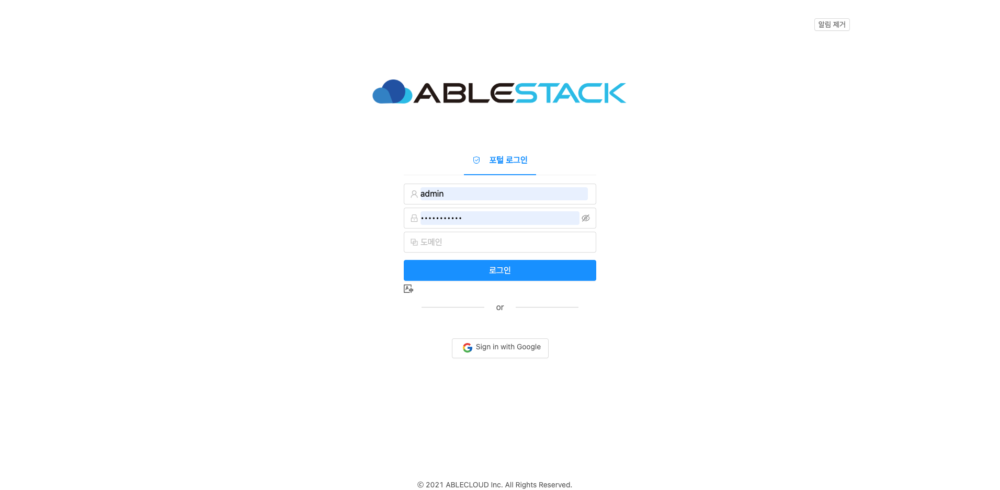
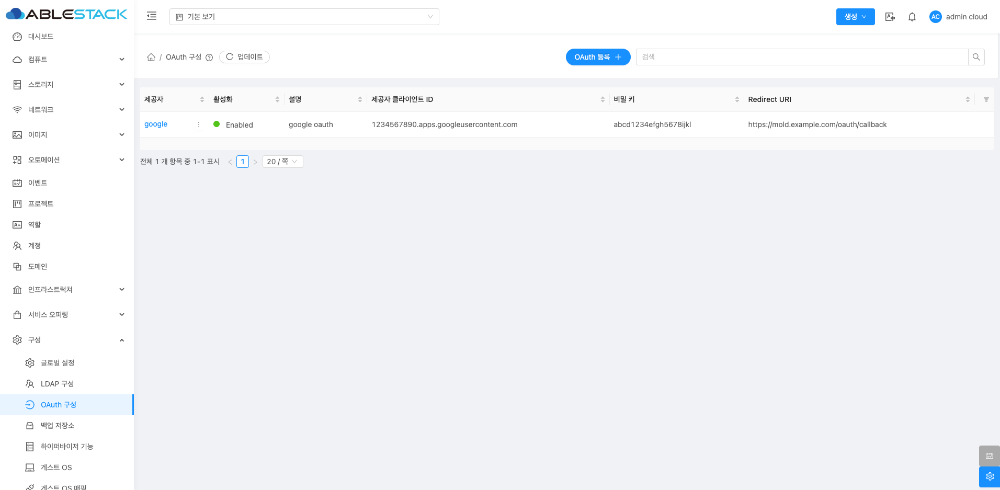
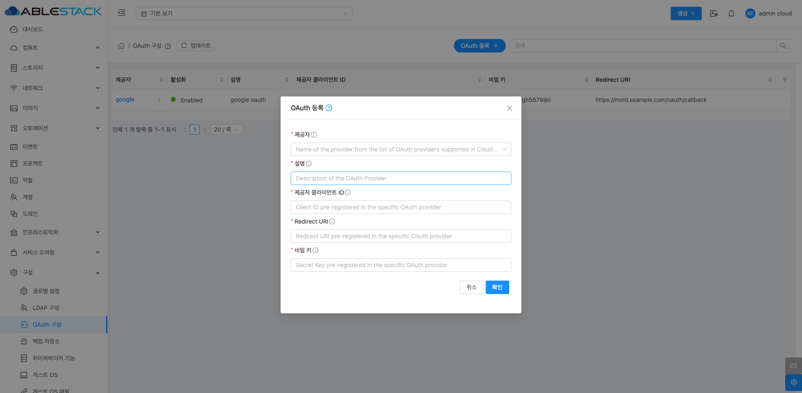
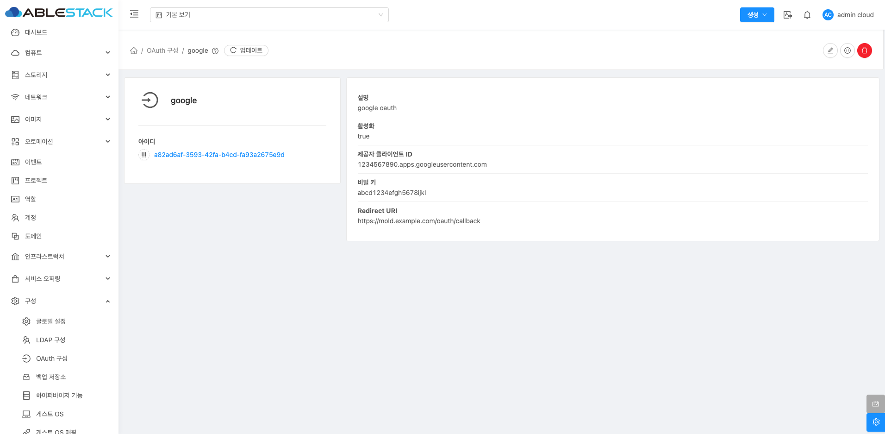
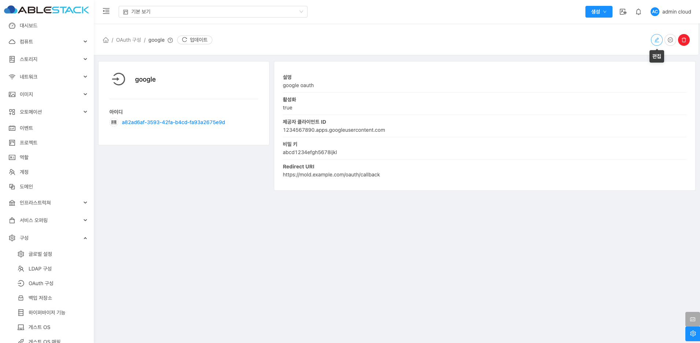
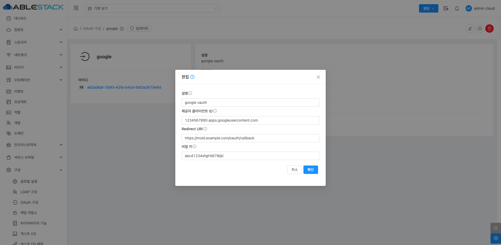
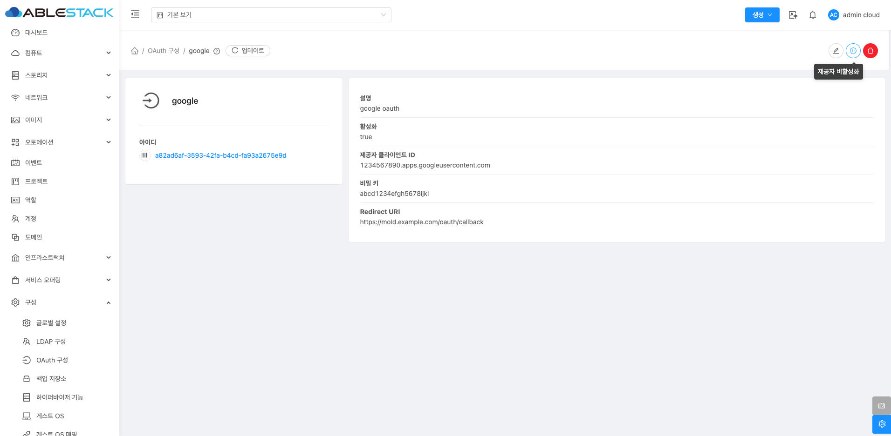
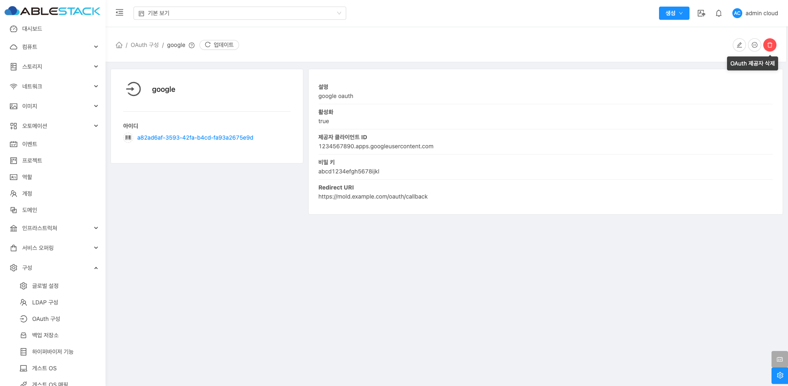
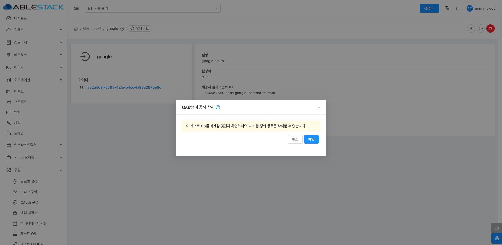

# OAuth 구성

## 개요
Mold의 OAuth 메뉴에서는 OAuth 제공자를 설정하여 외부 인증 시스템(Google, GitHub 등)을 사용하여 Mold에 로그인할 수 있도록 구성할 수 있습니다.

{ .imgCenter .imgBorder }

!!! note
    * OAuth2 활성화 필수: OAuth2 플러그인을 활성화해야 OAuth 구성이 적용됩니다. (글로벌 설정에서 oauth2.enabled 옵션 활성화)
    * 제공자 플러그인 설정: 글로벌 설정에서 사용할 플러그인을 google, github 등으로 설정해야 합니다.

## 목록 조회
등록된 OAuth 제공자가 목록에 표시됩니다. 목록에는 제공자, 활성화 상태, 설명, 클라이언트 ID, 비밀 키, Redirect URI 정보가 포함됩니다.

{ .imgCenter .imgBorder }

## OAuth 등록
OAuth 등록 버튼을 클릭하여 새로운 OAuth 서버를 등록할 수 있습니다.

{ .imgCenter .imgBorder }

1. OAuth 등록 화면에서 다음 항목을 입력합니다.
    * **제공자**: Mold에서 지원하는 OAuth 제공자를 정확히 선택해야 합니다.
    * **설명**: 해당 OAuth 설정에 대한 간단한 설명을 입력합니다.
    * **제공자 클라이언트 ID**: 해당 OAuth 제공자(예: Google Developer Console 또는 GitHub Developer Settings)에서 미리 발급받은 클라이언트 ID를 입력합니다.
    * **비밀 키**: OAuth 제공자 콘솔에서 발급받은 클라이언트 시크릿 키를 입력해야 합니다.
    * **Redirect URI**: OAuth 인증이 완료된 후 Mold로 돌아올 때 사용할 URI로, OAuth 제공자 콘솔에 사전에 등록해야 합니다.

2. 모든 항목을 입력한 후 확인 버튼을 클릭하여 설정을 완료합니다.

## OAuth 상세 탭
추가된 OAuth 서버의 상세 정보를 확인하고 관리할 수 있습니다.

{ .imgCenter .imgBorder }

## OAuth 편집
OAuth 상세 화면 오른쪽 상단의 편집 버튼을 클릭하여 해당 OAuth 정보를 편집할 수 있습니다.

{ .imgCenter .imgBorder }
{ .imgCenter .imgBorder }

## OAuth 제공자 비활성화
OAuth 상세 화면 오른쪽 상단의 제공자 비활성화 버튼을 클릭하여 특정 OAuth 제공자에 대한 보안 문제 발생 시 또는 필요하지 않을 때 일시적 사용을 중단하기 위해 해당 OAuth의 제공자를 비활성화할 수 있습니다.

{ .imgCenter .imgBorder }
{ .imgCenter .imgBorder }

## OAuth 삭제 
OAuth 상세 화면 오른쪽 상단의 삭제 버튼을 클릭하여 추가된 OAuth 서버를 삭제할 수 있습니다.

{ .imgCenter .imgBorder }
{ .imgCenter .imgBorder }

