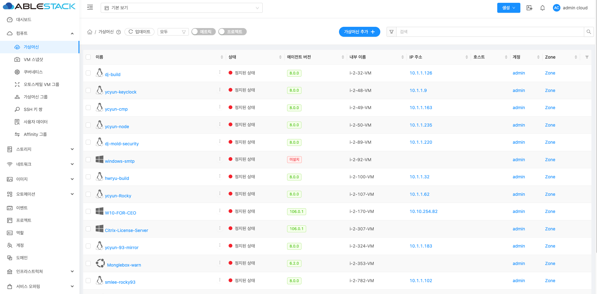
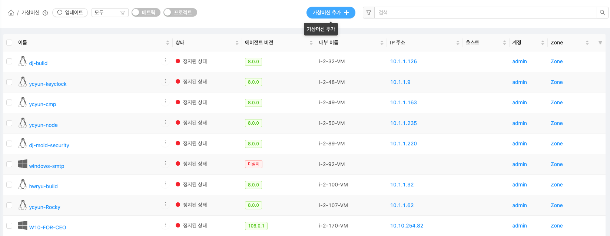
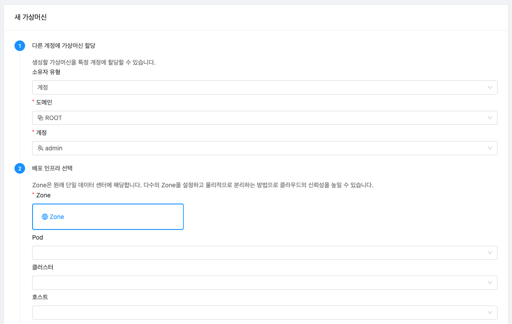
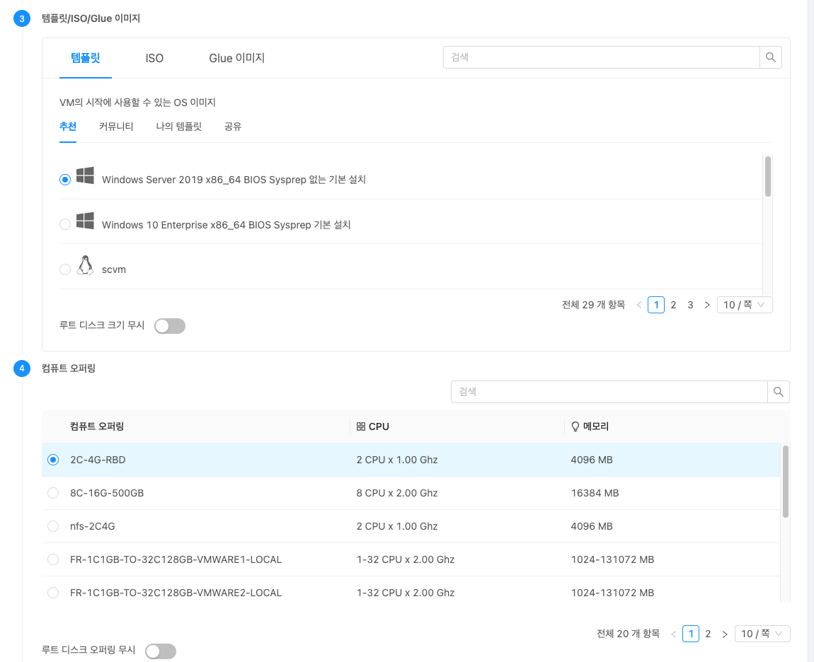

# 대시보드

## 개요
**해당 페이지는 템플릿 입니다.**

대시보드 ~~~ 할 수 있습니다. ~~~~ ( 메뉴에 대한 상세한 설명 )

## 목록 조회

1. 가상머신의 목록을 확인하는 화면입니다.
    생성된 가상머신 목록을 확인하거나 가상머신 추가버튼을 클릭하여 가상머신을 생성할 수 있습니다.
    { align=center }

## 가상머신 추가

1. 가상머신 버튼 클릭하여 새 가상머신 생성 화면을 호출합니다.
    { align=center }
    * 설명~~~~~~

2. 가상머신 추가 정보 입력
    { align=center }
    
    * **소유자 유형** 을 선택합니다.
    * **도메인** 을 선택합니다.
    * **계정** 을 선택합니다.
    * **Zone** 을 선택합니다.
    * **클러스터** 를 선택합니다.
    * **호스트** 를 선택합니다.
    
    { align=center }
    
    * 배포 유형에 따라 **템플릿**, **ISO**, **Glue 이미지** 를 선택합니다.  
    * **컴퓨트 오퍼링** 을 선택합니다.
