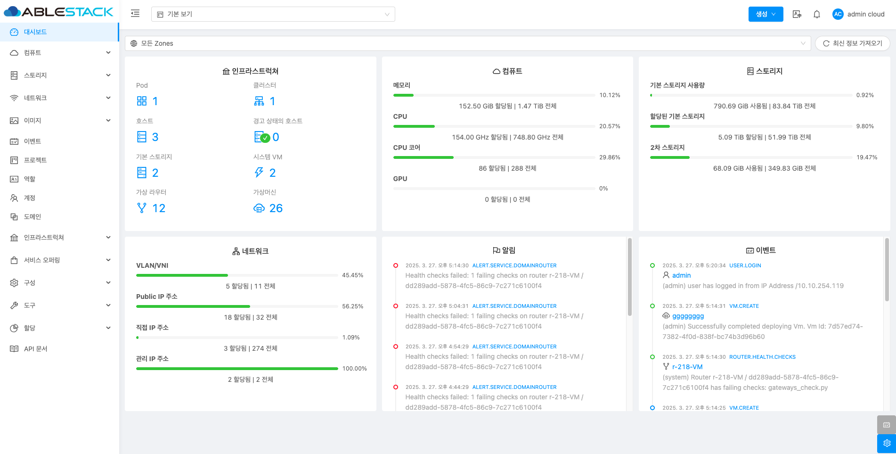

# 대시보드

## 개요
ABLESTACK 대시보드는 관리자가 인프라 전반의 상태를 한눈에 확인할 수 있도록 다양한 자원(인프라스트럭쳐, 컴퓨트, 스토리지, 네트워크, 알림, 이벤트 등)의 현황을 시각적으로 제공하는 대시보드입니다. 이를 통해 운영자는 시스템의 상태를 신속하게 파악하고 필요한 조치를 취할 수 있습니다.

## 대시보드 조회

1. 인프라 전반의 현황을 확인할 수 있습니다.
    { .imgCenter .imgBorder }

     * 인프라스트럭쳐 카드
        * 시스템의 각 구성 요소에 대한 현황을 확인할 수 있습니다.
        * 경고 상태의 호스트가 있을 경우 즉시 확인하여 대응할 수 있습니다.

    * 컴퓨트 카드
        * 가상 머신에 할당된 자원(메모리, CPU, CPU 코어, GPU)을 실시간으로 모니터링할 수 있습니다.
        * 자원 할당 현황을 효율적으로 파악하고 성능을 관리할 수 있습니다.

    * 스토리지 카드
         기본 스토리지 사용량을 확인하여 실제 사용 현황을 파악합니다.
        * 또한, 가상 머신에 할당된 스토리지 크기와 2차 스토리지 사용량도 함께 확인할 수 있습니다.

    * 네트워크 카드
        * VLAN/VNI, Public IP, 직접 IP, 관리 IP 주소에 대한 할당된 개수와 전체 개수를 한눈에 볼 수 있습니다.
        * 네트워크 자원의 효율적 관리와 배분 상태를 점검할 수 있습니다.

    * 알림 카드
        * ABLESTACK에서 발생하는 다양한 알림을 시간순으로 확인할 수 있습니다.
        * 중요 알림을 즉시 파악하고 필요한 조치를 신속히 취할 수 있습니다.

    * 이벤트 카드
        * 사용자 또는 시스템에서 발생한 다양한 이벤트를 시간순으로 확인할 수 있습니다.
        * 이벤트의 흐름을 추적하고 문제 발생 시 원인을 분석할 수 있습니다.

이 대시보드는 관리자에게 각종 자원의 실시간 현황을 직관적으로 제공하여 운영의 효율성을 높이고, 문제 발생 시 빠르게 대응할 수 있도록 돕습니다.
