# 도메인

## 개요
도메인은 클라우드 환경에서 계정과 리소스를 계층적으로 관리하는 최상위 단위입니다.
각 도메인은 하위 도메인과 계정을 포함할 수 있어 멀티테넌시 구조를 지원하며, 관리자는 도메인별로 정책과 리소스 할당을 제어할 수 있습니다.

도메인은 격리된 환경을 제공하여 보안과 독립성을 보장하며, 특정 조직이나 부서 단위로 활용할 수 있습니다.
도메인 내 계정은 가상머신, 스토리지, 네트워크 등 리소스를 생성하고 운영할 수 있으며, 상위 도메인은 하위 도메인의 리소스를 제어할 수 있습니다.
또한, 도메인 기반으로 사용자 접근 권한을 설정할 수 있어, 각 계정은 허용된 리소스만 사용할 수 있습니다.

도메인 계층 구조는 대규모 클라우드 환경에서도 유연한 관리가 가능하도록 설계되었습니다.
각 도메인에는 리소스 제한을 설정할 수 있어 무분별한 자원 사용을 방지할 수 있습니다.

API 및 UI를 통해 도메인을 생성, 수정, 삭제할 수 있으며, 특정 도메인의 리소스를 조회하고 관리할 수도 있습니다.
이를 통해, 클라우드 환경에서 효율적인 계층적 리소스 관리와 보안 정책 적용이 가능합니다.

## 도메인 목록 조회
1. 도메인 목록을 확인하는 화면입니다. 생성된 도메인 목록을 확인하거나 도메인 추가 버튼을 클릭하여 도메인을 생성하실 수 있습니다.
    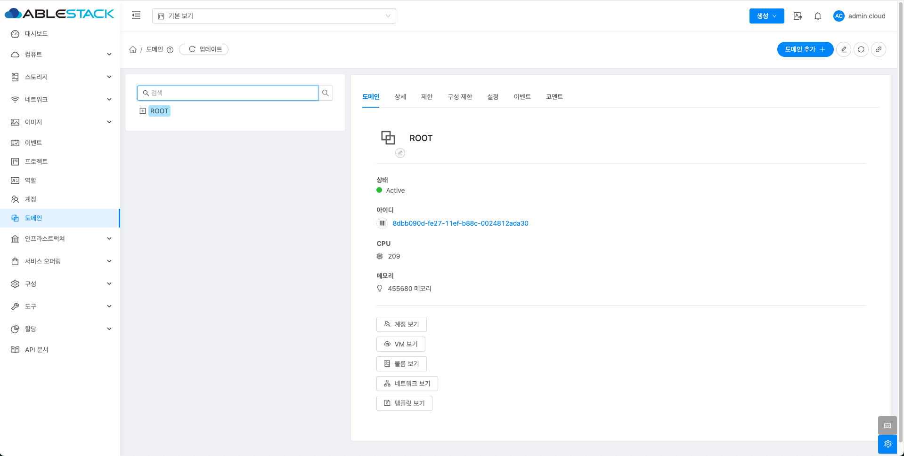{ .imgCenter .imgBorder }
2. 최상위 도메인에 포함된 하위 도메인도 확인할 수 있습니다.
    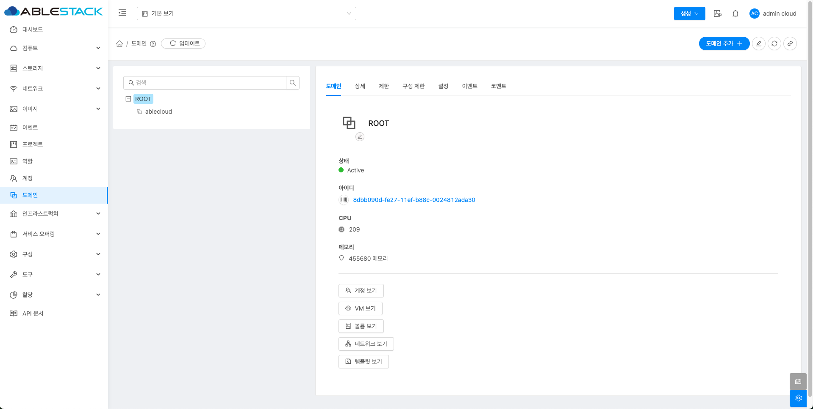{ .imgCenter .imgBorder }

    !!! info
        검색 기능을 활용하여 해당 도메인 목록 조회가 가능합니다.
        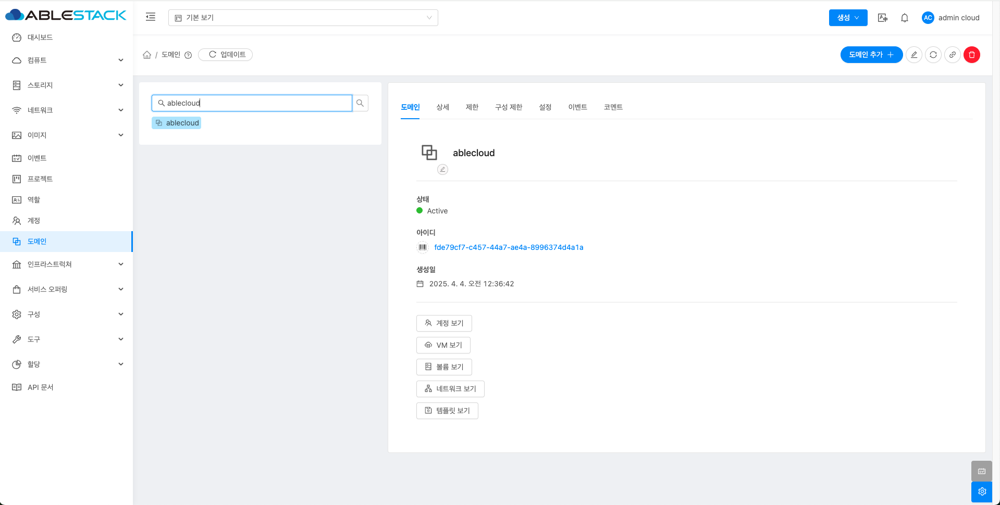{ .imgCenter .imgBorder }

## 도메인 추가
1. 도메인 목록에서 오른쪽 상단의 도메인 추가 버튼을 클릭합니다.
    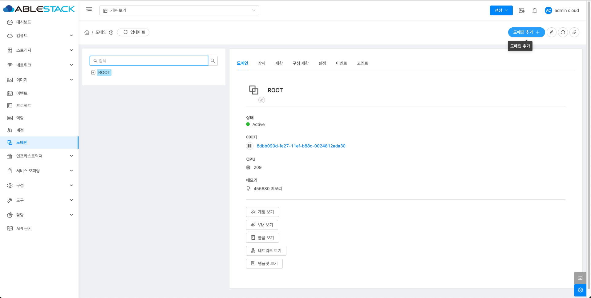{ .imgCenter .imgBorder }
2. 도메인 추가 버튼을 클릭한 화면입니다.
    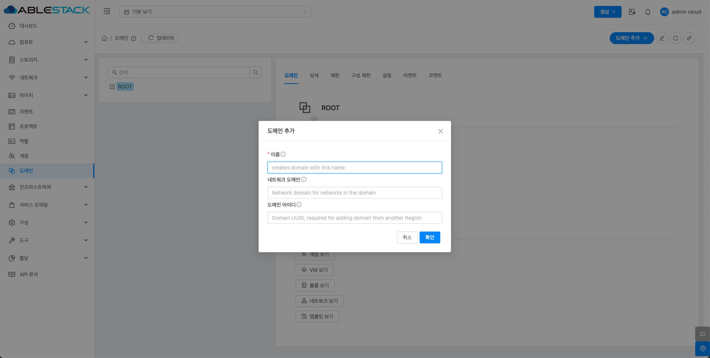{ .imgCenter .imgBorder }
    - **이름:** 이름을 입력합니다.

## 도메인 편집
1. 도메인 목록에서 오른쪽 상단의 도메인 편집 버튼을 클릭합니다.
    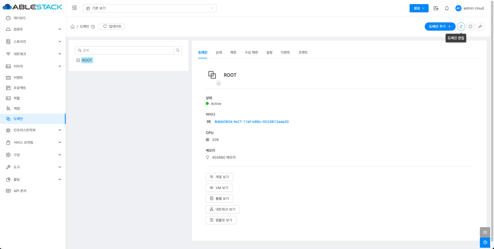{ .imgCenter .imgBorder }
2. 도메인 편집 버튼을 클릭한 화면입니다.
    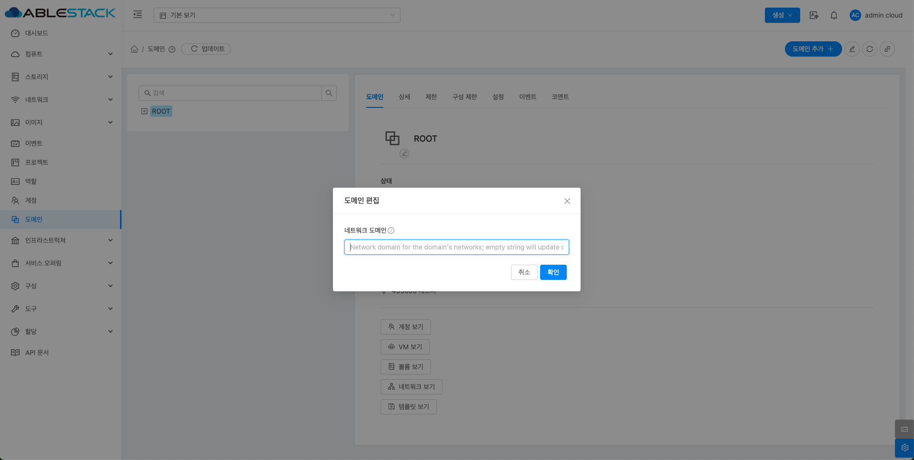{ .imgCenter .imgBorder }
    - **네트워크 도메인:** 네트워크 도메인을 입력합니다.

## 리소스 수 업데이트
1. 도메인 목록에서 오른쪽 상단의 리소스 수 업데이트 버튼을 클릭합니다.
    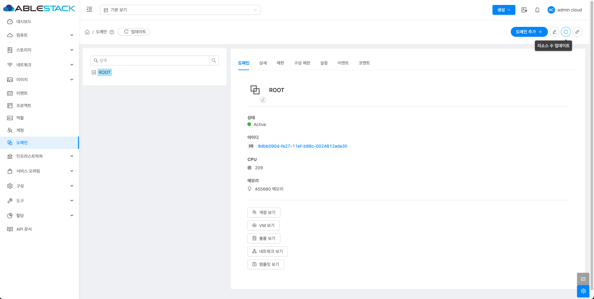{ .imgCenter .imgBorder }
2. 리소스 수 업데이트 버튼을 클릭한 화면입니다.
    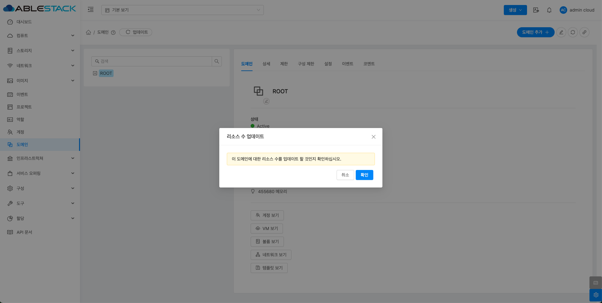{ .imgCenter .imgBorder }

## LDAP에 도메인 연결
1. 도메인 목록에서 오른쪽 상단의 LDAP에 도메인 연결 버튼을 클릭합니다.
    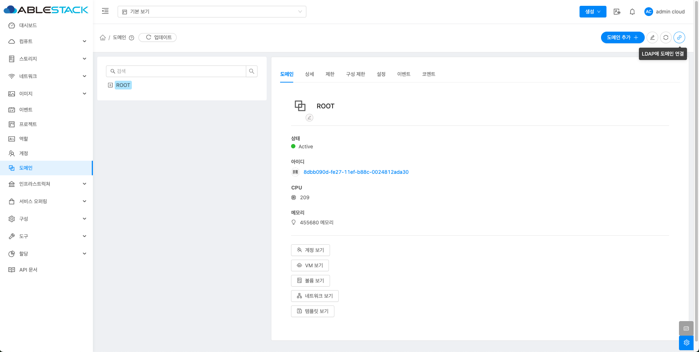{ .imgCenter .imgBorder }
2. LDAP에 도메인 연결을 클릭한 화면입니다.
    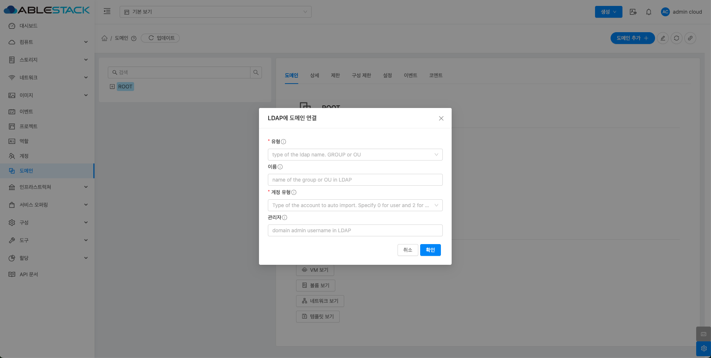{ .imgCenter .imgBorder }
    - **유형:** 유형을 선택합니다.
    - **이름:** 이름을 입력합니다.
    - **계정 유형:** 계정 유형을 선택합니다.
    - **관리자:** 관리자를 입력합니다.

## 도메인 탭
1. 도메인 목록 조회에서 확인하고 싶은 도메인 목록을 조회합니다. 도메인에 대한 상태 및 아이디를 확인하실 수 있으며, 도메인이 포함된 계정, 가상머신 등을 확인할 수 있습니다.
    { .imgCenter .imgBorder }

### 계정 보기
1. 도메인 탭의 하단에서 계정 보기로 해당 도메인에 포함된 계정을 확인할 수 있습니다.
    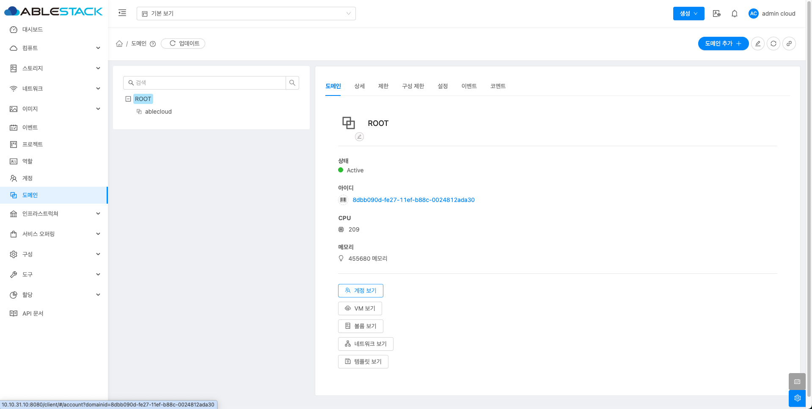{ .imgCenter .imgBorder }
2. 계정 보기 버튼을 클릭한 화면입니다.
    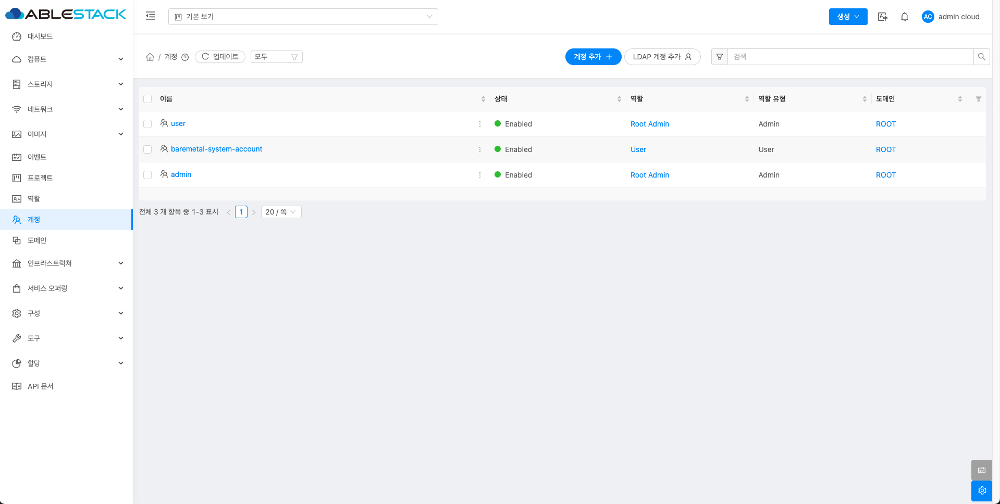{ .imgCenter .imgBorder }

### VM 보기
1. 도메인 탭의 하단에서 VM 보기로 해당 도메인에 포함된 가상머신을 확인할 수 있습니다.
    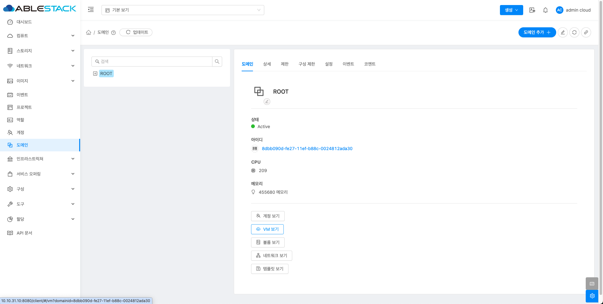{ .imgCenter .imgBorder }
2. VM 보기 버튼을 클릭한 화면입니다.
    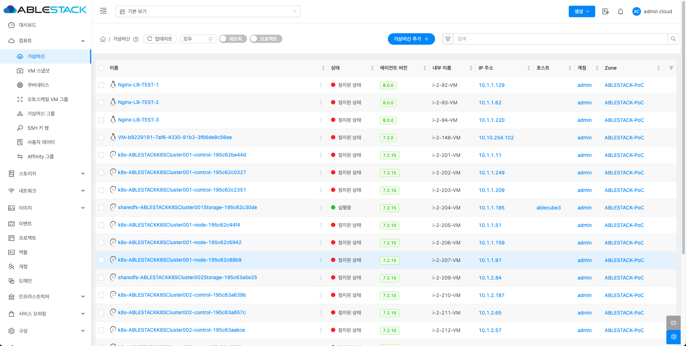{ .imgCenter .imgBorder }

### 볼륨 보기
1. 도메인 탭의 하단에서 볼륨 보기로 해당 도메인에 포함된 볼륨을 확인할 수 있습니다.
    { .imgCenter .imgBorder }
2. 볼륨 보기 버튼을 클릭한 화면입니다.
    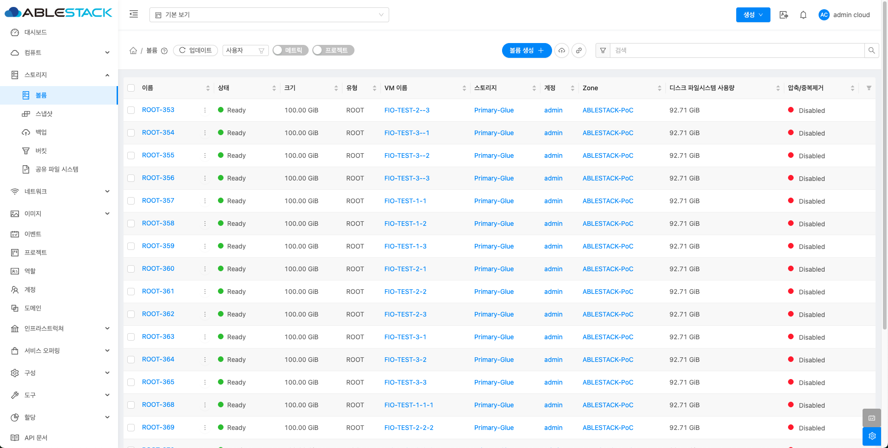{ .imgCenter .imgBorder }

### 네트워크 보기
1. 도메인 탭의 하단에서 네트워크 보기로 해당 도메인에 포함된 네트워크를 확인할 수 있습니다.
    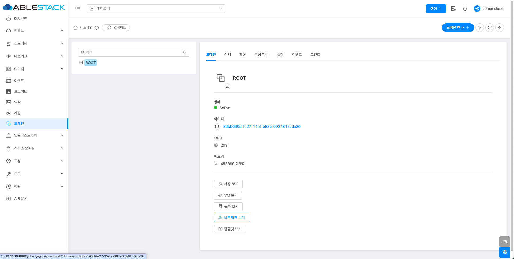{ .imgCenter .imgBorder }
2. 네트워크 보기 버튼을 클릭한 화면입니다.
    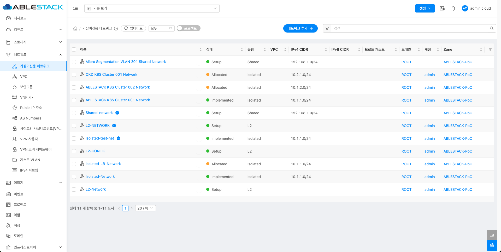{ .imgCenter .imgBorder }

### 템플릿 보기
1. 도메인 탭의 하단에서 템플릿 보기로 해당 도메인에 포함된 템플릿을 확인할 수 있습니다.
    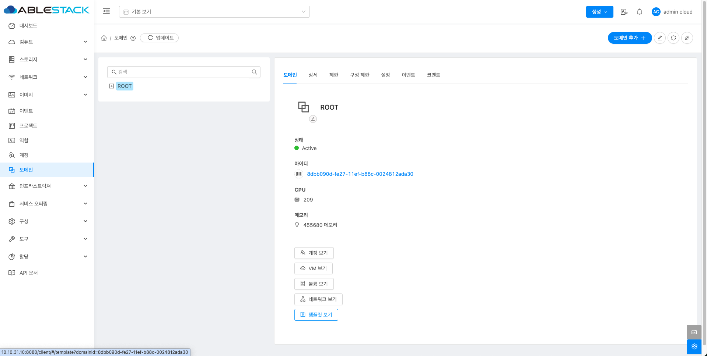{ .imgCenter .imgBorder }
2. 템플릿 보기 버튼을 클릭한 화면입니다.
    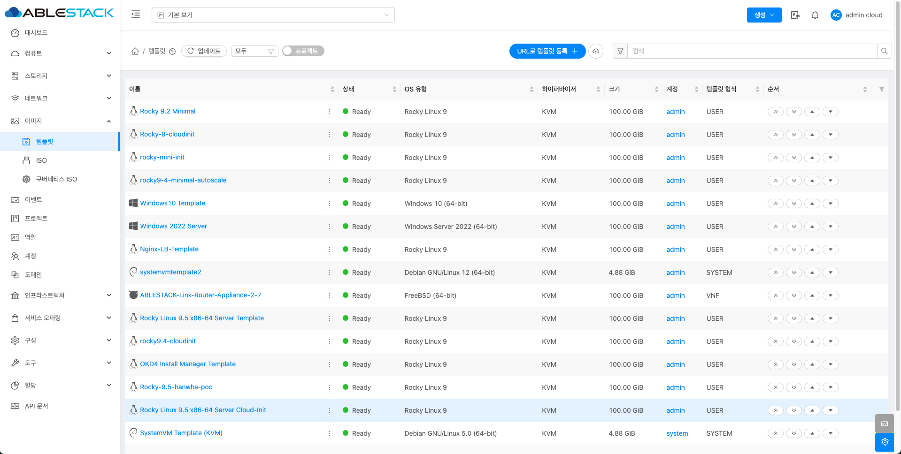{ .imgCenter .imgBorder }

## 도메인 상세 탭
1. 도메인 목록 조회에서 확인하고 싶은 도메인 목록을 조회합니다. 도메인에 대한 상세 정보를 확인하는 화면입니다. 이름, 아이디, 경로 등 상세 정보를 확인할 수 있습니다.
    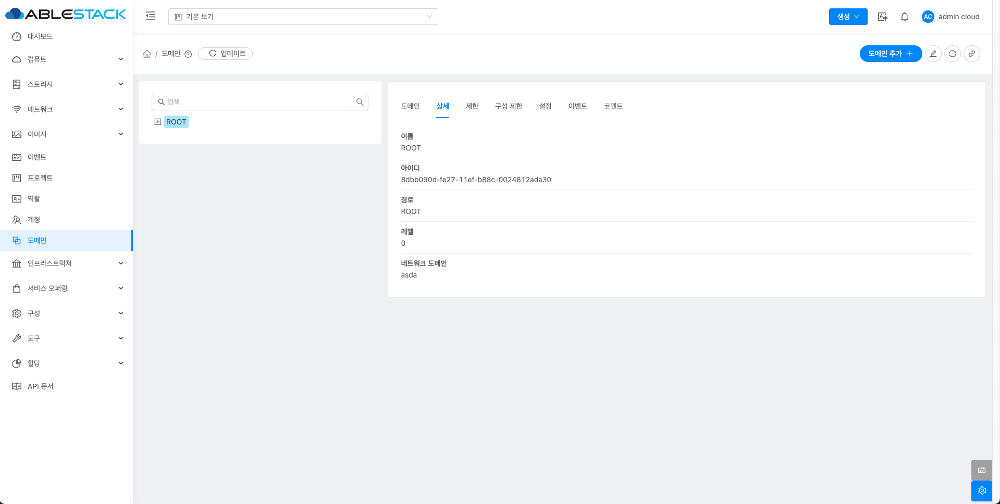{ .imgCenter .imgBorder }

## 도메인 제한 탭
1. 도메인 목록 조회에서 확인하고 싶은 도메인 목록을 조회합니다. 도메인에 할당된 리소스 제한 정보를 확인할 수 있습니다.
    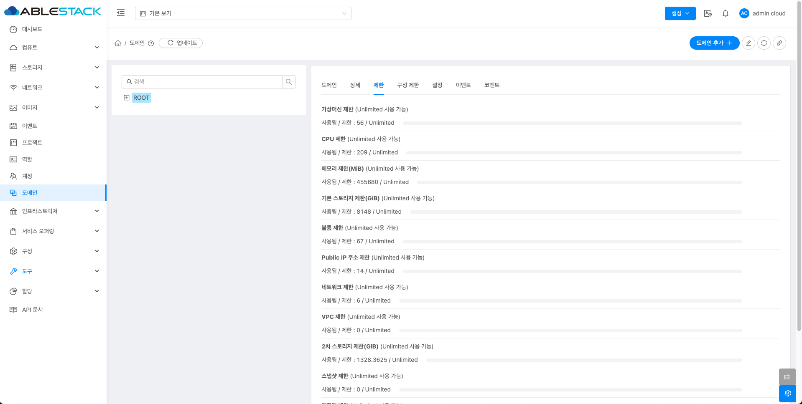{ .imgCenter .imgBorder }

## 도메인 구성 제한 탭
1. 도메인 목록 조회에서 확인하고 싶은 도메인 목록을 조회합니다. 도메인에 대해 리소스 자원 제한을 설정할 수 있습니다.
    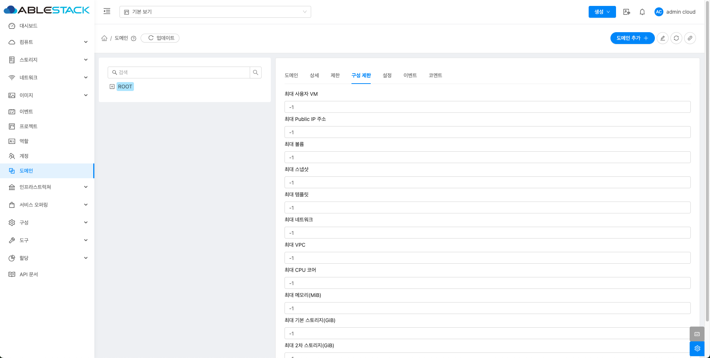{ .imgCenter .imgBorder }

## 도메인 설정 탭
1. 도메인 목록 조회에서 확인하고 싶은 도메인 목록을 조회합니다. 도메인에 대한 설정 정보 확인 및 값 변경을 할 수 있습니다.
    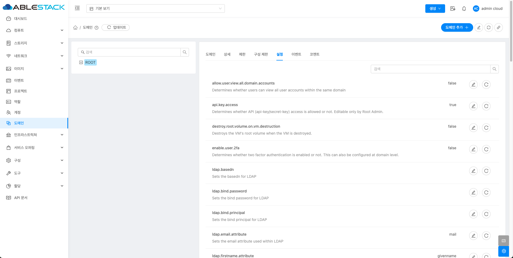{ .imgCenter .imgBorder }

## 도메인 이벤트 탭
1. 도메인 목록 조회에서 확인하고 싶은 도메인 목록을 조회합니다. 도메인에 대한 이벤트 정보를 확인하는 화면입니다. 해당 이벤트에 대한 유형 및 생성일 등을 확인할 수 있습니다.
    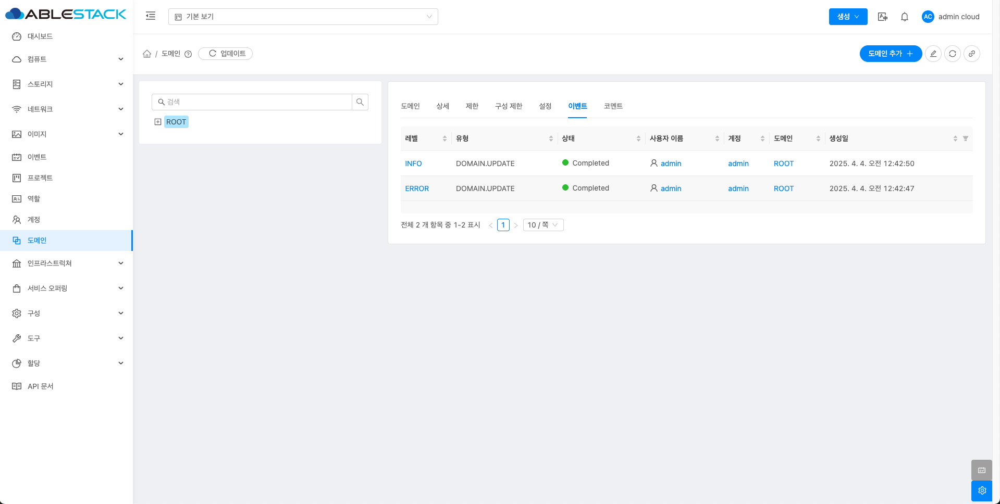{ .imgCenter .imgBorder }

## 도메인 코멘트 탭
1. 도메인 목록 조회에서 확인하고 싶은 도메인 목록을 조회합니다. 도메인에 대한 코멘트 정보를 확인하는 화면입니다. 각 사용자 별로 해당 도메인에 대한 코멘트 정보를 조회 및 관리할 수 있습니다.
    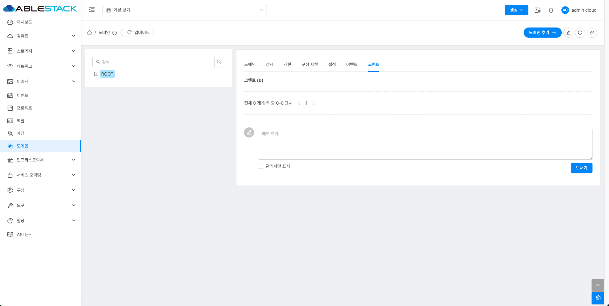{ .imgCenter .imgBorder }

## 용어 사전
