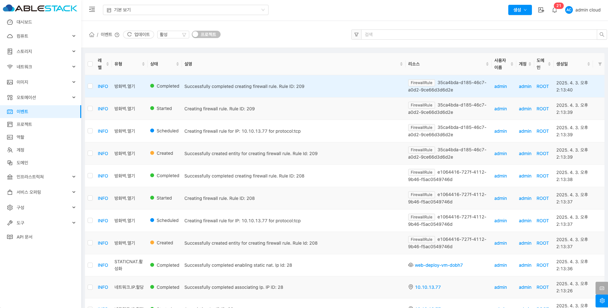
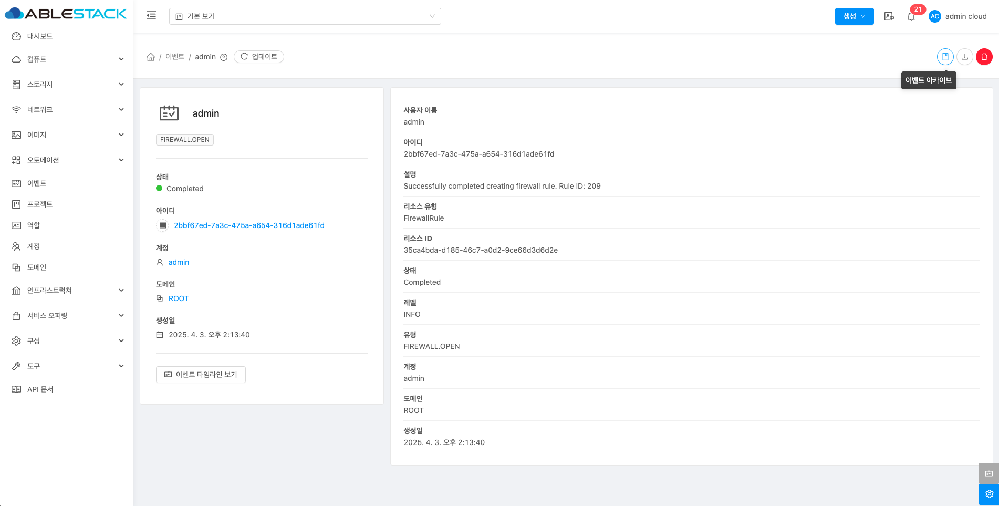
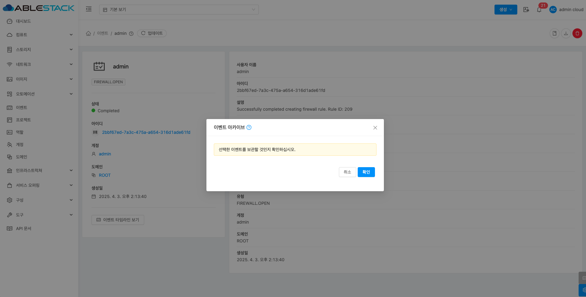
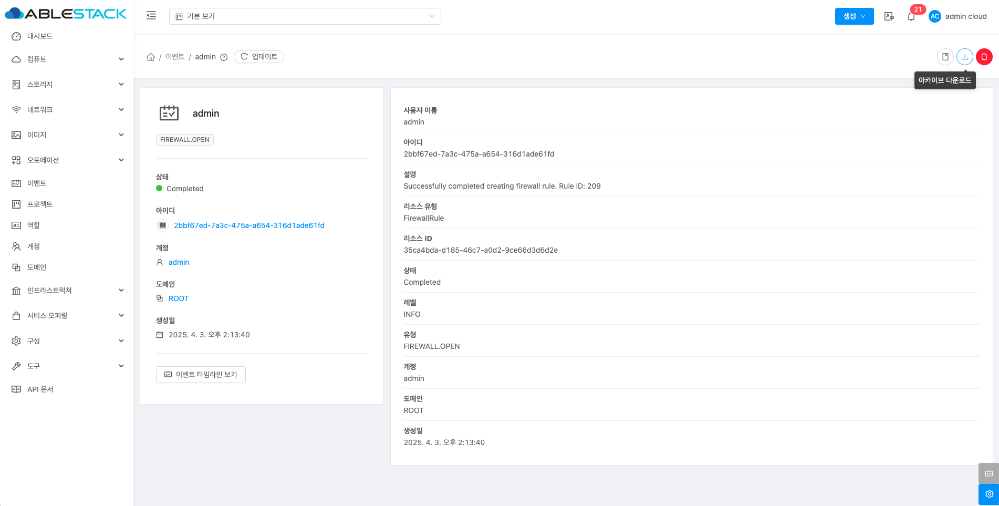
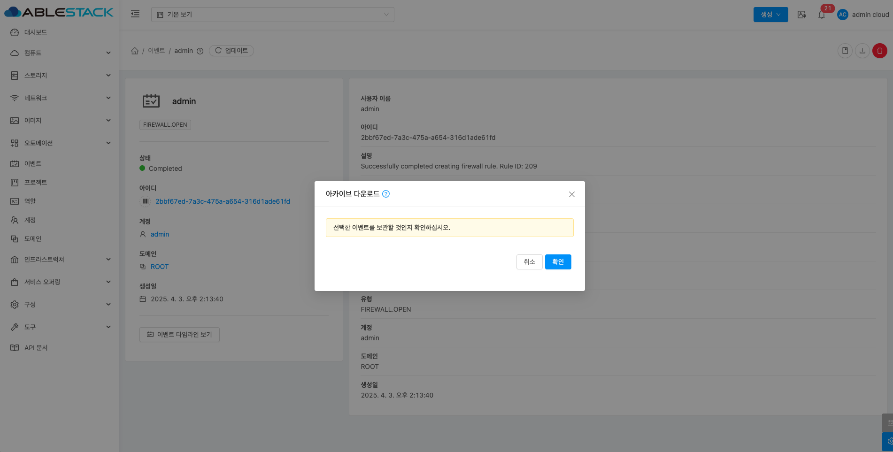
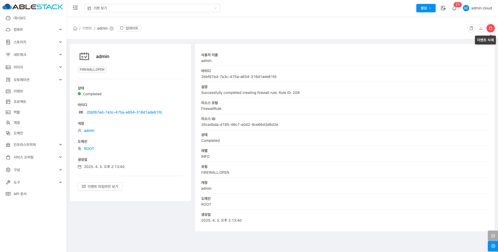
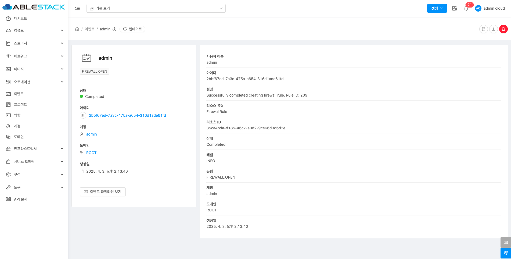

# 이벤트

## 개요
이벤트 메뉴는 시스템에서 발생한 다양한 사건을 기록하고 관리하는 기능입니다. 이를 통해 가상 머신 생성, 삭제, 오류 발생 등의 이벤트를 실시간으로 추적할 수 있습니다. 이벤트는 발생 시간, 관련 리소스, 사용자 등의 정보를 포함하며, 필터링 및 검색 기능으로 특정 이벤트를 쉽게 찾을 수 있습니다. 또한, 중요 이벤트에 대한 이벤트 설정을 통해 빠르게 대응할 수 있습니다. 이 메뉴는 클라우드 인프라의 상태를 확인하여 시스템 안정성을 유지하는 데 중요한 역할을 합니다.

## 목록 조회

1. 이벤트 목록을 확인하는 화면입니다.

    { align=center }

## 이벤트 아카이브

1. 선택한 이벤트을 보관하는 기능입니다.

    { align=center }

    * **이벤트 아카이브** 버튼을 클릭하여 이벤트 아카이브 화면을 호출합니다.

    { align=center }

    * **확인** 버튼을 클릭하여 이벤트을 보관합니다.

## 아카이브 다운로드

1. 선택한 이벤트을 다운로드하는 기능입니다.

    { align=center }

    * **아카이브 다운로드** 버튼을 클릭하여 아카이브 다운로드 화면을 호출합니다.

    { align=center }

    * **확인** 버튼을 클릭하여 이벤트을 cvs로 다운로드합니다.

### 이벤트 삭제

1. 이벤트를 삭제하는 기능입니다.

    { align=center }

    * **이벤트 삭제** 버튼을 클릭하여 이벤트 삭제 화면을 호출합니다.

    { align=center }

    * **확인** 버튼을 클릭하여 이벤트을 삭제합니다.

## 상세 탭

1. 이벤트에 대한 상세정보를 조회하는 화면입니다. 해당 이벤트의 사용자 이름, 아이디, 설명, 리소스 유형, 리소스 ID, 상태, 레벨, 유형, 계정, 도메인, 생성일 등의 정보를 확인할 수 있습니다.

    { align=center }
