# ISO

## 개요
ISO는 운영체제나 유틸리티를 가상 머신에 설치하거나 부팅할 수 있도록 하는 디스크 이미지 파일입니다.
사용자는 ISO를 업로드하여 가상 머신에 마운트하고, 운영체제 설치 또는 복구 작업을 수행할 수 있습니다.
일반적으로 부팅 가능(bootable) 또는 비부팅(non-bootable) 형태로 제공되며, 운영체제 설치 ISO는 부팅 가능해야 합니다.

모든 사용자에게 공개하거나 특정 계정에서만 사용할 수 있도록 설정할 수 있습니다. 또한, 특정 Zone에 배포하여 해당 Zone 내 가상 머신에서만 사용할 수 있도록 제한할 수 있습니다.

URL을 통해 직접 등록하거나, 미리 업로드된 파일을 선택하여 추가할 수 있습니다. 가상 머신에 ISO를 마운트하면 CD/DVD 드라이브처럼 인식되며, 필요한 경우 언제든지 제거할 수도 있습니다.

ISO에 대한 기본적인 정보와 상태를 제공하며, 필요하면 업데이트하거나 삭제할 수도 있습니다. ISO는 ISO과 달리 가상 머신 디스크를 포함하지 않으며, 운영체제의 설치 미디어 역할을 수행합니다.
이를 활용하면 가상 머신을 기존 운영체제 환경에서 부팅하거나 새로운 환경으로 설정할 수 있습니다.

## ISO 목록 조회
1. ISO 목록을 확인하는 화면입니다. 생성된 ISO 목록을 확인하거나 ISO 생성 버튼을 클릭하여 ISO을 생성하실 수 있습니다.
    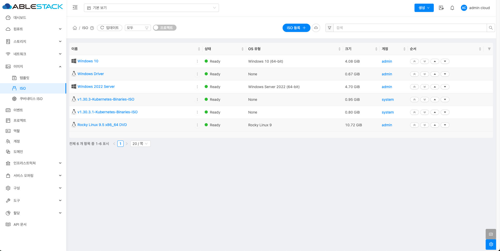{ .imgCenter .imgBorder }

    !!! info
        프로젝트 버튼을 활성화할 때 해당 프로젝트에 대한 정보를 ISO 목록에서 확인할 수 있습니다.

    !!! info
        필터링 기준으로 ISO 필터 유형에 따라 목록 조회가 가능합니다.
        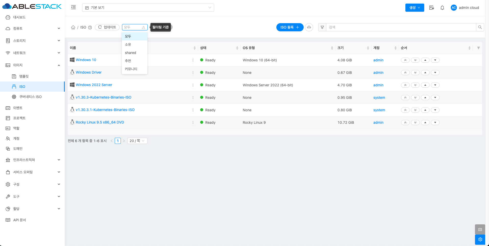{ .imgCenter .imgBorder }

## ISO 등록
1. 이미지의 ISO에서 상단의 ISO 등록 버튼을 클릭합니다.
    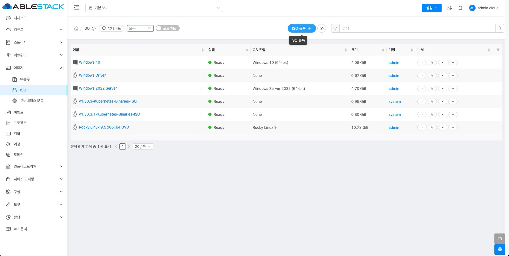{ .imgCenter .imgBorder }
2. ISO 등록 버튼을 클릭한 화면입니다.
    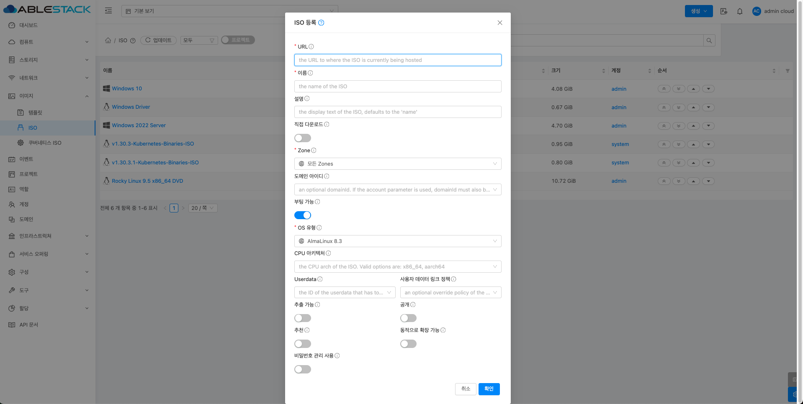{ .imgCenter .imgBorder }
    - **URL** 을 입력합니다.
    - **이름** 을 입력합니다.
    - **설명** 을 입력합니다.
    - **Zone** 을 선택합니다.
    - **도메인 아이디** 를 선택합니다.
    - **부팅 가능** 을 활성화합니다.
    - **OS 유형** 을 검색하여 선택합니다.
    - **CPU 아키텍처** 를 선택합니다.
    - **추출 가능** 을 체크합니다.
    - **동적으로 확장 가능** 을 활성화합니다.
    - **비밀번호 관리 사용** 을 활성화합니다.
    - **추천** 을 활성화합니다.
    - **공개** 를 활성화합니다.

## 로컬에서 ISO 업로드
1. 이미지의 ISO에서 상단의 로컬에서 ISO 업로드 버튼을 클릭합니다.
    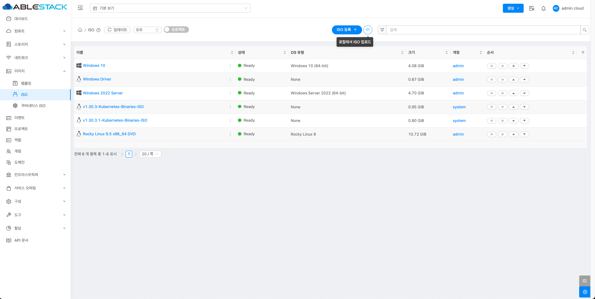{ .imgCenter .imgBorder }
2. 로컬에서 ISO 업로드 버튼을 클릭한 화면입니다.
    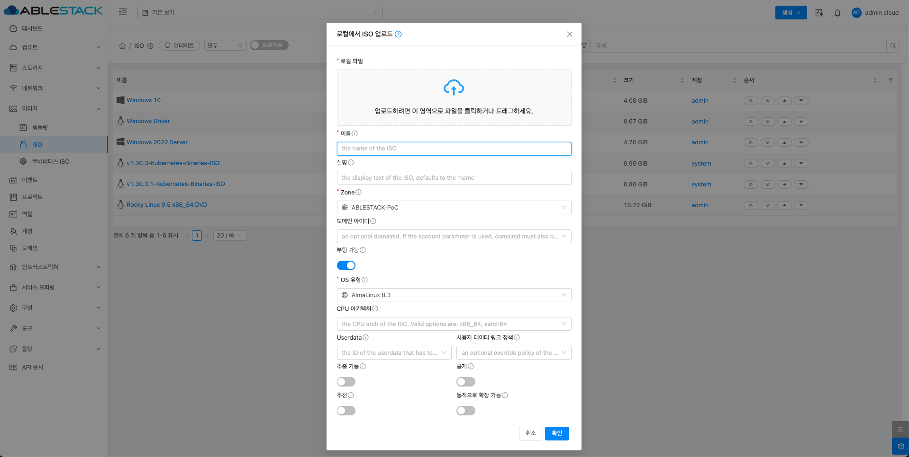{ .imgCenter .imgBorder }
    - **로컬 파일** 을 클릭하여 파일을 선택합니다.
    - **이름** 을 입력합니다.
    - **설명** 을 입력합니다.
    - **Zone** 을 선택합니다.
    - **도메인 아이디** 를 선택합니다.
    - **부팅 가능** 을 활성화합니다.
    - **OS 유형** 을 검색하여 선택합니다.
    - **CPU 아키텍처** 를 선택합니다.
    - **추출 가능** 을 활성화합니다.
    - **동적으로 확장 가능** 을 활성화합니다.
    - **추천** 을 활성화합니다.
    - **공개** 를 활성화합니다.

## ISO 편집
1. ISO 상세 오른쪽 상단의 ISO 편집 버튼을 클릭합니다.
    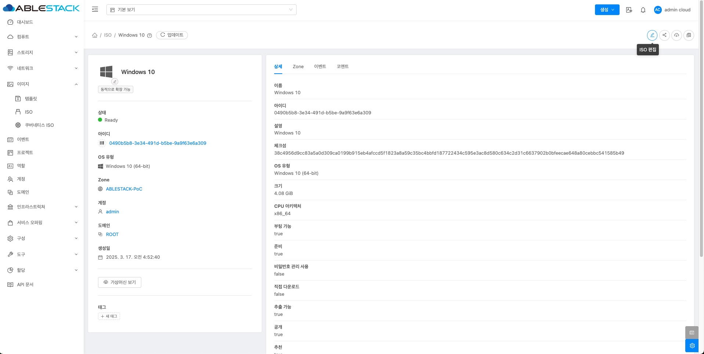{ .imgCenter .imgBorder }
2. ISO 편집 버튼을 클릭한 화면입니다.
    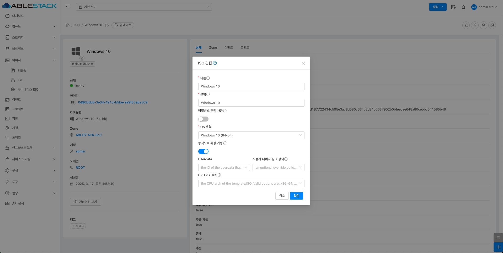{ .imgCenter .imgBorder }
    - **이름** 을 입력합니다.
    - **설명** 을 입력합니다.
    - **OS 유형** 을 검색하여 선택합니다.
    - **동적으로 확장 가능** 을 활성화 및 비활성화합니다.
    - **CPU 아키텍처** 를 선택합니다.

## 공유 ISO 업데이트
1. ISO 상세 오른쪽 상단의 공유 ISO 업데이트 버튼을 클릭합니다.
    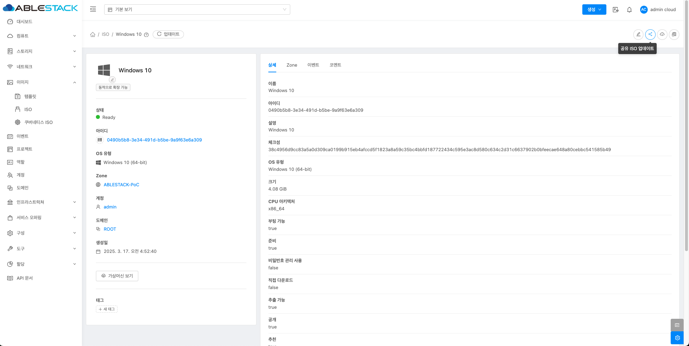{ .imgCenter .imgBorder }
2. 공유 ISO 업데이트 버튼을 클릭한 화면입니다.
    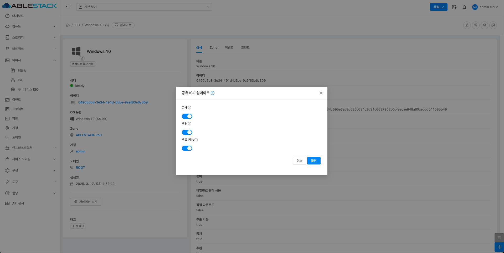{ .imgCenter .imgBorder }
    - **공개** 를 활성화합니다.
    - **추천** 을 활성화합니다.
    - **추출 가능** 을 활성화합니다.

## ISO 다운로드
1. ISO 상세 오른쪽 상단의 ISO 다운로드 버튼을 클릭합니다.
    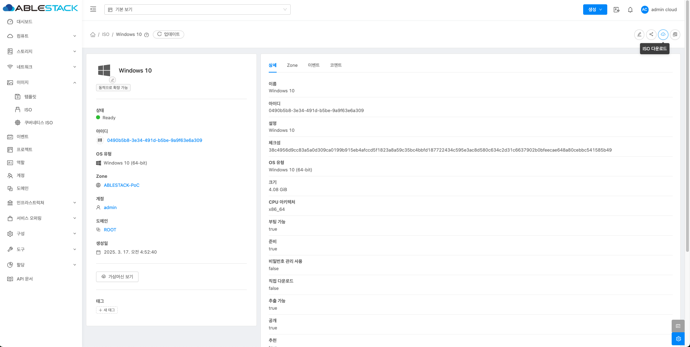{ .imgCenter .imgBorder }
2. ISO 다운로드 버튼을 클릭한 화면입니다.
    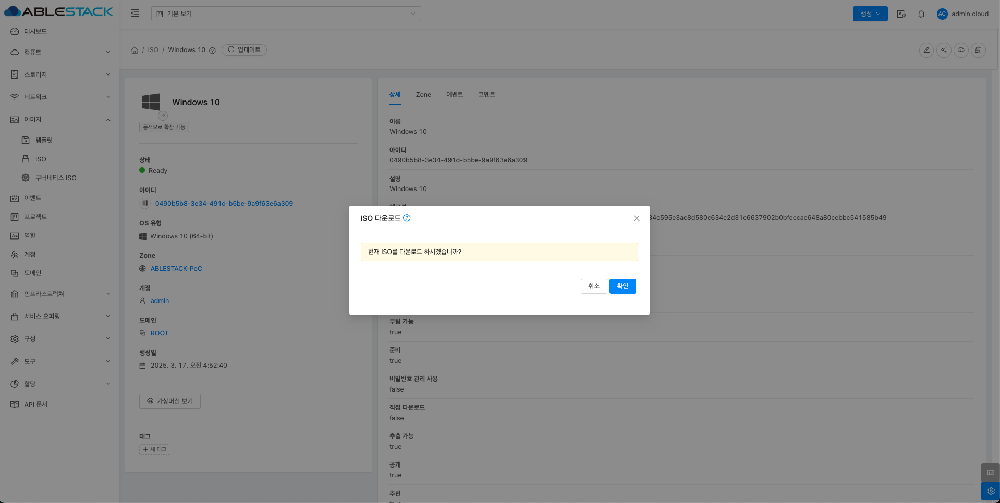{ .imgCenter .imgBorder }

## ISO 권한 업데이트
1. ISO 상세 오른쪽 상단의 ISO 권한 업데이트 버튼을 클릭합니다.
    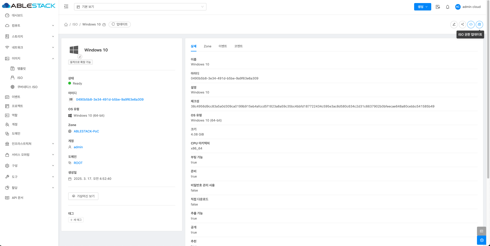{ .imgCenter .imgBorder }
2. ISO 권한 업데이트 버튼을 클릭한 화면입니다.
    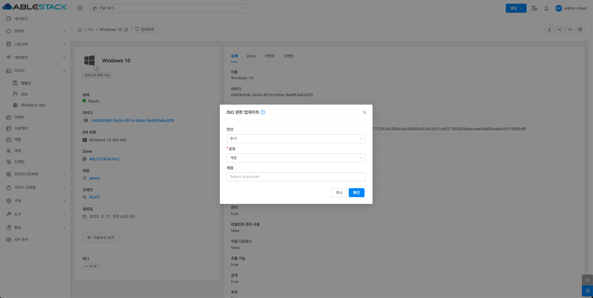{ .imgCenter .imgBorder }
    - **연산** 을 선택합니다.
    - **공유** 를 선택합니다.
    - **계정** 을 선택합니다.

## ISO 상세 탭
1. ISO 목록 조회에서 확인하고 싶은 ISO 목록을 조회합니다. ISO에 대한 상세 정보를 확인하는 화면입니다. 해당 ISO에 대한 이름, 아이디 등 상세 정보를 확인할 수 있습니다.
    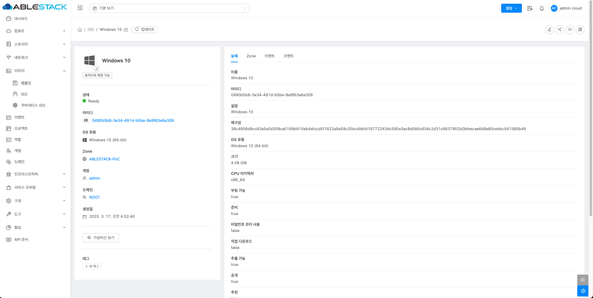{ .imgCenter .imgBorder }

## ISO Zone 탭
1. ISO 목록 조회에서 확인하고 싶은 ISO 목록을 조회합니다. ISO에 대한 Zone 정보를 확인하는 화면입니다. 해당 Zone에 대한 상태와 준비 등 확인할 수 있습니다.
    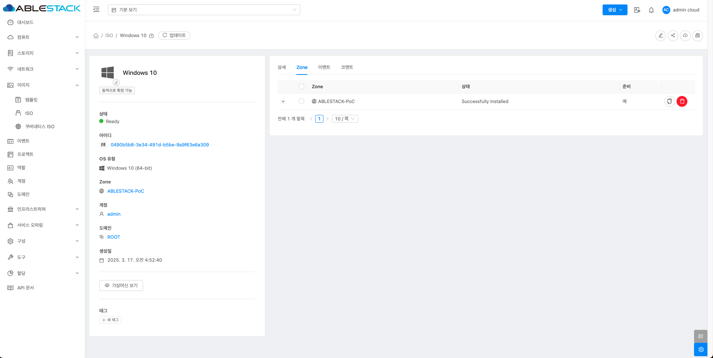{ .imgCenter .imgBorder }
2. ISO Zone 정보에서 **+** 버튼을 클릭하시면 해당 다운로드가 진행된 스토리지와 진행률 그리고 상태를 확인할 수 있습니다.
    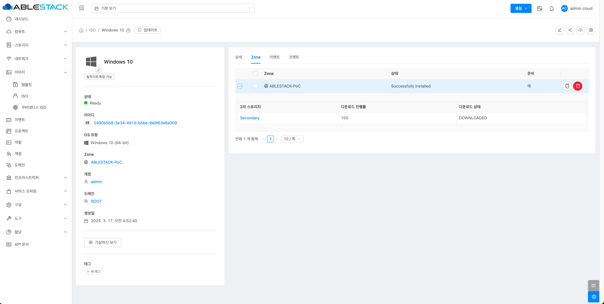{ .imgCenter .imgBorder }

### ISO 복사
3. 여러 개의 Zone이 존재 할 경우, ISO을 다른 Zone에 복사할 수 있는 기능을 제공합니다.
    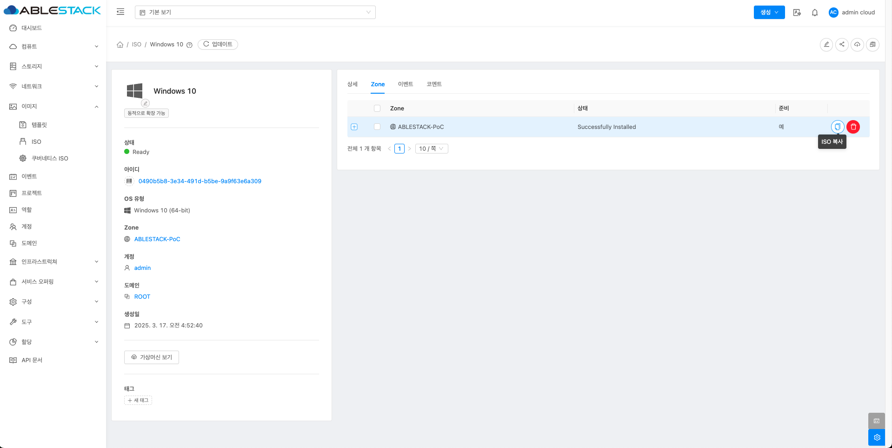{ .imgCenter .imgBorder }
4. ISO 복사 버튼을 클릭한 화면입니다.
    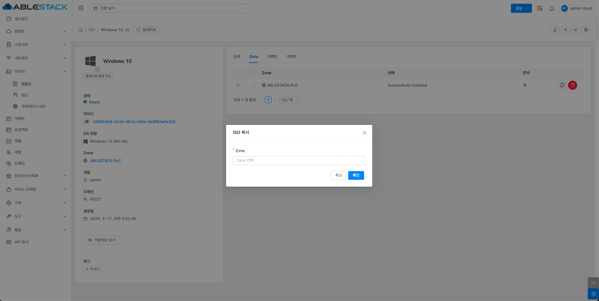{ .imgCenter .imgBorder }
    - **Zone** 을 선택합니다.

### ISO 삭제
5. ISO이 포함된 Zone에서 해당 ISO 삭제 기능 을 제공합니다.
    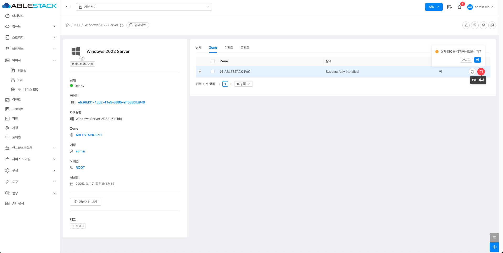{ .imgCenter .imgBorder }

### ISO 일괄 삭제
7. 여러 개의 Zone이 존재 할 경우, Zone을 다중 선택하여 다른 Zone에서도 삭제 할 수 있는 기능을 제공합니다.
    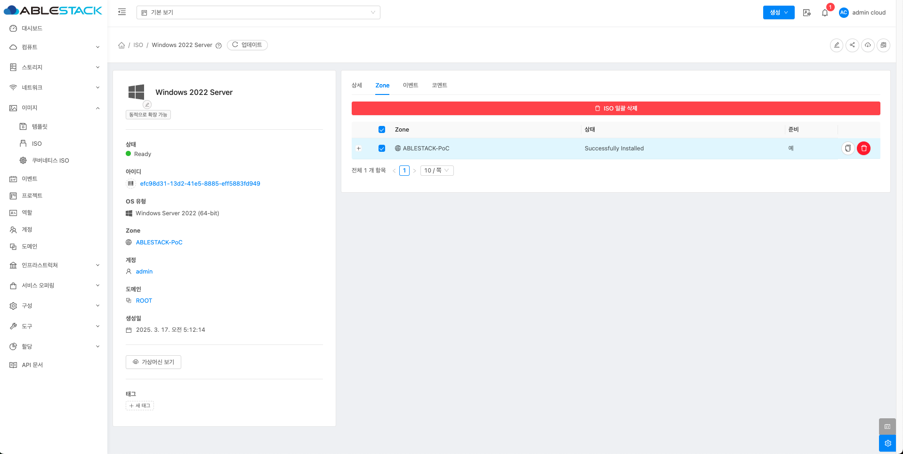{ .imgCenter .imgBorder }
8. ISO 일괄 삭제 버튼을 클릭한 화면입니다.
    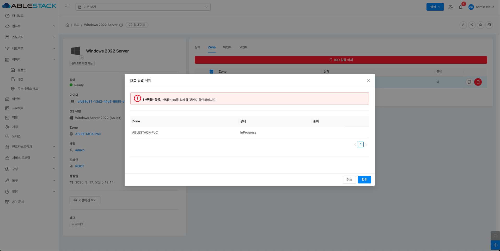{ .imgCenter .imgBorder }

## ISO 이벤트 탭
1. ISO 목록 조회에서 확인하고 싶은 ISO 목록을 조회합니다. ISO에 대한 이벤트 정보를 확인하는 화면입니다. 해당 이벤트에 대한 유형 및 생성일 등 확인할 수 있습니다.
    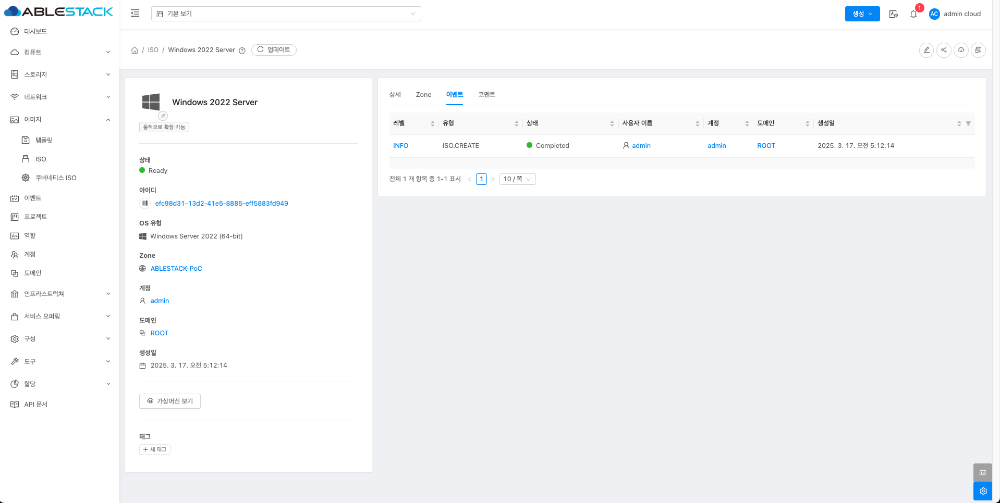{ .imgCenter .imgBorder }

## ISO 코멘트 탭
1. ISO 목록 조회에서 확인하고 싶은 ISO 목록을 조회합니다. ISO에 대한 코멘트 정보를 확인하는 화면입니다. 각 사용자별로 해당 ISO에 대한 코멘트 정보를 조회 및 관리할 수 있습니다.
    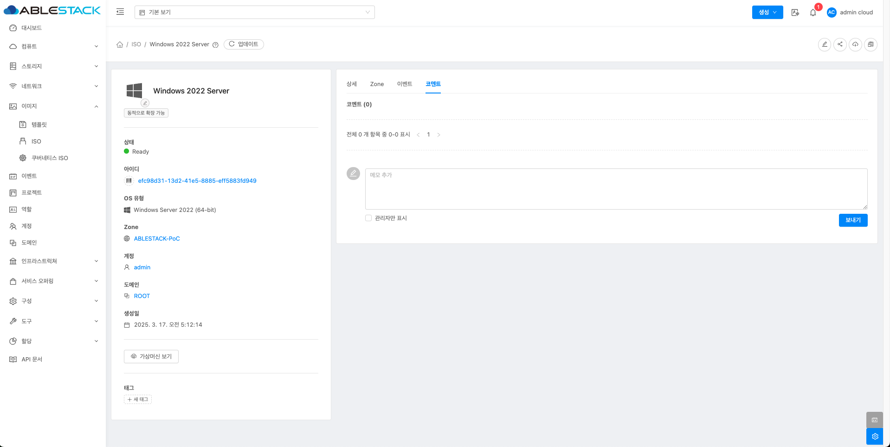{ .imgCenter .imgBorder }

## 용어사전
