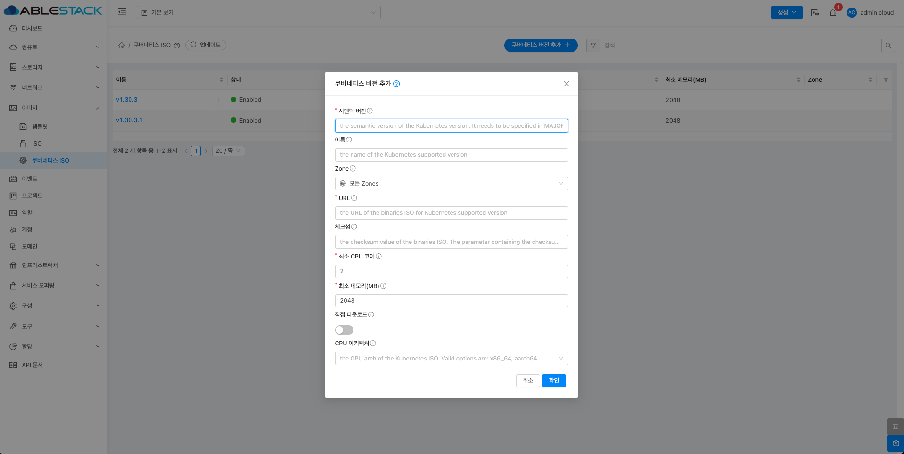

# 쿠버네티스 ISO

## 개요
쿠버네티스 ISO는 쿠버네티스 클러스터를 쉽게 배포하고 관리할 수 있도록 제공되는 부팅 가능한 이미지다.
이 ISO에는 쿠버네티스 설치에 필요한 OS와 패키지가 포함되어 있어 VM 생성 후 빠르게 클러스터를 구축할 수 있다.

자동으로 마스터와 워커 노드를 배포할 수 있으며, 일반 VM 인스턴스로도 쿠버네티스 환경을 구성할 수 있다.
쿠버네티스 ISO는 Cloud-Init을 지원해 SSH 키, 네트워크 설정, 사용자 데이터 등을 자동으로 적용할 수 있다. 이를 통해 DevOps 및 CI/CD 환경을 구축하고 컨테이너 기반 애플리케이션을 손쉽게 운영할 수 있다.

배포 과정은 먼저 ISO를 등록한 후, 해당 ISO로 VM을 생성하고 kubeadm을 사용해 클러스터를 초기화하는 방식으로 진행된다.
이후 워커 노드를 추가하여 쿠버네티스 클러스터를 확장할 수 있다. 쿠버네티스 ISO는 컨테이너 워크로드를 실행하는 데 최적화되어 있다.

이를 활용하면 하이브리드 클라우드 및 멀티 클러스터 운영이 가능하며, 인프라를 코드로 관리하는 접근 방식도 지원된다. 쿠버네티스를 활용하면 효율적인 클라우드 네이티브 애플리케이션 배포가 가능해진다.

## 쿠버네티스 ISO 목록 조회
1. 쿠버네티스 ISO 목록을 확인하는 화면입니다. 생성된 쿠버네티스 ISO 목록을 확인하거나 쿠버네티스 ISO 생성 버튼을 클릭하여 쿠버네티스 ISO을 생성하실 수 있습니다.
    { .imgCenter .imgBorder }

## 쿠버네티스 버전 추가
1. 이미지의 쿠버네티스 ISO에서 상단의 쿠버네티스 버전 추가 버튼을 클릭합니다.
    { .imgCenter .imgBorder }
2. 쿠버네티스 버전 추가 버튼을 클릭한 화면입니다.
    { .imgCenter .imgBorder }
    - **시맨틱 버전:** 시맨틱 버전을 입력합니다.
    - **이름:** 이름을 입력합니다.
    - **Zone:** Zone을 선택합니다.
    - **URL:** URL를 입력합니다.
    - **최소 CPU 코어:** 최소 CPU 코어를 입력합니다.
    - **최소 메모리(MB):** 최소 메모리(MB)을 입력합니다.
    - **직접 다운로드:** 직접 다운로드를 활성화 및 비활성화합니다.
    - **CPU 아키텍처:** CPU 아키텍처를 선택합니다.

## 쿠버네티스 버전 관리
1. 쿠버네티스 ISO 상세 오른쪽 상단의 쿠버네티스 버전 관리 버튼을 클릭합니다.
    { .imgCenter .imgBorder }
2. 쿠버네티스 버전 관리 버튼을 클릭한 화면입니다.
    { .imgCenter .imgBorder }
    - **상태:** 상태를 선택합니다.

## 쿠버네티스 버전 삭제
1. 쿠버네티스 ISO 상세 오른쪽 상단의 쿠버네티스 버전 삭제 버튼을 클릭합니다.
    { .imgCenter .imgBorder }
2. 쿠버네티스 버전 삭제 버튼을 클릭한 화면입니다.
    { .imgCenter .imgBorder }

## 쿠버네티스 ISO 상세 탭
1. 쿠버네티스 ISO 목록 조회에서 확인하고 싶은 쿠버네티스 ISO 목록을 조회합니다. 쿠버네티스 ISO에 대한 상세 정보를 확인하는 화면입니다. 해당 쿠버네티스 ISO에 대한 이름, 아이디 등 상세 정보를 확인할 수 있습니다.
    { .imgCenter .imgBorder }

## 쿠버네티스 ISO 이벤트 탭
1. 쿠버네티스 ISO 목록 조회에서 확인하고 싶은 쿠버네티스 ISO 목록을 조회합니다. 쿠버네티스 ISO에 대한 이벤트 정보를 확인하는 화면입니다. 해당 이벤트에 대한 유형 및 생성일 등 확인할 수 있습니다.
    { .imgCenter .imgBorder }

## 용어사전
* 시멘틱 버전
    * Kubernetes 클러스터를 정의할 떄 사용하는 버전 형식.
* 체크섬
    * 파일이나 데이터가 전송 또는 저장 과정에서 손상되거나 변조되지 않았는지를 확인하는 값.
