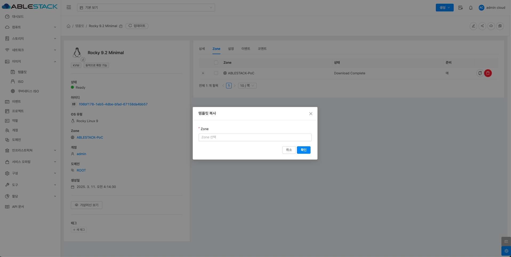
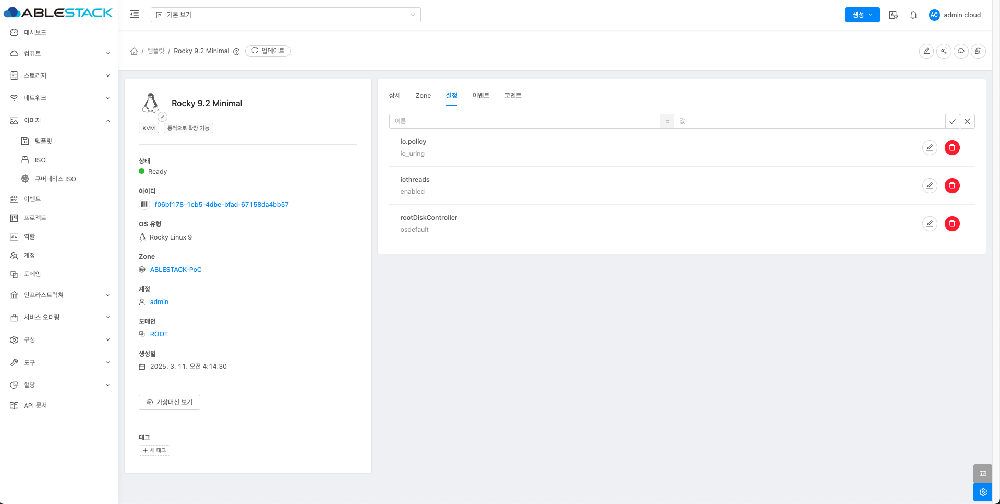

# 템플릿

## 개요
템플릿은 가상 머신을 배포하기 위한 운영체제와 소프트웨어가 포함된 미리 정의된 이미지입니다.
이를 활용하면 동일한 환경의 가상 머신을 빠르고 일관되게 생성할 수 있으며, 공용(public), 개인(private), 공유(shared) 세 가지 유형으로 나뉩니다.

공용 템플릿은 모든 사용자와 공유되며, 개인 템플릿은 생성한 사용자만 사용할 수 있고, 공유 템플릿은 특정 계정이나 도메인과 공유할 수 있습니다.
템플릿은 템플릿에서 생성하거나 ISO 이미지를 이용해 직접 만들 수 있으며, KVM, VMware 등 다양한 하이퍼바이저에서 지원됩니다.

템플릿을 업데이트하면 새로운 가상 머신 배포에만 적용되며 기존 VM에는 영향을 주지 않습니다.
또한 기본 디스크 크기, 네트워크 설정, 부팅 옵션 등을 미리 지정할 수 있어 운영 환경을 표준화하고 배포 속도를 높이는 데 유용합니다.

## 템플릿 목록 조회
1. 템플릿 목록을 확인하는 화면입니다. 생성된 템플릿 목록을 확인하거나 템플릿 생성 버튼을 클릭하여 템플릿을 생성하실 수 있습니다.
    { .imgCenter .imgBorder }

    !!! info
        프로젝트 버튼을 활성화할 때 해당 프로젝트에 대한 정보를 템플릿 목록에서 확인할 수 있습니다.

    !!! info
        필터링 기준으로 템플릿 필터 유형에 따라 목록 조회가 가능합니다.
        { .imgCenter .imgBorder }

## URL로 템플릿 등록
1. 이미지의 템플릿에서 상단의 URL로 템플릿 등록 버튼을 클릭합니다.
    { .imgCenter .imgBorder }
2. URL로 템플릿 등록 버튼을 클릭한 화면입니다.
    { .imgCenter .imgBorder }
    - **URL:** URL을 입력합니다.
    - **이름:** 이름을 입력합니다.
    - **설명:** 설명을 입력합니다.
    - **Zone:** Zone을 선택합니다.
    - **도메인 아이디:** 도메인 아이디를 선택합니다.
    - **하이퍼바이저:** 하이퍼바이저를 선택합니다.
    - **형식:** 형식을 선택합니다.
    - **OS 유형:** OS 유형을 검색하여 선택합니다.
    - **템플릿 형식:** 템플릿 형식을 선택합니다.
    - **CPU 아키텍처:** CPU 아키텍처를 선택합니다.
    - **추출 가능:** 추출 가능을 체크합니다.
    - **동적으로 확장 가능:** 동적으로 확장 가능을 체크합니다.
    - **HVM:** HVM을 체크합니다.
    - **추천:** 추천을 체크합니다.
    - **공개:** 공개를 체크합니다.

## 로컬에서 템플릿 업로드
1. 이미지의 템플릿에서 상단의 로컬에서 템플릿 업로드 버튼을 클릭합니다.
    { .imgCenter .imgBorder }
2. 로컬에서 템플릿 업로드 버튼을 클릭한 화면입니다.
    { .imgCenter .imgBorder }
    - **로컬 파일:** 로컬 파일을 클릭하여 파일을 선택합니다.
    - **이름:** 이름을 입력합니다.
    - **설명:** 설명을 입력합니다.
    - **Zone:** Zone을 선택합니다.
    - **도메인 아이디:** 도메인 아이디를 선택합니다.
    - **하이퍼바이저:** 하이퍼바이저를 선택합니다.
    - **형식:** 형식을 선택합니다.
    - **OS 유형:** OS 유형을 검색하여 선택합니다.
    - **템플릿 형식:** 템플릿 형식을 선택합니다.
    - **CPU 아키텍처:** CPU 아키텍처를 선택합니다.
    - **추출 가능:** 추출 가능을 체크합니다.
    - **동적으로 확장 가능:** 동적으로 확장 가능을 체크합니다.
    - **HVM:** HVM을 체크합니다.
    - **추천:** 추천을 체크합니다.
    - **공개:** 공개를 체크합니다.

## 템플릿 편집
1. 템플릿 상세 오른쪽 상단의 템플릿 편집 버튼을 클릭합니다.
    { .imgCenter .imgBorder }
2. 템플릿 편집 버튼을 클릭한 화면입니다.
    { .imgCenter .imgBorder }
    - **이름:** 이름을 입력합니다.
    - **설명:** 설명을 입력합니다.
    - **OS 유형:** OS 유형을 검색하여 선택합니다.

## 공유 템플릿 업데이트
1. 템플릿 상세 오른쪽 상단의 공유 템플릿 업데이트 버튼을 클릭합니다.
    { .imgCenter .imgBorder }
2. 공유 템플릿 업데이트 버튼을 클릭한 화면입니다.
    { .imgCenter .imgBorder }
    - **공개:** 공개를 활성화합니다.
    - **추천:** 추천을 활성화합니다.
    - **추출 가능:** 추출 가능을 활성화합니다.

## 템플릿 다운로드
1. 템플릿 상세 오른쪽 상단의 템플릿 다운로드 버튼을 클릭합니다.
    { .imgCenter .imgBorder }
2. 템플릿 다운로드 버튼을 클릭한 화면입니다.
    { .imgCenter .imgBorder }

## 템플릿 권한 업데이트
1. 템플릿 상세 오른쪽 상단의 템플릿 권한 업데이트 버튼을 클릭합니다.
    { .imgCenter .imgBorder }
2. 템플릿 권한 업데이트 버튼을 클릭한 화면입니다.
    { .imgCenter .imgBorder }
    - **연산:** 연산을 선택합니다.
    - **공유:** 공유를 선택합니다.
    - **계정:** 계정을 선택합니다.

## 템플릿 상세 탭
1. 템플릿 목록 조회에서 확인하고 싶은 템플릿 목록을 조회합니다. 템플릿에 대한 상세 정보를 확인하는 화면입니다. 해당 템플릿에 대한 이름, 아이디 등 상세 정보를 확인할 수 있습니다.
    { .imgCenter .imgBorder }

## 템플릿 Zone 탭
1. 템플릿 목록 조회에서 확인하고 싶은 템플릿 목록을 조회합니다. 템플릿에 대한 Zone 정보를 확인하는 화면입니다. 해당 Zone에 대한 상태와 준비 등 확인할 수 있습니다.
    { .imgCenter .imgBorder }
2. 템플릿 Zone 정보에서 **+** 버튼을 클릭하시면 해당 다운로드가 진행된 스토리지와 진행률 그리고 상태를 확인할 수 있습니다.
    { .imgCenter .imgBorder }

### 템플릿 복사
3. 여러 개의 Zone이 존재 할 경우, 템플릿을 다른 Zone에 복사할 수 있는 기능을 제공합니다.
    { .imgCenter .imgBorder }
4. 템플릿 복사 버튼을 클릭한 화면입니다.
    { .imgCenter .imgBorder }
    - **Zone:** Zone을 선택합니다.

### 템플릿 삭제
5. 템플릿이 포함된 Zone에서 해당 템플릿 삭제 기능 을 제공합니다.
    { .imgCenter .imgBorder }
6. 템플릿 삭제 버튼을 클릭한 화면입니다.
    { .imgCenter .imgBorder }

### 템플릿 일괄 삭제
7. 여러 개의 Zone이 존재 할 경우, Zone을 다중 선택하여 다른 Zone에서도 삭제 할 수 있는 기능을 제공합니다.
    { .imgCenter .imgBorder }
8. 템플릿 일괄 삭제 버튼을 클릭한 화면입니다.
    { .imgCenter .imgBorder }

## 템플릿 설정 탭
1. 템플릿 목록 조회에서 확인하고 싶은 템플릿 목록을 조회합니다. 템플릿에 대한 설정 정보를 확인 및 설정하는 화면입니다. 해당 설정에 대해 값을 지정할 수 있습니다.
    { .imgCenter .imgBorder }
2. 템플릿 설정 탭에서 이름란을 클릭하시면 설정 이름을 확인할 수 있습니다.
    { .imgCenter .imgBorder }
    { .imgCenter .imgBorder }

## 템플릿 이벤트 탭
1. 템플릿 목록 조회에서 확인하고 싶은 템플릿 목록을 조회합니다. 템플릿에 대한 이벤트 정보를 확인하는 화면입니다. 해당 이벤트에 대한 유형 및 생성일 등 확인할 수 있습니다.
    { .imgCenter .imgBorder }

## 템플릿 코멘트 탭
1. 템플릿 목록 조회에서 확인하고 싶은 템플릿 목록을 조회합니다. 템플릿에 대한 코멘트 정보를 확인하는 화면입니다. 각 사용자별로 해당 템플릿에 대한 코멘트 정보를 조회 및 관리할 수 있습니다.
    { .imgCenter .imgBorder }

## 용어사전
* 템플릿 형식
    * 템플릿을 어던 용도로 만들어졌는지 또는 어떤 역할을 수행하는지를 나타내는 논리적인 구분
        * user : 사용자가 생성하거나 등록한 일반 VM 템플릿
        * system : 내부 기능을 위한 시스템 VM(console proxy vm, secondary storage vm)을 위한 템플릿
        * builtin : 기본 제공하는 내장 템플릿
        * routing : 가상 라우터(VR, Virtual Router) 생성을 위한 템플릿
        * vnf : VNF(Virtual Network Fuction) 용도 템플릿, VPN, 방화벽 등 네트워크 기능 담당
* 사용자 데이터 링크 정책
    * 가상머신이 시작될 때, 사용자 데이터를 어떤 방식으로 접근할 수 있게 할지 결정하는 정책
        * allowoverride : 기존 사용자 데이터가 있어도, 새로운 사용자 데이터로 덮어씀. 즉, 기존 값을 무시하고 새 값을 사용.
        * append : 기존 사용자 데이터가 있으면, 새로운 데이터를 기존 데이터 뒤에 추가. 데이터를 합쳐서 전달함.
        * denyoverride : 기존 사용자 데이터가 있으면, 새로운 데이터는 무시. 덮어쓰기를 허용하지 않음.
* HVM
    * 하드웨어 가상화를 지원하는지의 여부
* 비밀번호 관리 사용
    * 가상머신 생성 시 root 사용자에 대한 비밀번호를 생성할 것인지의 여부
* 동적으로 확장 가능
    * 템플릿에 의해 생성된 가상머신에 대해 동적 스케일링을 지원할 것인지의 여부
* 추출 가능
    * 해당 ISO를 외부에 다운로드할 수 있도록 허용합니다.
