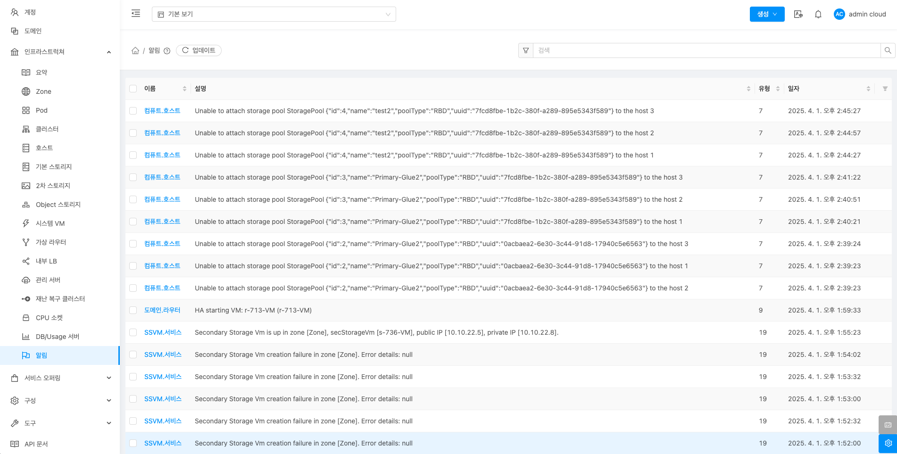
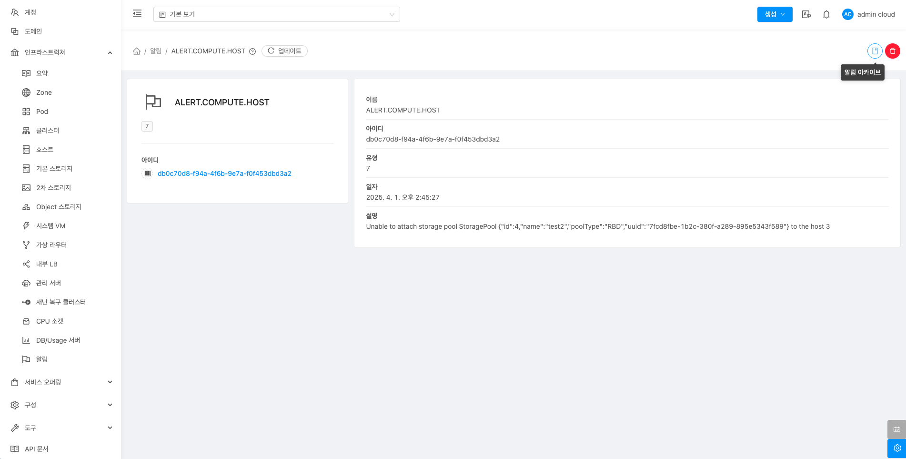
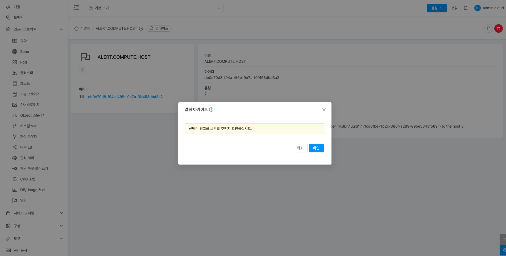
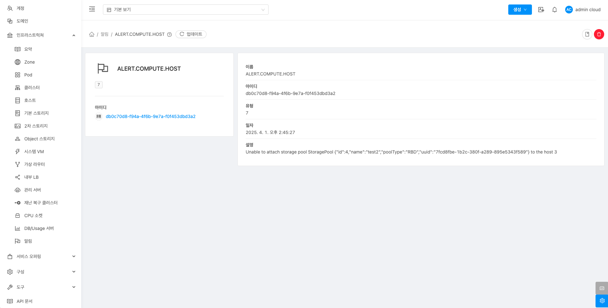

# 알림

## 개요
ABLESTACK 클라우드 인프라에서 발생하는 시스템 및 사용자 작업 관련하여 문제 발생하는 문제를 확인할 수 있습니다. 또한 관리자는 발생하는 알람을 이메일 형식으로 제공 받을수 있어 운영 및 관리의 편의성을 제공합니다.

## 목록 조회

1. 알림 목록을 확인하는 화면입니다.

    { .imgCenter .imgBorder }

## 알림 아카이브

1. 선택한 알림을 보관하는 기능입니다.

    { .imgCenter .imgBorder }

    * **알림 아카이브** 버튼을 클릭하여 알림 아카이브 화면을 호출합니다.

    { .imgCenter .imgBorder }

    * **확인** 버튼을 클릭하여 알림을 보관합니다.

### 알림 삭제

1. 무결성 검증 결과를 삭제하는 기능입니다.

    { .imgCenter .imgBorder }

    * **알림 삭제** 버튼을 클릭하여 알림 삭제 화면을 호출합니다.

    { .imgCenter .imgBorder }

    * **확인** 버튼을 클릭하여 알림을 삭제합니다.

## 상세 탭

1. 알림에 대한 상세정보를 조회하는 화면입니다. 해당 알림의 이름, 아이디, 유형, 일자, 설명 등의 정보를 확인할 수 있습니다.

    { .imgCenter .imgBorder }
