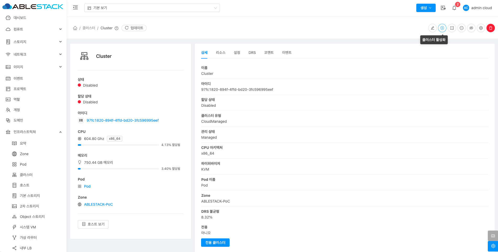

# 클러스터

## 개요
클러스터는 여러 물리적 호스트를 그룹화하여 리소스를 관리하는 단위입니다. 클러스터는 동일한 가상화 기술을 사용하는 서버들로 구성되며 가상 머신의 배치와 관리에 필요한 리소스를 제공합니다. 클러스터 내 호스트들은 리소스를 공유하고 고가용성을 통해 장애 발생 시 가상 머신을 다른 호스트에서 실행할 수 있습니다. 또한, 클러스터는 서버를 추가해 확장할 수 있어 클라우드 환경의 유연한 자원 관리가 가능합니다.

## 목록 조회

1. 클러스터 목록을 확인하는 화면입니다.
    생성된 클러스터 목록을 확인하거나 클러스터 추가 버튼을 클릭하여 클러스터를 생성할 수 있습니다.
    { .imgCenter .imgBorder }

## 클러스터 추가

1. 클러스터 추가 버튼 클릭 하여 클러스터 추가 팝업을 호출합니다.

    { .imgCenter .imgBorder }

2. 클러스터 구성을 위한 항목을 입력합니다.

    { .imgCenter .imgBorder }

    * **Zone 이름:** Zone 이름을 선택합니다.
    * **하이퍼바이저:** 하이퍼바이저를 선택합니다.
    * **CPU 아키텍처:** CPU 아키텍처를 선택합니다.
    * **Pod 이름:** Pod 이름을 선택합니다.
    * **클러스터 이름:** 클러스터 이름을 입력합니다.
    * **확인** 버튼을 클릭하여 클러스터를 추가합니다.

## 편집

1. 해당 Cluster 정보를 편집합니다.

    { .imgCenter .imgBorder }

    * **Cluster 편집** 버튼을 클릭하여 Cluster 편집 화면을 호출합니다.

    { .imgCenter .imgBorder }

    * 수정할 **항목** 을 입력합니다.
    * **확인** 버튼을 클릭하여 Cluster 업데이트합니다.

## 클러스터 비활성화

1. 해당 클러스터를 비활성화합니다.

    { .imgCenter .imgBorder }

    * **클러스터 비활성화** 버튼을 클릭하여 클러스터 비활성화 화면을 호출합니다.

    { .imgCenter .imgBorder }

    * **확인** 버튼을 클릭하여 클러스터 비활성화합니다.

## 클러스터 활성화

1. 해당 클러스터를 활성화합니다.

    { .imgCenter .imgBorder }

    * **클러스터 활성화** 버튼을 클릭하여 클러스터 활성화 화면을 호출합니다.

    { .imgCenter .imgBorder }

    * **확인** 버튼을 클릭하여 클러스터 활성화합니다.

## 클러스터 관리 해제

1. 해당 클러스터를 관리 해제합니다.

    { .imgCenter .imgBorder }

    * **클러스터 관리 해제** 버튼을 클릭하여 클러스터 관리 해제 화면을 호출합니다.

    { .imgCenter .imgBorder }

    * **확인** 버튼을 클릭하여 클러스터 관리해제합니다.

## 클러스터 관리

1. 해당 클러스터를 관리합니다.

    { .imgCenter .imgBorder }

    * **클러스터 관리** 버튼을 클릭하여 클러스터 관리 화면을 호출합니다.

    { .imgCenter .imgBorder }

    * **확인** 버튼을 클릭하여 클러스터 관리합니다.

## 원격 관리 비활성화

1. 해당 Cluster 원격 관리 비활성화합니다.

    { .imgCenter .imgBorder }

    * **원격 관리 비활성화** 버튼을 클릭하여 원격 관리 비활성화 화면을 호출합니다.

    { .imgCenter .imgBorder }

    * **확인** 버튼을 클릭하여 원격 관리 비활성화합니다.

## 원격 관리 활성화

1. 해당 Cluster 원격 관리 활성화합니다.

    { .imgCenter .imgBorder }

    * **원격 관리 활성화** 버튼을 클릭하여 원격 관리 활성화 화면을 호출합니다.

    { .imgCenter .imgBorder }

    * **확인** 버튼을 클릭하여 원격 관리 활성화합니다.

## 롤링 유지 관리 시작

1. 해당 클러스터에 호스트에 대하여 롤링 유지 관리하는 기능입니다.

    { .imgCenter .imgBorder }

    * **롤링 유지 관리 시작** 버튼을 클릭하여 롤링 유지 관리 시작 화면을 호출합니다.

    { .imgCenter .imgBorder }

    * **시간초과:** 을 입력합니다.
    * **payload:** payload에 실행할 명령을 입력합니다.
    * **확인** 버튼을 클릭하여 롤링 유지 관리 시작합니다.

## 클러스터 삭제

1. 해당 클러스터를 삭제합니다.

    { .imgCenter .imgBorder }

    * **클러스터 삭제** 버튼을 클릭하여 클러스터 삭제 화면을 호출합니다.

    { .imgCenter .imgBorder }

    * **확인** 버튼을 클릭하여 클러스터를 삭제합니다.

## 상세 탭

1. 클러스터에 대한 상세정보를 조회하는 화면입니다. 해당 클러스터의 이름, 아이디, 할당 상태, 클러스터 유형, 관리 상태, CPU 아키텍처, 하이퍼바이저, Pod 이름, Zone, DRS 불균형, 전용 등의 정보를 확인할 수 있습니다.

    { .imgCenter .imgBorder }

## 리소스 탭

1. 클러스터에 할당된 자원의 상태를 조회하는 화면입니다. 해당 클러스터에서 할당량과 활당 가능량을 확인 가능하며 메모리, CPU, 기본 스토리지 사용량, 할당된 기본 스토리지, GPU, CPU 코어수 등의 정보를 확인할 수 있습니다.

    { .imgCenter .imgBorder }

## 설정 탭

1. Cluster에서 사용하는 설정을 조회 및 관리하는 화면입니다. 해당 Cluster 설정 정보를 편집하고 초기값으로 원복할 수 있습니다.

    { .imgCenter .imgBorder }

### 편집

1. Cluster에 설정 값을 변경합니다.

    { .imgCenter .imgBorder }

    * 설정 값을 수정후 확인 버튼을 클릭하여 해당 cluster에 설정 값을 변경합니다.

### 기본값으로 재설정

1. Cluster의 설정 값을 초기값으로 재설정합니다.

    { .imgCenter .imgBorder }

## DRS 탭

!!! info
    DRS로 가상머신이 재분배 될때 라이브 마이그레이션으로 동작합니다.

1. 클러스터내 가상머신 자원 CPU, Memory 사용량을 토대로 자원을 분산하는 스케줄을 만들어 클러스터내 모든 호스트에 고르게 분배합니다.

    { .imgCenter .imgBorder }

### DRS 계획 생성

1. DRS 계획을 생성하여 배포계획을 보여줍니다. 배포 계획이 없는 DRS 설정 기준치에 적절하게 배포되어 있는 상태입니다.

    { .imgCenter .imgBorder }

    * DRS 계획 생성을 확인하여 수동으로 가상머신은 분배할 수 있습니다.

## 코멘트 탭

1. Cluster에 관련된 코멘트 정보를 확인하는 화면입니다. 각 사용자별로 해당 Cluster에 대한 코멘트 정보를 조회 및 관리할 수 있는 화면입니다.

    { .imgCenter .imgBorder }

## 이벤트 탭

1. Cluster에 관련된 이벤트 정보를 확인할 수 있는 화면입니다. Cluster에서 발생한 다양한 액션과 변경 사항을 쉽게 파악할 수 있습니다.

    { .imgCenter .imgBorder }
