# 재난 복구 클러스터

!!! info
    재난 복구 클러스터는 ABLESTACK HCI 기반의 클러스터간 DR 구성이 가능합니다.

## 개요
ABLESTACK의 가상 인프라 및 애플리케이션에서 발생할 수 있는 다양한 장애 및 재해 상황을 대응하기 위한 복구 관리 기능으로 UI를 통해 가상머신 단위로 DR 설정을 지원하여 효율적인 DR 관리가 가능하며, 가상머신 단위로 상태 모니터링을 지원하고, Mission Critical 애플리케이션이 무중단으로 운영되는 것을 보장하기 위한 서버 이중화를 지원합니다.

## 목록 조회

1. 재난 복구 클러스터 목록을 확인하는 화면입니다.
    생성된 재난 복구 클러스터 목록을 확인할 수 있습니다.
    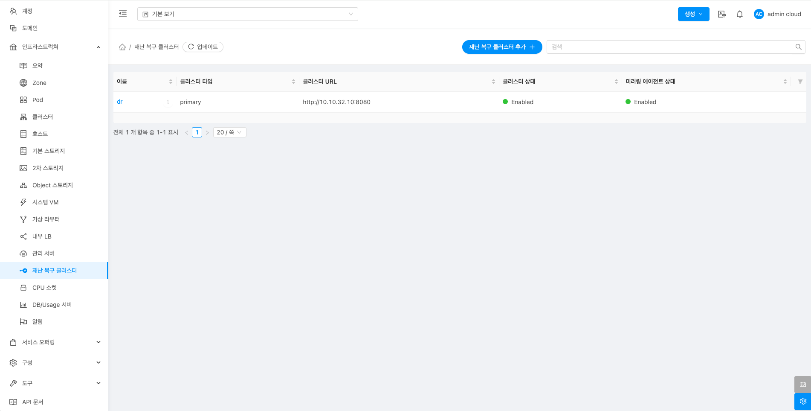{ align=center }

## 재난 복구 클러스터 추가

1. 재난 복구 클러스터 추가 버튼 클릭 하여 재난 복구 클러스터 추가 팝업을 호출합니다.
    
    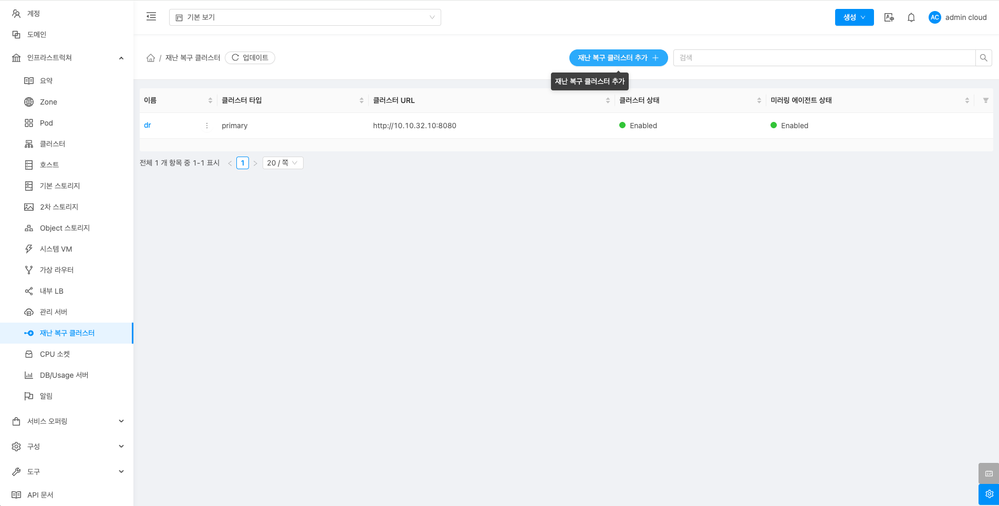{ align=center }

2. 재난 복구 클러스터 추가를 위한 항목을 입력합니다.

    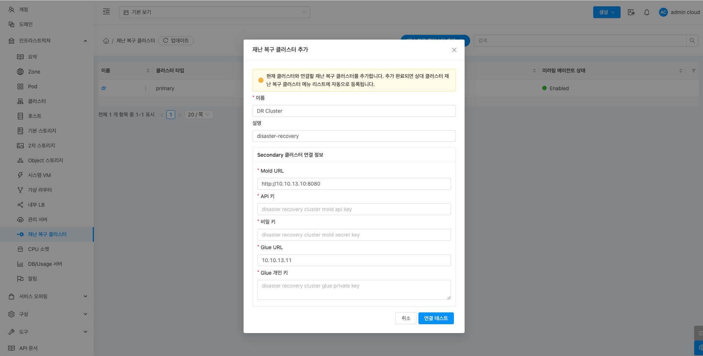{ align=center }

    * **이름:** 이름을 입력합니다.
    * **설명:** 설명을 입력합니다.
    * 재난 복구를 위한 Secondary 클러스터 연결 정보
    * **Mold URL:** Mold URL을 입력합니다.
    * **API Key:** API Key를 입력합니다.
    * **비밀 키:** 비밀 키를 입력합니다.
    * **Glue URL:** Glue URL을 입력합니다.
    * **Glue 개인 키:** Glue 개인 키를 입력합니다.
    * **연결 테스트** 버튼을 Secondary 클러스터와 통신 테스트를 합니다.
    * 연결 테스트가 정상적인 경우 확인 버튼이 활성화 됨
    * **확인** 버튼을 클릭하여 Secondary 클러스터를 추가합니다.

## 재난 복구 클러스터 편집

1. 재난 복구 클러스터를 편집할 수 있습니다.

    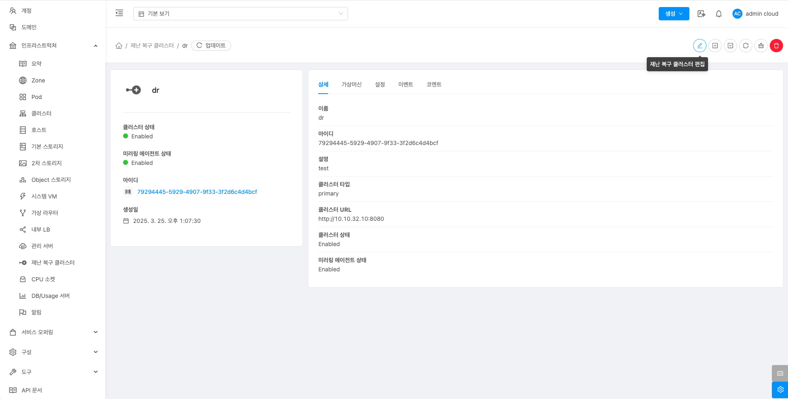{ align=center }

    * **재난 복구 클러스터 편집** 버튼을 클릭하여 재난 복구 클러스터 편집 화면을 호출합니다.

    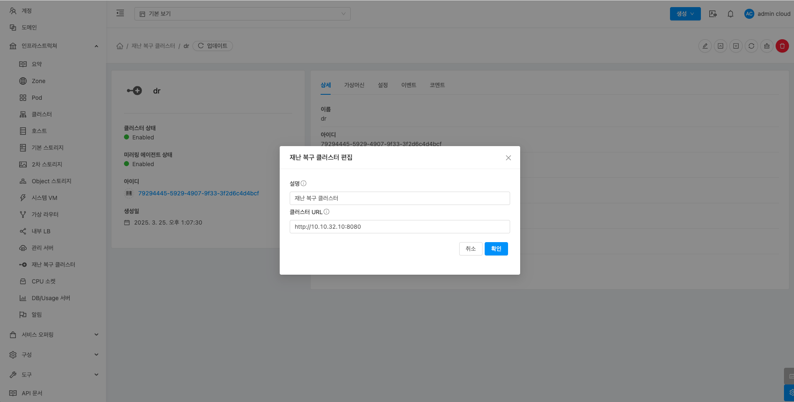{ align=center }

    * **확인** 버튼을 클릭하여 재난 복구 클러스터를 편집합니다.

## 재난 복구 클러스터 강제 프로모트

1. 재난 복구 클러스터를 강제 프로모트할 수 있습니다.

    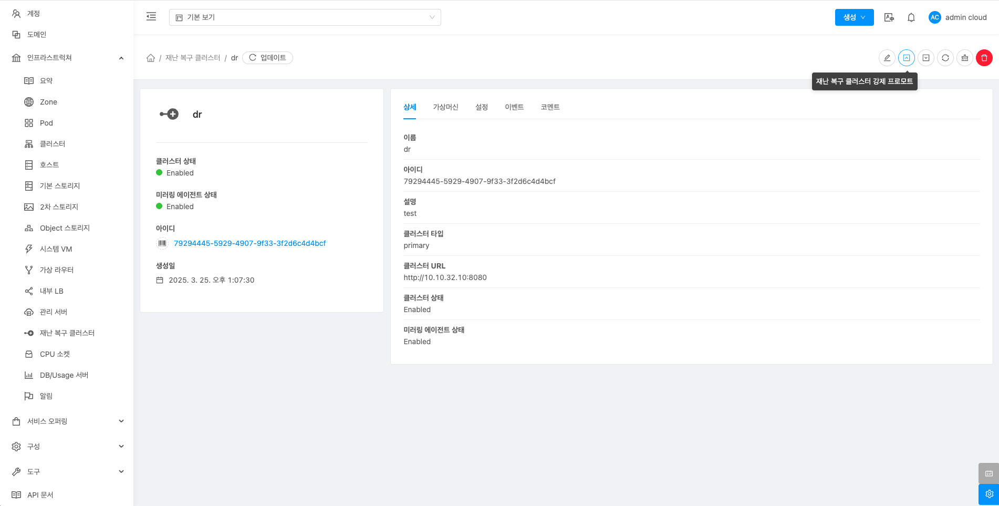{ align=center }

    * **재난 복구 클러스터 프로모트** 버튼을 클릭하여 재난 복구 클러스터 강제 프로모트 화면을 호출합니다.

    { align=center }

    * **확인** 버튼을 클릭하여 재난 복구 클러스터를 강제 프로모트합니다.

## 재난 복구 클러스터 동기화

!!! info
    재난 복구 상황 발생 시 Primary 클러스터를 복구한 경우, 강제 디모트 실행 전 복구된 Primary 클러스터의 Glue 이미지를 동기화하는 작업을 실행합니다.

1. 재난 복구 클러스터 동기화할 수 있습니다.

    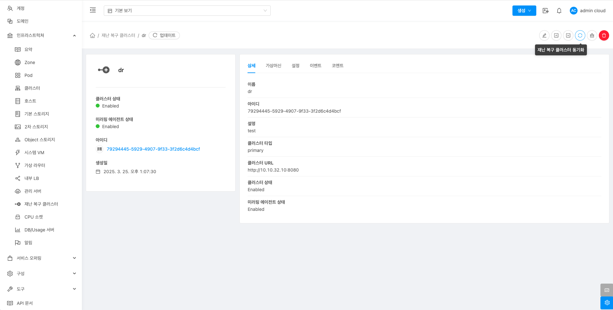{ align=center }

    * **재난 복구 클러스터 동기화** 버튼을 클릭하여 재난 복구 클러스터 강제 디모트 화면을 호출합니다.

    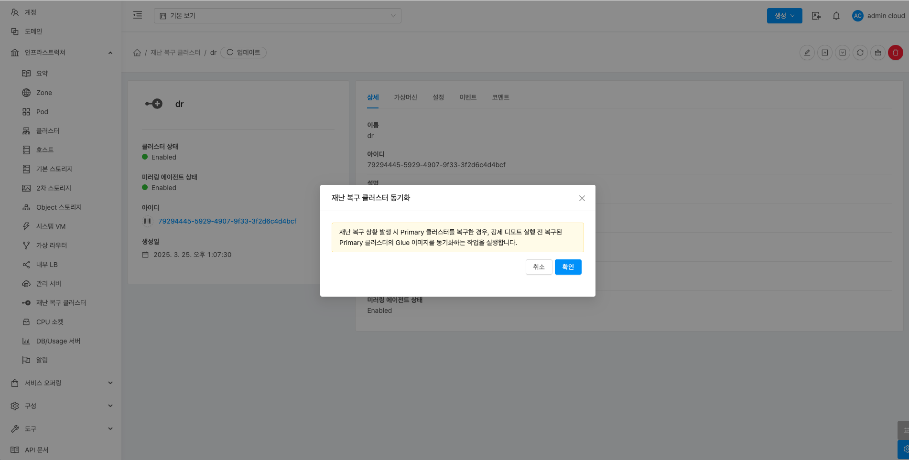{ align=center }

    * **확인** 버튼을 클릭하여 재난 복구 클러스터를 강제 디모트합니다.

## 재난 복구 클러스터 가비지 삭제

!!! info
    재난 복구 상황 발생 시 Primary 클러스터를 복구하지 않는 경우, 기존의 재난 복구 클러스터에 대한 Glue 가비지를 삭제합니다.

1. 재난 복구 클러스터 가비지 삭제할 수 있습니다.

    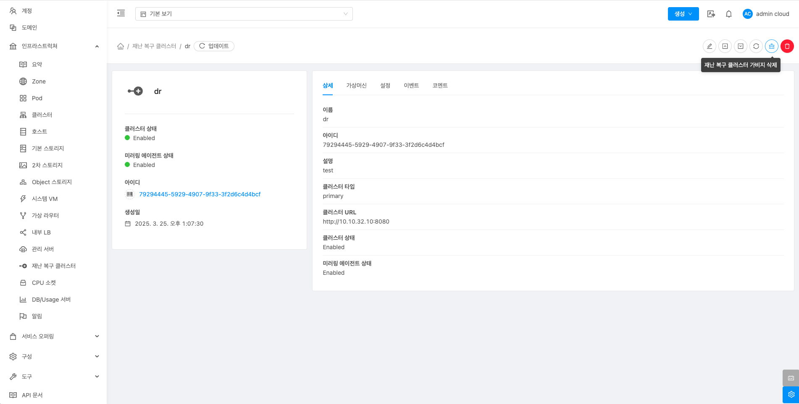{ align=center }

    * **재난 복구 클러스터 가비지 삭제** 버튼을 클릭하여 재난 복구 클러스터 가비지 삭제 화면을 호출합니다.

    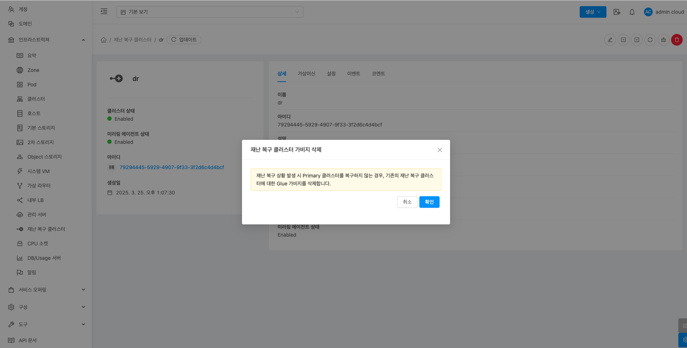{ align=center }

    * **확인** 버튼을 클릭하여 재난 복구 클러스터 가비지를 삭제합니다.

## 재난 복구 클러스터 삭제

1. 재난 복구 클러스터 삭제할 수 있습니다.

    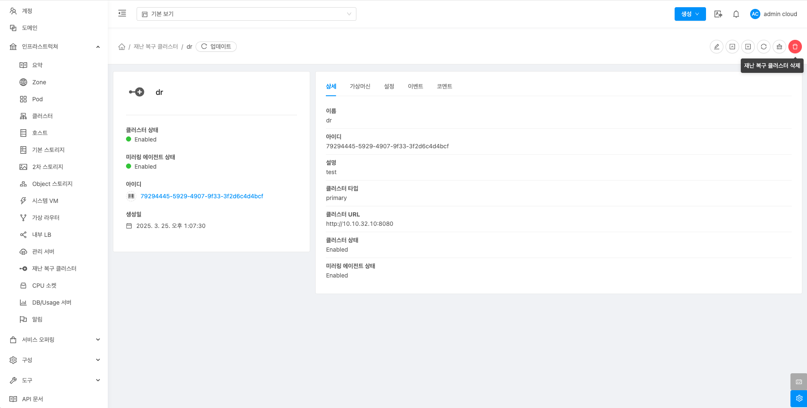{ align=center }

    * **재난 복구 클러스터 삭제** 버튼을 클릭하여 재난 복구 클러스터 삭제 화면을 호출합니다.

    { align=center }

    * **확인** 버튼을 클릭하여 재난 복구 클러스터를 삭제합니다.

## 상세 탭

1. 재난 복구 클러스터에 대한 상세정보를 조회하는 화면입니다. 해당 재난 복구 클러스터의 이름, 아이디, 설명, 클러스터 타입, 클러스터 URL, 클러스터 상태, 미러링 에이전트 상태 등의 정보를 확인할 수 있습니다.

    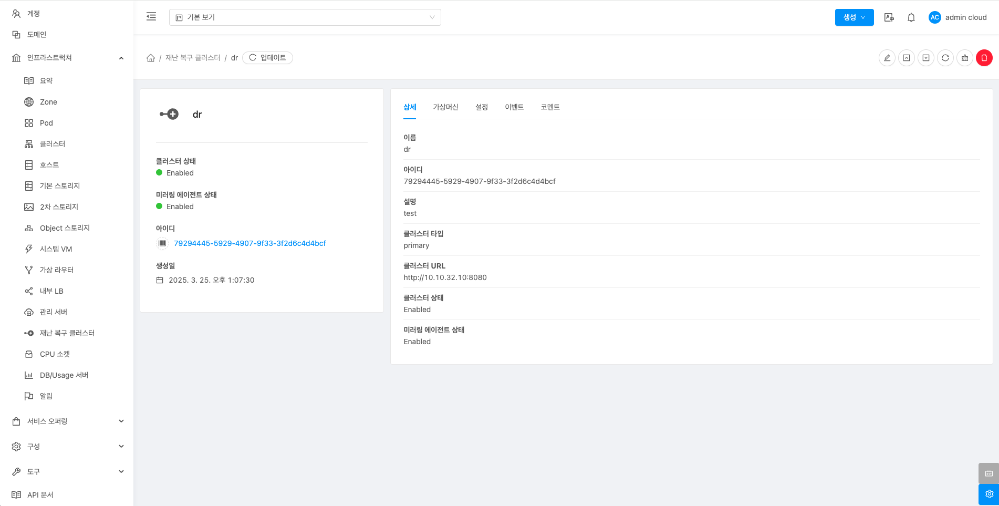{ align=center }

## 가상머신 탭

1. DR 구성된 Secondary 클러스터와 Primary 클러스터에 동기화된 가상머신 정보를 확인할 수 있습니다.

    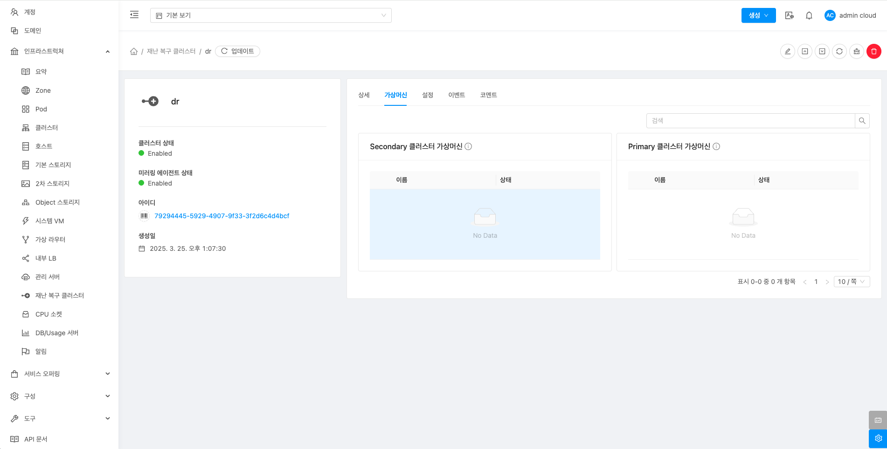{ align=center }

## 설정 탭

1. 재난 복구 클러스터에서 사용하는 설정을 조회 및 관리하는 화면입니다. 해당 재난 복구 클러스터 설정 정보를 편집하고 초기값으로 원복할 수 있습니다.

    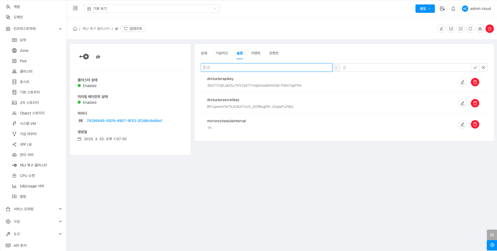{ align=center }

### 편집

1. 재난 복구 클러스터에서 설정 값을 변경합니다.

    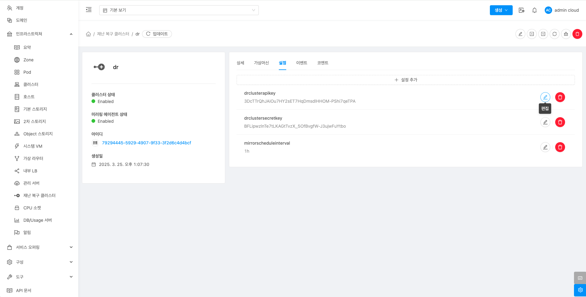{ align=center }

    * 설정 값을 수정후 확인 버튼을 클릭하여 해당 재난 복구 클러스에 설정 값을 변경합니다. 

### 기본값으로 재설정

1. 기본 스토리지의 설정 값을 초기값으로 재설정합니다.

    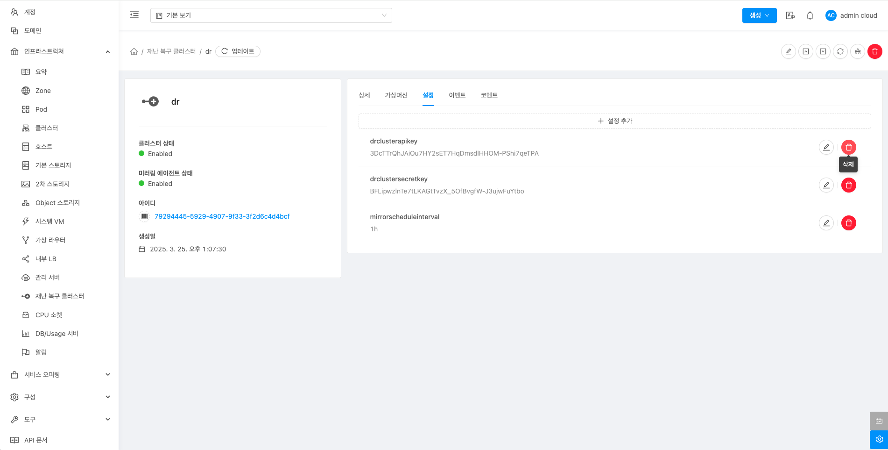{ align=center }

## 이벤트 탭

1. 재난 복구 클러스터에 관련된 이벤트 정보를 확인할 수 있는 화면입니다. 재난 복구 클러스터에서 발생한 다양한 액션과 변경 사항을 쉽게 파악할 수 있습니다.

    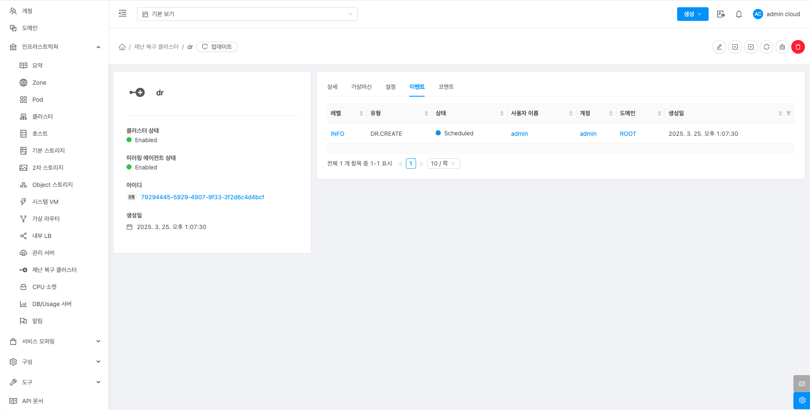{ align=center }

## 코멘트 탭

1. 재난 복구 클러스터에 관련된 코멘트 정보를 확인하는 화면입니다. 각 사용자별로 해당 재난 복구 클러스터에 대한 코멘트 정보를 조회 및 관리할 수 있는 화면입니다.

    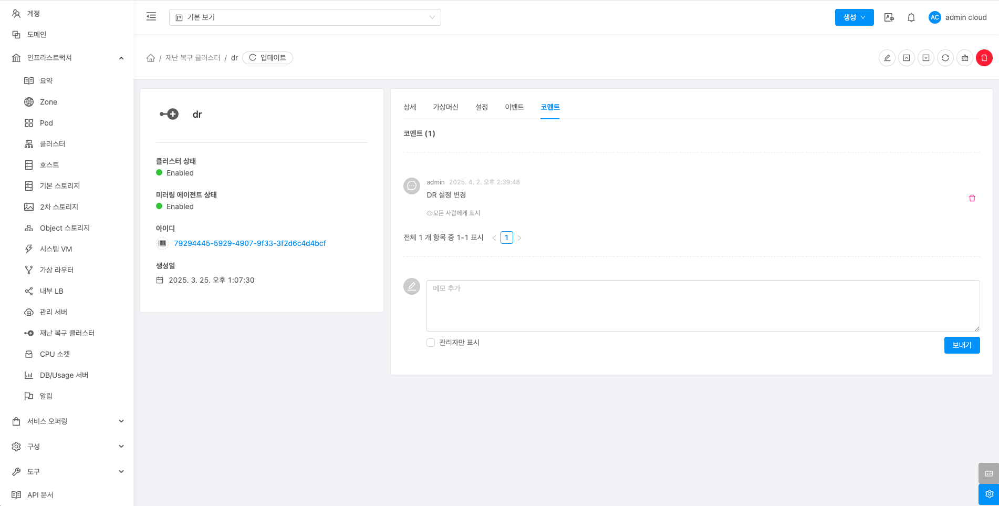{ align=center }
