# 호스트

## 개요
호스트는 가상 머신을 실행하는 물리적 서버입니다. 각 호스트는 하이퍼바이저(Cell, KVM, VMware)의 가상화 소프트웨어를 사용해 가상 머신을 관리합니다. 호스트는 CPU, 메모리, 디스크와 같은 리소스를 제공하며 ABLESTACK 클라우드 환경에서 가상 머신을 배치하고 리소스를 분배합니다. 호스트의 상태는 Up, Down, Maintenance로 구분되며 장애 발생 시 가상 머신을 다른 호스트로 이동시켜 서비스 중단을 최소화합니다. 또한 호스트는 그룹화되어 효율적으로 관리될 수 있습니다.

## 목록 조회

1. 호스트 목록을 확인하는 화면입니다.
    생성된 호스트 목록을 확인하거나 호스트 추가 버튼을 클릭하여 호스트를 추가할 수 있습니다.
    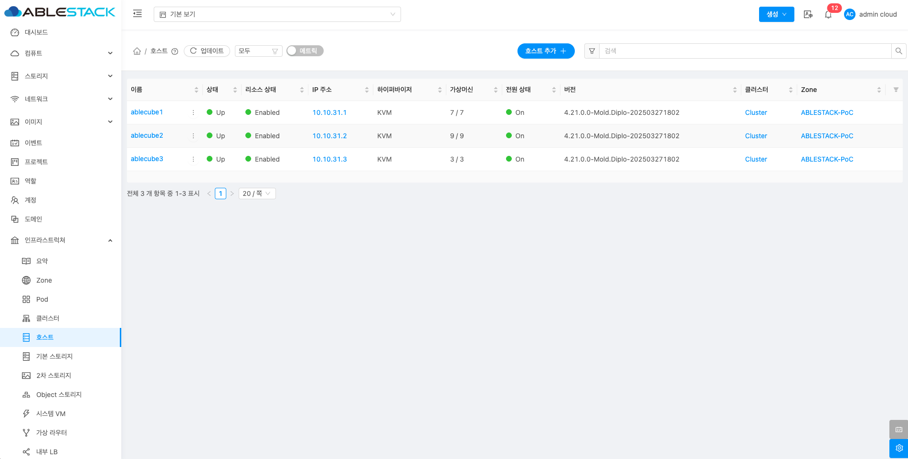{ align=center }

## 호스트 추가

1. 호스트 추가 버튼 클릭 하여 호스트 추가 팝업을 호출합니다.
    
    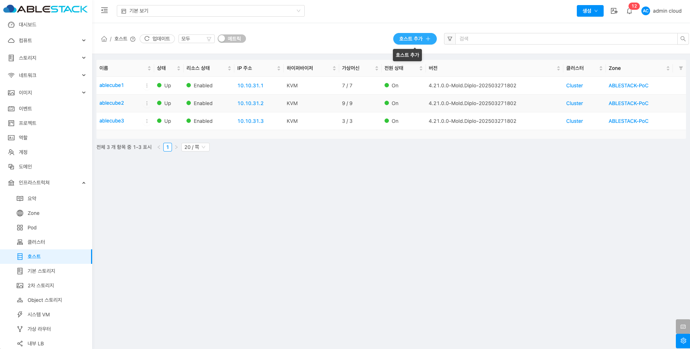{ align=center }

2. 호스트 구성을 위한 항목을 입력합니다.

    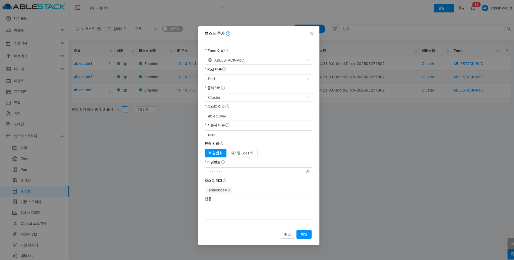{ align=center }

    * **Zone 이름:** Zone 이름을 선택합니다.
    * **Pod 이름:** Pod 이름을 선택합니다.
    * **클러스터:** 클러스터를 선택합니다.
    * **호스트 이름:** 호스트 이름을 입력합니다.
    * **사용자 이름:** 사용자 이름을 입력합니다.
    * **인증방법:** 인증방법을 선택합니다.
    * **비밀번호:** 비밀번호를 입력합니다.
    * **호스트 태그:** 호스트 태그를 입력합니다.
    * **확인** 버튼을 클릭하여 호스트를 추가합니다.

## 상세 탭

1. 호스트에 대한 상세정보를 조회하는 화면입니다. 해당 호스트의 이름, 아이디, 리소스 상태, IP 주소, 하이퍼바이저, CPU 아키텍처, 유형, 클러스터, Pod 이름, Zone, 마지막 종료 시점, 생성일, 하이퍼바이저 버전, 보안됨, 볼륨 암호화 지원, 가상머신 변환 지원, 호스트 태그, 원격 관리, 전원 상태, HA 활성화 됨 등의 정보를 확인할 수 있습니다.

    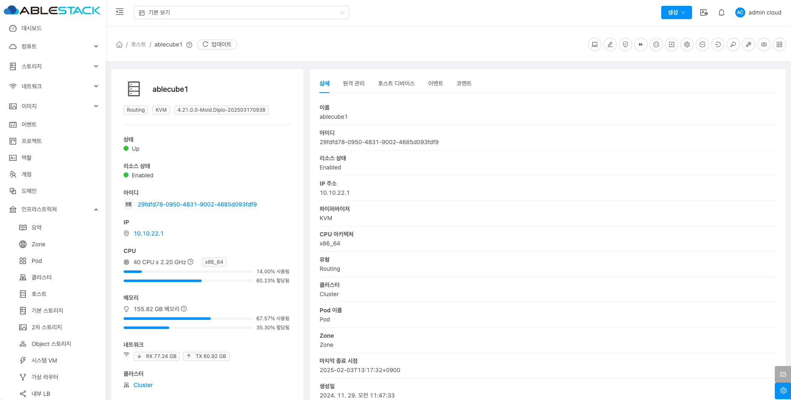{ align=center }

## 원격 관리 탭

1. 호스트 원격 관리 위한 oobm 설정 정보를 확인할 수 있습니다.

    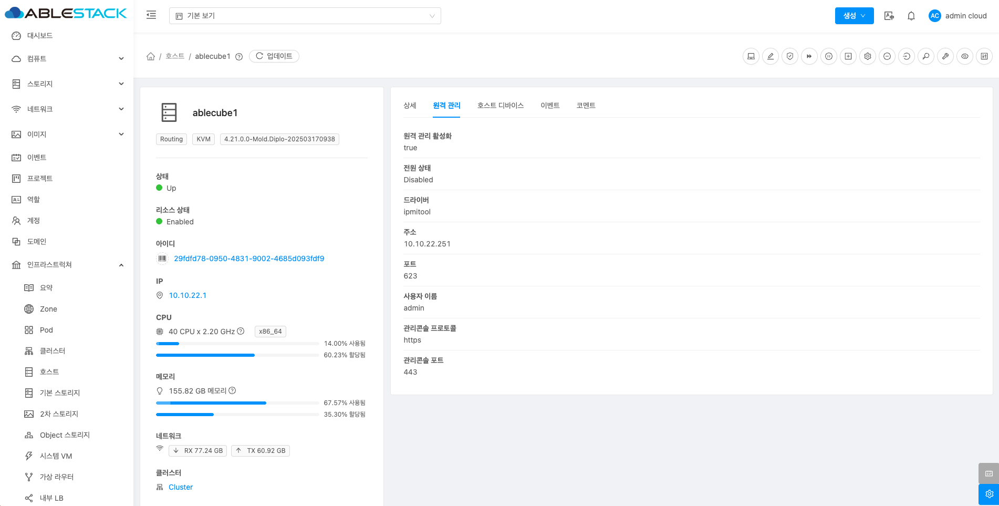{ align=center }

## 호스트 디바이스

1. Host에 디바이스를 가상머신에 직접 할당(Pass-through) 하는 기능을 제공합니다. 

    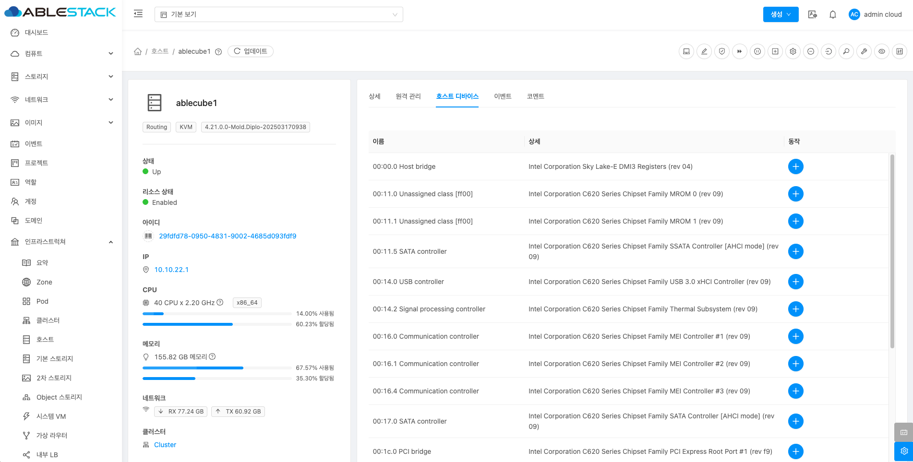{ align=center }

### 호스트 디바이스 이관

1. 이관할 장치를 **+** 버튼을 클릭 하여 호스트 디바이스 이관 팝업을 호출합니다.
    
    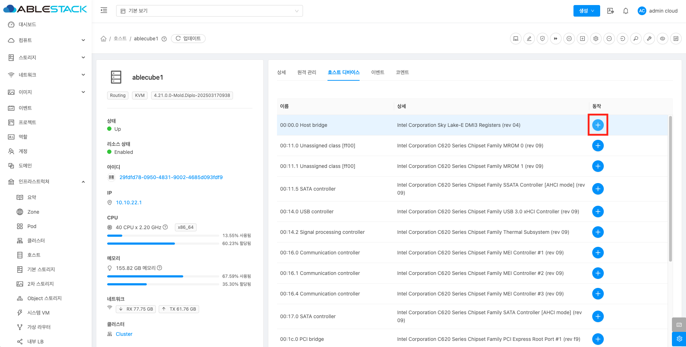{ align=center }

2. 호스트 디바이스 이관 하기위한 화면입니다.

    !!! warning
        호스트 장치를 가상머신에 이관하기 위해서는 가상머신을 완전히 정지 후 시작하셔야 적용이 됩니다. (글로벌 설정에서 enable.additional.vm.configuratio를 true로 설정해야합니다.)

    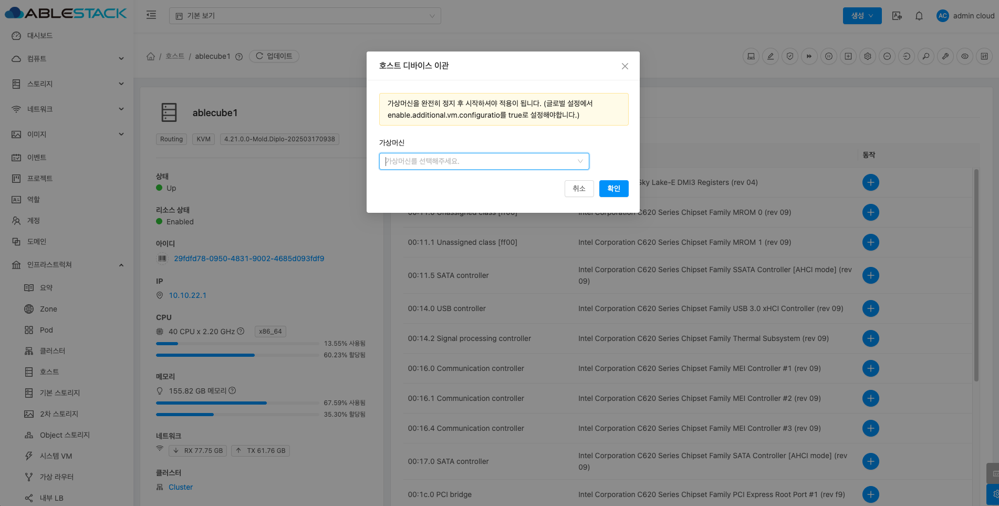{ align=center }

    * **가상머신:** 가상머신을 선택합니다.
    * **확인** 버튼을 클릭하여 가상머신에 호스트 디바이스를 이관합니다.

## 이벤트 탭

1. Host에 관련된 이벤트 정보를 확인할 수 있는 화면입니다. Host에서 발생한 다양한 액션과 변경 사항을 쉽게 파악할 수 있습니다.

    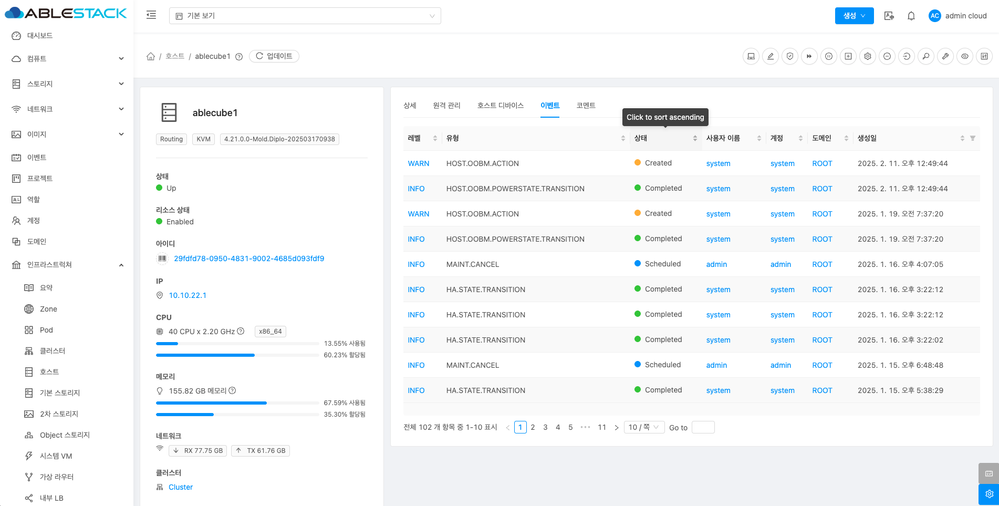{ align=center }

## 코멘트 탭

1. Host에 관련된 코멘트 정보를 확인하는 화면입니다. 각 사용자별로 해당 Host에 대한 코멘트 정보를 조회 및 관리할 수 있는 화면입니다.

    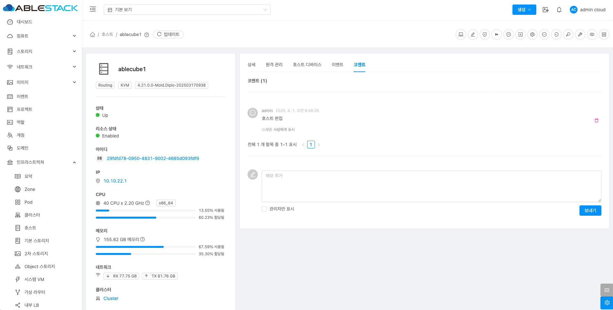{ align=center }

## OOBM 포털 연결

1. 호스트에 설정된 OOBM 포털에 접근할 수 있습니다.

    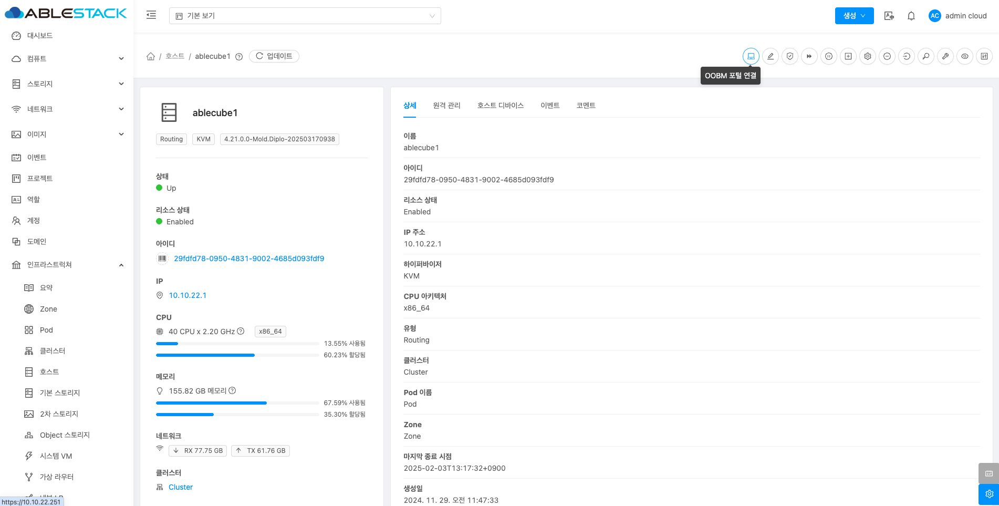{ align=center }

    * **OOBM 포털 연결** 버튼을 클릭하여 OOBM 포털화면을 호출합니다.

    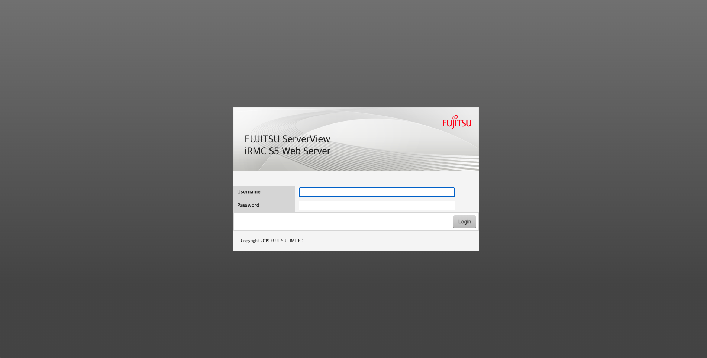{ align=center }

    * OOBM 포털에 로그인하여 호스트를 조작할 수 있습니다.

## 편집

1. 해당 Host 정보를 편집합니다.

    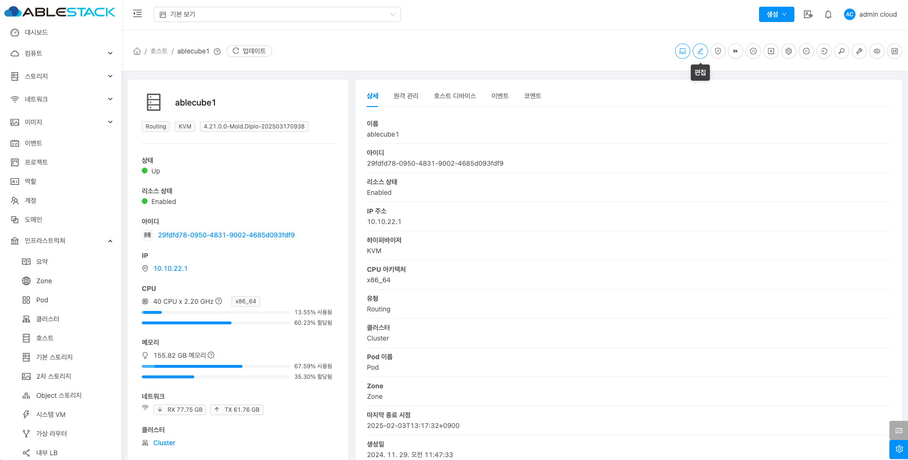{ align=center }

    * **Host 편집** 버튼을 클릭하여 Host 편집 화면을 호출합니다.

    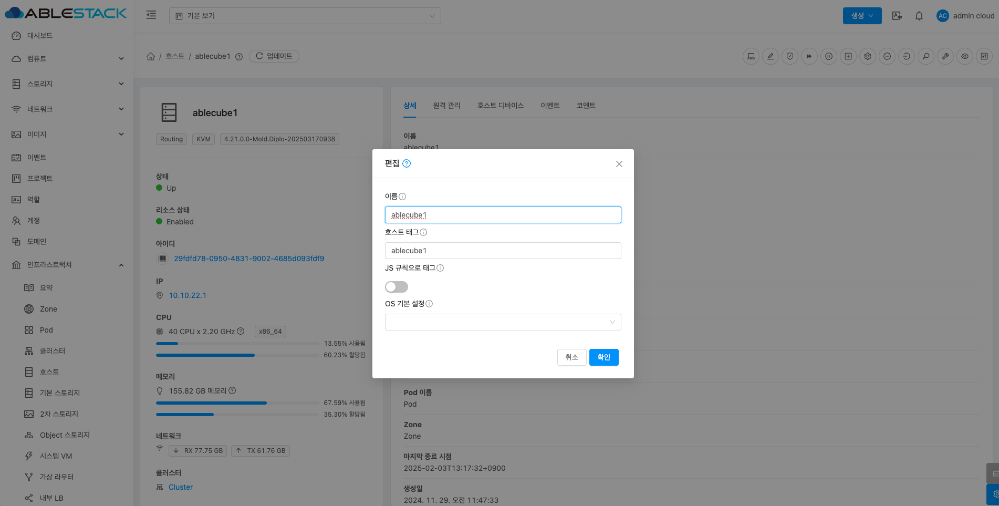{ align=center }

    * 수정할 **항목** 을 입력합니다.
    * **확인** 버튼을 클릭하여 Host 업데이트합니다.

## 호스트 보안 키 프로비저닝

1. 호스트 보안 키 프로비저닝할 수 있습니다.
    !!! warning
        새 X509 인증서를 적용한 후 Host Agent 및 libvirtd 프로세스를 다시 시작합니다.

    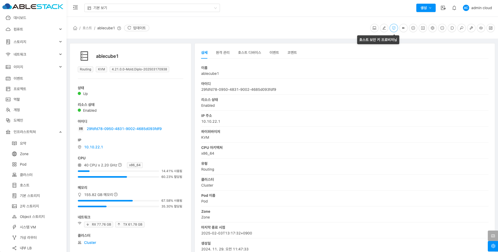{ align=center }

    * **호스트 보안 키 프로비저닝** 버튼을 클릭하여 호스트 보안 키 프로비저닝 화면을 호출합니다.

    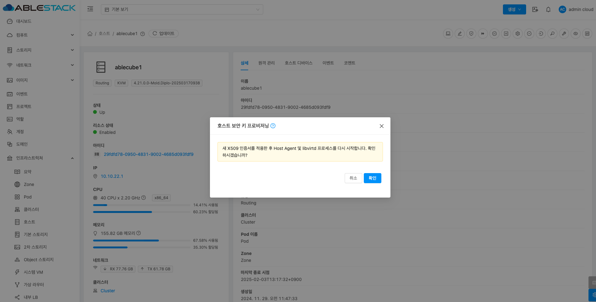{ align=center }

    * **확인** 버튼을 클릭하여 호스트 보안 키 프로비저닝 업데이트합니다.

## 강제 재연결

1. 호스트를 강제 재연결할 수 있습니다.

    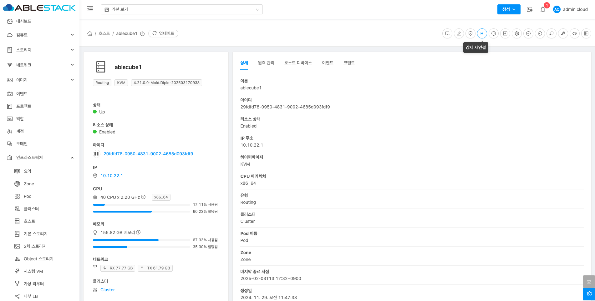{ align=center }

    * **강제 재연결** 버튼을 클릭하여 강제 재연결 화면을 호출합니다.

    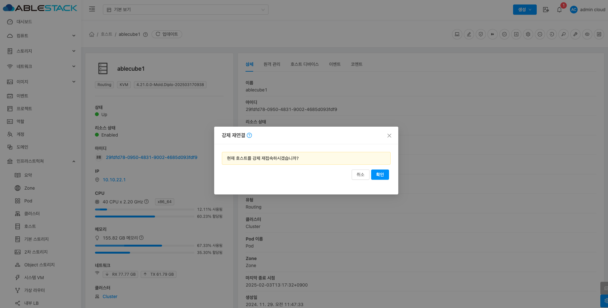{ align=center }

    * **확인** 버튼을 클릭하여 강제 재연결합니다.

## 호스트 비활성화

!!! info
    호스트 활성화, 비활성화를 하기 위해서는 enable.kvm.host.auto.enable.disable 설정 값을 true 로 체크해야합니다.

1. 해당 호스트를 비활성화합니다.

    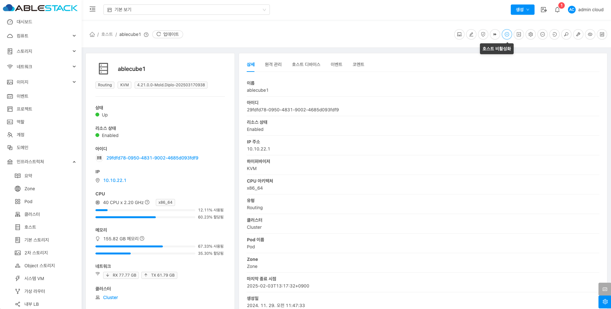{ align=center }

    * **호스트 비활성화** 버튼을 클릭하여 호스트 비활성화 화면을 호출합니다.

    { align=center }

    * **확인** 버튼을 클릭하여 호스트 비활성화합니다.

## 호스트 활성화

1. 해당 호스트를 활성화합니다.

    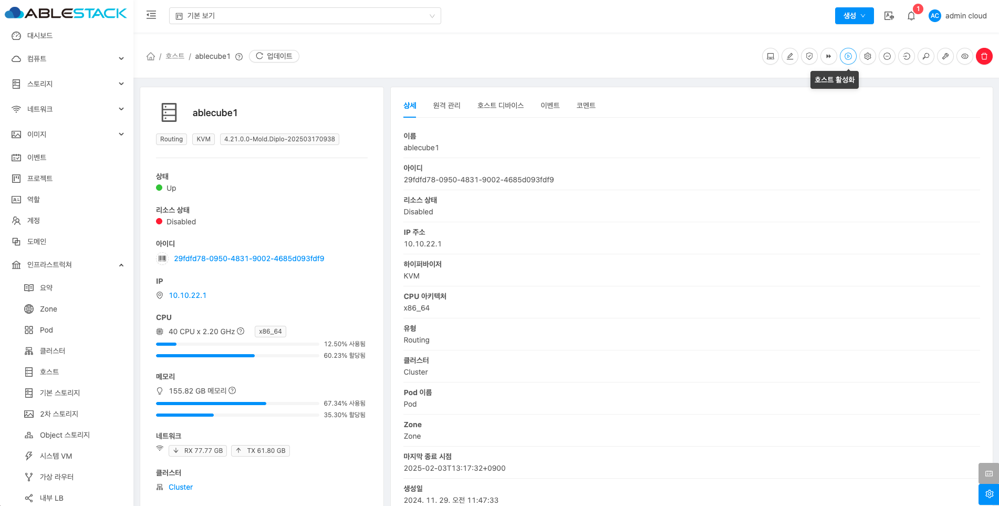{ align=center }

    * **호스트 활성화** 버튼을 클릭하여 호스트 활성화 화면을 호출합니다.

    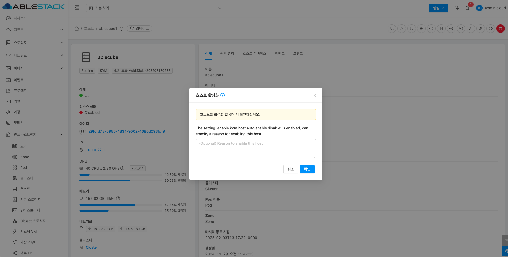{ align=center }

    * **확인** 버튼을 클릭하여 호스트 활성화합니다.

## 유지보수 모드 활성화

!!! info
    호스트 유지보수 모드로 설정하면 호스트의 모든 가상머신을 다른 호스트로 마이그레이션합니다.

1. 해당 호스트를 유지보수 모드 활성화화합니다.

    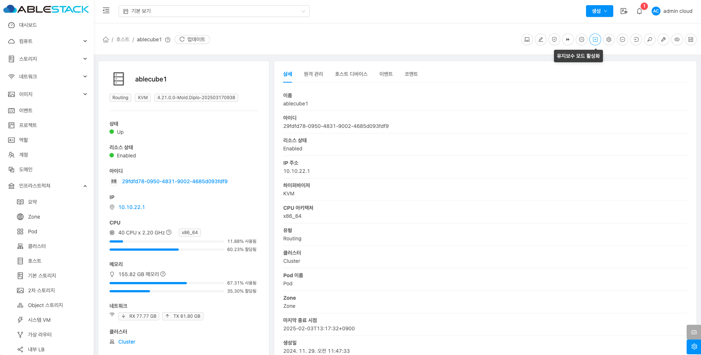{ align=center }

    * **유지보수 모드 활성화** 버튼을 클릭하여 유지보수 모드 활성화 화면을 호출합니다.

    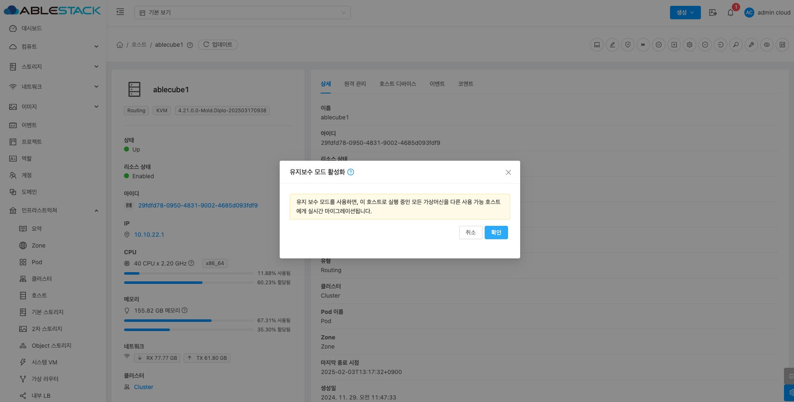{ align=center }

    * **확인** 버튼을 클릭하여 호스트 비활성화합니다.

## 유지보수 모드 비활성화

1. 해당 호스트를 유지보수 모드 비활성화합니다.

    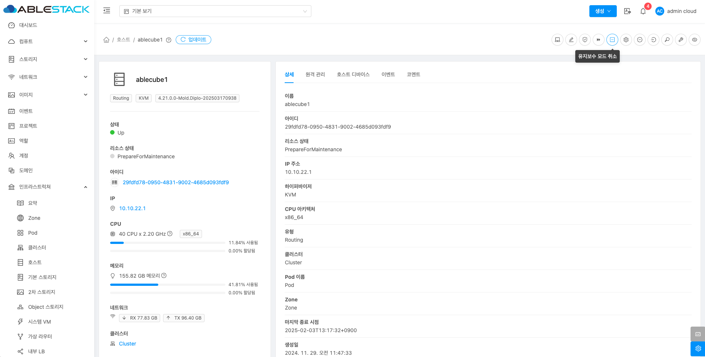{ align=center }

    * **유지보수 모드 비활성화** 버튼을 클릭하여 호스트 유지보수 모드 비활성화 화면을 호출합니다.

    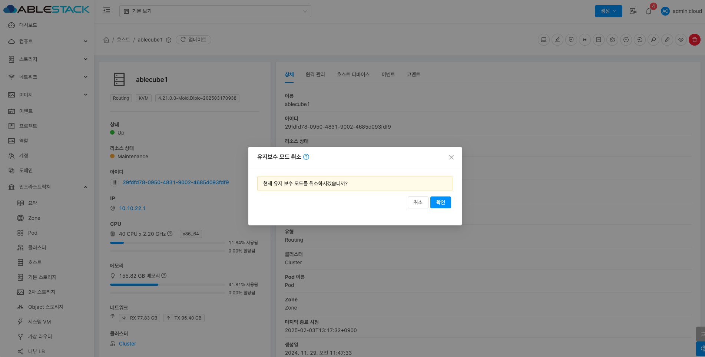{ align=center }

    * **확인** 버튼을 클릭하여 유지보수 모드 비활성화합니다.

## 원격 관리 구성

1. 원격 관리 구성 버튼 클릭 하여 원격 관리 구성 팝업을 호출합니다.
    
    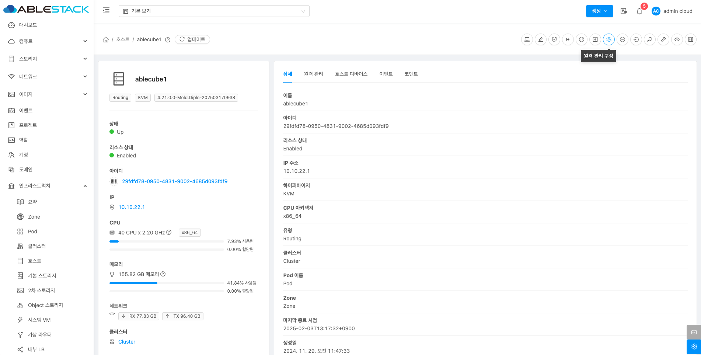{ align=center }

2. 원격 관리 구성을 위한 항목을 입력합니다.

    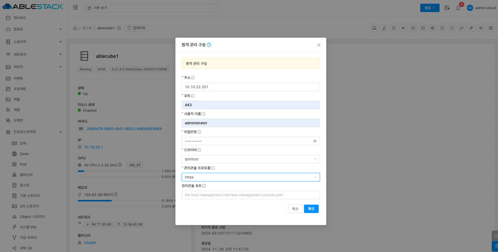{ align=center }

    * **주소:** 주소를 입력합니다.
    * **포트:** 포트를 입력합니다.
    * **사용자 이름:** 사용자 이름을 입력합니다.
    * **비밀번호:** 비밀번호를 입력합니다.
    * **드라이버:** 드라이버를 선택합니다.
    * **관리콜솔 프로토콜:** 관리콜솔 프로토콜을 선택합니다.
    * **확인** 버튼을 클릭하여 원격 관리 구성을 설정합니다.

## 원격 관리 비활성화

1. 해당 Host 원격 관리 비활성화합니다.

    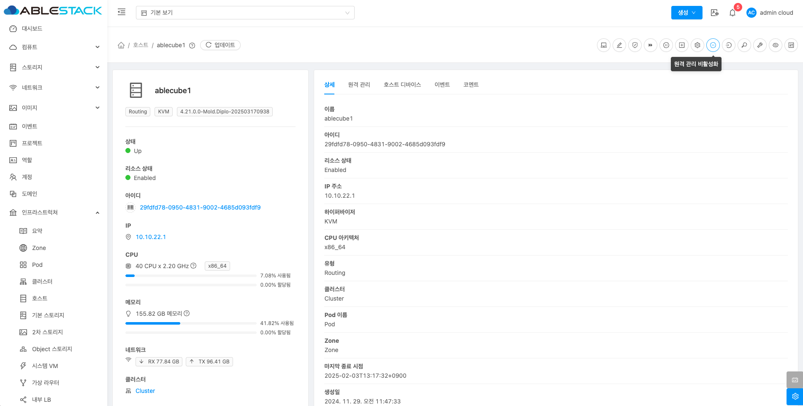{ align=center }

    * **원격 관리 비활성화** 버튼을 클릭하여 원격 관리 비활성화 화면을 호출합니다.

    { align=center }

    * **확인** 버튼을 클릭하여 원격 관리 비활성화합니다.

## 원격 관리 활성화

1. 해당 Host 원격 관리 활성화합니다.

    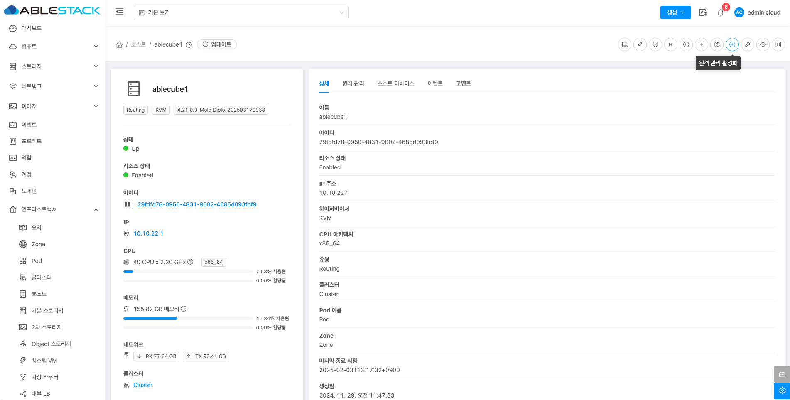{ align=center }

    * **원격 관리 활성화** 버튼을 클릭하여 원격 관리 활성화 화면을 호출합니다.

    { align=center }

    * **확인** 버튼을 클릭하여 원격 관리 활성화합니다.

## 원격 관리 전원 조치 실행

1. 원격 관리 전원 조치 실행 버튼 클릭 하여 호스트를 원격으로 관리할 수 있는 팝업을 호출합니다.
    
    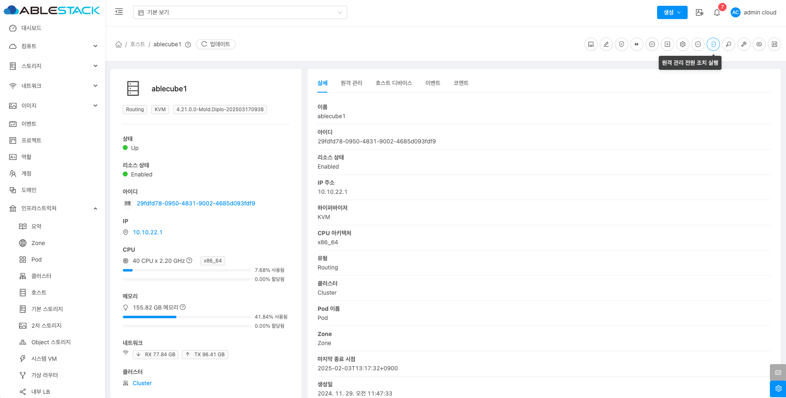{ align=center }

2. 원격 관리 전원 조치 실행을 위한 항목을 입력합니다.

    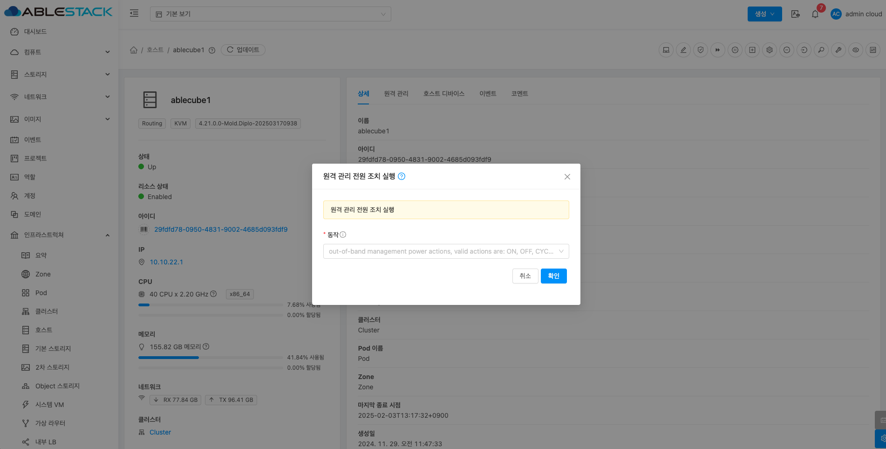{ align=center }

    * 호스트 원격관리 **동작** 을 선택합니다. ( ON, OFF, CYCLE, RESET, SOFT, STATUS )
    * **확인** 버튼을 클릭하여 원격 관리 구성을 설정합니다.

## 원격 관리 비밀번호 변경

1. 호스트의 원격 관리 비밀번호를 변경할 수 있습니다.

    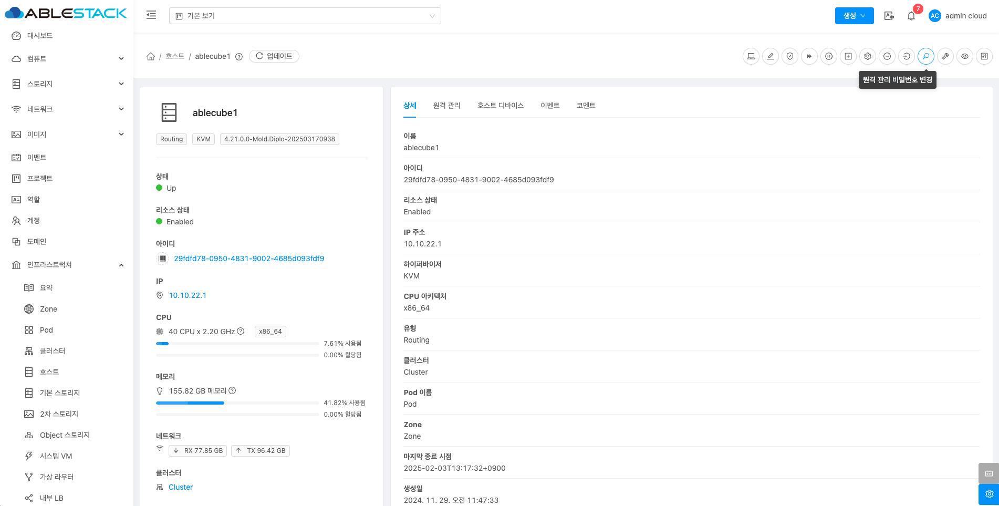{ align=center }

    * **원격 관리 비밀번호 변경** 버튼을 클릭하여 원격 관리 비밀번호 변경 화면을 호출합니다.

    { align=center }
    
    * **비밀번호:** 비밀번호를 입력합니다.
    * **확인** 버튼을 클릭하여 원격 관리 비밀번호 변경합니다.

## HA 구성

1. 호스트의 HA를 구성할 수 있습니다.

    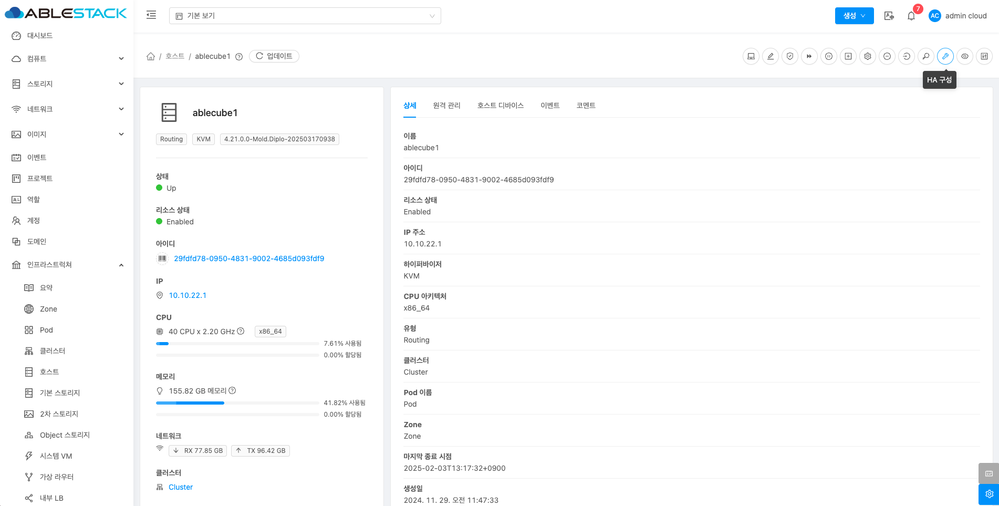{ align=center }

    * **HA 구성** 버튼을 클릭하여 HA 구성 변경 화면을 호출합니다.

    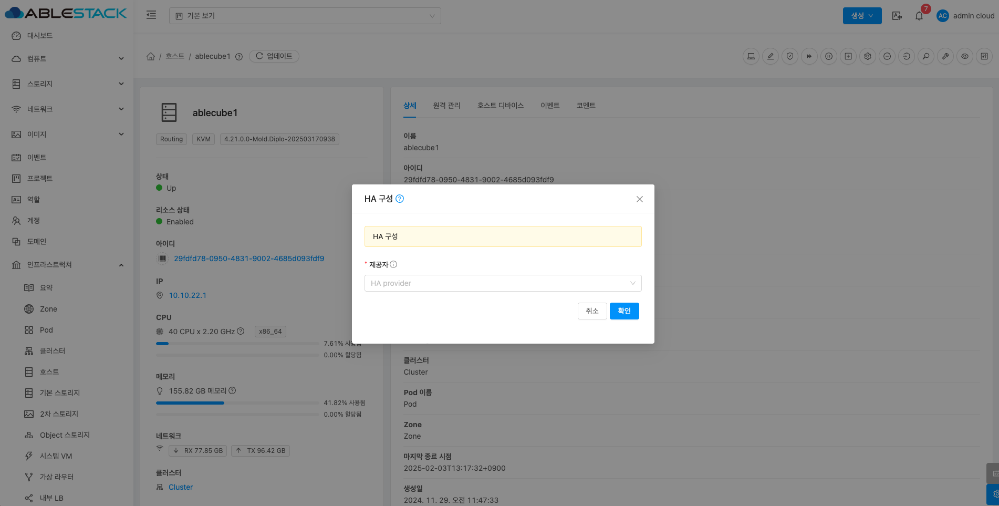{ align=center }
    
    * **제공자:** 제공자를 선택합니다.
    * **확인** 버튼을 클릭하여 HA 구성합니다.

## HA 활성화

1. 해당 호스트 HA 활성화합니다.

    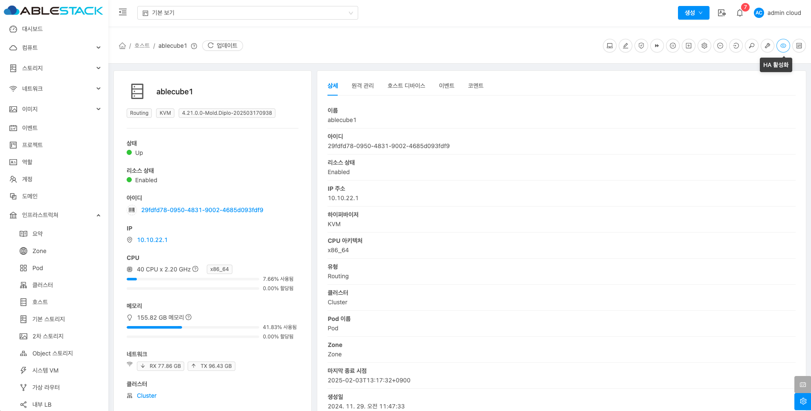{ align=center }

    * **HA 활성화** 버튼을 클릭하여 호스트 HA 활성화 화면을 호출합니다.

    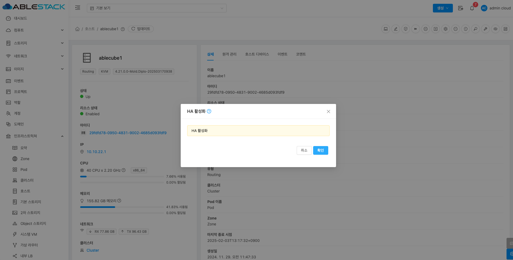{ align=center }

    * **확인** 버튼을 클릭하여 호스트 HA 활성화합니다.

## HA 비활성화

1. 해당 Zone HA 비활성화합니다.

    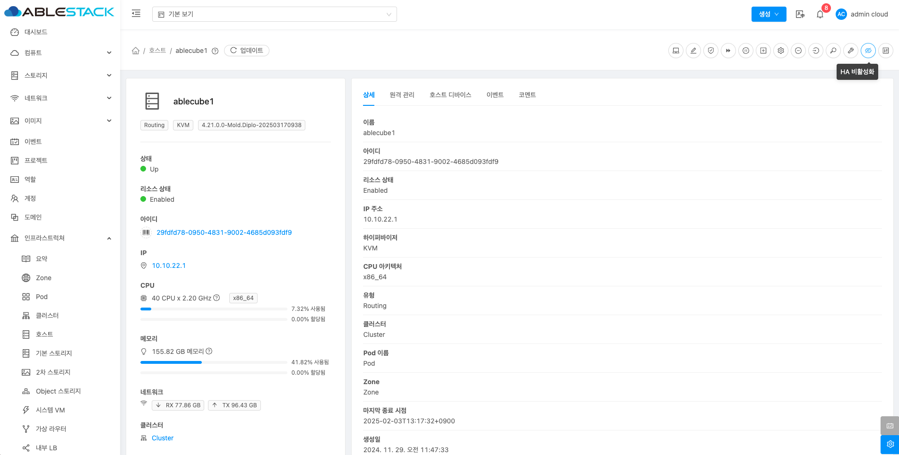{ align=center }

    * **HA 비활성화** 버튼을 클릭하여 호스트 HA 비활성화 화면을 호출합니다.

    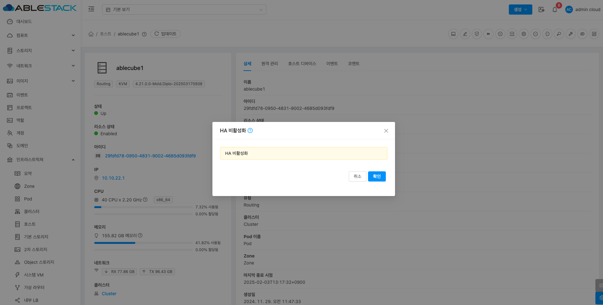{ align=center }

    * **확인** 버튼을 클릭하여 호스트 HA 비활성화합니다.

## 롤링 유지 관리 시작

1. 해당 호스트에 호스트에 대하여 롤링 유지 관리하는 기능입니다.

    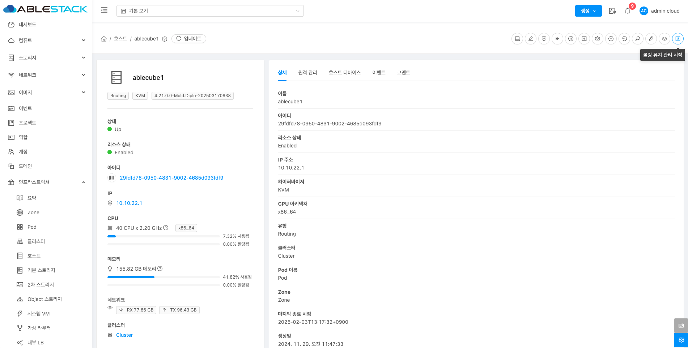{ align=center }

    * **롤링 유지 관리 시작** 버튼을 클릭하여 롤링 유지 관리 시작 화면을 호출합니다.

    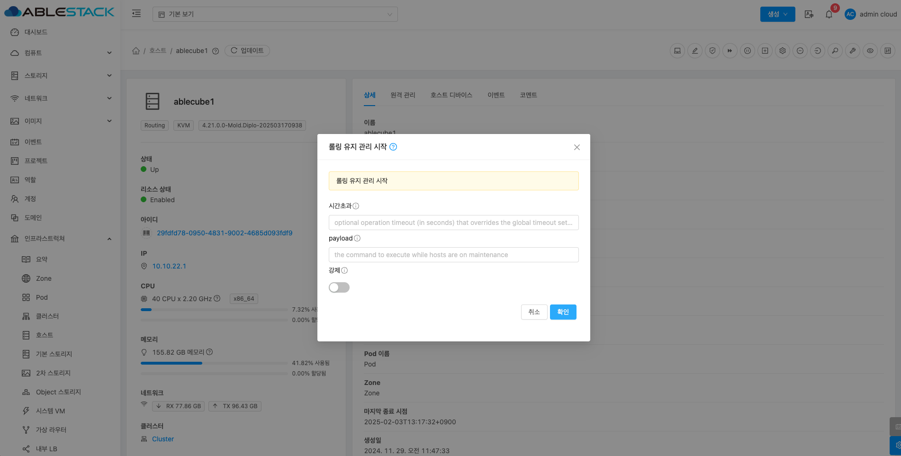{ align=center }
    
    * **시간초과:** 시간초과를 입력합니다.
    * **payload:** payload에 실행할 명령을 입력합니다.
    * **확인** 버튼을 클릭하여 롤링 유지 관리 시작합니다.

##  호스트 삭제

1. 해당 호스트를 삭제합니다.

    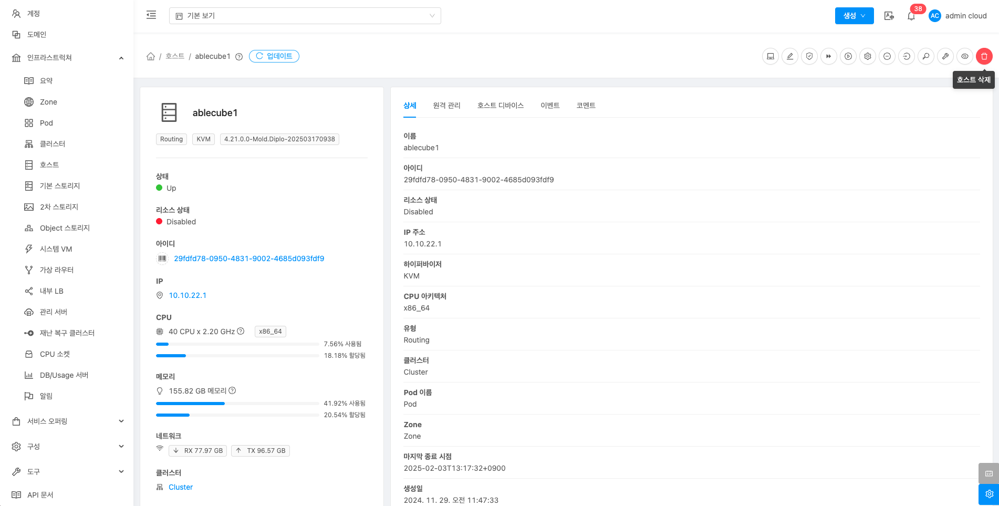{ align=center }

    * **호스트 삭제** 버튼을 클릭하여 호스트 삭제 화면을 호출합니다.

    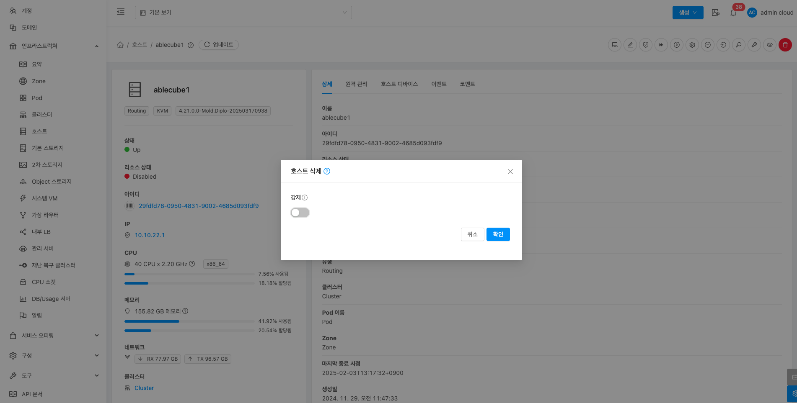{ align=center }

    * **확인** 버튼을 클릭하여 호스트를 삭제합니다.
