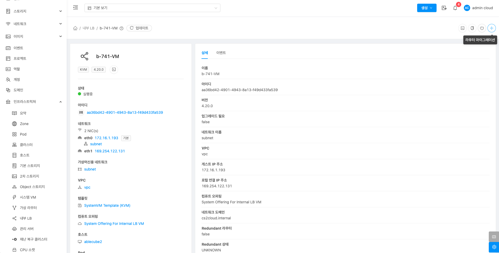

# 내부 LB

## 개요
내부 LB는 VPC(Virtual Private Cloud) 내에서만 트래픽을 분배하는 기능입니다. VPC는 가상 네트워크를 만들고 내부 LB는 이 네트워크 내에서 여러 서버들 간에 트래픽을 고르게 분배합니다. 이를 통해 서버의 부하를 분산시키고 한 서버에서 장애발생 시 자동으로 다른 서버로 트래픽을 우회시켜 서비스의 안정성을 유지합니다. 또한 외부와 격리된 상태에서만 작동하므로 보안이 강화됩니다. 이를 통해 클라우드 환경에서 효율적이고 안전한 로드 밸런싱을 제공합니다.

## 목록 조회

1. 내부 LB 목록을 확인하는 화면입니다.
    생성된 내부 LB 목록을 확인할 수 있습니다.
    { .imgCenter .imgBorder }

## 상세 탭

1. 내부 LB에 대한 상세정보를 조회하는 화면입니다. 해당 내부 LB의 이름, 아이디, 버전, 업그레이드 필요, 네트워크 이름, VPC, 게스트 IP 주소, 로컬 연결 IP 주소, 컴퓨트 오퍼링, 네트워크 도메인, Redundant 라우터, Redundant 상태, 호스트, 계정, Zone, 생성일, 제어 영역 상태 등의 정보를 확인할 수 있습니다.

    { .imgCenter .imgBorder }

## 이벤트 탭

1. 내부 LB에 관련된 이벤트 정보를 확인할 수 있는 화면입니다. 내부 LB에서 발생한 다양한 액션과 변경 사항을 쉽게 파악할 수 있습니다.

    { .imgCenter .imgBorder }

## 콘솔 보기

1. 내부 LB의 콘솔에 접근할 수 있습니다.

    { .imgCenter .imgBorder }

    * **콘솔 보기** 버튼을 클릭하여 내부 LB 콘솔 화면을 호출합니다.

    { .imgCenter .imgBorder }

    * 콘솔에서 해당  내부 LB 시스템 가상머신을 조작할 수 있습니다.

## 클립보드에 콘솔 URL 복사

1. 내부 LB의 콘솔에 접근할 수 있는 URL을 복사할 수 있습니다.

    { .imgCenter .imgBorder }

## 라우터 정지

1. 내부 LB를 정지할 수 있습니다.

    { .imgCenter .imgBorder }

    * **라우터 정지** 버튼을 클릭하여 내부 LB 정지 화면을 호출합니다.

    { .imgCenter .imgBorder }

    * **확인** 버튼을 클릭하여 내부 LB 가상머신을 정지합니다.

## 라우터 시작

1. 내부 LB를 시작할 수 있습니다.

    { .imgCenter .imgBorder }

    * **라우터 시작** 버튼을 클릭하여 내부 LB 시작 화면을 호출합니다.

    { .imgCenter .imgBorder }

    * **확인** 버튼을 클릭하여 내부 LB 가상머신을 시작합니다.

## 라우터 마이그레이션

1. 내부 LB를 다른 호스트로 마이그레이션할 수 있습니다.

    { .imgCenter .imgBorder }

    * **라우터 마이그레이션** 버튼을 클릭하여 라우터 마이그레이션 화면을 호출합니다.

    { .imgCenter .imgBorder }

    * **호스트:** 호스트를 선택합니다.
    * **확인** 버튼을 클릭하여 내부 LB를 다른 호스트로 마이그레이션합니다.
