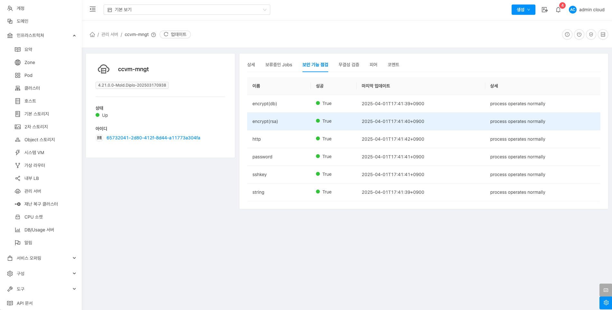

# 관리 서버

## 개요
관리 서버는 ABLESTACK 클라우드 인프라의 중앙 관리 서버로, 클라우드 자원(가상 머신, 네트워크 등)을 관리하고 사용자 요청을 처리합니다. 관리 서버는 리소스를 할당하고 상태를 모니터링하며, 장애 발생 시 알림을 제공합니다. 또한 네트워크와 보안 설정, API 처리, 서비스 배포를 담당하며 클라우드 환경의 효율적인 운영을 지원합니다. Management Server는 데이터베이스와 연동하여 클라우드 환경의 상태 정보를 저장하고 관리합니다.

## 목록 조회

1. 관리 서버 목록을 확인하는 화면입니다.

    { .imgCenter .imgBorder }

## Shutdown 준비

1. 관리 서버의 서비스를 정지할 준비를 합니다.

    { .imgCenter .imgBorder }

    * **Shutdown 준비** 버튼을 클릭하여 관리 서버 Shutdown 준비 화면을 호출합니다.

    { .imgCenter .imgBorder }

    * **확인** 버튼을 클릭하여 관리 서버를 Shutdown 준비합니다.

## 안전 종료 트리거

!!! warning
    이 작업을 수행하면 Mold 서비스가 종료 됩니다. 재시작은 Cube에 접속하여 Mold를 시작하거나, systemctl start mold 명령을 통해 시작 가능합니다.

1. 관리 서버의 서비스를 정지시킵니다.

    { .imgCenter .imgBorder }

    * **안전 종료 트리거** 버튼을 클릭하여 관리 서버 Mold 서비스를 종료하는 안전 종료 트리거 화면을 호출합니다.

    { .imgCenter .imgBorder }

    * **확인** 버튼을 클릭하여 관리 서버의 Mold 서비스를 종료합니다.

## 보안 기능 점검

1. 관리 서버의 보안 기능 점검을 수행할 수 있습니다.

    { .imgCenter .imgBorder }

    * **보안 기능 점검** 버튼을 클릭하여 관리 서버 보안 기능 점검 화면을 호출합니다.

    { .imgCenter .imgBorder }

    * **확인** 버튼을 클릭하여 관리 서버의 보안 기능을 점검합니다.

## 무결성 검증

1. 관리 서버의 무결성 검증을 수행할 수 있습니다.

    { .imgCenter .imgBorder }

    * **무결성 검증** 버튼을 클릭하여 관리 서버 무결성 검증 화면을 호출합니다.

    { .imgCenter .imgBorder }

    * **확인** 버튼을 클릭하여 관리 서버의 무결성을 검증합니다.

## 상세 탭

1. 관리 서버에 대한 상세정보를 조회하는 화면입니다. 해당 관리 서버의 수집 시간, 사용 서버가 로컬에 설치됨, DB가 로컬에서 실행, 관리서버의 마지막 시작 시간, 관리서버의 마지막 정지 시간, 관리서버 시스템의 부팅 시간, 버전, 로그 파일 정보, 모든 코어의 전체 CPU 용량(MHz), 1, 5, 15분 로드 평균, 사용자, 시스템 및 Idle 주기, 전체 시스템 메모리, 사용 가능한 시스템 메모리, 가상 전체 프로세스 크기, 사용 가능한 프로세서 코어, Java Runtime 배포, Java Runtime Version, OS 배포, Kernel Version, 연결된 에이전트 수, Active 클라이언트 세션, 사용 Heap-memory, 사용가능 Heap-memory, 차단된 스레드, 실행 가능한 스레드, 전체 스레드 수, 대기 중인 스레드 등의 정보를 확인할 수 있습니다.

    { .imgCenter .imgBorder }

## 보류중인 Jobs 탭

1. 관리 서버에서 발생한 보류중인 작업 목록을 확인하는 화면입니다. 해당 화면에서 보류중인 작업의 커맨드, 리소스 유형, 계정, 도메인, 생성일 정보를 확인할 수 있습니다.

    { .imgCenter .imgBorder }

## 보안 기능 점검

1. 관리 서버의 보안 기능을 점검 결과를 조회하는 화면입니다.

    { .imgCenter .imgBorder }

## 무결성 검증

1. 관리 서버의 무결성 검증 결과를 조회하는 화면입니다.

    { .imgCenter .imgBorder }

### 결과 삭제

1. 무결성 검증 결과를 삭제하는 기능입니다.

    { .imgCenter .imgBorder }

    * **결과 삭제** 버튼을 클릭하여 무결성 검증 결과 삭제 화면을 호출합니다.

    { .imgCenter .imgBorder }

    * **확인** 버튼을 클릭하여 무결성 검증 결과를 삭제합니다.

## 피어

1. 관리 서버 피어를 조회하는 화면입니다. 피어는 여러 개의 관리서버가 서로 연결되어 함께 작동하는 것을 의미합니다. 관리 서버들은 서로 데이터를 공유하고 부하를 나누어 처리합니다. 한 서버에 문제가 생기면 다른 서버가 대신 처리하여 클라우드 서비스의 안정성을 유지합니다.

    { .imgCenter .imgBorder }

## 코멘트 탭

1. 관리 서버에 관련된 코멘트 정보를 확인하는 화면입니다. 각 사용자별로 해당 가상 라우터에 대한 코멘트 정보를 조회 및 관리할 수 있는 화면입니다.

    { .imgCenter .imgBorder }
