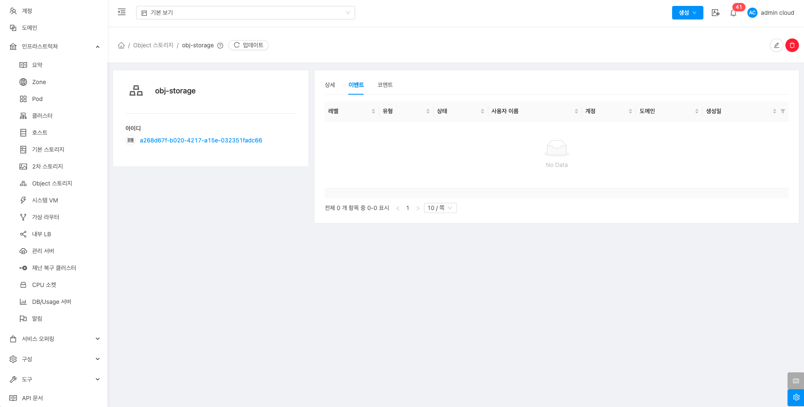

# Object 스토리지

## 개요
Object 스토리지는 대용량 비정형 데이터를 저장하는 시스템으로, 주로 이미지, 비디오, 로그 파일 등을 관리하는 데 사용됩니다. 데이터는 객체 단위로 저장되며 각 객체는 메타데이터와 고유 식별자를 가집니다. Object 스토리지는 높은 확장성과 고가용성을 제공하고, HTTP 기반의 REST API를 통해 데이터에 쉽게 접근할 수 있습니다. 이를 통해 ABLESTACK 클라우드 애플리케이션에서 대용량 파일 저장과 관리가 용이해집니다.

## 목록 조회

1. Object 스토리지 목록을 확인하는 화면입니다.
    생성된 Object 스토리지 목록을 확인하거나 Object 스토리지 추가 버튼을 클릭하여 Object 스토리지를 추가할 수 있습니다.
    { .imgCenter .imgBorder }

## Object 스토리지 추가

1. Object 스토리지 추가 버튼을 클릭하여 Object 스토리지 추가 팝업을 호출합니다.

    { .imgCenter .imgBorder }

2. Object 스토리지 추가를 위한 항목을 입력합니다.

    { .imgCenter .imgBorder }

    * **이름** 이름을 입력합니다.
    * **제공자:** 제공자를 선택합니다.
    * **URL** URL을 입력합니다.
    * **엑세스 키:** 엑세스 키를 입력합니다.
    * **비밀 키:** 비밀 키를 입력합니다.
    * **확인** 버튼을 클릭하여 Object 스토리지를 추가합니다.

## 편집

1. 해당 Object 스토리지 정보를 편집합니다.

    { .imgCenter .imgBorder }

    * **편집** 버튼을 클릭하여 편집 화면을 호출합니다.

    { .imgCenter .imgBorder }

    * 수정할 **항목** 을 입력합니다.
    * **확인** 버튼을 클릭하여 Object 스토리지를 업데이트합니다.

## Object 스토리지 삭제

1. 해당 Object 스토리지를 삭제합니다.

    { .imgCenter .imgBorder }

    * **Object 스토리지 삭제** 버튼을 클릭하여 Object 스토리지 삭제 화면을 호출합니다.

    { .imgCenter .imgBorder }

    * **확인** 버튼을 클릭하여 Object 스토리지를 삭제합니다.

## 상세 탭

1. Object 스토리지에 대한 상세정보를 조회하는 화면입니다. 해당 Object 스토리지의 이름, 아이디, URL, 제공자 등의 정보를 확인할 수 있습니다.

    { .imgCenter .imgBorder }

## 이벤트 탭

1. Object 스토리지에 관련된 이벤트 정보를 확인할 수 있는 화면입니다. Object 스토리지에서 발생한 다양한 액션과 변경 사항을 쉽게 파악할 수 있습니다.

    { .imgCenter .imgBorder }

## 코멘트 탭

1. Object 스토리지에 관련된 코멘트 정보를 확인하는 화면입니다. 각 사용자별로 해당 Object 스토리지에 대한 코멘트 정보를 조회 및 관리할 수 있는 화면입니다.

    { .imgCenter .imgBorder }
