# Pod

## 개요
Pod는 물리적 리소스를 그룹화하는 논리적 단위로 ABLESTACK 클라우드 인프라를 효율적으로 관리합니다. 각 Pod는 여러 가상화 호스트와 네트워크 리소스를 포함하며 이를 통해 리소스를 분리하고 최적화할 수 있습니다. Pod는 데이터 센터 내에서 리소스를 그룹화하고 장애가 발생해도 다른 Pod에 영향을 미치지 않도록 설계되어 가용성과 확장성을 높이는 데 중요한 역할을 합니다. 이를 통해 클라우드 환경에서 효율적인 자원 배분과 네트워크 격리가 가능합니다.

## 목록 조회

1. Pod 목록을 확인하는 화면입니다.
    생성된 Pod 목록을 확인하거나 Pod 추가 버튼을 클릭하여 Pod를 생성할 수 있습니다.
    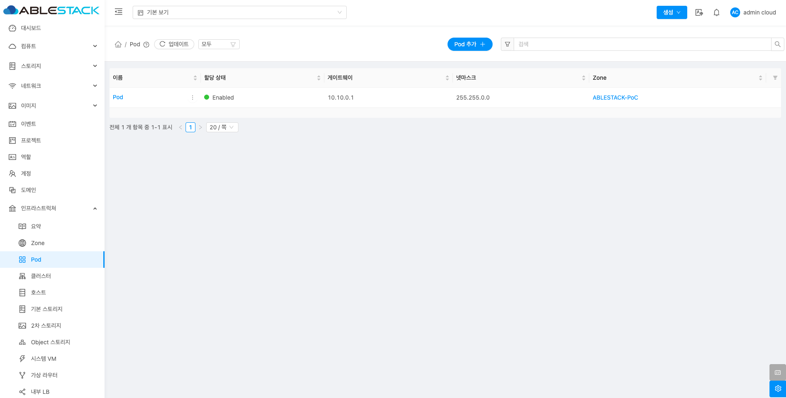{ align=center }

## Pod추가

1. Pod 추가 버튼 클릭 하여 Pod 추가 팝업을 호출합니다.
    
    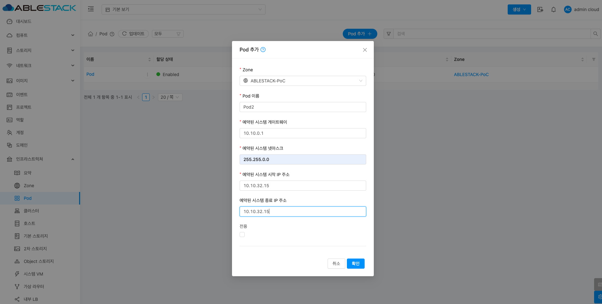{ align=center }

2. Pod 구성을 위한 항목을 입력합니다.

    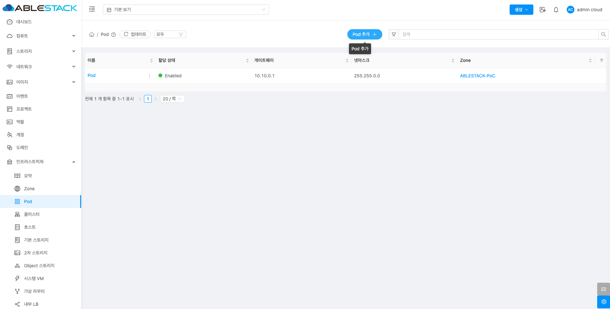{ align=center }

    * **Zone:** Zone을 선택합니다.
    * **Pod 이름:** Pod 이름을 입력합니다.
    * **예약된 시스템 게이트웨이:** 예약된 시스템 게이트웨이을 입력합니다.
    * **예약된 시스템 넷마스크:** 예약된 시스템 넷마스크를 입력합니다.
    * **예약된 시스템 시작 IP 주소:** 예약된 시스템 시작 IP 주소를 입력합니다.
    * **예약된 시스템 종료 IP 주소:** 예약된 시스템 종료 IP 주소를 입력합니다.
    * **확인** 버튼을 클릭하여 Pod를 추가합니다.

## 편집

1. 해당 Pod 정보를 편집합니다.

    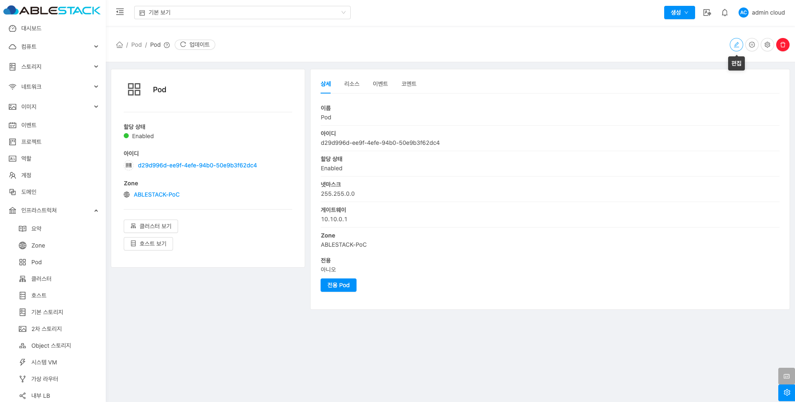{ align=center }

    * **Pod 편집** 버튼을 클릭하여 Pod 편집 화면을 호출합니다.

    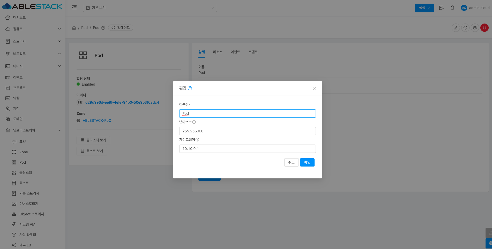{ align=center }

    * 수정할 **항목** 을 입력합니다.
    * **확인** 버튼을 클릭하여 Pod 업데이트합니다.

## Pod 비활성화

1. 해당 Pod를 비활성화합니다.

    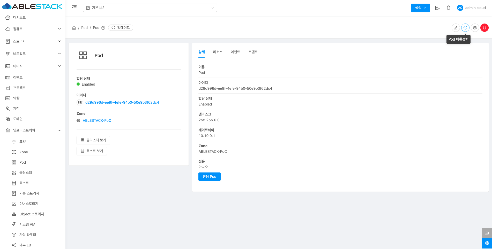{ align=center }

    * **Pod 비활성화** 버튼을 클릭하여 Pod 비활성화 화면을 호출합니다.

    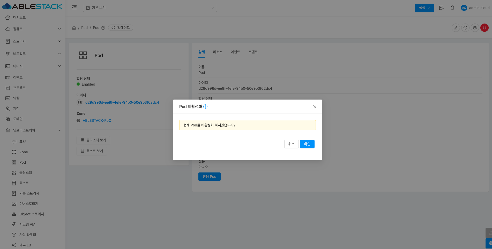{ align=center }

    * **확인** 버튼을 클릭하여 Pod 비활성화합니다.

## Pod 활성화

1. 해당 Pod를 활성화합니다.

    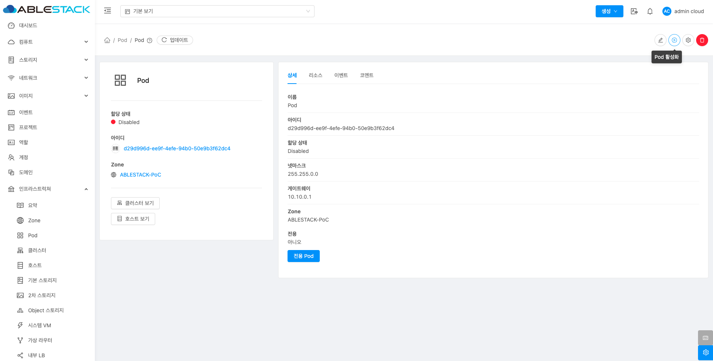{ align=center }

    * **Pod 활성화** 버튼을 클릭하여 Pod 활성화 화면을 호출합니다.

    { align=center }

    * **확인** 버튼을 클릭하여 Pod 활성화합니다.

## 롤링 유지 관리 시작

1. 해당 Pod에 호스트에 대하여 롤링 유지 관리하는 기능입니다.

    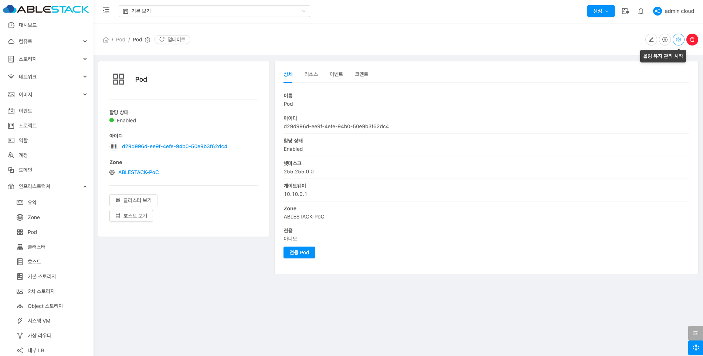{ align=center }

    * **롤링 유지 관리 시작** 버튼을 클릭하여 롤링 유지 관리 시작 화면을 호출합니다.

    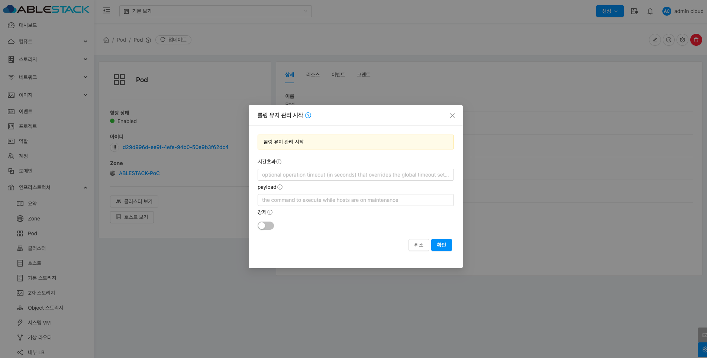{ align=center }
    
    * **시간초과:** 시간초과를 입력합니다.
    * **payload:** payload에 실행할 명령을 입력합니다.
    * **확인** 버튼을 클릭하여 롤링 유지 관리 시작합니다.

## Pod 삭제

1. 해당 Pod를 삭제합니다.

    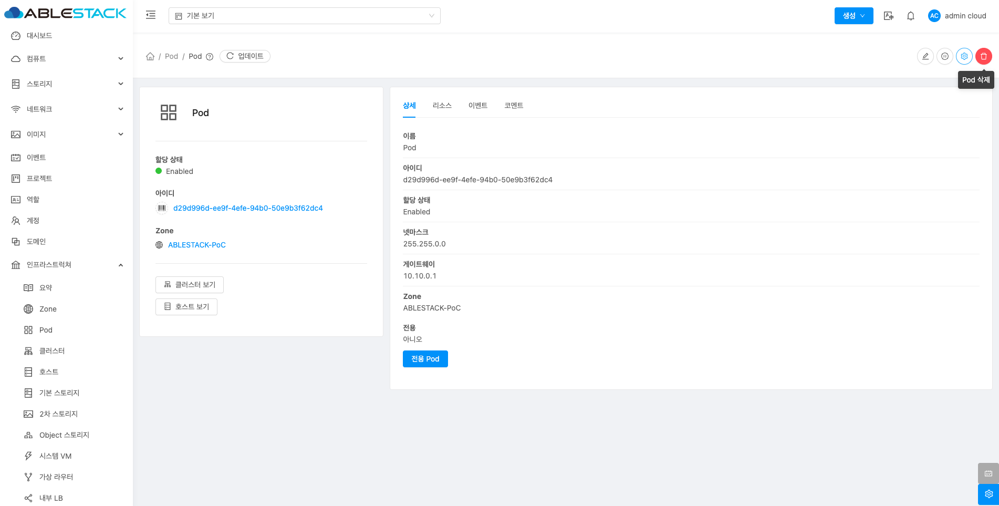{ align=center }

    * **Pod 삭제** 버튼을 클릭하여 Pod 삭제 화면을 호출합니다.

    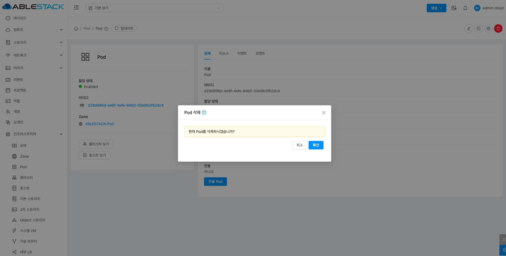{ align=center }

    * **확인** 버튼을 클릭하여 Pod를 삭제합니다.

## 상세 탭

1. Pod에 대한 상세정보를 조회하는 화면입니다. 해당 Pod의 이름, 아이디, 할당 상태, 넷마스크, 게이트웨이, Zone, 전용 등의 정보를 확인할 수 있습니다.

    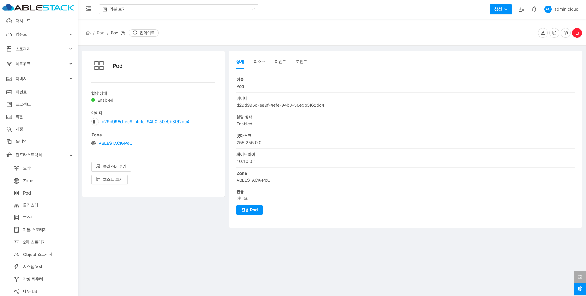{ align=center }

## 리소스 탭

1. Pod에 할당된 자원의 상태를 조회하는 화면입니다. 해당 Pod에서 할당량과 활당 가능량을 확인 가능하며 메모리, CPU, 기본 스토리지 사용량, 할당된 기본 스토리지, 관리 IP 주소, GPU, CPU 코어수 등의 정보를 확인할 수 있습니다.

    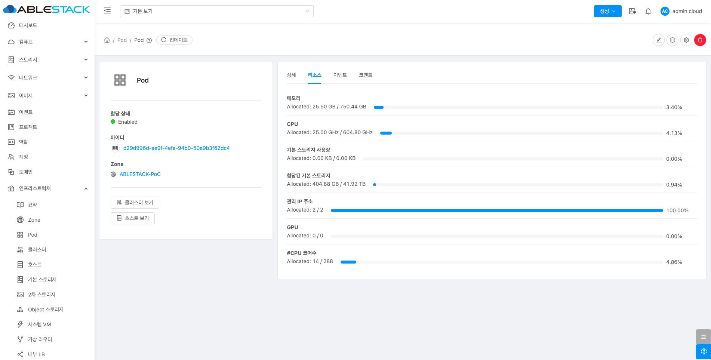{ align=center }

## 이벤트 탭

1. Pod에 관련된 이벤트 정보를 확인할 수 있는 화면입니다. Pod에서 발생한 다양한 액션과 변경 사항을 쉽게 파악할 수 있습니다.

    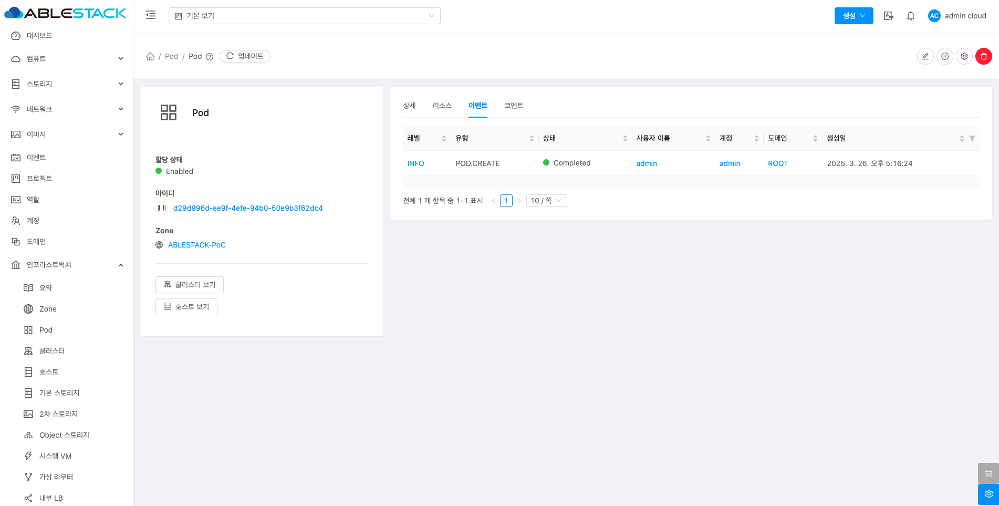{ align=center }

## 코멘트 탭

1. Pod에 관련된 코멘트 정보를 확인하는 화면입니다. 각 사용자별로 해당 Pod에 대한 코멘트 정보를 조회 및 관리할 수 있는 화면입니다.

    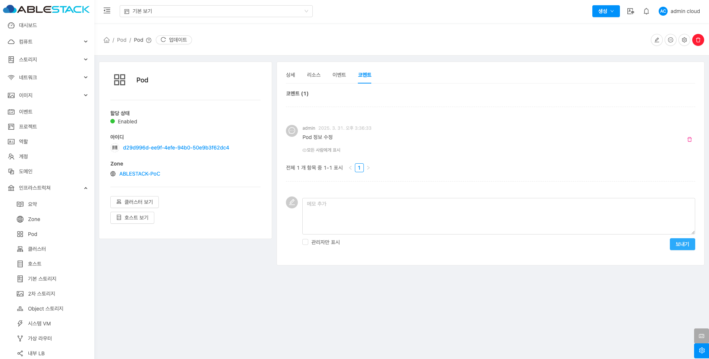{ align=center }
