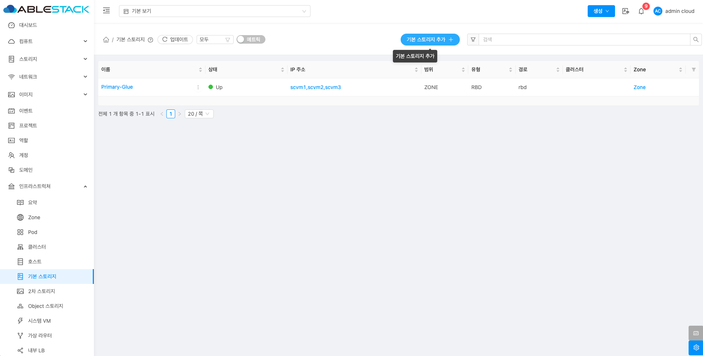
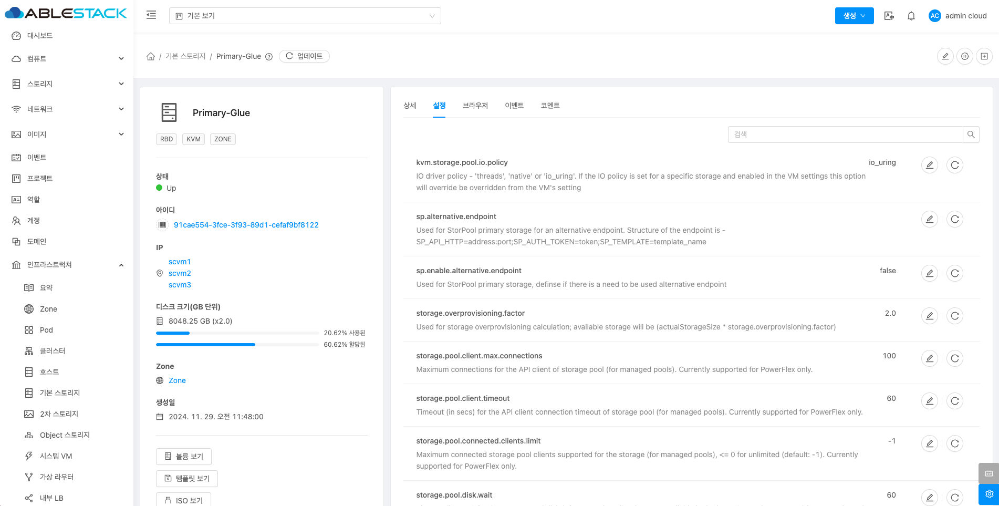

# 기본 스토리지

## 개요
기본 스토리지(Primary Storage)는 가상머신의 ROOT disk(운영 체제), DATA disk(데이터) 등을 저장하는 기본 저장소입니다. 가상머신이 실행될 때 필요한 데이터를 제공하는 중요한 역할을 합니다. 주로 빠른 데이터 접근이 필요한 SSD나 고속 스토리지를 사용하고 Glue Block, Glue FS, NFS, iSCSI와 같은 다양한 스토리지 기술을 지원합니다. 기본 스토리지는 클라우드 환경에서 가상 머신의데이터를 효율적으로 저장하고 관리하는 핵심 자원입니다.

## 목록 조회

1. 기본 스토리지 목록을 확인하는 화면입니다.
    생성된 기본 스토리지 목록을 확인하거나 기본 스토리지 추가 버튼을 클릭하여 기본 스토리지를 추가할 수 있습니다.
    { .imgCenter .imgBorder }

## 기본 스토리지 추가

1. 기본 스토리지 추가 버튼 클릭 하여 기본 스토리지 추가 팝업을 호출합니다.

    { .imgCenter .imgBorder }

2. 기본 스토리지 추가를 위한 항목을 입력합니다.
    !!! info
        아래 기본 스토리지 추가 화면 이미지에서는 nfs 추가 방식이며, 스토리지 유형에 따라 입력값은 달라질 수 있습니다.
    { .imgCenter .imgBorder }

    * **범위:** 범위를 선택합니다.
    * **Zone:** Zone을 선택합니다.
    * **Pod:** 을 선택합니다.
    * **클러스터:** 클러스터를 선택합니다.
    * **이름:** 이름을 입력합니다.
    * **제공자:** 제공자를 선택합니다.
    * **프로토콜:** 프로토콜을 선택합니다.
    * **서버:** 서버를 입력합니다.
    * **경로:** 경로를 입력합니다.
    * **NFS 마운트 옵션:** NFS 마운트 옵션을 입력합니다.
    * **기본 스토리지 태그:** 기본 스토리지 태그를 입력합니다.
    * **확인** 버튼을 클릭하여 기본 스토리지를 추가합니다.

## 편집

1. 해당 기본 스토리지 정보를 편집합니다.

    { .imgCenter .imgBorder }

    * **편집** 버튼을 클릭하여 편집 화면을 호출합니다.

    { .imgCenter .imgBorder }

    * 수정할 **항목** 을 입력합니다.
    * **확인** 버튼을 클릭하여 기본 스토리지를 업데이트합니다.

## 스토리지 풀 비활성화

1. 해당 스토리지 풀을 비활성화합니다.

    { .imgCenter .imgBorder }

    * **스토리지 풀 비활성화** 버튼을 클릭하여 스토리지 풀 비활성화 화면을 호출합니다.

    { .imgCenter .imgBorder }

    * **확인** 버튼을 클릭하여 스토리지 풀 비활성화합니다.

## 스토리지 풀 활성화

1. 해당 스토리지 풀 활성화합니다.

    { .imgCenter .imgBorder }

    * **스토리지 풀 활성화** 버튼을 클릭하여 스토리지 풀 활성화 화면을 호출합니다.

    { .imgCenter .imgBorder }

    * **확인** 버튼을 클릭하여 스토리지 풀 활성화합니다.

## 유지보수 모드 활성화

!!! warning
    기본스토리지 유지보수 모드를 실행할 경우 해당 스토리지를 사용하는 가상머신을 모두 정지시킵니다. 확인후 작업이 필요합니다.

1. 해당 기본 스토리지를 유지보수 모드 활성화화합니다.

    { .imgCenter .imgBorder }

    * **유지보수 모드 활성화** 버튼을 클릭하여 유지보수 모드 활성화 화면을 호출합니다.

    { .imgCenter .imgBorder }

    * **확인** 버튼을 클릭하여 기본 스토리지 비활성화합니다.

## 유지보수 모드 비활성화

1. 해당 기본 스토리지를 유지보수 모드 비활성화합니다.

    { .imgCenter .imgBorder }

    * **유지보수 모드 비활성화** 버튼을 클릭하여 기본 스토리지 유지보수 모드 비활성화 화면을 호출합니다.

    { .imgCenter .imgBorder }

    * **확인** 버튼을 클릭하여 유지보수 모드 비활성화합니다.

##  기본 스토리지 삭제

!!! warning
    기본 스토리지 유지보수 모드를 설정해야 삭제 버튼이 활성화됩니다.

1. 해당 기본 스토리지를 삭제합니다.

    { .imgCenter .imgBorder }

    * **기본 스토리지 삭제** 버튼을 클릭하여 기본 스토리지 삭제 화면을 호출합니다.

    { .imgCenter .imgBorder }

    * **확인** 버튼을 클릭하여 기본 스토리지를 삭제합니다.

## 상세 탭

1. 기본 스토리지에 대한 상세정보를 조회하는 화면입니다. 해당 기본 스토리지의 이름, 아이디, IP 주소, 유형, 범위, 태그, 경로, 하이퍼바이저, 오버 프로비저닝 요인, 전체 디스크 크기, 할당된 디스크 크기, 사용된 디스크 크기, Zone, 생성일 등의 정보를 확인할 수 있습니다.

    { .imgCenter .imgBorder }

## 설정 탭

1. 기본 스토리지에서 사용하는 설정을 조회 및 관리하는 화면입니다. 해당 기본 스토리지 설정 정보를 편집하고 초기값으로 원복할 수 있습니다.

    { .imgCenter .imgBorder }

### 편집

1. 기본 스토리지에서 설정 값을 변경합니다.

    { .imgCenter .imgBorder }

    * 설정 값을 수정후 확인 버튼을 클릭하여 해당 기본 스토리지에 설정 값을 변경합니다.

### 기본값으로 재설정

1. 기본 스토리지의 설정 값을 초기값으로 재설정합니다.

    { .imgCenter .imgBorder }

## 브라우저 탭

1. 기본 스토리지에 저장된 디스크 정보를 조회하거나 스토리지에 이미지를 생성할 수 있는 기능을 제공합니다.

    { .imgCenter .imgBorder }

### 이미지 생성

!!! info
    이미지 생성은 Glue Block 스토리지인 경우에만 활성화 됩니다.

1. **이미지 생성** 버튼을 클릭 하여 이미지 생성 팝업을 호출합니다.

    { .imgCenter .imgBorder }

2. Glue 기본 스토리지에 이미지를 생성하기 위한 화면입니다.

    { .imgCenter .imgBorder }

    * **이름:** 이름을 입력합니다.
    * **크기:** 크기를 입력합니다.
    * **확인** 버튼을 클릭하여 이미지를 생성합니다.

## 이벤트 탭

1. 기본 스토리지에 관련된 이벤트 정보를 확인할 수 있는 화면입니다. 기본 스토리지에서 발생한 다양한 액션과 변경 사항을 쉽게 파악할 수 있습니다.

    { .imgCenter .imgBorder }

## 코멘트 탭

1. 기본 스토리지에 관련된 코멘트 정보를 확인하는 화면입니다. 각 사용자별로 해당 기본 스토리지에 대한 코멘트 정보를 조회 및 관리할 수 있는 화면입니다.

    { .imgCenter .imgBorder }
