# 2차 스토리지

## 개요
2차 스토리지는 가상머신의 디스크 이미지, 템플릿, 스냅샷 등을 저장하는 저장소입니다. 기본 스토리지가 가상머신의 실제 데이터와 운영 체제를 저장하는 반면, 2차 스토리지는 가상머신 생성 시 필요한 파일들을 보관합니다. 새로운 VM을 만들 때 템플릿을 Secondary Storage에서 가져오고, VM의 상태를 스냅샷으로 저장해 두어 필요할 때 복원할 수 있습니다.

## 목록 조회

1. 2차 스토리지 목록을 확인하는 화면입니다.
    생성된 2차 스토리지 목록을 확인하거나 2차 스토리지 추가 버튼을 클릭하여 2차 스토리지를 추가할 수 있습니다.
    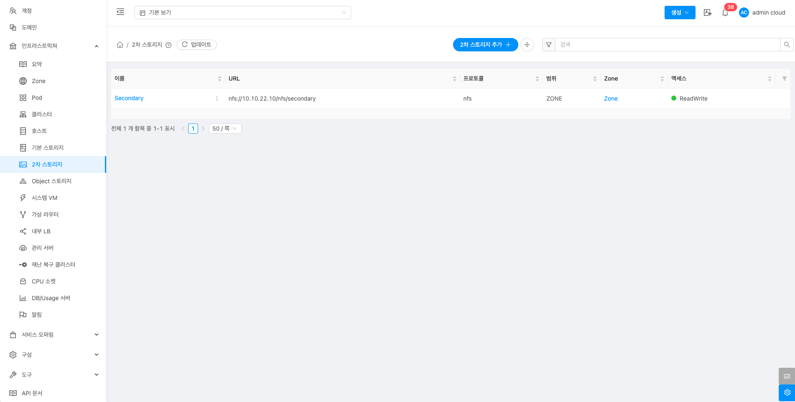{ .imgCenter .imgBorder }

## 2차 스토리지 추가

1. 2차 스토리지 추가 버튼 클릭 하여 2차 스토리지 추가 팝업을 호출합니다.

    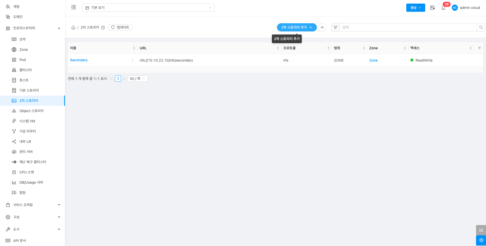{ .imgCenter .imgBorder }

2. 2차 스토리지 추가를 위한 항목을 입력합니다.
    !!! info
        아래 2차 스토리지 추가 화면 이미지에서는 nfs 추가 방식이며, 스토리지 유형에 따라 입력값은 달라질 수 있습니다.
    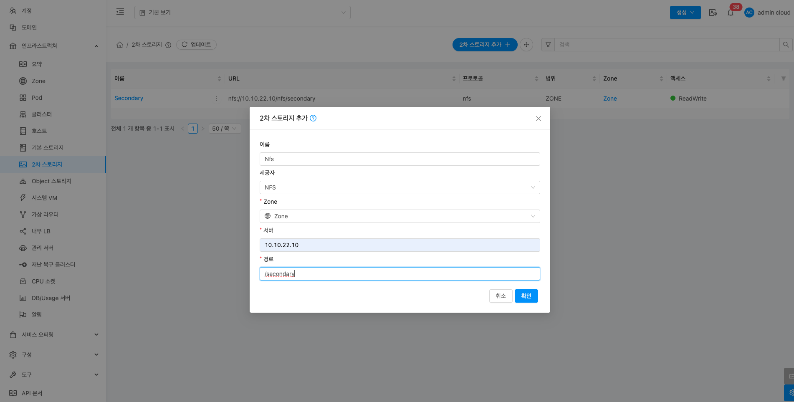{ .imgCenter .imgBorder }

    * **이름:** 이름을 입력합니다.
    * **제공자:** 제공자를 선택합니다.
    * **Zone:** Zone을 선택합니다.
    * **서버:** 서버를 입력합니다.
    * **경로:** 경로를 입력합니다.
    * **확인** 버튼을 클릭하여 2차 스토리지를 추가합니다.

## 편집

1. 해당 2차 스토리지 정보를 편집합니다.

    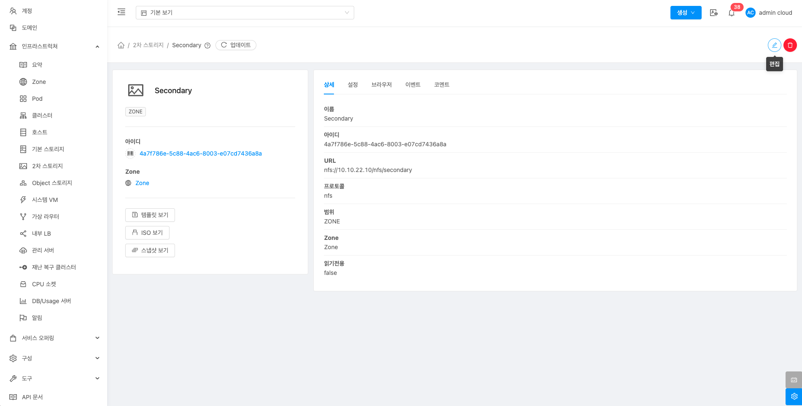{ .imgCenter .imgBorder }

    * **편집** 버튼을 클릭하여 편집 화면을 호출합니다.

    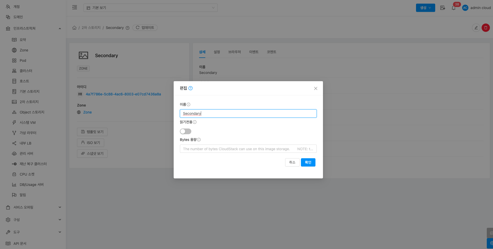{ .imgCenter .imgBorder }

    * 수정할 **항목** 을 입력합니다.
    * **확인** 버튼을 클릭하여 2차 스토리지를 업데이트합니다.

## 2차 스토리지 삭제

1. 해당 2차 스토리지를 삭제합니다.

    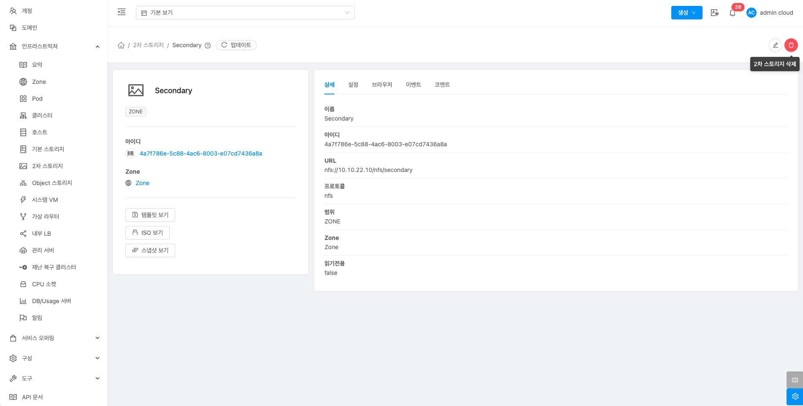{ .imgCenter .imgBorder }

    * **2차 스토리지 삭제** 버튼을 클릭하여 2차 스토리지 삭제 화면을 호출합니다.

    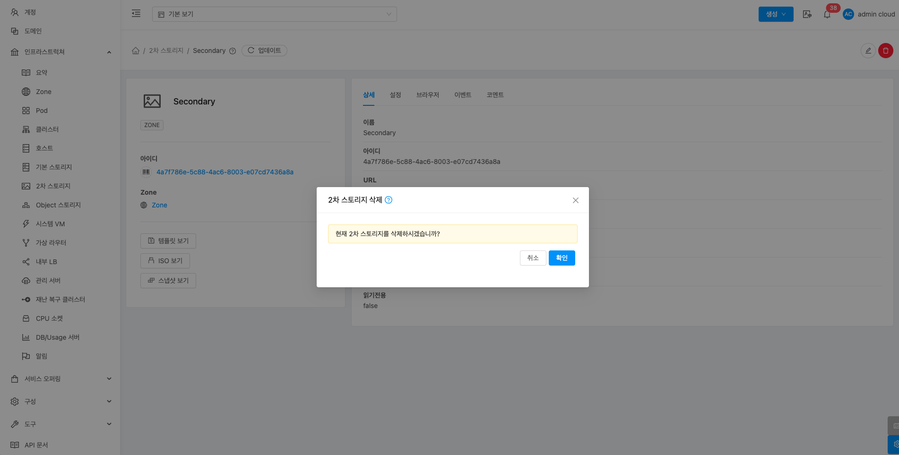{ .imgCenter .imgBorder }

    * **확인** 버튼을 클릭하여 Pod를 삭제합니다.

## 상세 탭

1. 2차 스토리지에 대한 상세정보를 조회하는 화면입니다. 해당 2차 스토리지의 이름, 아이디, URL, 프로토콜, 범위, Zone, 읽기전용 등의 정보를 확인할 수 있습니다.

    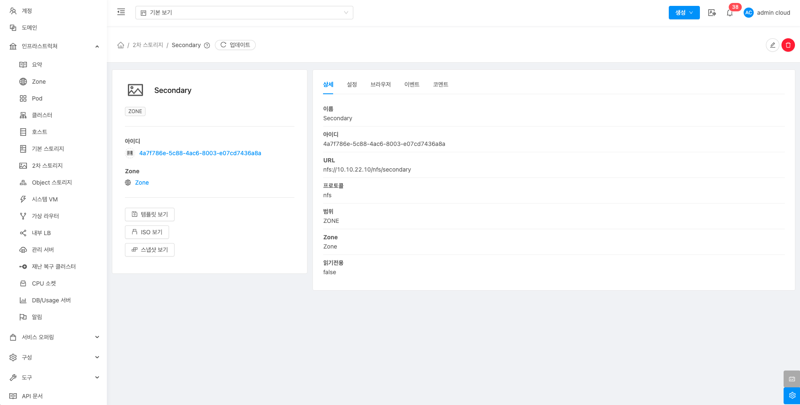{ .imgCenter .imgBorder }

## 설정 탭

1. 2차 스토리지에서 사용하는 설정을 조회 및 관리하는 화면입니다. 해당 2차 스토리지 설정 정보를 편집하고 초기값으로 원복할 수 있습니다.

    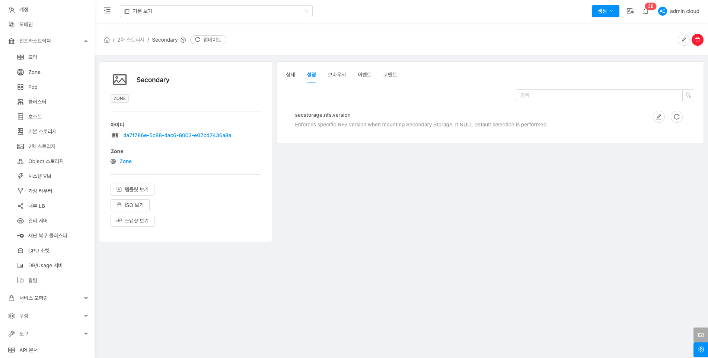{ .imgCenter .imgBorder }

### 편집

1. 2차 스토리지에서 설정 값을 변경합니다.

    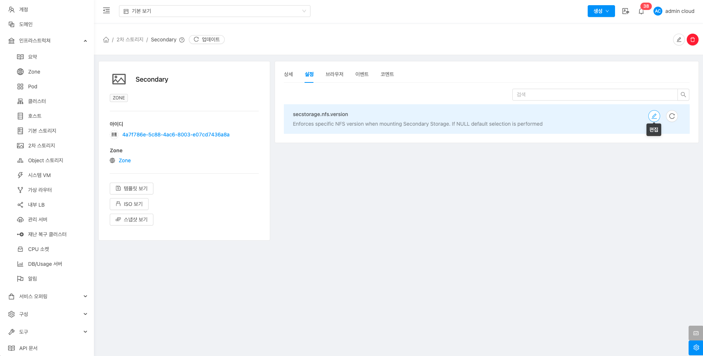{ .imgCenter .imgBorder }

    * 설정 값을 수정후 확인 버튼을 클릭하여 해당 2차스토리지에 설정 값을 변경합니다.

### 기본값으로 재설정

1. 2차 스토리지의 설정 값을 초기값으로 재설정합니다.

    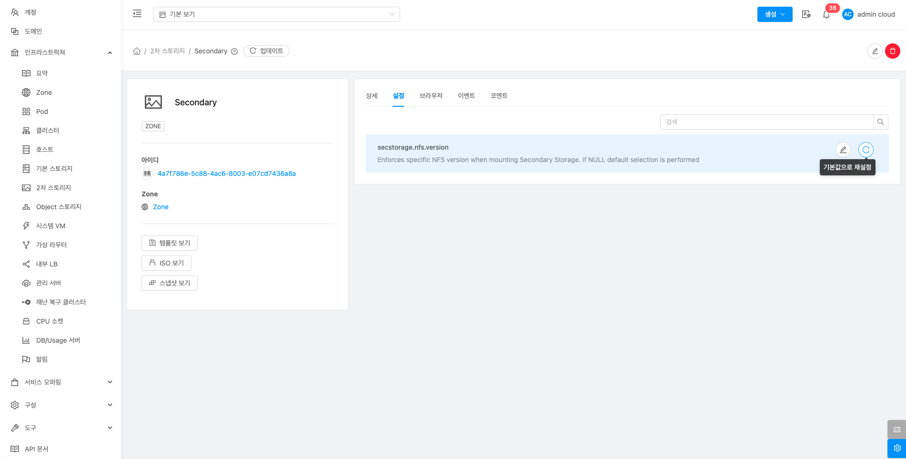{ .imgCenter .imgBorder }

## 브라우저 탭

1. 2차 스토리지에 저장된 파일 정보를 조회할 수 있습니다.

    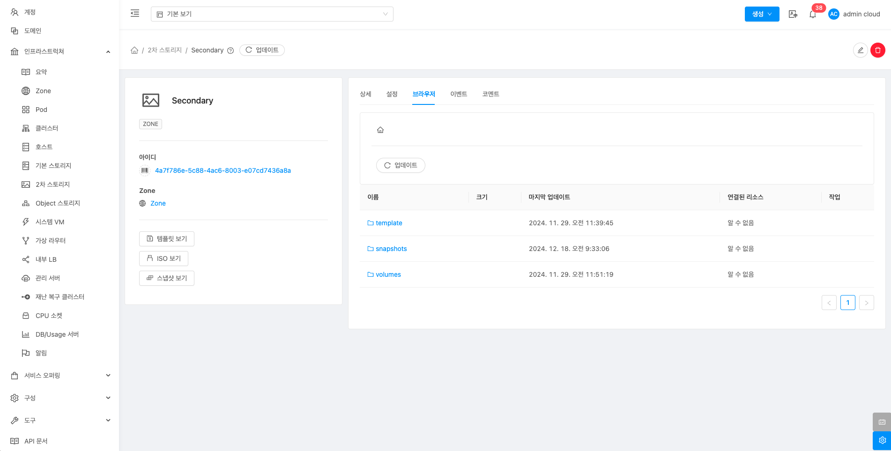{ .imgCenter .imgBorder }

## 이벤트 탭

1. 2차 스토리지에 관련된 이벤트 정보를 확인할 수 있는 화면입니다. 2차 스토리지에서 발생한 다양한 액션과 변경 사항을 쉽게 파악할 수 있습니다.

    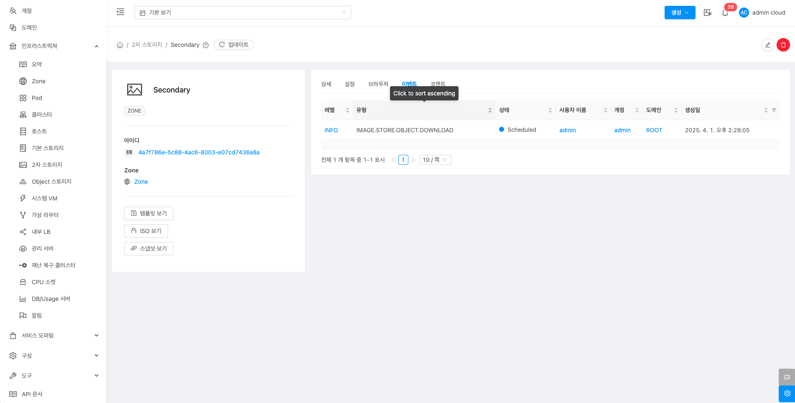{ .imgCenter .imgBorder }

## 코멘트 탭

1. 2차 스토리지에 관련된 코멘트 정보를 확인하는 화면입니다. 각 사용자별로 해당 2차 스토리지에 대한 코멘트 정보를 조회 및 관리할 수 있는 화면입니다.

    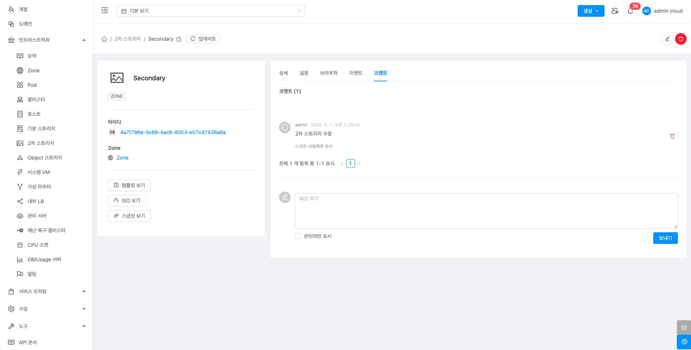{ .imgCenter .imgBorder }
