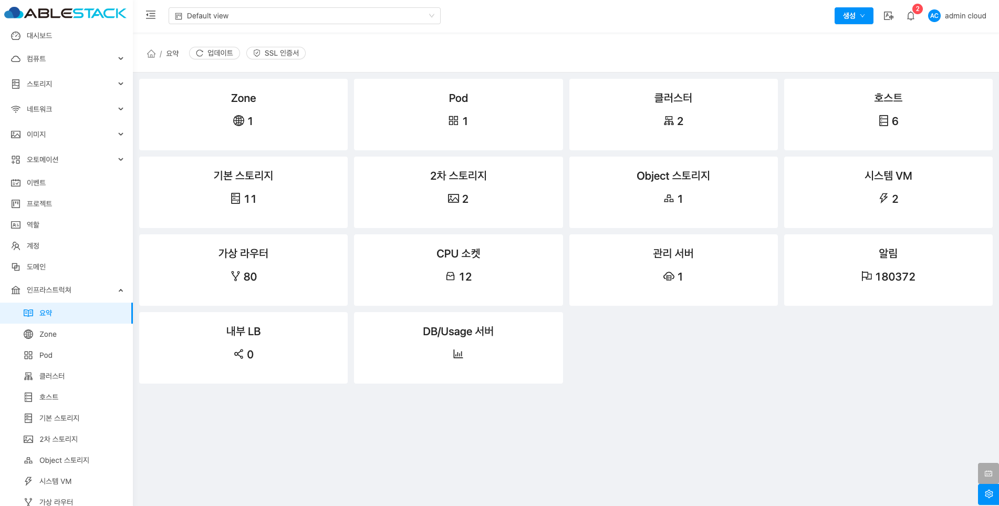

# 요약

## 개요
ABLESTACK의 인프라스트럭처 전반적인 상태 및 현황을 한눈에 보여주는 대시보드입니다. 이 기능은 사용자가 클라우드 환경의 주요 리소스를 효율적으로 관리할 수 있도록 도와줍니다. 각 구성요소 ( Zones, Pods, Clusters, Hosts, Primary storage, Secondary storage, Object Storage, System VMs, Virtual routers, CPU sockets, Management servers, Alerts, Internal LB, DB/Usage server ) 의 수를 확인할 수 있습니다.

## 대시보드 조회

1. 인프라스트럭처의 구성요소를 대시보드 형태로 확인할 수 있습니다.
    { .imgCenter .imgBorder }

    * 각 **구성요소** 카드를 클릭하여 해당 구성요소의 목록 페이지로 이동 가능합니다.
