# 요약

## 개요

인프라스트럭처 요약 화면에서는 ABLESTACK 클라우드 환경을 구성하는 주요 리소스의 상태와 수량을 한눈에 확인할 수 있습니다. 또한 랙 시각화 기능을 통해 데이터센터 랙의 공간 사용 현황과 장비 배치 상태를 관리할 수 있습니다.

## 인프라스트럭처 현황

1. 왼쪽 메뉴에서 <strong>인프라스트럭쳐 &gt; 요약</strong>을 클릭합니다.
2. 화면 왼쪽의 인프라스트럭처 구성요소의 요약 정보가 카드 형태로 표시되는지 확인합니다.

    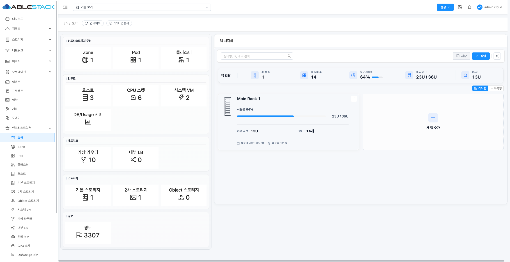{ .imgCenter .imgBorder }

3. 각 카드에서 Zone, Pod, 클러스터, 호스트, 기본 스토리지, 보조 스토리지, Object 스토리지, 시스템 VM, 가상 라우터, CPU 소켓, 관리 서버, 알림, 내부 LB 및 DB/Usage 서버의 수를 확인합니다.
4. 구성요소 카드를 클릭하면 해당 리소스의 목록 화면으로 이동합니다.

## 랙 시각화

랙 시각화에서는 등록된 랙의 사용률과 여유 공간을 확인하고, 랙과 장비의 배치 정보를 관리할 수 있습니다.

### 랙 목록 조회

1. **인프라스트럭쳐 > 요약** 화면 오른쪽의 **랙 시각화** 영역을 확인합니다.

    { .imgCenter .imgBorder }

2. 랙 목록 상단에서 검색 및 화면 제어 기능을 사용할 수 있습니다.

    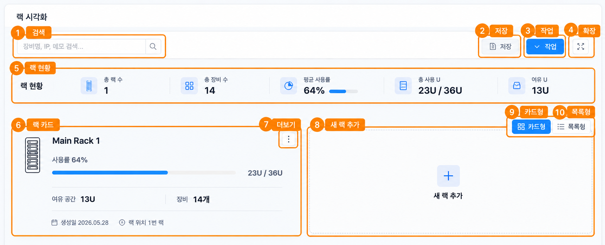{ .imgCenter .imgBorder }

    * **검색:** **(1)** 장비명, IP 주소 또는 메모를 입력한 후 돋보기 버튼을 클릭하면 조건과 일치하는 장비가 포함된 랙을 조회합니다.
    * **저장:** **(2)** 랙 시각화에서 변경한 내용을 저장합니다. 저장할 변경사항이 없으면 버튼이 비활성화될 수 있습니다.
    * **작업:** **(3)** 새 랙 추가, 백업, 복원 및 캡처 기능을 표시합니다.
    * **확장:** **(4)** 인프라스트럭처 현황 영역을 접고 랙 시각화 영역을 넓게 표시합니다.
    * **랙 현황:** **(5)** 전체 랙의 구성과 공간 사용 상태를 표시합니다.
        * **총 랙 수:** 등록된 랙의 총 개수입니다.
        * **총 장비 수:** 모든 랙에 등록된 장비의 총 개수입니다.
        * **평균 사용률:** 전체 랙의 평균 U 사용률입니다.
        * **총 사용 U:** 사용 중인 U와 전체 U를 `사용 U / 전체 U` 형식으로 표시합니다.
        * **여유 U:** 전체 랙에서 추가로 사용할 수 있는 U의 합계입니다.
    * **랙 카드:** **(6)** 랙 이름, 사용률, 사용 U/전체 U, 여유 공간, 장비 수, 생성일 및 랙 위치를 표시합니다.
    * **더보기:** **(7)** 선택한 랙의 **랙 복제**, **수정**, **삭제** 메뉴를 표시합니다.
    * **새 랙 추가:** **(8)** 새로운 랙을 등록하는 화면을 표시합니다.
    * **카드형:** **(9)** 랙 정보를 카드 형태로 표시합니다.
    * **목록형:** **(10)** 랙 정보를 한 줄 형식의 목록으로 표시합니다.

### 작업 메뉴

1. 랙 시각화 영역 오른쪽 상단의 **작업 버튼:** **(1)**을 클릭합니다.

    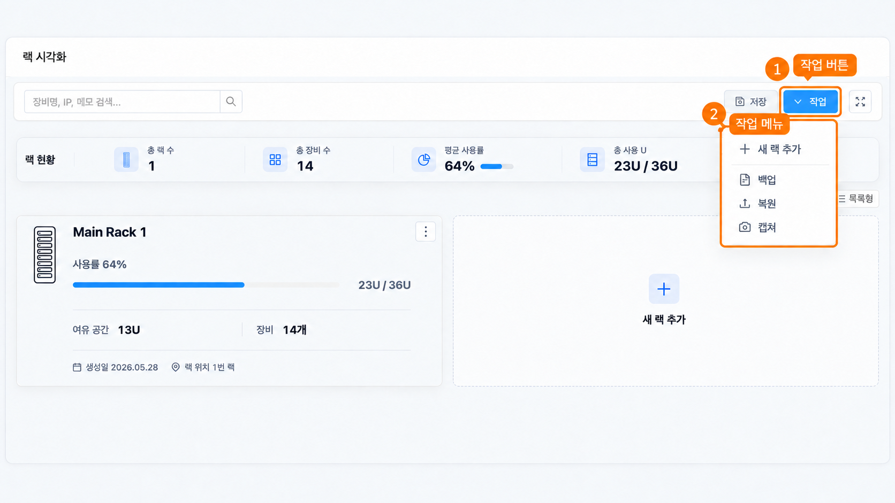{ .imgCenter .imgBorder }

2. <strong>작업 메뉴:</strong> <strong>(2)</strong>에서 실행할 작업을 선택합니다.

    * **새 랙 추가:** 새로운 랙을 등록합니다.
    * **백업:** 현재 랙 시각화 구성 정보를 JSON 파일로 다운로드합니다.
    * **복원:** 백업한 JSON 파일을 불러와 랙 구성을 복원합니다.
    * **캡처:** 현재 랙에 장비가 배치된 모습을 이미지로 저장합니다. 랙 목록 화면에서는 사용할 수 없습니다.

### 랙 상세 조회 및 관리

1. 랙 목록에서 확인할 랙의 이름 또는 카드 본문을 클릭합니다.
2. 선택한 랙의 이름과 U별 장비 배치 상태를 확인합니다.

    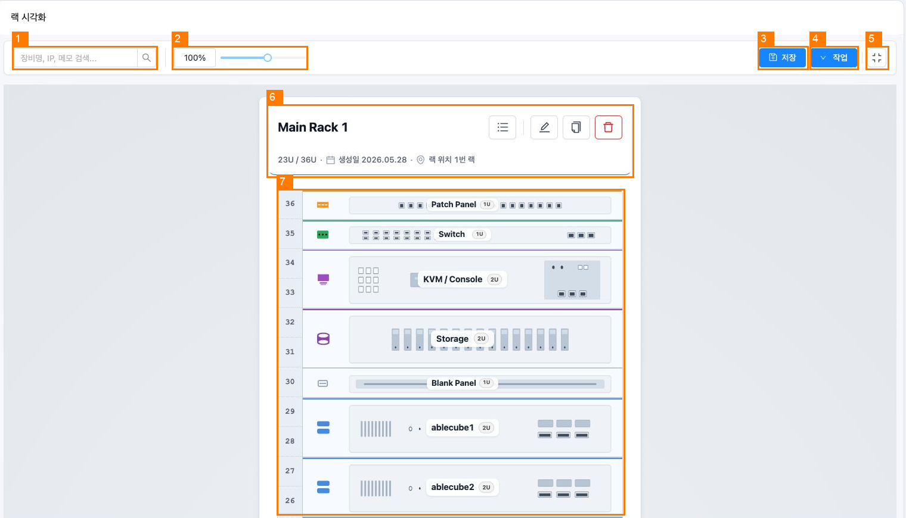{ .imgCenter .imgBorder }

3. 랙 상세 화면에서는 다음 기능을 사용할 수 있습니다.

    * **검색:** **(1)** 장비명, IP 주소 또는 메모를 기준으로 장비를 검색합니다.
    * **배율:** **(2)** 숫자를 입력하거나 슬라이더를 움직여 랙 배치도의 표시 크기를 조절합니다.
    * **저장:** **(3)** 랙과 장비의 변경사항을 저장합니다.
    * **작업:** **(4)** 랙 시각화의 공통 작업 메뉴를 표시합니다.
    * **요약 영역 표시:** **(5)** 접어 둔 인프라스트럭처 현황 영역을 다시 표시합니다.
    * **랙 머리글:** **(6)** 랙 이름, 사용 U/전체 U, 생성일, 랙 위치 및 랙 관리 버튼을 표시합니다.
    * **장비 배치 영역:** **(7)** U 번호별 장비의 배치 위치를 표시합니다.

4. 랙 머리글에서 랙 정보와 관리 버튼을 확인합니다.

    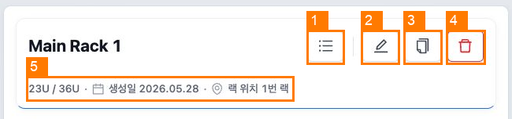{ .imgCenter .imgBorder }

    * **목록:** **(1)** 랙 목록 화면으로 돌아갑니다.
    * **수정:** **(2)** 랙 이름, 위치 및 총 높이를 수정합니다.
    * **랙 복제:** **(3)** 현재 랙의 복사본을 생성합니다.
    * **삭제:** **(4)** 현재 랙을 삭제합니다.
    * **랙 정보:** **(5)** 사용 U/전체 U, 생성일 및 랙 위치를 표시합니다.

    !!! warning
        <strong>랙 복제</strong>를 클릭하면 별도의 입력 화면 없이 복사본이 생성될 수 있으므로 대상 랙을 먼저 확인하십시오.

5. **수정** 버튼을 클릭하면 랙 편집 창이 표시됩니다.

    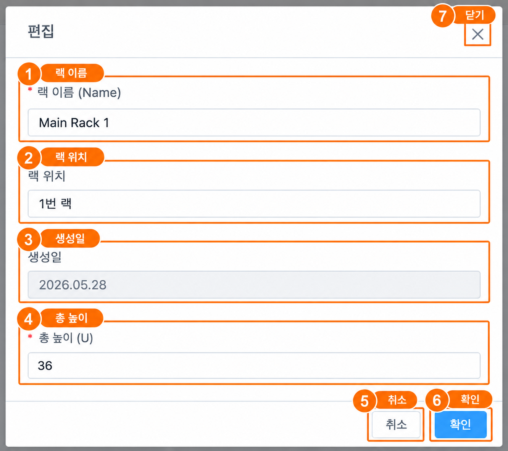{ .imgCenter .imgBorder }

    * **랙 이름:** **(1)** 랙을 식별할 이름을 입력합니다. 필수 입력 항목입니다.
    * **랙 위치:** **(2)** 랙이 설치된 위치를 입력합니다.
    * **생성일:** **(3)** 랙이 생성된 날짜를 표시합니다.
    * **총 높이(U):** **(4)** 랙의 전체 높이를 입력합니다. 필수 입력 항목입니다.
    * **취소:** **(5)** 입력한 내용을 적용하지 않고 화면을 닫습니다.
    * **확인:** **(6)** 입력한 설정을 적용합니다.
    * **×:** **(7)** 랙 편집 화면을 닫습니다.

### 장비 조회 및 관리

1. 랙 배치도에서 U 번호와 장비가 차지하는 구간을 확인합니다.
2. 장비 위로 포인터를 이동하면 장비별 작업 버튼이 표시됩니다.
3. 장비 본문을 클릭하면 해당 장비가 선택되고 오른쪽에 장비 정보 패널이 표시됩니다.

    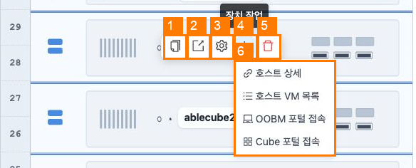{ .imgCenter .imgBorder }

    * **복제:** **(1)** 선택한 장비를 복제합니다.
    * **이동:** **(2)** 장비를 다른 랙으로 이동합니다.
    * **설정:** **(3)** 장비 설정 창을 표시합니다.
    * **장치 작업:** **(4)** 연결된 인프라 자산에 사용할 수 있는 작업을 표시합니다.
    * **삭제:** **(5)** 선택한 장비를 삭제합니다.
    * **장치 작업 메뉴:** **(6)** 연결된 인프라 자산에서 사용할 수 있는 작업 목록입니다.

    !!! note
        장치 작업 메뉴는 장비 종류와 연결된 인프라 자산에 따라 달라집니다. 호스트에 연결된 서버 장비는 호스트 상세, 호스트 VM 목록, OOBM 포털 및 Cube 포털 바로가기를 제공할 수 있습니다.

#### 장비 요약 정보

1. 장비 정보 패널에서 **요약** 탭을 클릭합니다.

    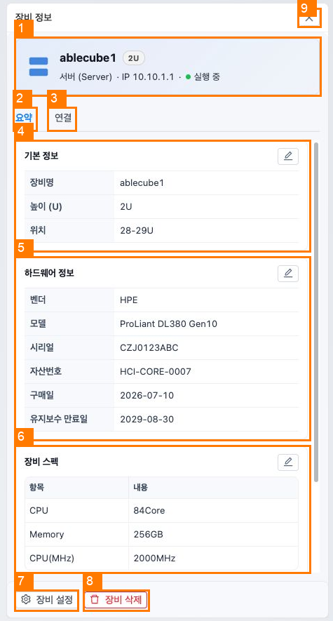{ .imgCenter .imgBorder }

2. 장비의 기본 정보, 하드웨어 정보, 스펙 및 메모를 확인합니다.

    * **장비 식별 정보:** **(1)** 장비명, 높이, 장비 종류, 연결된 IP 주소 및 상태를 표시합니다.
    * **요약:** **(2)** 기본 정보, 하드웨어 정보, 장비 스펙 및 메모를 표시합니다.
    * **연결:** **(3)** 연결된 인프라 자산과 바로가기 링크를 표시합니다.
    * **기본 정보:** **(4)** 장비명, 높이(U) 및 위치를 표시합니다.
    * **하드웨어 정보:** **(5)** 벤더, 모델, 시리얼, 자산번호, 구매일 및 유지보수 만료일을 표시합니다.
    * **장비 스펙:** **(6)** CPU, Memory 등 등록된 항목과 값을 표시합니다.
    * **장비 설정:** **(7)** 장비의 전체 설정 화면을 표시합니다.
    * **장비 삭제:** **(8)** 선택한 장비를 삭제합니다.
    * **×:** **(9)** 장비 정보 패널을 닫습니다.

3. 기본 정보, 하드웨어 정보, 장비 스펙 또는 장비 메모 오른쪽의 연필 버튼을 클릭하면 해당 항목을 패널에서 바로 수정할 수 있습니다.

    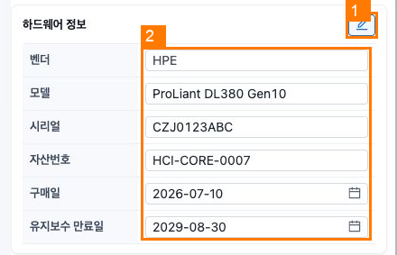{ .imgCenter .imgBorder }

    * **연필 버튼:** **(1)** 하드웨어 정보 편집 영역을 표시합니다.
    * **입력 영역:** **(2)** 벤더, 모델, 시리얼, 자산번호, 구매일 및 유지보수 만료일을 입력합니다.

#### 장비 설정

1. 장비 작업 버튼의 톱니바퀴 또는 장비 정보 패널의 **장비 설정** 버튼을 클릭합니다.

    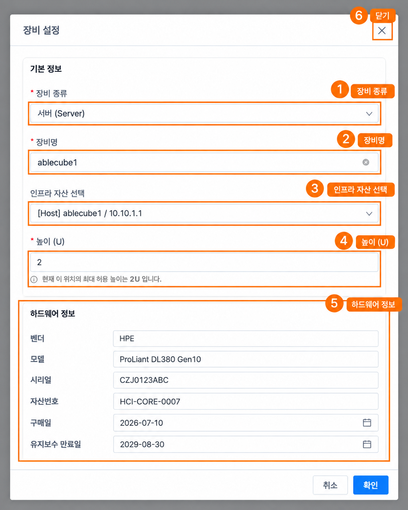{ .imgCenter .imgBorder }

2. 장비 정보를 입력하거나 수정합니다.

    * **장비 종류:** **(1)** 서버, 스위치, 스토리지 등 장비 종류를 선택합니다. 필수 입력 항목입니다.
    * **장비명:** **(2)** 배치도와 상세 패널에 표시할 이름을 입력합니다. 필수 입력 항목입니다.
    * **인프라 자산 선택:** **(3)** 장비를 Mold의 인프라 자산과 연결합니다.
    * **높이(U):** **(4)** 장비가 차지하는 높이를 입력합니다. 현재 위치에 배치할 수 있는 최대 높이가 함께 표시됩니다.
    * **하드웨어 정보:** **(5)** 벤더, 모델, 시리얼, 자산번호, 구매일 및 유지보수 만료일을 입력합니다.
    * **×:** **(6)** 장비 설정 화면을 닫습니다.

3. 장비 종류 목록에서 등록할 장비의 종류를 선택합니다.

    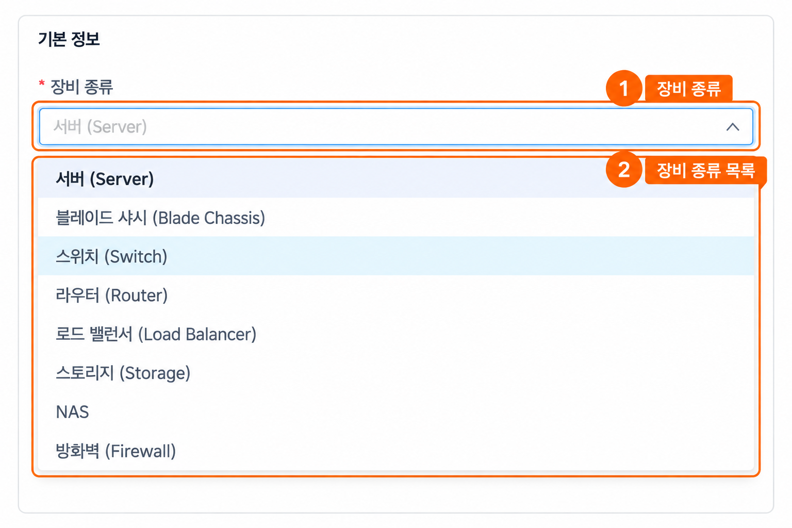{ .imgCenter .imgBorder }

    * **장비 종류:** **(1)** 장비 종류 선택 목록을 표시합니다.
    * **선택 목록:** **(2)** 서버, 블레이드 샤시, 스위치, 라우터, 로드 밸런서, 스토리지, NAS 및 방화벽 등의 장비를 선택할 수 있습니다.

4. 설정 화면을 아래로 스크롤하여 장비 스펙, 메모 및 커스텀 바로가기 링크를 입력합니다.

    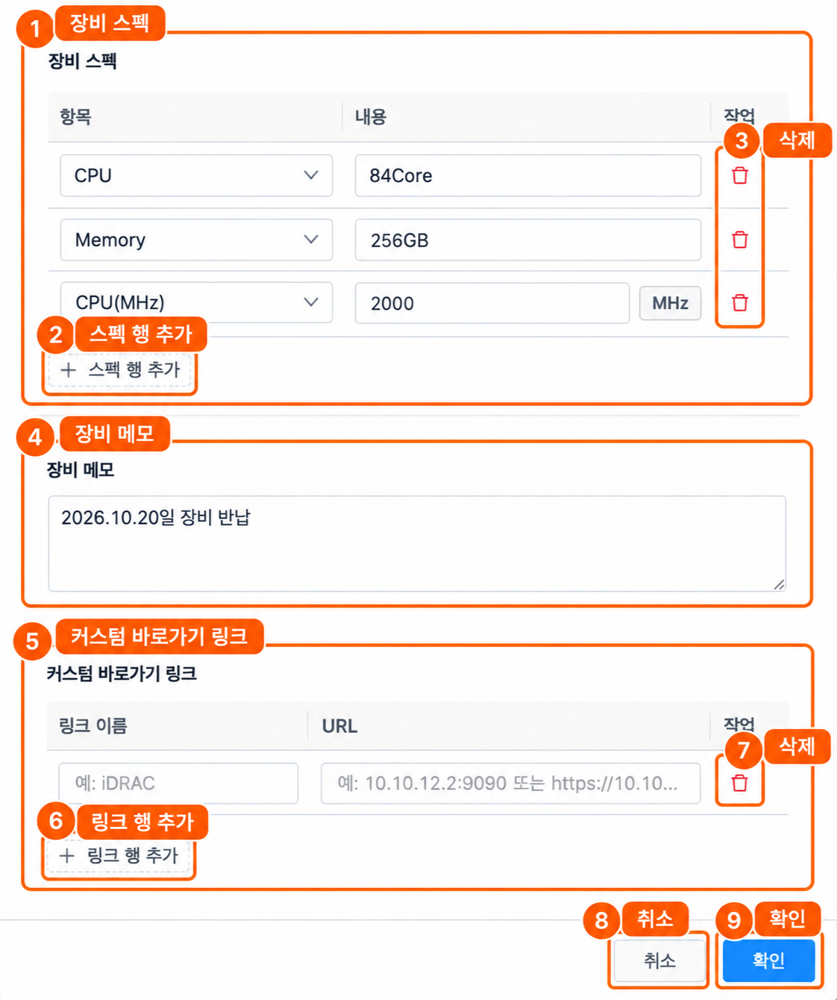{ .imgCenter .imgBorder }

    * **장비 스펙:** **(1)** 항목과 값을 한 행씩 입력합니다.
    * **스펙 행 추가:** **(2)** 장비 스펙 입력 행을 추가합니다.
    * **스펙 행 삭제:** **(3)** 해당 장비 스펙 입력 행을 삭제합니다.
    * **장비 메모:** **(4)** IP 주소, 용도, 담당자 등의 관리 정보를 입력합니다.
    * **커스텀 바로가기 링크:** **(5)** 링크 이름과 URL을 입력합니다.
    * **링크 행 추가:** **(6)** 커스텀 바로가기 링크 입력 행을 추가합니다.
    * **링크 행 삭제:** **(7)** 해당 커스텀 바로가기 링크 입력 행을 삭제합니다.
    * **취소:** **(8)** 입력한 내용을 적용하지 않고 화면을 닫습니다.
    * **확인:** **(9)** 입력한 장비 설정을 적용합니다. 설정을 적용한 후 랙 시각화의 **저장** 버튼을 클릭하여 변경사항을 저장합니다.

#### 빈 공간에 장비 추가

1. 랙 배치도에서 사선 무늬로 표시된 빈 공간을 찾습니다.
2. **U 여백(클릭하여 장비 추가)** 영역을 클릭합니다. `U`는 해당 공간에 배치할 수 있는 높이를 나타냅니다.
3. 장비 설정 화면에서 장비 종류, 장비명, 인프라 자산 및 높이(U)를 입력합니다.
4. 필요한 경우 하드웨어 정보, 스펙, 메모 및 커스텀 바로가기 링크를 입력한 후 <strong>확인</strong>을 클릭합니다.
5. 랙 시각화의 **저장** 버튼을 클릭합니다.

#### 장비 이동

1. 이동할 장비의 작업 버튼에서 <strong>이동</strong>을 클릭합니다.
2. 장비 이동 화면에서 대상 랙을 선택합니다.

    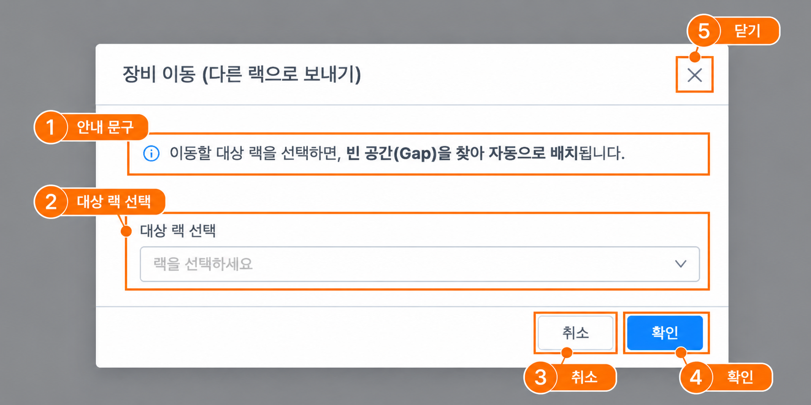{ .imgCenter .imgBorder }

    * **안내:** **(1)** 대상 랙을 선택하면 빈 공간을 찾아 장비가 자동 배치됨을 안내합니다.
    * **대상 랙 선택:** **(2)** 장비를 이동할 랙을 선택합니다.
    * **취소:** **(3)** 장비를 이동하지 않고 화면을 닫습니다.
    * **확인:** **(4)** 선택한 랙으로 장비 이동을 실행합니다.
    * **×:** **(5)** 장비 이동 화면을 닫습니다.

3. 장비 이동 후 랙 시각화의 **저장** 버튼을 클릭합니다.

### 인프라 자산 연결

1. 장비 정보 패널에서 **연결** 탭을 클릭합니다.

    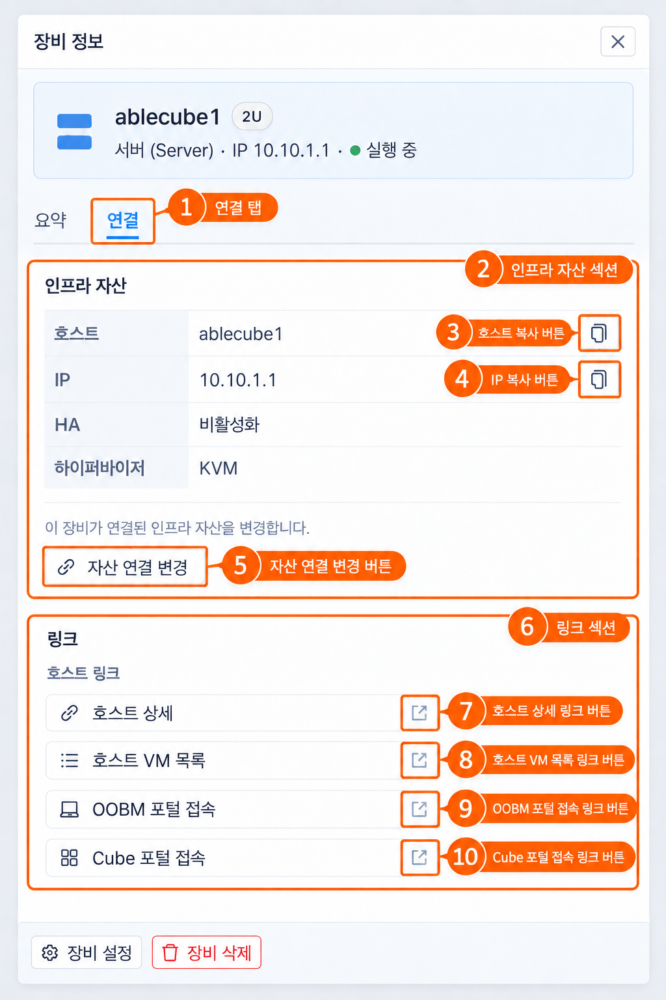{ .imgCenter .imgBorder }

2. 이미지 번호별 연결 정보를 확인합니다.

    * **연결 탭:** **(1)** 인프라 자산과 바로가기 링크를 표시합니다.
    * **인프라 자산 섹션:** **(2)** 연결된 자산의 이름, IP 주소, HA 상태 및 하이퍼바이저를 표시합니다.
    * **호스트 복사 버튼:** **(3)** 연결된 호스트 이름을 클립보드에 복사합니다.
    * **IP 복사 버튼:** **(4)** 연결된 호스트의 IP 주소를 클립보드에 복사합니다.
    * **자산 연결 변경 버튼:** **(5)** 연결할 인프라 자산을 변경하는 화면을 표시합니다.
    * **링크 섹션:** **(6)** 연결된 인프라 자산에서 사용할 수 있는 바로가기 링크를 표시합니다.
    * **호스트 상세 링크 버튼:** **(7)** 연결된 호스트의 상세 화면으로 이동합니다.
    * **호스트 VM 목록 링크 버튼:** **(8)** 연결된 호스트의 가상머신 목록을 표시합니다.
    * **OOBM 포털 접속 링크 버튼:** **(9)** OOBM 관리 포털로 이동합니다.
    * **Cube 포털 접속 링크 버튼:** **(10)** Cube 관리 포털로 이동합니다.

#### 자산 연결 변경

1. 연결 탭에서 <strong>자산 연결 변경</strong>을 클릭합니다.
2. 연결할 인프라 자산을 선택합니다.

    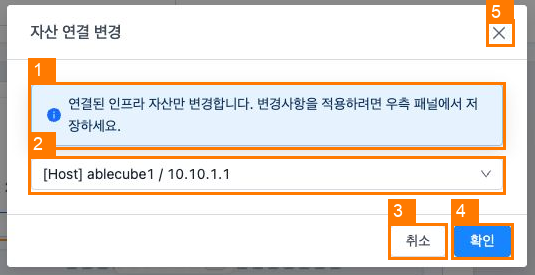{ .imgCenter .imgBorder }

    * **안내:** **(1)** 연결된 인프라 자산만 변경되며 변경사항을 별도로 저장해야 함을 안내합니다.
    * **자산 선택:** **(2)** 연결할 인프라 자산을 선택합니다.
    * **취소:** **(3)** 선택을 적용하지 않고 화면을 닫습니다.
    * **확인:** **(4)** 선택한 자산 연결을 적용합니다.
    * **×:** **(5)** 자산 연결 변경 화면을 닫습니다.

3. 장비 정보 패널과 랙 시각화 화면에서 변경사항을 저장합니다.

#### 호스트 VM 목록 조회

1. 호스트에 연결된 서버 장비의 **장치 작업** 메뉴 또는 연결 탭에서 <strong>호스트 VM 목록</strong>을 클릭합니다.
2. 호스트에서 실행 중인 가상머신의 이름, 상태, 하이퍼바이저 및 IP 주소를 확인합니다.

    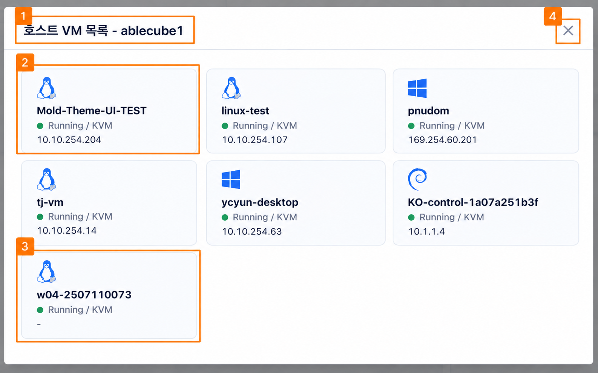{ .imgCenter .imgBorder }

    * **모달 제목:** **(1)** 조회 중인 호스트의 이름을 표시합니다.
    * **IP가 표시된 VM 카드:** **(2)** 가상머신의 운영체제 아이콘, 이름, 상태, 하이퍼바이저 및 IP 주소를 표시합니다.
    * **IP가 없는 VM 카드:** **(3)** IP 주소 대신 `-`를 표시합니다.
    * **×:** **(4)** 호스트 VM 목록 화면을 닫습니다.
