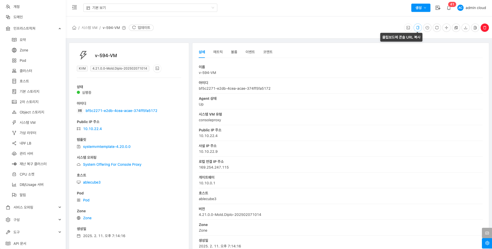
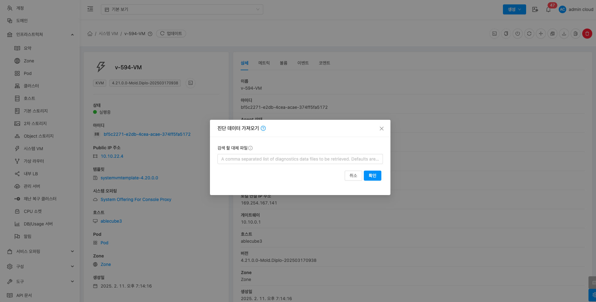
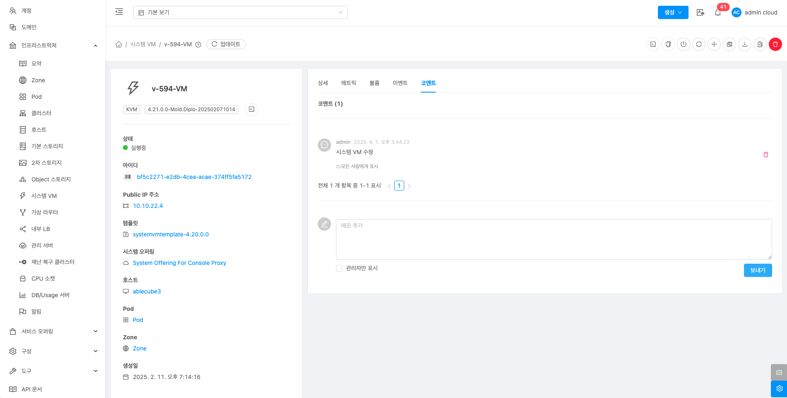

# 시스템 VM

## 개요
시스템 VM은 ABLESTACK 클라우드 환경의 관리 및 운영을 지원하는 가상 머신입니다. 주요 역할로는 가상머신에 원격 접속을 제공하는 Console Proxy VM, 템플릿 및 스냅샷을 관리하는 Secondary Storage VM이 있습니다.시스템 VM은 Zone이 활성화 되면 자동으로 생성되고, ABLESTACK 클라우드 인프라의 관리에 중요한 역할을 합니다.

## 목록 조회

1. 시스템 VM 목록을 확인하는 화면입니다.
    생성된 시스템 VM 목록을 확인할 수 있습니다.
    { align=center }

## 콘솔 보기

1. 시스템 VM의 콘솔에 접근할 수 있습니다.

    { align=center }

    * **콘솔 보기** 버튼을 클릭하여 시스템 VM 콘솔 화면을 호출합니다.

    { align=center }

    * 콘솔에서 해당 가상머신을 조작할 수 있습니다.

## 클립보드에 콘솔 URL 복사

1. 시스템 VM의 콘솔에 접근할 수 있는 URL 복사할 수 있습니다.

    { align=center }

## 시스템 VM 정지

1. 시스템 VM을 정지할 수 있습니다.

    { align=center }

    * **시스템 VM 정지** 버튼을 클릭하여 시스템 VM 정지 화면을 호출합니다.

    { align=center }

    * **확인** 버튼을 클릭하여 시스템 VM을 정지합니다.

## 시스템 VM 시작

1. 시스템 VM을 시작할 수 있습니다.

    { align=center }

    * **시스템 VM 시작** 버튼을 클릭하여 시스템 VM 시작 화면을 호출합니다.

    { align=center }

    * **확인** 버튼을 클릭하여 시스템 VM을 시작합니다.

## 시스템 VM 재시작

1. 시스템 VM을 재시작할 수 있습니다.

    { align=center }

    * **시스템 VM 재시작** 버튼을 클릭하여 시스템 VM 재시작 화면을 호출합니다.

    { align=center }

    * **확인** 버튼을 클릭하여 시스템 VM을 재시작합니다.

## 시스템 VM 마이그레이션

1. 시스템 VM 다른 호스트로 마이그레이션할 수 있습니다.

    { align=center }

    * **시스템 VM 마이그레이션** 버튼을 클릭하여 시스템 VM 마이그레이션 화면을 호출합니다.

    { align=center }

    * **호스트:** 호스트를 선택합니다.
    * **확인** 버튼을 클릭하여 시스템 VM을 다른 호스트로 마이그레이션합니다.

## 진단 실행

1. 시스템 VM이 ping, traceroute, arping 등 진단 실행할 수 있습니다.

    { align=center }

    * **진단 실행** 버튼을 클릭하여 진단 실행 화면을 호출합니다.

    { align=center }

    * **호스트:** 호스트를 선택합니다.
    * **확인** 버튼을 클릭하여 진단 실행합니다.

## 진단 가져오기

1. 진단 실행 결과를 가져올 수 있습니다.

    { align=center }

    * **진단 가져오기** 버튼을 클릭하여 진단 가져오기 화면을 호출합니다.

    { align=center }

    * **호스트:** 호스트를 선택합니다.
    * **확인** 버튼을 클릭하여 진단 가져오기를 수행합니다.

## 시스템 VM 패치

1. 시스템 VM 패치하여 버전을 변경할 수 있습니다.

    { align=center }

    * **시스템 VM 패치** 버튼을 클릭하여 시스템 VM 패치 화면을 호출합니다.

    { align=center }

    * **호스트:** 를 선택합니다.
    * **확인** 버튼을 클릭하여 시스템 VM 패치합니다.

##  시스템 VM 삭제

!!! info
    시스템 VM을 삭제하더라도 Zone이 활성화 되어있으면 다시 생성합니다.

1. 해당 시스템 VM를 삭제합니다.

    { align=center }

    * **시스템 VM 삭제** 버튼을 클릭하여 시스템 VM 삭제 화면을 호출합니다.

    { align=center }

    * **확인** 버튼을 클릭하여 시스템 VM을 삭제합니다.

## 상세 탭

1. 시스템 VM에 대한 상세정보를 조회하는 화면입니다. 해당 시스템 VM의 이름, 아이디, Agent 상태, 시스템 VM 유형, Public IP 주소, 사설 IP 주소, 로컬 연결 IP 주소, 게이트웨이, 호스트, 버전, Zone, 생성일, 활성 세션, 동적으로 확장 가능, 제어 영역 상태 등의 정보를 확인할 수 있습니다.

    { align=center }

## 메트릭 탭

1. 시스템 VM에 대한 메트릭 정보를 조회하는 화면입니다. 해당 시스템 VM의 CPU, 메모리, 디스크, 네트워크 등의 사용량 정보를 확인할 수 있습니다.

    { align=center }

## 볼륨 탭

1. 시스템 VM에 대한 볼륨을 조회하는 화면입니다. 해당 시스템 VM의 볼륨에 대한 이름, 상태, 유형, 크기, 스토리지 등의 정보를 확인할 수 있습니다.

    { align=center }

## 이벤트 탭

1. 시스템 VM에 관련된 이벤트 정보를 확인할 수 있는 화면입니다. 시스템 VM에서 발생한 다양한 액션과 변경 사항을 쉽게 파악할 수 있습니다.

    { align=center }

## 코멘트 탭

1. 시스템 VM에 관련된 코멘트 정보를 확인하는 화면입니다. 각 사용자별로 해당 시스템 VM에 대한 코멘트 정보를 조회 및 관리할 수 있는 화면입니다.

    { align=center }
