# 가상 라우터

## 개요
가상 라우터는 ABLESTACK 클라우드 가상 네트워크에서 중요한 역할을 하는 가상 라우터입니다. 주요 기능으로는 가상머신 간의 네트워크 연결을 위한 라우팅, 외부 네트워크와 연결을 위한 NAT, IP 주소를 자동으로 할당하는 DHCP 서버, VPN 연결, 방화벽 기능 등이 있습니다. 가상 라우터는 가상머신들이 서로 통신하고 외부와 연결될 수 있도록 지원하며 네트워크 관리와 보안을 담당합니다. 이를 통해 안정적인 네트워크 환경을 제공합니다.

## 목록 조회

1. 가상 라우터 목록을 확인하는 화면입니다.
    생성된 가상 라우터 목록을 확인할 수 있습니다.
    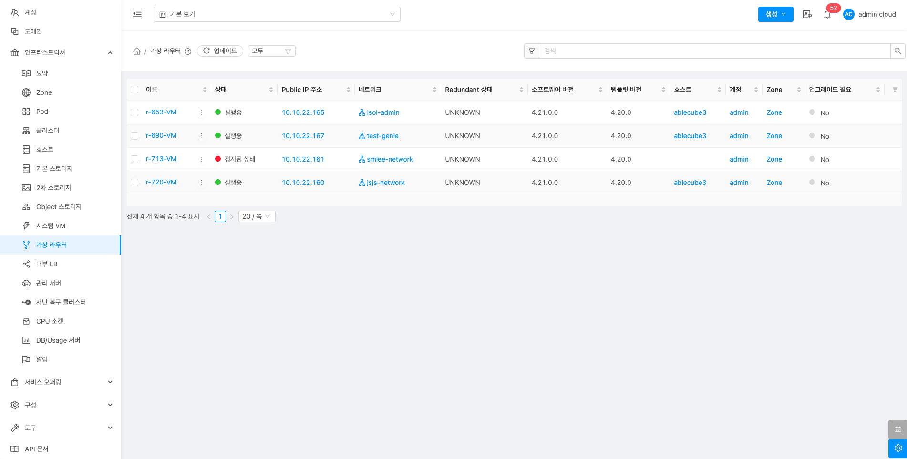{ .imgCenter .imgBorder }

## 상세 탭

1. 가상 라우터에 대한 상세정보를 조회하는 화면입니다. 해당 가상 라우터의 이름, 아이디, 버전, 소프트웨어 버전, 업그레이드 필요, 네트워크 이름, Public IP 주소, 게스트 IP 주소, 로컬 연결 IP 주소, 컴퓨트 오퍼링, 네트워크 도메인, Redundant 라우터, Redundant 상태, 호스트, 계정, Zone, 생성일, 제어 영역 상태 등의 정보를 확인할 수 있습니다.

    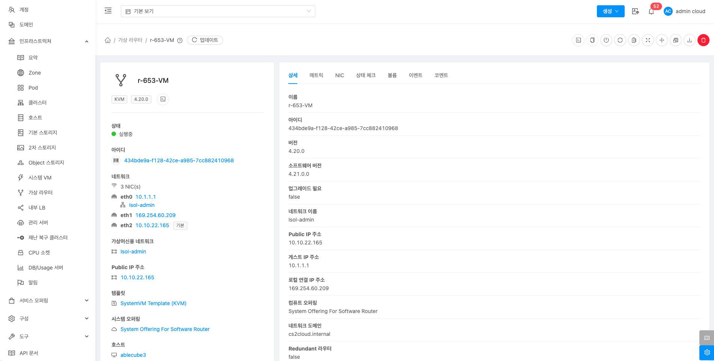{ .imgCenter .imgBorder }

## 메트릭 탭

1. 가상 라우터에 대한 메트릭 정보를 조회하는 화면입니다. 해당 가상 라우터의 CPU, 메모리, 디스크, 네트워크 등의 사용량 정보를 확인할 수 있습니다.

    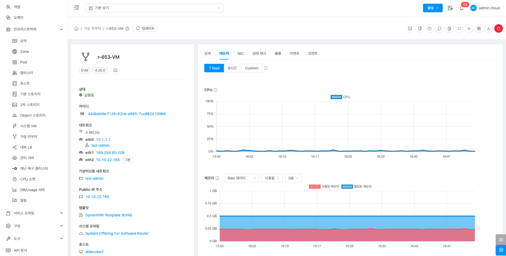{ .imgCenter .imgBorder }

## NIC 탭

1. 가상 라우터에 연결된 네트워크를 조회하는 화면입니다. 해당 가상 라우터 NIC의 장치 ID, 네트워크 이름, MAC 주소, IP 주소, 넷마스트, 등의 정보를 확인할 수 있습니다.

    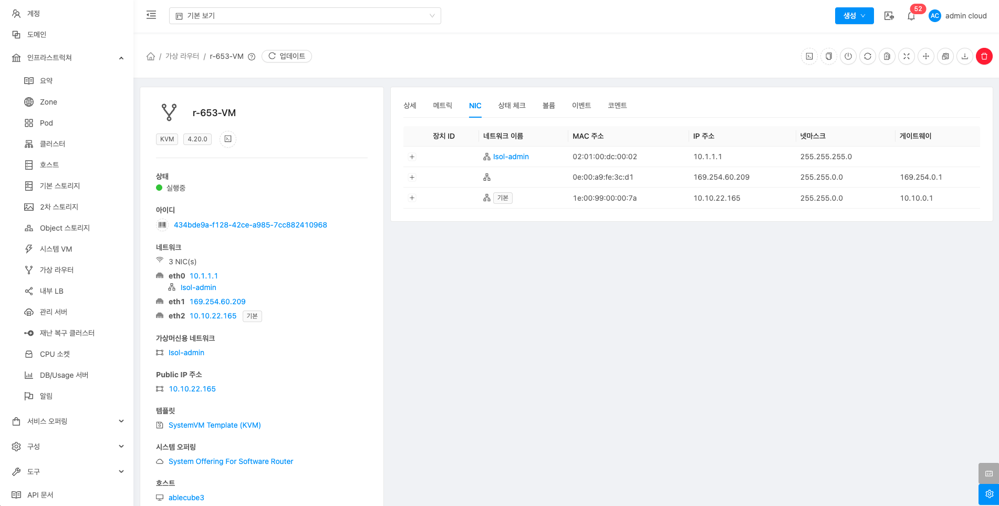{ .imgCenter .imgBorder }

## 상태 체크 탭

1. 가상 라우터에 대한 상태 조회 및 헬스 체크 결과를 확인할 수 있습니다. 해당 가상 라우터의 이름 확인, 유형, 성공, 마지막 업데이트, 상세 등의 정보를 확인할 수 있습니다.

    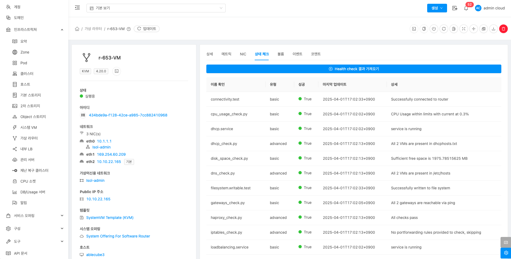{ .imgCenter .imgBorder }

### Health check 결과 가져오기

1. Health check 결과 가져오기 수행할 수 있는 기능입니다.

    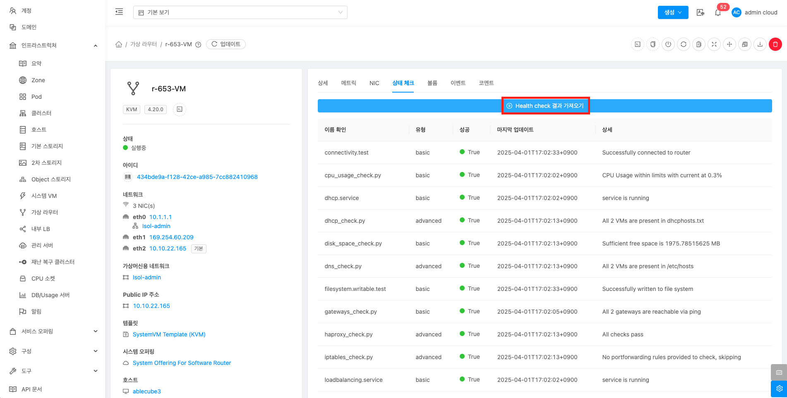{ .imgCenter .imgBorder }

    * **볼륨 생성 및 추가** 버튼을 클릭하여 볼륨 생성 및 추가 화면을 호출합니다.

    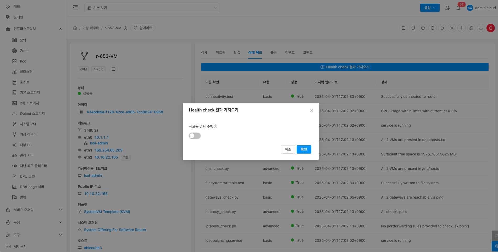{ .imgCenter .imgBorder }

    * **확인** 버튼을 클릭하여 Health check 결과 가져오기

## 볼륨 탭

1. 가상 라우터에 대한 볼륨을 조회하는 화면입니다. 해당 가상 라우터의 볼륨에 대한 이름, 상태, 유형, 크기, 스토리지 등의 정보를 확인할 수 있습니다.

    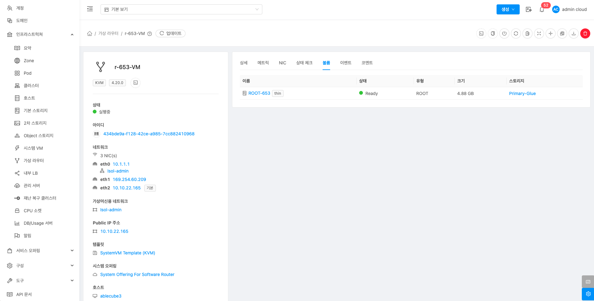{ .imgCenter .imgBorder }

## 이벤트 탭

1. 가상 라우터에 관련된 이벤트 정보를 확인할 수 있는 화면입니다. 가상 라우터에서 발생한 다양한 액션과 변경 사항을 쉽게 파악할 수 있습니다.

    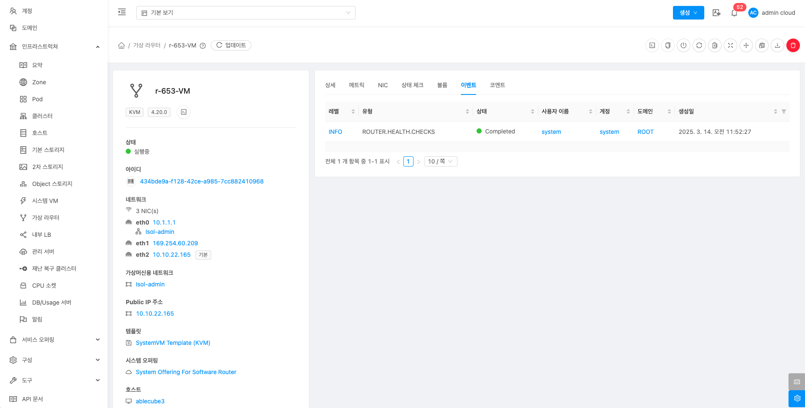{ .imgCenter .imgBorder }

## 코멘트 탭

1. 가상 라우터에 관련된 코멘트 정보를 확인하는 화면입니다. 각 사용자별로 해당 가상 라우터에 대한 코멘트 정보를 조회 및 관리할 수 있는 화면입니다.

    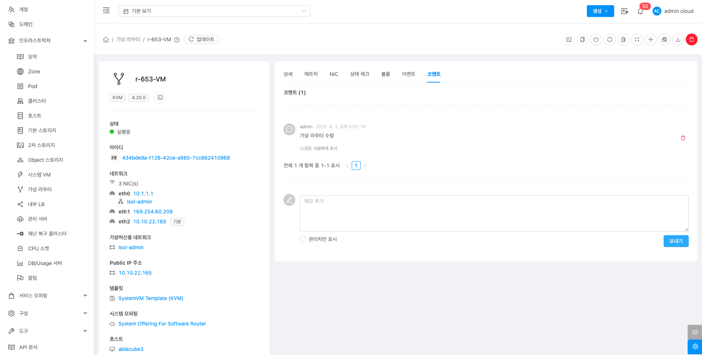{ .imgCenter .imgBorder }

## 콘솔 보기

1. 가상 라우터의 콘솔에 접근할 수 있습니다.

    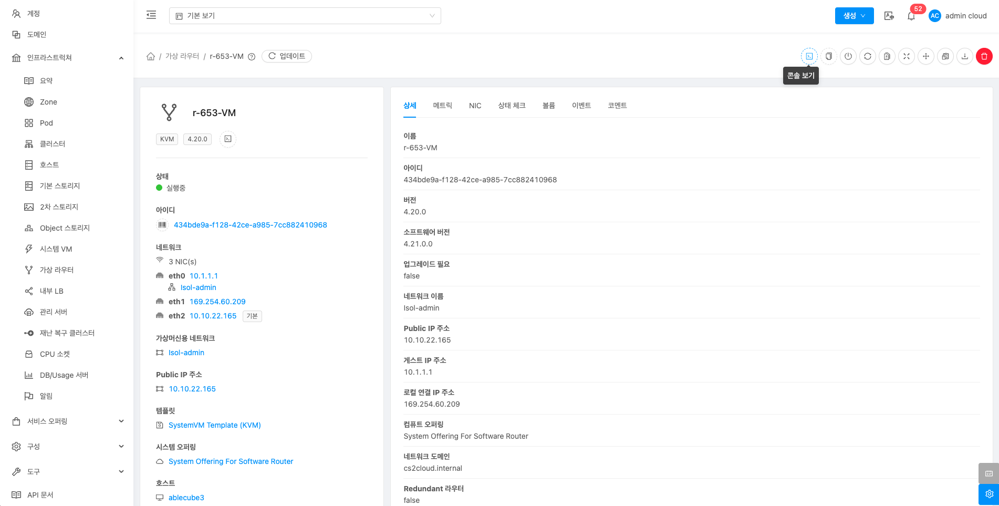{ .imgCenter .imgBorder }

    * **콘솔 보기** 버튼을 클릭하여 가상 라우터 콘솔 화면을 호출합니다.

    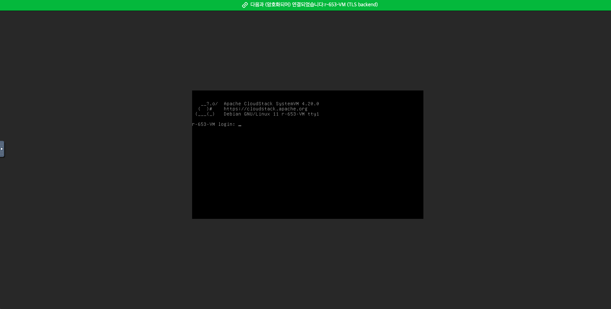{ .imgCenter .imgBorder }

    * 콘솔에서 해당 가상머신을 조작할 수 있습니다.

## 클립보드에 콘솔 URL 복사

1. 가상 라우터의 콘솔에 접근할 수 있는 URL 복사할 수 있습니다.

    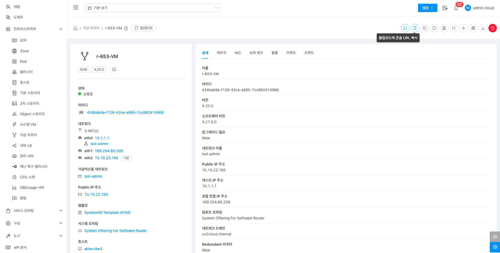{ .imgCenter .imgBorder }

## 라우터 정지

1. 가상 라우터를 정지할 수 있습니다.

    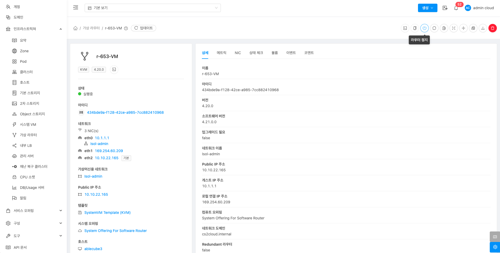{ .imgCenter .imgBorder }

    * **라우터 정지** 버튼을 클릭하여 가상 라우터 정지 화면을 호출합니다.

    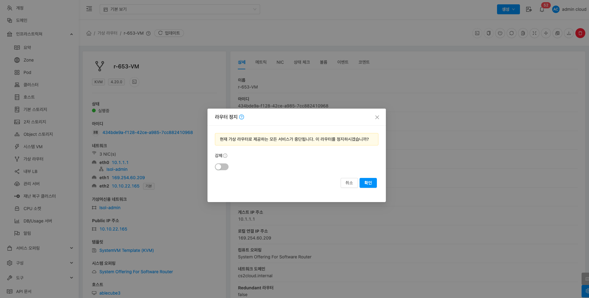{ .imgCenter .imgBorder }

    * **확인** 버튼을 클릭하여 가상 라우터를 정지합니다.

## 라우터 시작

1. 가상 라우터를 시작할 수 있습니다.

    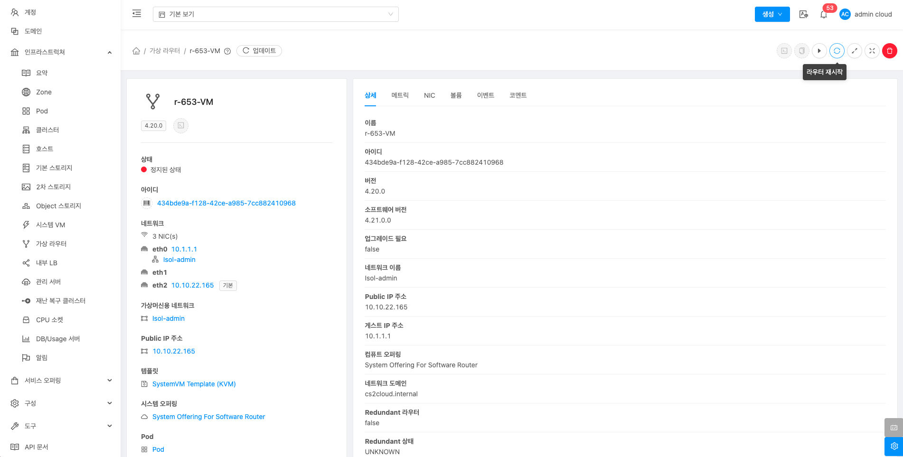{ .imgCenter .imgBorder }

    * **라우터 시작** 버튼을 클릭하여 가상 라우터 시작 화면을 호출합니다.

    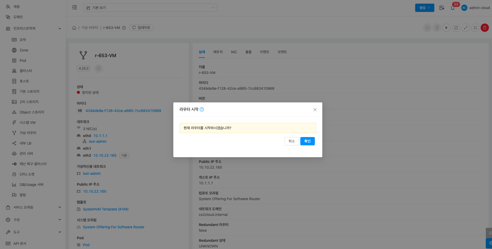{ .imgCenter .imgBorder }

    * **확인** 버튼을 클릭하여 가상 라우터를 시작합니다.

## 가상 라우터 재시작

1. 가상 라우터를 재시작할 수 있습니다.

    { .imgCenter .imgBorder }

    * **가상 라우터 재시작** 버튼을 클릭하여 가상 라우터 재시작 화면을 호출합니다.

    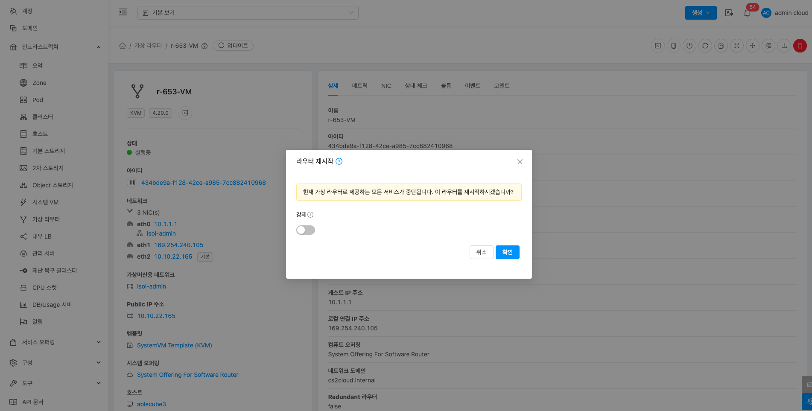{ .imgCenter .imgBorder }

    * **확인** 버튼을 클릭하여 가상 라우터를 재시작합니다.

## 시스템 VM 패치

1. 시스템 VM 패치하여 가상 라우터의 버전을 변경할 수 있습니다.

    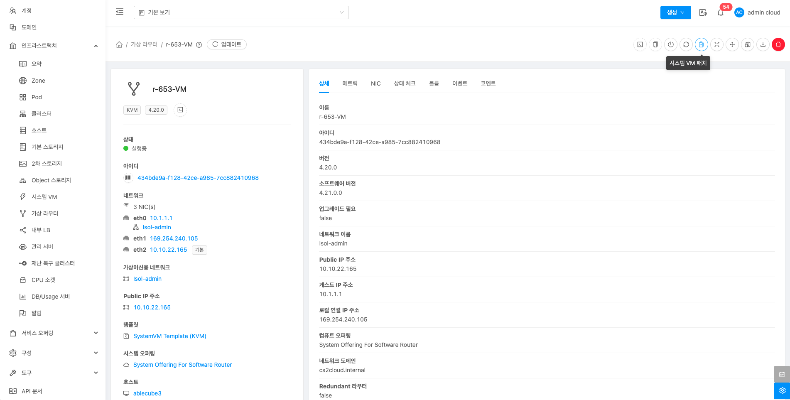{ .imgCenter .imgBorder }

    * **시스템 VM 패치** 버튼을 클릭하여 시스템 VM 패치 화면을 호출합니다.

    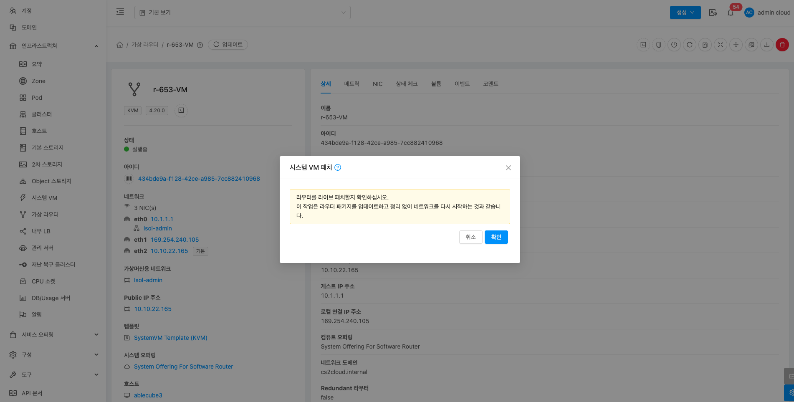{ .imgCenter .imgBorder }

    * **호스트** 를 선택합니다.
    * **확인** 버튼을 클릭하여 시스템 VM 패치합니다.

## 최신 템플릿을 사용하도록 라우터 업그레이드

1. 가상 라우터를 최신 템플릿으로 업그레이드할 수 있습니다.

    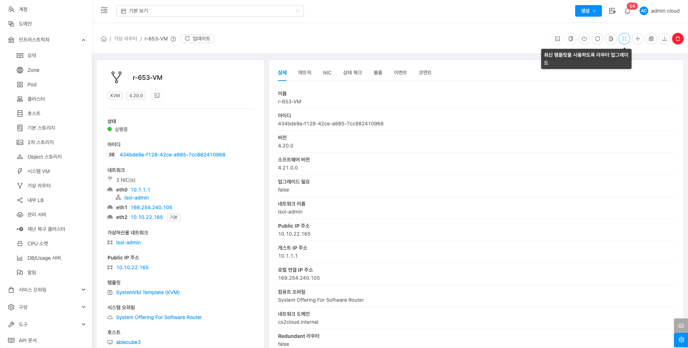{ .imgCenter .imgBorder }

    * **최신 템플릿을 사용하도록 라우터 업그레이드** 버튼을 클릭하여 최신 템플릿을 사용하도록 라우터 업그레이드 화면을 호출합니다.

    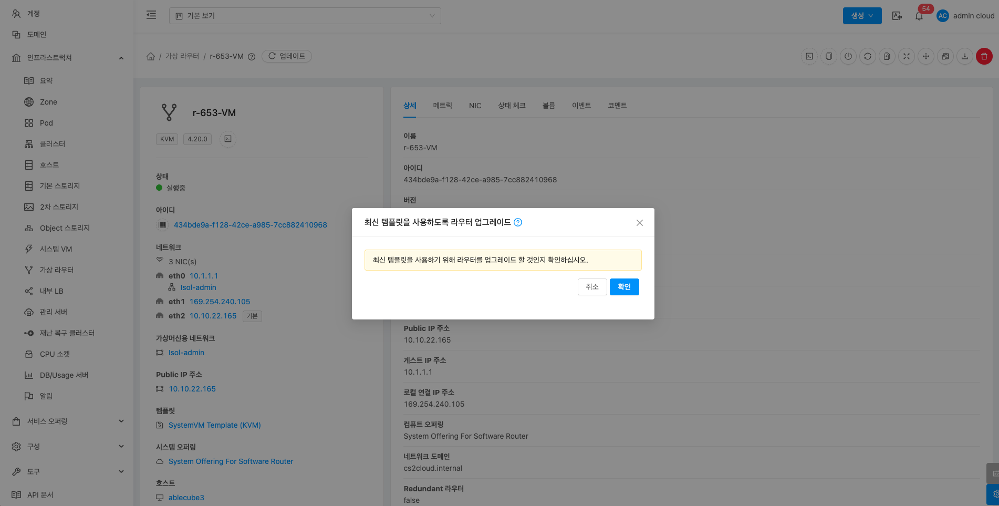{ .imgCenter .imgBorder }

    * **확인** 버튼을 클릭하여 가상 라우터를 최신화합니다.

## 가상 라우터 마이그레이션

1. 가상 라우터 다른 호스트로 마이그레이션할 수 있습니다.

    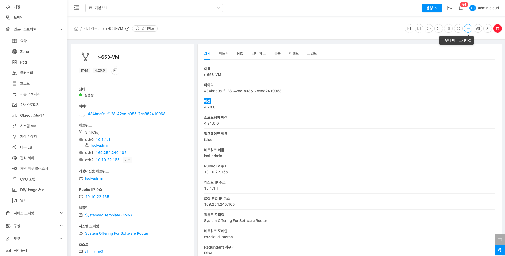{ .imgCenter .imgBorder }

    * **가상 라우터 마이그레이션** 버튼을 클릭하여 가상 라우터 마이그레이션 화면을 호출합니다.

    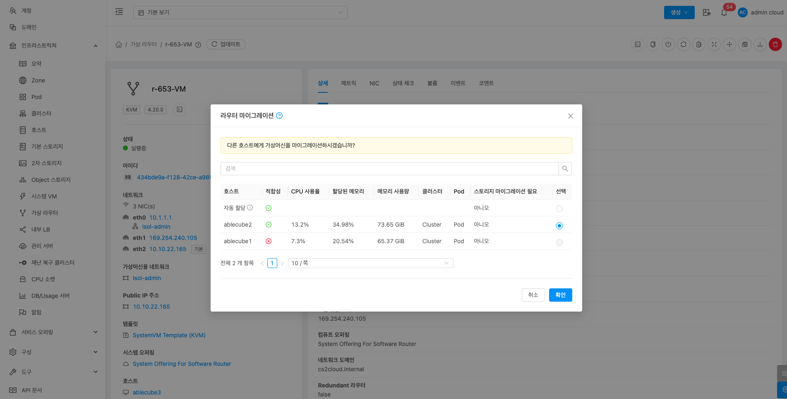{ .imgCenter .imgBorder }

    * **호스트** 를 선택합니다.
    * **확인** 버튼을 클릭하여 가상 라우터를 다른 호스트로 마이그레이션합니다.

## 진단 실행

1. 가상 라우터이 ping, traceroute, arping 등 진단 실행할 수 있습니다.

    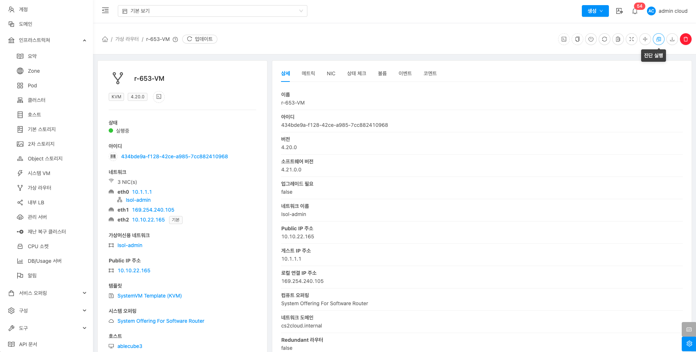{ .imgCenter .imgBorder }

    * **진단 실행** 버튼을 클릭하여 진단 실행 화면을 호출합니다.

    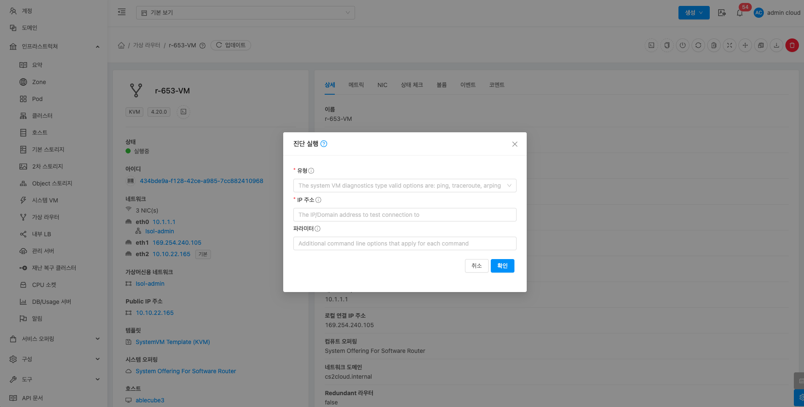{ .imgCenter .imgBorder }

    * **호스트** 를 선택합니다.
    * **확인** 버튼을 클릭하여 진단 실행합니다.

## 진단 가져오기

1. 진단 실행 결과를 가져올 수 있습니다.

    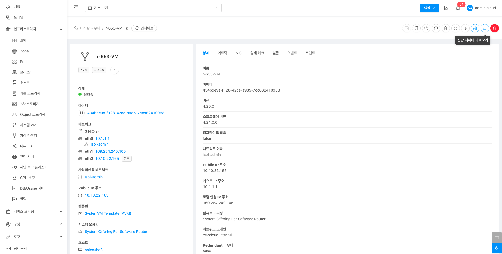{ .imgCenter .imgBorder }

    * **진단 가져오기** 버튼을 클릭하여 진단 가져오기 화면을 호출합니다.

    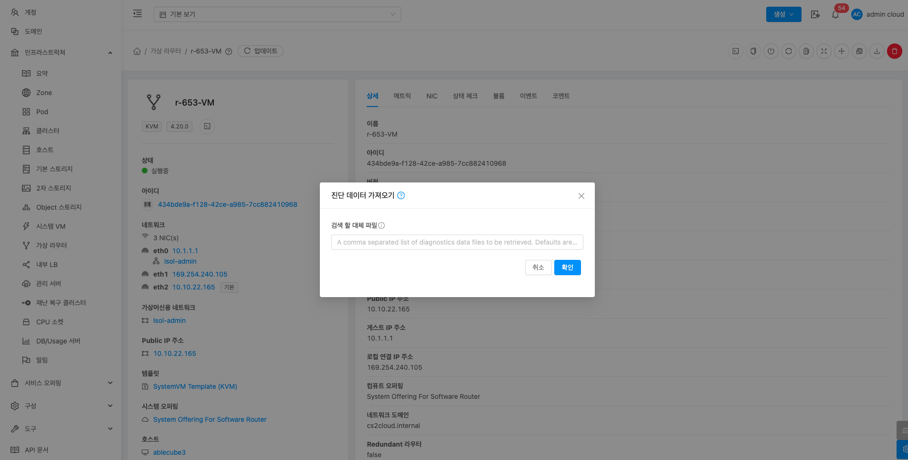{ .imgCenter .imgBorder }

    * **호스트** 를 선택합니다.
    * **확인** 버튼을 클릭하여 진단 가져오기를 수행합니다.

##  가상 라우터 삭제

!!! info
    가상 라우터를 삭제하더라도 Zone이 활성화 되어있으면 다시 생성합니다.

1. 해당 가상 라우터를 삭제합니다.

    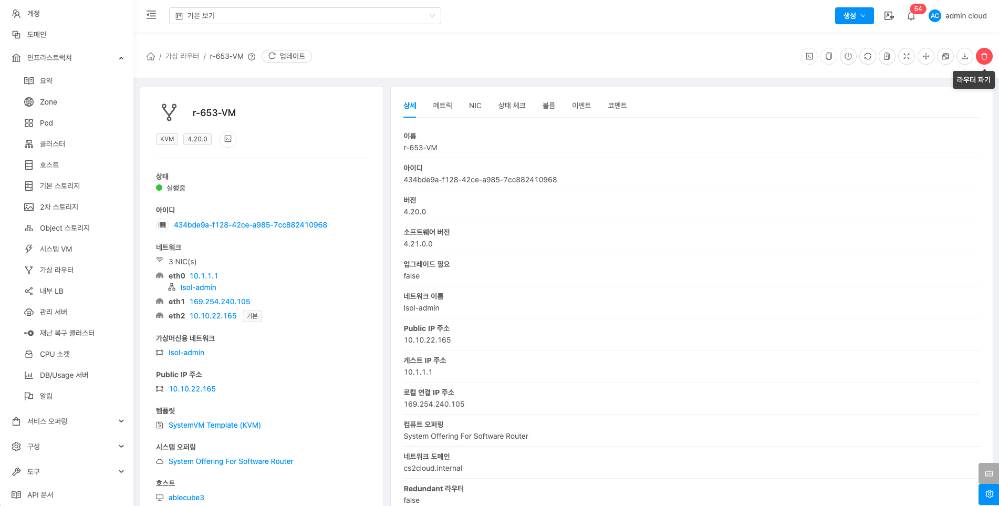{ .imgCenter .imgBorder }

    * **가상 라우터 삭제** 버튼을 클릭하여 가상 라우터 삭제 화면을 호출합니다.

    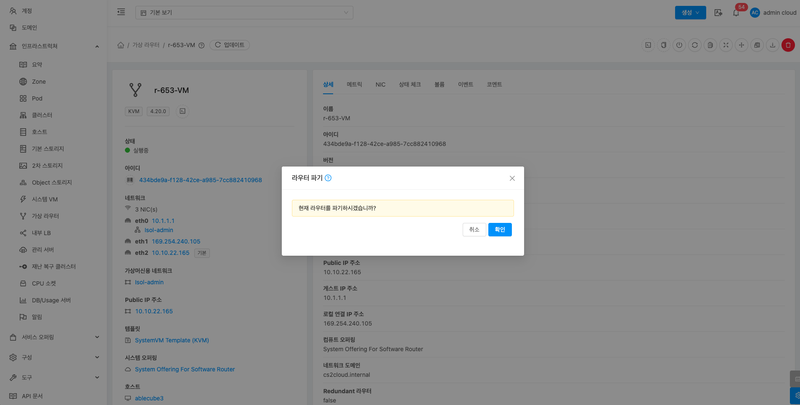{ .imgCenter .imgBorder }

    * **확인** 버튼을 클릭하여 가상 라우터를 삭제합니다.
