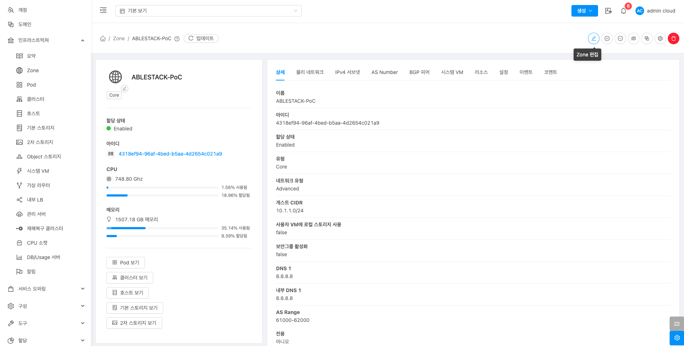
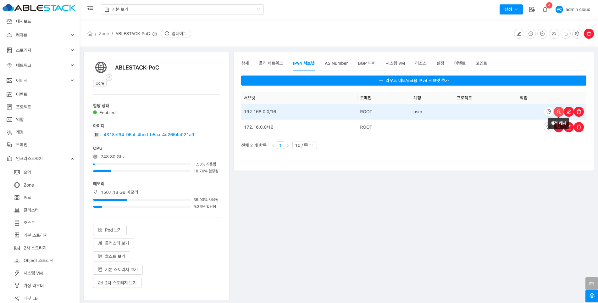
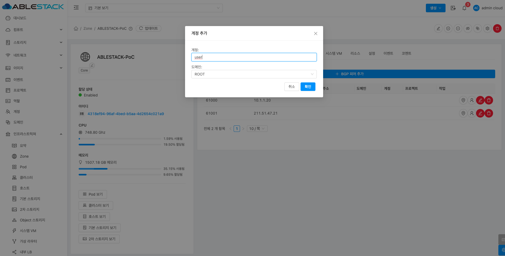

# Zone

## 개요
Zone은 ABLESTACK 인프라의 자원을 관리하고 배치하는 기본 단위로, 물리적 또는 논리적 구분을 통해 효율적인 관리가 가능합니다. Zone은 서버, 스토리지, 네트워크 자원을 포함하며, 서로 다른 하이퍼바이저(VMware, KVM 등)를 기반으로 구성될 수 있습니다.

## 목록 조회

1. Zone 목록을 확인하는 화면입니다.
    생성된 Zone 목록을 확인하거나 Zone 추가 버튼을 클릭하여 Zone을 생성할 수 있습니다.
    { .imgCenter .imgBorder }

## Zone추가

1. Zone 추가 버튼을 클릭 하여 Zone 추가 팝업을 호출합니다.

    { .imgCenter .imgBorder }

2. Zone 구성을 위한 항목을 입력합니다.

    !!! info
        다음은 예시입니다. Zone 구성시 네트워크, 스토리지, 호스트 등 실제 구축하는 사이트 환경에 맞는 값을 입력해야합니다.

    { .imgCenter .imgBorder }

    * Zone의 유형을 선택하는 화면입니다.
    * **Core:** Core를 선택합니다.
    * **다음** 을 클릭합니다.

    { .imgCenter .imgBorder }

    * **확장:** 확장을 선택한합니다.
    * **다음** 을 클릭합니다.

    { .imgCenter .imgBorder }

    * Zone 에 대한 정보를 입력하는 화면 입니다.
    * **이름:** 이름을 입력합니다.
    * **IPv4 DNS1:** IPv4 DNS1을 입력합니다.
    * **내부 DNS 1:** 내부 DNS1을 입력합니다.
    * **하이퍼바이저:** 하이퍼바이저를 선택합니다.
    * 입력 정보 확인 후에 **다음** 버튼을 클릭합니다.

    { .imgCenter .imgBorder }

    * Zone 의 네트워크 정보를 입력하는 화면입니다.
    * **트래픽 유형** 의 **MANAGEMENT, GUEST, PUBLIC** 각각 편집 버튼을 클릭하여 트래픽 라벨을 입력합니다.

    { .imgCenter .imgBorder }

    * **트래픽 유형** 에 따라 네트워크 서비스를 제공할 트래픽 라벨명을 입력합니다.

    { .imgCenter .imgBorder }

    * Zone 의 서비스용 네트워크 정보를 입력 하는 화면입니다.
    * **게이트웨이:** 게이트웨이를 입력합니다.
    * **넷마스크:** 넷마스크를 입력합니다.
    * **가상 네트워크(VLAN):** 가상 네트워크(VLAN)을 입력합니다.
    * **시작 IP 주소:** 시작 IP 주소를 입력합니다.
    * **종료 IP 주소:** 종료 IP 주소를 입력합니다.
    * **추가** 버튼을 클릭합니다.
    * 입력한 정보를 확인 후 다음 버튼을 클릭합니다.

    { .imgCenter .imgBorder }

    * Pod 네트워크 정보를 입력하는 화면 입니다.
    * **이름:** 이름을 입력합니다.
    * **예약된 시스템 게이트웨이:** 예약된 시스템 게이트웨이를 입력합니다.
    * **예약된 시스템 넷마스크:** 예약된 시스템 넷마스크를 입력합니다.
    * **예약된 시스템 시작 IP 주소:** 예약된 시스템 시작 IP 주소를 입력합니다.
    * **예약된 시스템 종료 IP:** 예약된 시스템 종료 IP를 입력합니다.
    * 입력한 정보를 확인 후 **다음** 버튼을 클릭합니다.

    { .imgCenter .imgBorder }

    * 가상머신용 네트워크 정보를 입력하는 화면입니다.
    * "VLAN 범위" 를 입력합니다.
    * 입력한 정보를 확인 후 **다음** 버튼을 클릭합니다.

    { .imgCenter .imgBorder }

    * 클라우드센터 클러스터 정보를 입력하는 화면입니다.
    * **클러스터 이름:** 을 입력합니다.
    * 입력한 정보를 확인 후 **다음** 버튼을 클릭합니다.

    { .imgCenter .imgBorder }

    * 클라우드센터에 호스트를 추가하는 화면 입니다.
    * **호스트 이름:** 호스트 이름을 입력합니다.
    * **사용자 이름:** 사용자 이름을 입력합니다.
    * **비밀번호:** 비밀번호을 입력합니다.
    * **태그:** 태그를 입력합니다.
    * 입력한 정보를 확인 후 **다음** 버튼을 클릭합니다.

    { .imgCenter .imgBorder }

    * 기본 스토리지 추가하는 화면입니다.
    * **이름:** 이름을 입력합니다.
    * **범위:** 범위를 선택합니다.
    * **제공자:** 제공자를 선택합니다.
    * **프로토콜:** 프로토콜을 선택합니다.
    * **Glue Block 모니터:** Glue Block 모니터를 입력합니다.(띄어쓰기 없음)
    * **Glue Block 풀:** Glue Block 풀을 입력합니다.
    * **Glue Block 사용자:** Glue Block 사용자를 입력합니다.

    { .imgCenter .imgBorder }

    * **Glue Block 시크릿:** Glue Block 시크릿을 입력합니다.
    * **Glue Block 경로:** Glue Block 경로를 입력합니다.
    * 입력한 정보를 확인 후 **다음** 버튼을 클릭합니다.

    { .imgCenter .imgBorder }

    * 2차 스토리지를 추가하는 화면입니다.
    * **제공자:** 제공자를 선택합니다.
    * **이름:** 이름을 입력합니다.
    * **서버:** 서버를 입력합니다.
    * **경로:** 경로를 입력합니다.
    * 입력한 정보를 확인 후 다음 버튼을 클릭합니다.

    { .imgCenter .imgBorder }

    * **Zone 시작** 버튼을 클릭하여 Zone 구성을 진행합니다.

    { .imgCenter .imgBorder }

    * Zone 구성 진행 화면입니다. (입력값 및 구성이 올바르지 않을 경우 해당 입력 영역을 다시 입력하실수 있습니다.)

    !!! info
        입력값이나 구성이 올바르지 않은 경우, 해당 입력 영역을 다시 확인하여 입력할 수 있습니다.

    { .imgCenter .imgBorder }

    * 완료되면 목록에 추가된 Zone을 확인할 수 있습니다.

## Zone 편집

1. 해당 Zone 정보를 편집합니다.

    { .imgCenter .imgBorder }

    * **Zone 편집** 버튼을 클릭하여 Zone 편집 화면을 호출합니다.

    { .imgCenter .imgBorder }

    * 수정할 **항목** 을 입력합니다.
    * **확인** 버튼을 클릭하여 Zone 업데이트합니다.

## Zone 비활성화

1. 해당 Zone을 비활성화합니다.

    { .imgCenter .imgBorder }

    * **Zone 비활성화** 버튼을 클릭하여 Zone 비활성화 화면을 호출합니다.

    { .imgCenter .imgBorder }

    * **확인** 버튼을 클릭하여 Zone 비활성화합니다.

## Zone 활성화

1. 해당 Zone을 활성화합니다.

    { .imgCenter .imgBorder }

    * **Zone 활성화** 버튼을 클릭하여 Zone 활성화 화면을 호출합니다.

    { .imgCenter .imgBorder }

    * **확인** 버튼을 클릭하여 Zone 활성화합니다.

## 원격 관리 비활성화

1. 해당 Zone 원격 관리 비활성화합니다.

    { .imgCenter .imgBorder }

    * **원격 관리 비활성화** 버튼을 클릭하여 원격 관리 비활성화 화면을 호출합니다.

    { .imgCenter .imgBorder }

    * **확인** 버튼을 클릭하여 원격 관리 비활성화합니다.

## 원격 관리 활성화

1. 해당 Zone 원격 관리 활성화합니다.

    { .imgCenter .imgBorder }

    * **원격 관리 활성화** 버튼을 클릭하여 원격 관리 활성화 화면을 호출합니다.

    { .imgCenter .imgBorder }

    * **확인** 버튼을 클릭하여 원격 관리 활성화합니다.

## HA 비활성화

1. 해당 Zone HA 비활성화합니다.

    { .imgCenter .imgBorder }

    * **HA 비활성화** 버튼을 클릭하여 HA 비활성화 화면을 호출합니다.

    { .imgCenter .imgBorder }

    * **확인** 버튼을 클릭하여 HA 비활성화합니다.

## HA 활성화

1. 해당 Zone HA 활성화합니다.

    { .imgCenter .imgBorder }

    * **HA 활성화** 버튼을 클릭하여 HA 활성화 화면을 호출합니다.

    { .imgCenter .imgBorder }

    * **확인** 버튼을 클릭하여 HA 활성화합니다.

## VMware 데이터 센터 추가

1. 해당 Zone에 VMware 데이터 센터를 추가하는 기능입니다.

    { .imgCenter .imgBorder }

    * **VMware 데이터 센터 추가** 버튼을 클릭하여 VMware 데이터 센터 추가 화면을 호출합니다.

    { .imgCenter .imgBorder }

    * **이름:** 이름을 입력합니다.
    * **VMware 데이터센터 vCenter:** VMware 데이터센터 vCenter를 입력합니다
    * **사용자 이름:** 사용자 이름을 입력합니다.
    * **비밀번호:** 비밀번호를 입력합니다.
    * **확인** 버튼을 클릭하여 VMware 데이터 센터를 추가합니다.

## 롤링 유지 관리 시작

1. 해당 Zone에 호스트에 대하여 롤링 유지 관리하는 기능입니다.

    { .imgCenter .imgBorder }

    * **롤링 유지 관리 시작** 버튼을 클릭하여 롤링 유지 관리 시작 화면을 호출합니다.

    { .imgCenter .imgBorder }

    * **시간초과:** 시간초과을 입력합니다.
    * **payload:** payload에 실행할 명령을 입력합니다.
    * **확인** 버튼을 클릭하여 롤링 유지 관리 시작합니다.

## Zone 삭제

!!! warning
    Zone을 삭제하기 위해서는 이하 pod, cluster, 호스트, 기본스토리지, 2차스토리지가 존재하지 않아야 합니다.

1. 해당 Zone을 삭제합니다.

    { .imgCenter .imgBorder }

    * **Zone 삭제** 버튼을 클릭하여 Zone 삭제 화면을 호출합니다.

    { .imgCenter .imgBorder }

    * **확인** 버튼을 클릭하여 Zone을 삭제합니다.

## 상세 탭

1. Zone에 대한 상세정보를 조회하는 화면입니다. 해당 Zone의 이름, 아이디, 할당 상태, 유형, 네트워크 유형, 게스트 CIDR, 사용자 VM에 로컬 스토리지 사용, 보안그룹 활성화, DNS, 내부 DNS,  AS Rnage, 전용 등의 정보를 확인할 수 있습니다.

    { .imgCenter .imgBorder }

## 물리네트워크 탭

1. Zone에서 사용하는 물리네트워크를 조회 및 관리하는 화면입니다. 해당 Zone 물리네트워크의 이름, 상태, Isolation 메소드 등의 정보를 확인할 수 있습니다.

    { .imgCenter .imgBorder }

### 물리네트워크 추가

1. Zone에 물리네트워크를 추가하는 기능입니다.

    !!! info
        * 물리네트워크를 추가하기 위해서는 먼저 [Zone 을 비활성화](../mold/mold-admin-guide-infrastructure-zones.md/#zone_3) 해야 합니다. Zone 을 비활성화 해도 사용자 가상머신의 운영에는 영향이 없습니다.

    { .imgCenter .imgBorder }

    * **물리 네트워크 추가** 버튼을 클릭하여 볼륨 생성 및 추가 화면을 호출합니다.

    { .imgCenter .imgBorder }

    * **이름:** 이름을 입력합니다.
    * **Isolation 메소드:** Isolation 메소드를 선택합니다.
    * **VLAN/VNI:** VLAN/VNI를 입력합니다.
    * **태그:** 태그를 입력합니다.
    * **네트워크 속도:** 네트워크 속도를 입력합니다.
    * **브로드캐스트 도메인 범위:** 브로드캐스트 도메인 범위를 입력합니다.
    * **확인** 버튼을 클릭하여 Zone을 추가합니다.

    { .imgCenter .imgBorder }

    * 생성된 물리네트워크로 들어가 트래픽 라벨을 업데이트 합니다.

    { .imgCenter .imgBorder }

    * 트래픽 유형을 GUEST 로 설정합니다.
    * KVM 트래픽 라벨에 Cube 에서 추가한 bridge 명을 추가합니다.

    { .imgCenter .imgBorder }

    * 트래픽 유형 추가를 클릭합니다.

    { .imgCenter .imgBorder }

    * 트래픽 유형을 GUEST 로 설정합니다.
    * Isolation 메소드를 vlan 으로 선택합니다.

    { .imgCenter .imgBorder }

    * 물리 네트워크 업데이트를 클릭합니다.

    { .imgCenter .imgBorder }

    * VLAN으로 나뉘어 있을 경우 VLAN 을 입력합니다.
    * 해당 물리네크워크를 확인할 수있는 태그를 설정합니다.
    !!! info
        *추가한 물리네트워크를 이용하기 위해서는 [해당 물리네트워크의 태그를 단 네트워크 오퍼링을 생성](../mold/mold-admin-guide-offerings-network-offerings.md/#_1)해야 합니다. 

## IPv4 서브넷 탭

1. Zone에서 사용하는 IPv4 서브넷을 미리 할당하고 어떤 네트워크에서 사용되는지 조회 및 관리하는 화면입니다. 해당 Zone IPv4 서브넷의 서브넷, 도메인, 계정, 프로젝트, 작업 등의 정보를 확인할 수 있습니다.

    { .imgCenter .imgBorder }

### 라우트 네트워크용 IPv4 서브넷 추가

1. Zone에 IPv4 서브넷을 추가하는 기능입니다.

    { .imgCenter .imgBorder }

    * **라우트 네트워크용 IPv4 서브넷 추가** 버튼을 클릭하여 라우트 네트워크용 IPv4 서브넷 추가 화면을 호출합니다.

    { .imgCenter .imgBorder }

    * **서브넷:** 서브넷을 입력합니다.
    * **확인** 버튼을 클릭하여 IPv4 서브넷을 추가합니다.

### 보기 IPv4 서브넷

1. 해당 서브넷이 어떤 네트워크에서 사용중인지 확인할 수 있도록 IPv4 서브넷 목록 메뉴로 이동합니다.

    { .imgCenter .imgBorder }

    * 선택한 서브넷을 사용중 네트워크를 확인할 수 있도록 **네트워크 > IPv4 서브넷** 메뉴로 이동합니다.

### 계정 추가

1. 해당 서브넷을 사용하는 계정을 추가하는 기능입니다.

    { .imgCenter .imgBorder }

    * **계정 추가** 버튼을 클릭하여 계정 추가 화면을 호출합니다.

    { .imgCenter .imgBorder }

    * **계정:** 계정을 입력합니다.
    * **도메인:** 도메인을 선택합니다
    * **확인** 버튼을 클릭하여 계정을 추가합니다.

### 계정 해제

1. 해당 서브넷을 사용하는 계정을 해제하는 기능입니다.

    { .imgCenter .imgBorder }

    * **계정 해제** 버튼을 클릭하여 계정을 해제합니다.

### IPv4 서브넷 업데이트

1. 해당 서브넷을 변경하는 기능입니다.

    { .imgCenter .imgBorder }

    * **IPv4 서브넷 업데이트** 버튼을 클릭하여 IP 범위 업데이트 화면을 호출합니다.

    { .imgCenter .imgBorder }

    * **서브넷:** 서브넷을 입력합니다.
    * **확인** 버튼을 클릭하여 서브넷 IP 주소 범위를 업데이트합니다.

### IPv4 서브넷 제거

1. 해당 IPv4 서브넷을 제거하는 기능입니다.

    { .imgCenter .imgBorder }

    * **IPv4 서브넷 제거** 버튼을 클릭하여 IPv4 서브넷을 제거합니다.

## AS Number 탭

1. Zone에서 사용하는 AS Number를 조회 및 관리하는 화면입니다. 해당 Zone AS Number의 AS Range 등의 정보를 확인할 수 있습니다.

    { .imgCenter .imgBorder }

### AS Number 생성

1. Zone에 AS Number의 범위를 생성하는 기능입니다.

    { .imgCenter .imgBorder }

    * **AS Number 업데이트** 버튼을 클릭하여 IP 범위 업데이트 화면을 호출합니다.

    { .imgCenter .imgBorder }

    * **범위:** 범위를 입력합니다.
    * **확인** 버튼을 클릭하여 AS Range를 생성합니다.

### AS Number 삭제

1. 해당 AS Number를 삭제하는 기능입니다.

    { .imgCenter .imgBorder }

    * **AS Number 삭제** 버튼을 클릭하여 AS Number를 제거합니다.

## BGP 피어 탭

1. Zone에서 사용하는 BGP 피어를 조회 및 관리하는 화면입니다. 해당 Zone BGP 피어의 AS Number, IP 주소, IPv6 IP 주소, 도메인, 계정, 프로젝트 등의 정보를 확인할 수 있습니다.

    { .imgCenter .imgBorder }

### BGP 피어 추가

1. Zone에 BGP 피어를 추가하는 기능입니다.

    { .imgCenter .imgBorder }

    * **BGP 피어 추가** 버튼을 클릭하여 BGP 피어 추가 화면을 호출합니다.

    { .imgCenter .imgBorder }

    * **AS Number:** AS Number를 입력합니다.
    * **IP 주소:** IP 주소을 입력합니다.
    * **비밀번호:** 비밀번호를 입력합니다.
    * **확인** 버튼을 클릭하여 Zone을 추가합니다.

### 보기 네트워크

1. 해당 BGP 피어가 어떤 가상머신용 네트워크에서 사용중인지 확인할 수 있도록 네트워크 목록 메뉴로 이동합니다.

    { .imgCenter .imgBorder }

    * 선택한 BGP 피어가 사용중 네트워크를 확인할 수 있도록 **네트워크 > 가상머신용 네트워크** 메뉴로 이동합니다.

### 계정 추가

1. 해당 BGP 피어를 사용하는 계정을 추가하는 기능입니다.

    { .imgCenter .imgBorder }

    * **계정 추가** 버튼을 클릭하여 계정 추가 화면을 호출합니다.

    { .imgCenter .imgBorder }

    * **계정:** 계정을 입력합니다.
    * **도메인:** 도메인을 선택합니다
    * **확인** 버튼을 클릭하여 계정을 추가합니다.

### 계정 해제

1. 해당 BGP 피어가 사용하는 계정을 해제하는 기능입니다.

    { .imgCenter .imgBorder }

    * **계정 해제** 버튼을 클릭하여 계정을 해제합니다.

### BGP 피어 업데이트

1. 해당 BGP 피어를 변경하는 기능입니다.

    { .imgCenter .imgBorder }

    * **BGP 피어 업데이트** 버튼을 클릭하여 IP 범위 업데이트 화면을 호출합니다.

    { .imgCenter .imgBorder }

    * **AS Number:** AS Number를 입력합니다.
    * **IP 주소:** IP 주소를 입력합니다.
    * **확인** 버튼을 클릭하여  BGP 피어를 업데이트합니다.

### BGP 피어 제거

1. 해당 BGP 피어을 제거하는 기능입니다.

    { .imgCenter .imgBorder }

    * **BGP 피어 제거** 버튼을 클릭하여 BGP 피어을 제거합니다.

## 시스템 VM 탭

1. Zone에 시스템 가상머신 (콘솔 가상머신, 2차 스토리지 가상머신)의 상태를 조회하는 화면입니다. 해당 Zone에서 실행중인 시스템 가상머신의 이름, VM 상태, Agent 상태, 유형, Public IP, 호스트 등의 정보를 확인할 수 있습니다.

    { .imgCenter .imgBorder }

## 리소스 탭

1. Zone에 할당된 자원의 상태를 조회하는 화면입니다. 해당 Zone에서 할당량과 활당 가능량을 확인 가능하며 메모리, CPU, 기본 스토리지 사용량, 할당된 기본 스토리지, Public 주소, 관리 IP 주소, 2차 스토리지, VLAN/VNI, 직접 IP 주소, GPU, CPU 코어수 등의 정보를 확인할 수 있습니다.

    { .imgCenter .imgBorder }

## 설정 탭

1. Zone에서 사용하는 설정을 조회 및 관리하는 화면입니다. 해당 Zone 설정 정보를 편집하고 초기값으로 원복할 수 있습니다.

    { .imgCenter .imgBorder }

### 편집

1. Zone에 설정 값을 변경합니다.

    { .imgCenter .imgBorder }

    * 설정 값을 수정후 확인 버튼을 클릭하여 해당 Zone에 설정 값을 변경합니다.

### 기본값으로 재설정

1. Zone의 설정 값을 초기값으로 재설정합니다.

    { .imgCenter .imgBorder }

## 이벤트 탭

1. Zone에 관련된 이벤트 정보를 확인할 수 있는 화면입니다. Zone에서 발생한 다양한 액션과 변경 사항을 쉽게 파악할 수 있습니다.

    { .imgCenter .imgBorder }

## 코멘트 탭

1. Zone에 관련된 코멘트 정보를 확인하는 화면입니다. 각 사용자별로 해당 Zone에 대한 코멘트 정보를 조회 및 관리할 수 있는 화면입니다.

    { .imgCenter .imgBorder }
