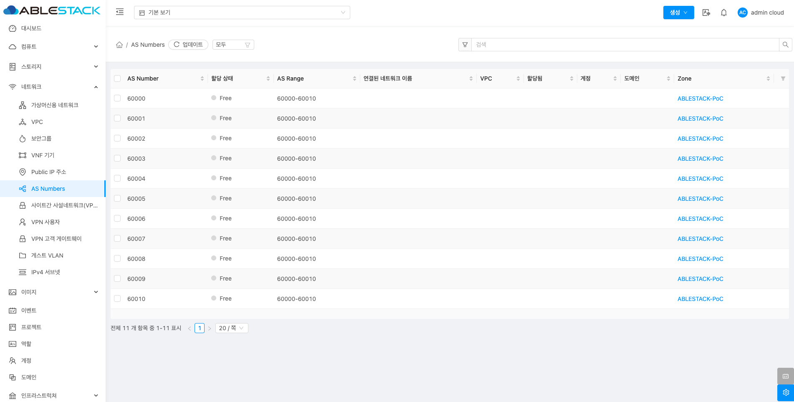

# AS Numbers

## 개요
AS Numbers는 동적 라우팅을 설정하는 데 필수적인 요소입니다. AS Number를 효율적으로 관리하면, 다양한 네트워크 간의 경로 설정을 최적화하고 안정적인 라우팅을 보장할 수 있습니다. ABLESTACK에서 제공하는 API와 UI 기능을 통해 AS 번호를 생성, 조회, 해제 및 관리할 수 있습니다.

## 목록 조회

1. AS Numbers 목록을 확인할 수 있습니다.
    Zone에 할당된 AS Number의 AS Number, 할당 상태, AS Rnage, 연결된 네트워크 이름 등 다양한 정보를 확인할 수 있습니다.
    { align=center }