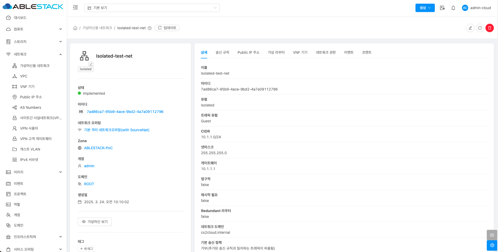

# 가상머신용 네트워크

## 개요
네트워크는 가상머신 간의 통신 및 외부 네트워크와의 연결을 관리하는 중요한 기능을 담당하며, 네트워크의 유형, IP 할당, 보안 설정 등을 통해 유연한 네트워크 환경을 제공합니다. 게스트용 네트워크 타입은 Isolated, L2, Shared 를 제공하고 있습니다.

## 목록 조회

1. 가상머신용 네트워크 목록을 확인하는 화면입니다.
    생성된 네트워크 목록을 확인하거나 네트워크 생성 버튼을 클릭하여 네크워크를 생성할 수 있습니다.
    { align=center }

## 가상머신용 네트워크 추가
게스트용 네트워크 생성 용도에 따라 Isolated, L2, Shared를 선택하여 생성합니다. 네트워크 추가 버튼 클릭하여 새 네트워크 생성 화면을 호출합니다.

1. 네트워크 추가 버튼 클릭
    { align=center }
    * **네트워크 추가** 버튼을 클릭하여 네트워크 추가 화면을 호출합니다.

### Isolated 생성
Isolated Network는 네트워크가 다른 네트워크와 격리되어 독립적으로 운영되는 방식입니다. 이 네트워크 타입에서는 가상머신이 서로 다른 네트워크에서 독립적으로 동작합니다.
    
1. Isolated 네트워크 생성 정보 입력
    { align=center }
    * **이름** 을 입력합니다.
    * **설명** 을 입력합니다.
    * **소유자 유형** 을 선택합니다.
    * **도메인** 을 선택합니다.
    * **계정** 을 선택합니다.
    * **네트워크 오퍼링** 을 선택합니다.

    { align=center }

    * **확인** 버튼을 클릭하여 Isolated 네트워크를 생성합니다.

### L2 생성
L2 Network는 물리적인 네트워크에서 Layer 2 (데이터 링크 계층) 기반으로 동작하는 네트워크입니다. 이 L2 네트워크를 통해 여러 가상 머신(VM)이 동일한 물리적 네트워크를 공유하게 됩니다. L2 네트워크는 가상화된 환경 내에서 VM들이 서로 연결될 수 있도록 하며, 실제 물리적인 네트워크의 스위칭 기능을 기반으로 합니다.

1. L2 네트워크 생성 정보 입력
    { align=center }
    
    * **이름** 을 입력합니다.
    * **설명** 을 입력합니다.
    * **Zone** 을 선택합니다.
    * **소유자 유형** 을 선택합니다.
    * **도메인** 을 선택합니다.
    * **계정** 을 선택합니다.
    * **네트워크 오퍼링** 을 선택합니다.
    * **VLAN/VNI** 를 입력합니다.
    * **확인** 버튼을 클릭하여 L2 네트워크를 생성합니다.

### shared 생성
Shared Network는 여러 사용자와 VM이 동일한 VLAN을 공유하는 네트워크 유형입니다. 이를 통해 여러 사용자가 동일한 네트워크 자원을 효율적으로 공유하며, 관리자는 네트워크 설정을 더 유연하게 관리할 수 있습니다.

1. Shared 네트워크 생성 정보 입력
    { align=center }
    
    * **이름** 을 입력합니다.
    * **설명** 을 입력합니다.
    * **Zone** 을 선택합니다.
    * **물리 네트워크** 을 선택합니다.
    * **VLAN/VNI** 를 선택합니다.
    * **네크워크 오퍼링** 을 선택합니다.

    { align=center }

    * 구성에 따라 **IPv4** 를 설정합니다.
    * **확인** 버튼을 클릭하여 Shared 네트워크를 생성합니다.

## 상세 탭 (Isolated)

1. Isolated 네트워크에 대한 상세정보를 조회하는 화면입니다. 해당 네트워크의 이름, 아이디, 유형, 트래픽 유형, CIDR, 넷마스크, 게이트웨이, 영구적, 재시작 필요, Redundant 라우터, 네트워크 도메인, 기본 송신 정책, Zone, 계정, 도메인, DNS1, Public 인터페이스 MTU, Private 인터페이스 MTU 등의 정보를 확인할 수 있습니다.

    { align=center }

## 송신 규칙 탭 (Isolated)

1. Isolated 네트워크에 대한 송신 규칙을 조회 및 관리하는 화면입니다. Source CIDR, 목적지 CIDR, 프로토콜, 시작 포트, 종료 포트 등의 정보를 확인할 수 있습니다.

    { align=center }

### 송신 규칙 추가

1. 송신 규칙을 추가하는 기능입니다.

    { align=center }

    * **Source CIDR** 를 입력합니다.
    * **목적지 CIDR** 를 입력합니다.
    * **프로토콜** 을 입력합니다.
    * **시작 포트** 를 입력합니다.
    * **종료 포트** 를 입력합니다.
    * **+ 추가** 버튼을 클릭하여 송신 규칙을 추가합니다.

### 송신 규칙 삭제

1. 송신 규칙을 삭제하는 기능입니다.

    { align=center }

    * **삭제** 버튼을 클릭하여 송신 규칙을 삭제합니다.

## Public IP 주소 탭 (Isolated)

1. Isolated 네트워크에 대한 Public IP 주소를 조회 및 관리하는 화면입니다. IP 주소, 상태, VM, 네트워크 등의 정보를 확인할 수 있습니다.

    { align=center }

### 새 IP 주소 가져오기

1. Isolated 네트워크에 Public IP 주소를 추가할 수 있습니다. IP 주소를 클릭하여 Public IP 주소 상세에서 가상머신에 IP 주소를 Static Nat으로 가상머신에 제공할 수 있습니다.

    { align=center }

    * **IP 주소** 를 입력합니다.
    * **확인** 버튼을 클릭하여 IP 주소를 추가합니다.

### Public IP 주소 일괄 해제

1. Isolated 네트워크에 Public IP 주소를 해제할 수 있습니다. 

    { align=center }

* **IP 주소 해제** 버튼을 클릭하여 IP 주소를 해제합니다.

## 가상 라우터 탭 (Isolated)

1. Isolated 네트워크에 대한 가상 라우터를 조회하는 화면입니다. 해당 네트워크의 가상 라우터 이름, 상태, IP, 버전, 실행중인 호스트 등의 정보를 확인할 수 있습니다.

    { align=center }

## VNF 기기 탭 (Isolated)

1. Isolated 네트워크에 대한 VNF 기기를 조회하는 화면입니다. 해당 네트워크의 연결된 VNF 기기의 이름, 상태, IP 주소, 템플릿, OS Display 명, 실행중인 호스트 등의 정보를 확인할 수 있습니다.

    { align=center }

## 네트워크 권한 탭 (Isolated)

1. Isolated 네트워크에 대한 네트워크 권한을 조회 및 관리하는 화면입니다. 해당 네트워크의 도메인, 계정, 프로젝트 등의 정보를 확인할 수 있습니다.

    { align=center }

### 네트워크 권한 추가

1. Isolated 네트워크의 네트워크 권한을 추가합니다.

    { align=center }

    * **계정** 을 선택합니다.
    * **프로젝트** 를 선택합니다.
    * **확인** 버튼을 클릭하여 네트워크 권한을 추가합니다.

### 네트워크 권한 삭제

1. Isolated 네트워크의 네트워크 권한을 삭제합니다.

    { align=center }

    * **네트워크 권한 삭제** 버튼을 클릭하여 네트워크 권한을 삭제ㄹ합니다.

### 네트워크 권한 재설정

1. Isolated 네트워크의 네트워크 권한을 재설정합니다.

    { align=center }

    * **확인** 버튼을 클릭하여 네트워크 권한을 재설정합니다.

## 이벤트 탭 (Isolated)

1. Isolated 네트워크에 관련된 이벤트 정보를 확인할 수 있는 화면입니다. 네트워크에서 발생한 다양한 액션과 변경 사항을 쉽게 파악할 수 있습니다.

    { align=center }

## 코멘트 탭 (Isolated)

1. Isolated 네트워크에 관련된 코멘트 정보를 확인하는 화면입니다. 각 사용자별로 해당 네트워크에 대한 코멘트 정보를 조회 및 관리할 수 있는 화면입니다.

    { align=center }

## 네트워크 업데이트 (Isolated)

1. 해당 네트워크의 정보를 업데이트합니다.

    { align=center }

    * **네트워크 업데이트** 버튼을 클릭하여 네트워크 업데이트 화면을 호출합니다.

    { align=center }

    * 수정할 **항목** 을 입력합니다.
    * **확인** 버튼을 클릭하여 네트워크 업데이트 합니다.

## 네트워크 재시작 (Isolated)

1. Isolated 네트워크의 가상라우터를 재시작합니다.

    { align=center }

    * **네트워크 재시작** 버튼을 클릭하여 네트워크 재시작 화면을 호출합니다.

    { align=center }

    * **확인** 버튼을 클릭하여 네트워크 가상 라우터를 재시작합니다.

## 네트워크 삭제 (Isolated)

1. Isolated 네트워크를 삭제합니다.

    { align=center }

    * **네트워크 삭제** 버튼을 클릭하여 네트워크 삭제 화면을 호출합니다.

    { align=center }

    * **확인** 버튼을 클릭하여 네트워크를 삭제합니다.

## 상세 탭 (L2)

1. L2 네트워크에 대한 상세정보를 조회하는 화면입니다. 해당 네트워크의 이름, 아이디, 유형, 트래픽 유형, 영구적, 재시작 필요, Redundant 라우터, Zone, 계정, 도메인, DNS1 등의 정보를 확인할 수 있습니다.

    { align=center }

## VNF 기기 탭 (L2)

1. L2 네트워크에 대한 VNF 기기를 조회하는 화면입니다. 해당 네트워크의 연결된 VNF 기기의 이름, 상태, IP 주소, 템플릿, OS Display 명, 실행중인 호스트 등의 정보를 확인할 수 있습니다.

    { align=center }

## 네트워크 권한 탭 (L2)

1. L2 네트워크에 대한 네트워크 권한을 조회 및 관리하는 화면입니다. 해당 네트워크의 도메인, 계정, 프로젝트 등의 정보를 확인할 수 있습니다.

    { align=center }

### 네트워크 권한 추가

1. L2 네트워크의 네트워크 권한을 추가합니다.

    { align=center }

    * **계정** 을 선택합니다.
    * **프로젝트** 를 선택합니다.
    * **확인** 버튼을 클릭하여 네트워크 권한을 추가합니다.

### 네트워크 권한 삭제

1. L2 네트워크의 네트워크 권한을 삭제합니다.

    { align=center }

    * **네트워크 권한 삭제** 버튼을 클릭하여 네트워크 권한을 삭제합니다.

### 네트워크 권한 재설정

1. L2 네트워크의 네트워크 권한을 재설정합니다.

    { align=center }

    * **확인** 버튼을 클릭하여 네트워크 권한을 재설정합니다.

## 이벤트 탭 (L2)

1. L2 네트워크에 관련된 이벤트 정보를 확인할 수 있는 화면입니다. 네트워크에서 발생한 다양한 액션과 변경 사항을 쉽게 파악할 수 있습니다.

    { align=center }

## 코멘트 탭 (L2)

1. L2 네트워크에 관련된 코멘트 정보를 확인하는 화면입니다. 각 사용자별로 해당 네트워크에 대한 코멘트 정보를 조회 및 관리할 수 있는 화면입니다.

    { align=center }

## 네트워크 업데이트 (L2)

1. 해당 네트워크의 정보를 업데이트합니다.

    { align=center }

    * **네트워크 업데이트** 버튼을 클릭하여 네트워크 업데이트 화면을 호출합니다.

    { align=center }

    * 수정할 **항목** 을 입력합니다.
    * **확인** 버튼을 클릭하여 네트워크 업데이트 합니다.

## 네트워크 삭제 (L2)

1. l2 네트워크를 삭제합니다.

    { align=center }

    * **네트워크 삭제** 버튼을 클릭하여 네트워크 삭제 화면을 호출합니다.

    { align=center }

    * **확인** 버튼을 클릭하여 네트워크를 삭제합니다.

## 상세 탭 (Shared)

1. Shared 네트워크에 대한 상세정보를 조회하는 화면입니다. 해당 네트워크의 이름, 아이디, 유형, 트래픽 유형, CIDR, 넷마스크, 게이트웨이, 영구적, 재시작 필요, Redundant 라우터, Zone, 도메인, DNS1, Public 인터페이스 MTU 등의 정보를 확인할 수 있습니다.

    { align=center }

## IP Addresses 탭 (Shared)

1. Shared 네트워크에 대한 IP Addresses를 조회 및 관리하는 화면입니다. IP 주소, 상태, VM, 네트워크 등의 정보를 확인할 수 있습니다.

    { align=center }

### Public IP 주소 일괄 해제

1. Shared 네트워크에 Public IP 주소를 해제할 수 있습니다. 

    { align=center }
    
    * **Public IP 주소 일괄 해제** 버튼을 클릭하여 Public IP 주소 일괄 해제 화면을 호출합니다.

    { align=center }

    * **확인** 버튼을 클릭하여 네트워크 가상 라우터를 재시작합니다.

## 가상 라우터 탭 (Shared)

1. Shared 네트워크에 대한 가상 라우터를 조회하는 화면입니다. 해당 네트워크의 가상 라우터 이름, 상태, IP, 버전, 실행중인 호스트 등의 정보를 확인할 수 있습니다.

    { align=center }

## VNF 기기 탭 (Shared)

1. Shared 네트워크에 대한 VNF 기기를 조회하는 화면입니다. 해당 네트워크의 연결된 VNF 기기의 이름, 상태, IP 주소, 템플릿, OS Display 명, 실행중인 호스트 등의 정보를 확인할 수 있습니다.

    { align=center }

## 게스트 IP 주소 범위 탭(Shared)

1. Shared 네트워크에 대한 게스트 IP 주소 범위를 조회 및 관리하는 화면입니다. 해당 네트워크의 게스트 IP 주소 범위의 IPv4 사작 IP, IPv4 종료 IP, IPv6 사작 IP, IPv4 종료 IP, 게이트웨이, 넷마스크 등의 정보를 확인할 수 있습니다.

    { align=center }

### IP 주소 범위 추가

1. Shared 네트워크의 게스트 IP 주소 범위를 추가합니다.

    { align=center }

    * **게이트웨이** 를 입력합니다.
    * **넷마스크** 를 입력합니다.
    * **IPv4 시작 IP** 를 입력합니다.
    * **IPv4 종료 IP** 를 입력합니다.
    * **확인** 버튼을 클릭하여 게스트 IP 주소 범위를 추가합니다.

### IP 주소 범위 편집

1. Shared 네트워크의 게스트 IP 주소 범위를 편집합니다.

    { align=center }

    * **편집** 버튼을 클릭하여 IP 범위 업데이트 화면을 호출합니다.

    { align=center }

    * 수정할 **항목** 을 입력합니다.
    * **확인** 버튼을 클릭하여 IP 범위를 업데이트합니다.

### IP 주소 범위 삭제

1. Shared 네트워크의 게스트 IP 주소 범위를 삭제합니다.

    { align=center }

    * **IP 주소 범위 삭제** 버튼을 클릭하여 IP 범위 삭제 모달을 호출합니다.

    { align=center }

    * **예** 버튼을 클릭하여 IP 범위를 삭제합니다.

## 이벤트 탭 (Shared)

1. Shared 네트워크에 관련된 이벤트 정보를 확인할 수 있는 화면입니다. 네트워크에서 발생한 다양한 액션과 변경 사항을 쉽게 파악할 수 있습니다.

    { align=center }

## 코멘트 탭 (Shared)

1. Shared 네트워크에 관련된 코멘트 정보를 확인하는 화면입니다. 각 사용자별로 해당 네트워크에 대한 코멘트 정보를 조회 및 관리할 수 있는 화면입니다.

    { align=center }
