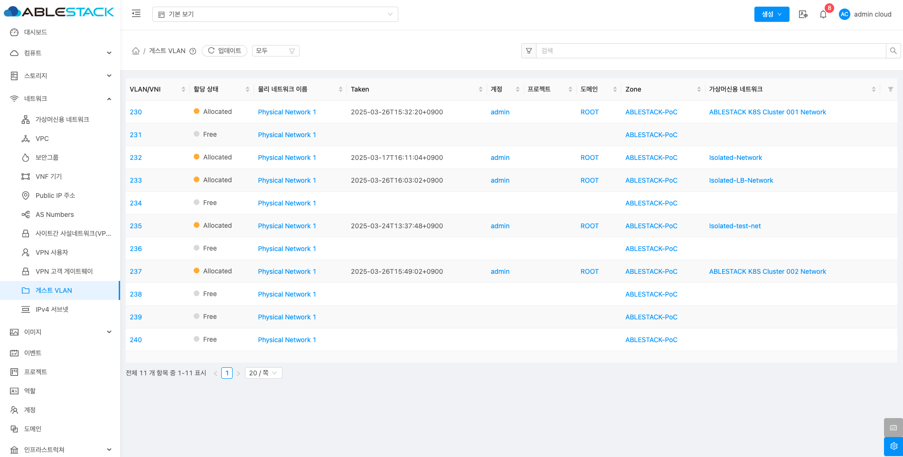
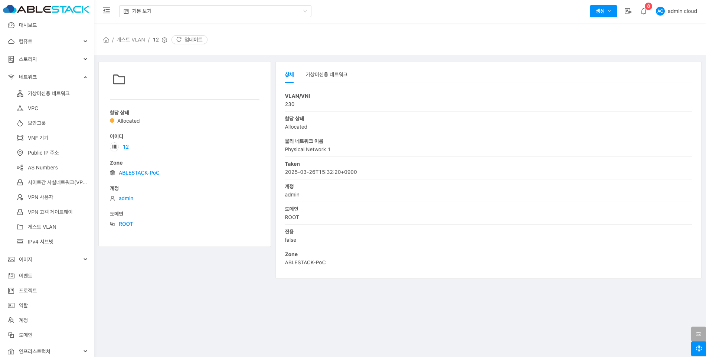
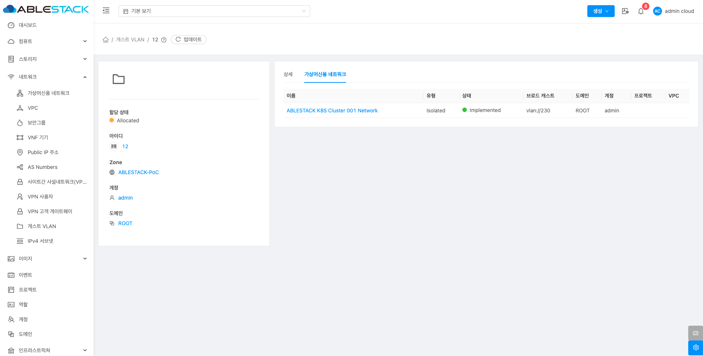

# 게스트 VLAN

## 개요
해당 메뉴에서는 게스트 VLAN은 가상 머신들이 통신할 수 있는 가상 네트워크에 사용된 VLAN 목록 정보를 제공합니다. 해당 기능을 통해 게스트 VLAN이 사용된 물리네트워크, 가상머신용 네트워크 정보를 한눈에 확인할 수 있습니다.

## 목록 조회

1. 게스트 VLAN 목록을 확인할 수 있습니다.
    사용 가능하거나 사용한 게스트 VLAN 목록을 확인할 수 있습니다.
    { .imgCenter .imgBorder }

## 상세 탭

1. 게스트 VLAN에 대한 상세정보를 조회하는 화면입니다. 해당 게스트 VLAN의 VLAN/VNI, 할당, 상태, 물리 네트워크 이름, Taken, 계정, 도메인, 전용, Zone 등의 정보를 확인할 수 있습니다.

    { .imgCenter .imgBorder }

## 가상머신용 네트워크 탭

1. VPC에 연결된 가상머신용 네트워크 정보를 확인할 수 있는 화면입니다. 해당 게스트 VLAN에 연결된 가상머신용 네트워크의 이름, 유형, 상태, 브로드 캐스트, 도메인, 계정, 프로젝트, VPC 등의 정보를 확인할 수 있습니다.

    { .imgCenter .imgBorder }
