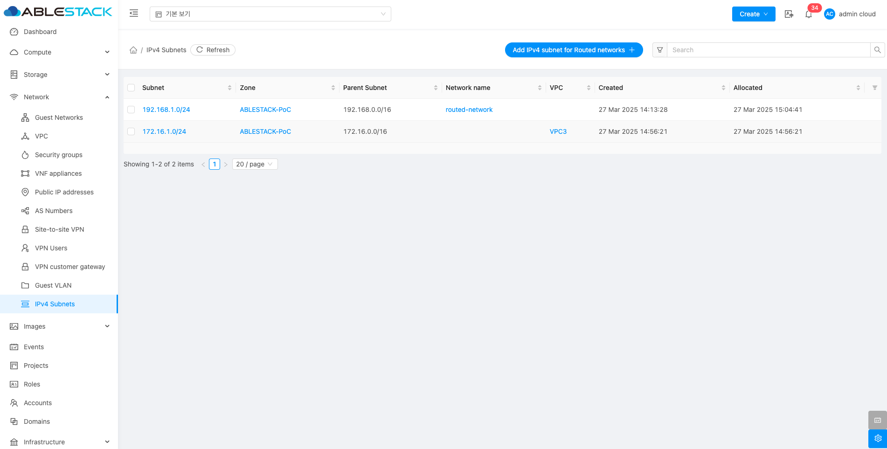
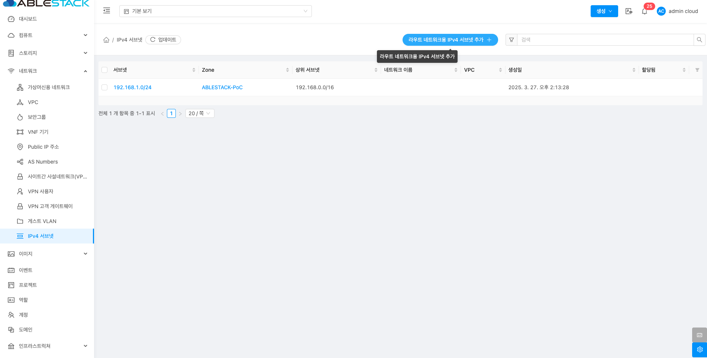
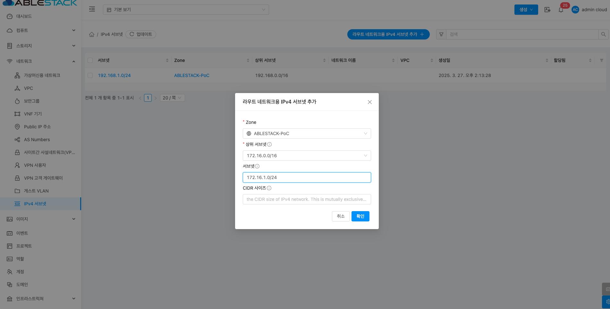
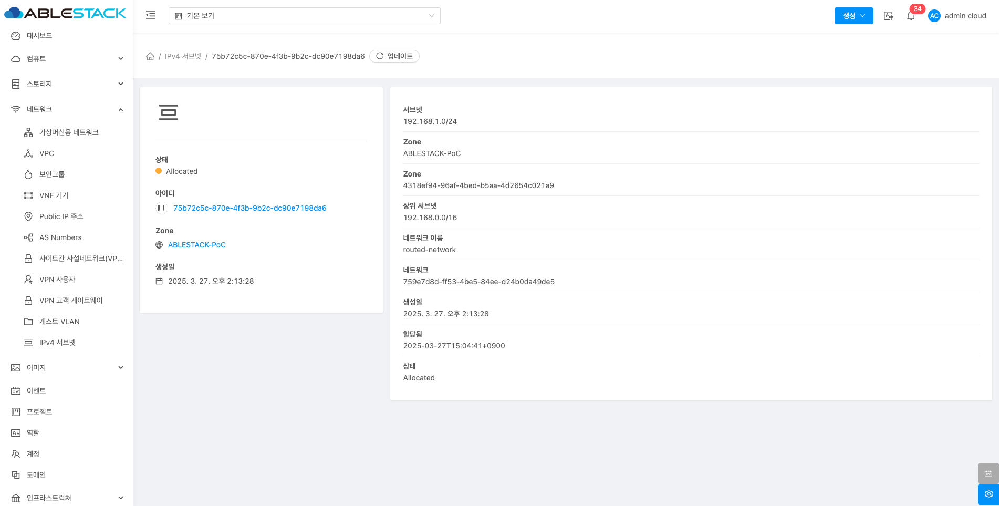

# IPv4 서브넷

## 개요
IPv4 서브넷 기능은 네트워크 구성을 효율적으로 관리하고 IP 주소를 할당하는 데 사용됩니다. 사용자는 특정 IP 대역을 서브넷으로 나누어 관리할 수 있으며, 이를 통해 네트워크의 IP 주소 공간을 효율적으로 분배하고 관리할 수 있습니다.

## 목록 조회

1. IPv4 서브넷 목록을 확인하는 화면입니다.
    생성된 IPv4 서브넷 목록을 확인하거나 IPv4 서브넷 추가 버튼을 클릭하여 IPv4 서브넷을 생성할 수 있습니다.
    { .imgCenter .imgBorder }

## 라우트 네트워크용 IPv4 서브넷 추가

1. 라우트 네트워크용 IPv4 서브넷 추가 버튼 클릭 하여 라우트 네트워크용 IPv4 서브넷 추가 화면을 호출합니다.

    { .imgCenter .imgBorder }

    * **라우트 네트워크용 IPv4 서브넷 추가** 버튼을 클릭하여 라우트 네트워크용 IPv4 서브넷 추가 화면을 호출합니다.

2. IPv4 서브넷 추가를 위한 항목을 입력합니다.
    { .imgCenter .imgBorder }
    * **Zone:** Zone을 선택합니다.
    * **상위 서브넷:** 상위 서브넷을 선택합니다.
    * **서브넷:** 서브넷을 입력합니다.
    * **확인** 버튼을 클릭하여 IPv4 서브넷을 생성합니다.

## 상세 탭

1. IPv4 서브넷에 대한 상세정보를 조회하는 화면입니다. 해당 서브넷의 서브넷, Zone, 상위 서브넷, 네트워크 이름, 생성일, 상태 등의 정보를 확인할 수 있습니다.

    { .imgCenter .imgBorder }
