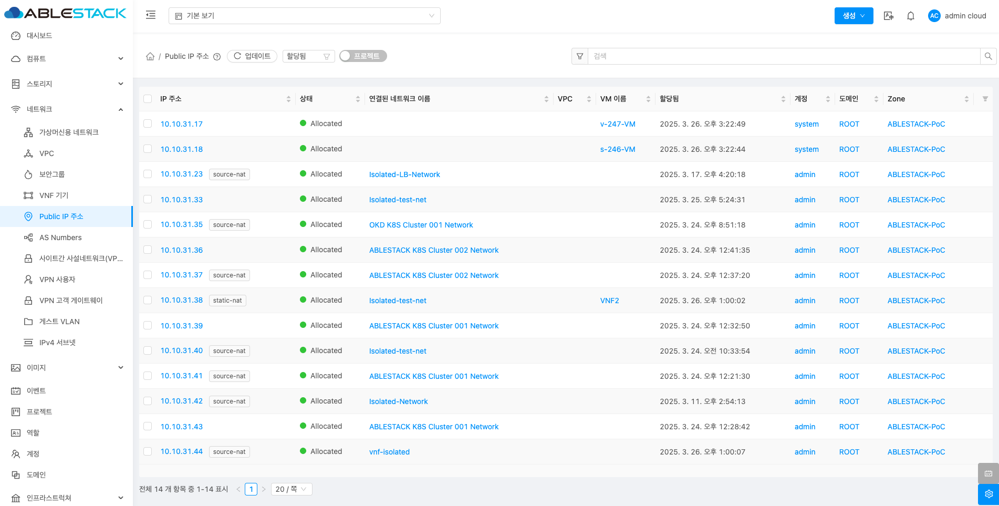

# Public IP 주소

## 개요
ABLESTACK 인프라에서 외부와의 통신을 가능하게 하는 고유한 IP 주소입니다. 이를 통해 외부에서 ABLESTACK 인프라 내 가상 머신이나 서비스에 접근할 수 있습니다. 웹 서버나 애플리케이션 서버 등 외부 연결이 필요한 자원에 할당되어, 외부 사용자가 해당 자원에 접속할 수 있도록 합니다.

## 목록 조회

1. Public IP 주소의 목록을 확인할 수 있습니다.
    Zone에 Public IP 주소의 할당 상태, 사용중인 가상머신 등의 다양한 정보를 확인할 수 있습니다.
    { align=center }