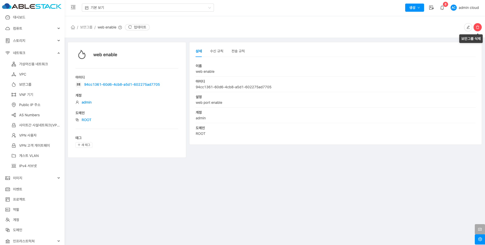
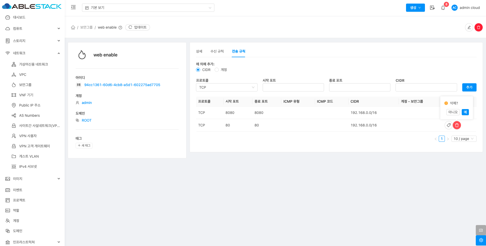

# 보안그룹

## 개요
보안 그룹은 인스턴스로의 트래픽을 격리할 수 있는 방법을 제공합니다. 보안 그룹은 인스턴스 그룹으로, 수신 및 송신 규칙(인그레스 및 이그레스 규칙)에 따라 트래픽을 필터링합니다. 이 규칙들은 가상머신과 통신하려는 IP 주소에 따라 네트워크 트래픽을 필터링합니다.

## 목록 조회

1. 보안 그룹 목록을 확인하는 화면입니다.
    생성된 보안 그룹 목록을 확인하거나 보안그룹 추가 버튼을 클릭하여 보안그룹를 생성할 수 있습니다.
    { .imgCenter .imgBorder }

## 보안 그룹 추가

1. 보안그룹 추가 버튼 클릭 하여 보안그룹 추가 팝업을 호출합니다.

    { .imgCenter .imgBorder }

    * **보안 그룹 추가** 버튼을 클릭하여 보안그룹 추가 화면을 호출합니다.

2. 보안그룹 추가를 위한 항목을 입력합니다.
    { .imgCenter .imgBorder }
    * **이름:** 이름을 입력합니다.
    * **설명:** 설명을 입력합니다.
    * **확인** 버튼을 클릭하여 보안그룹을 생성합니다.

## 편집

1. 해당 보안 그룹의 정보를 업데이트합니다.

    { .imgCenter .imgBorder }

    * **편집** 버튼을 클릭하여 보안 그룹 편집 화면을 호출합니다.

    { .imgCenter .imgBorder }

    * 수정할 **항목** 을 입력합니다.
    * **확인** 버튼을 클릭하여 보안 그룹을 편집 합니다.

## 보안그룹 삭제

1. 보안 그룹을 삭제합니다.

    { .imgCenter .imgBorder }

    * **보안그룹 삭제** 버튼을 클릭하여 보안그룹 삭제 화면을 호출합니다.

    { .imgCenter .imgBorder }

    * **확인** 버튼을 클릭하여 보안그룹을 삭제합니다.

## 상세 탭

1. 보안그룹에 대한 상세정보를 조회하는 화면입니다. 해당 보안그룹의 이름, ID, 설명, 계정, 도메인 등의 정보를 확인할 수 있습니다.

    { .imgCenter .imgBorder }

## 수신 규칙 탭

1. 보안 그룹에 대한 수신 규칙을 조회 및 관리하는 화면입니다. 해당 보안 그룹의 프로토콜, 시작 포트, 종료 포트, CIDR 등의 정보를 확인할 수 있습니다.

    { .imgCenter .imgBorder }

### 수신 규칙 추가

1. 수신 규칙 추가를 위한 정보를 입력 추가합니다.

    { .imgCenter .imgBorder }

    * **프로토콜:** 프로토콜을 선택합니다.
    * **시작 포트:** 시작 포트을 입력합니다.
    * **종료 포트:** 종료 포트를 입력합니다.
    * **CIDR:** CIDR를 입력합니다.
    * **추가** 버튼을 클릭하여 수신 규칙을 추가합니다.

### 수신 규칙 삭제

1. 수신 규칙을 삭제하는 기능입니다.

    { .imgCenter .imgBorder }

    * **삭제** 버튼을 클릭하여 삭제 컨펌 모달을 호출합니다.

    { .imgCenter .imgBorder }

    * **예** 버튼을 클릭하여 수신 규칙을 삭제합니다.

## 전송 규칙 탭

1. 보안 그룹에 대한 전송 규칙을 조회 및 관리하는 화면입니다. 해당 보안 그룹의 프로토콜, 시작 포트, 종료 포트, ICMP 유형, ICMP 코드, CIDR 등의 정보를 확인할 수 있습니다.

    { .imgCenter .imgBorder }

### 전송 규칙 추가

1. 전송 규칙 추가를 위한 정보를 입력 추가합니다.

    { .imgCenter .imgBorder }

    * **프로토콜:** 프로토콜을 선택합니다.
    * **시작 포트:** 시작 포트을 입력합니다.
    * **종료 포트:** 종료 포트를 입력합니다.
    * **CIDR:** CIDR를 입력합니다.
    * **추가** 버튼을 클릭하여 전송 규칙을 추가합니다.

### 전송 규칙 삭제

1. 전송 규칙을 삭제하는 기능입니다.

    { .imgCenter .imgBorder }

    * **삭제** 버튼을 클릭하여 삭제 컨펌 모달을 호출합니다.

    { .imgCenter .imgBorder }

    * **예** 버튼을 클릭하여 전송 규칙을 삭제합니다.
