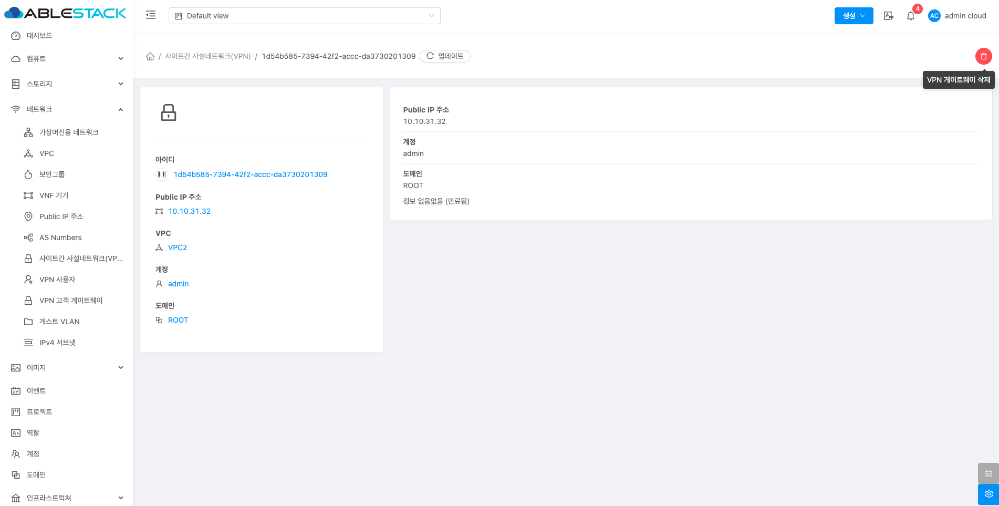

# 사이트간 사설네트워크(VPN)

## 개요
Site-to-site VPN은 고객의 데이터 센터와 ABLESTACK 클라우드 인프라 간에 안전한 연결을 만들어 줍니다. 이를 통해 데이터 센터의 장치에서 VPN을 이용해 ABLESTACK 클라우드의 가상 라우터와 연결하고 그 안의 가상머신에 접근할 수 있습니다. 또한 두 개의 VPC나 고가용성 영역 간에 안전한 연결을 설정할 수 있어 개별 VM에 직접 연결할 필요가 없습니다. 원격 VPN과의 차이점은 Site-to-site VPN이 전체 네트워크를 연결한다는 점이며, 각 호스트는 VPN 클라이언트 없이 VPN 게이트웨이를 통해 데이터를 주고받습니다.

## 목록 조회

1. Site-to-site VPN 목록을 확인하는 화면입니다.
    생성된 Site-to-site VPN 목록을 확인하거나 VPN 게이트웨이 추가 버튼을 클릭하여 Site-to-site VPN을 생성할 수 있습니다.
    { .imgCenter .imgBorder }

## VPN 게이트웨이 추가

1. VPN 게이트웨이 추가 버튼 클릭 하여 VPN 게이트웨이 추가 화면을 호출합니다.

    { .imgCenter .imgBorder }

    * **VPN 게이트웨이 추가** 버튼을 클릭하여 VPN 게이트웨이 추가 화면을 호출합니다.

2. VPN 게이트웨이 추가를 위한 항목을 입력합니다.
    { .imgCenter .imgBorder }

    * **VPC:** VPC를 선택합니다.
    * **확인** 버튼을 클릭하여 VPN 게이트웨이를 생성합니다.

## VPN 게이트웨이 삭제

1. VPN 게이트웨이를 삭제할 수 있습니다.

    { .imgCenter .imgBorder }

    * **VPN 게이트웨이 삭제** 버튼을 클릭하여 VPN 게이트웨이 삭제 화면을 호출합니다.

    { .imgCenter .imgBorder }

    * **확인** 버튼을 클릭하여 VPN 게이트웨이를 삭제합니다.

## 상세 탭

1. VPN 게이트웨이에 대한 상세정보를 조회하는 화면입니다. 해당 VPN의 Public IP 주소, 계정, 도메인 등의 정보를 확인할 수 있습니다.

    { .imgCenter .imgBorder }
