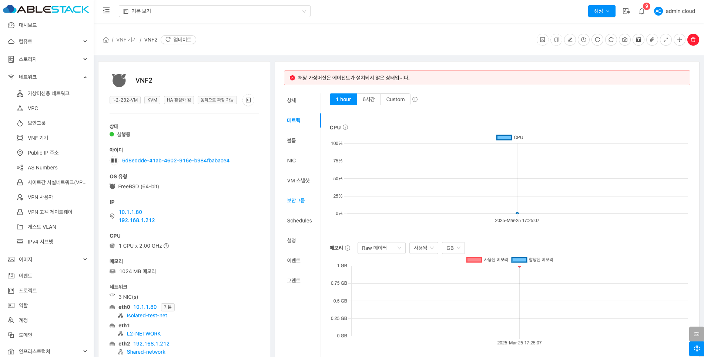
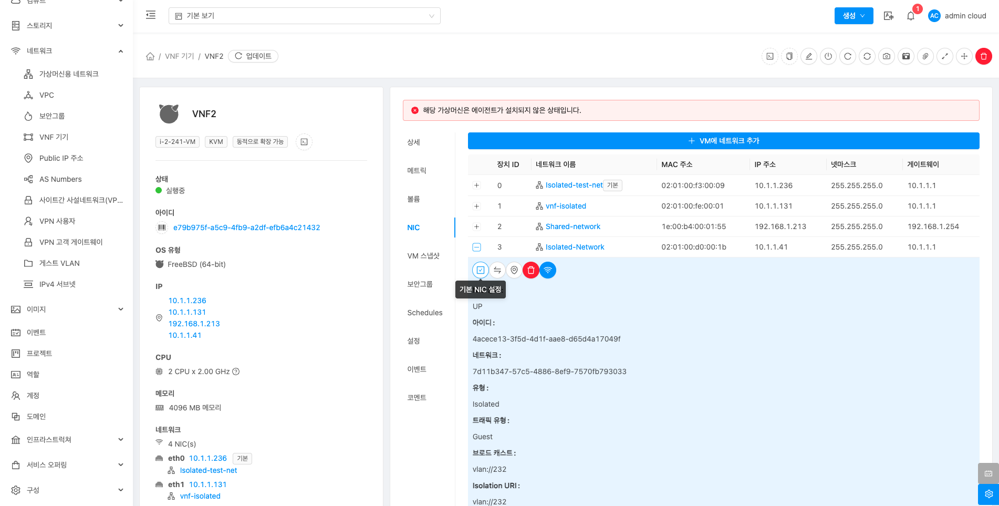
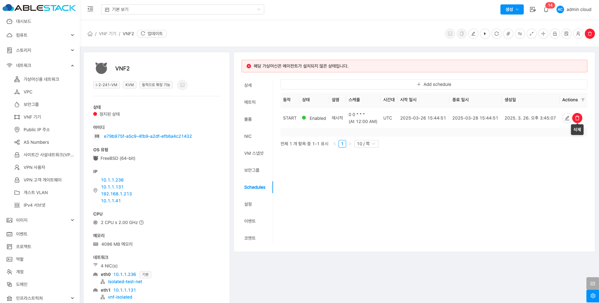

# VNF 기기

## 개요
사용자는 VNF 템플릿을 이용해 VNF 어플라이언스를 배포할 수 있으며, 템플릿에는 네트워크 NIC를 지정하고 장치 액세스 정보를 저장하는 기능이 포함됩니다. 이로써 가상 라우터(VR) 대신 VNF를 통해 네트워크 서비스를 유연하게 관리하고 제공할 수 있습니다.

## 목록 조회

1. VNF 목록을 확인하는 화면입니다.
    생성된 VNF 목록을 확인하거나 VNF 어플라이언스 추가 버튼을 클릭하여 VNF를 생성할 수 있습니다.
    { align=center }

## VNF 어플라이언스 추가

1. VNF 어플라이언스 추가 버튼 클릭 하여 VNF 어플라이언스 추가 팝업을 호출합니다.

    { align=center }

    * **VNF 어플라이언스 추가** 버튼을 클릭하여 VNF 어플라이언스 추가 화면을 호출합니다.

2. VNF 어플라이언스 추가를 위한 항목을 입력합니다.
    { align=center }

    * **Zone** 을 선택합니다.
    * **템플릿** 을 선택합니다.

    { align=center }

    * **컴퓨트 오피링** 을 선택합니다.

    { align=center }

    * **네트워크** 를 선택합니다.

    { align=center }

    * **VNF NIC 매핑** 값을 장치에 따라 선택합니다.

    { align=center }

    * **이름** 을 입력합니다.
    * **VNF 어플라이언스 실행** 버튼을 클릭하여 VNF를 생성합니다.

## 상세 탭

1. VNF에 대한 상세정보를 조회하는 화면입니다. 해당 VNF의 이름, 이름 표시, 아이디, 상태, IP 주소, 템플릿, OS 유형, 컴퓨트 오퍼링, 동적으로 확장 가능, HA 활성화 됨, 하이퍼바이저, 계정, 도메인, Zone, 제어 영역 상태 등의 정보를 확인할 수 있습니다.

    { align=center }

## 메트릭 탭

1. VNF 어플라이언스에 대한 메트릭 정보를 조회하는 화면입니다. 해당 VNF의 CPU, 메모리, 디스크, 네트워크 등의 사용량 정보를 확인할 수 있습니다.

    { align=center }

## 볼륨 탭

1. VNF 어플라이언스에 대한 볼륨을 조회 및 관리하는 화면입니다. 해당 VNF의 볼륨에 대한 이름, 상태, 유형, 크기, 스토리지 등의 정보를 확인할 수 있습니다.

    { align=center }

### 볼륨 생성 및 추가

1. VNF 어플라이언스에 볼륨을 추가하는 기능입니다.

    { align=center }

    * **볼륨 생성 및 추가** 버튼을 클릭하여 볼륨 생성 및 추가 화면을 호출합니다.

    { align=center }

    * **소유자 유형** 을 선택합니다.
    * **도메인** 을 선택합니다.
    * **계정** 을 선택합니다.
    * **이름** 을 입력합니다.
    * **Zone** 을 선택합니다.
    * **디스크 오퍼링** 을 선택합니다.
    * **크기** 를 입력합니다.
    * **확인** 버튼을 클릭하여 볼륨을 추가하고 가상머신에 연결합니다.

## NIC 탭

1. VNF 어플라이언스에 대한 NIC를 조회 및 관리하는 화면입니다. 해당 VNF의 연결된 NIC의 장치ID, 네트워크 이름, MAC 주소, IP 주소, 넷마스크, 게이트웨이 등의 정보를 확인할 수 있습니다.

    { align=center }

### NIC 생성 및 추가

1. VNF 어플라이언스에 NIC을 추가하는 기능입니다.

    { align=center }

    * **NIC 생성 및 추가** 버튼을 클릭하여 NIC 생성 및 추가 화면을 호출합니다.

    { align=center }

    * **네트워크** 를 선택합니다
    * **확인** 버튼을 클릭하여 가상머신에 네크워크를 연결합니다.

### 기본 NIC 설정

1. 선택한 NIC를 기본 장치로 설정하는 기능입니다.

    { align=center }

    * **기본 NIC 설정** 버튼을 클릭하여 기본 NIC 설정 모달 화면을 호출합니다.

    { align=center }

    * **예** 버튼을 클릭하여 기본 NIC로 설정합니다.

### 기본 NIC 설정

1. 선택한 NIC를 기본 장치로 설정하는 기능입니다.

    { align=center }

    * **기본 NIC 설정** 버튼을 클릭하여 기본 NIC 설정 모달 화면을 호출합니다.

    { align=center }

    * **예** 버튼을 클릭하여 기본 NIC로 설정합니다.

### IP 주소 변경

1. 선택한 NIC의 IP 주소를 변경하는 기능입니다.

    { align=center }

    * **IP 주소 변경** 버튼을 클릭하여 NIC의 IP 주소 변경 화면을 호출합니다.

    { align=center }

    * **IP 주소** 를 입력합니다
    * **확인** 버튼을 클릭하여 NIC의 IP 주소를 설정합니다. (가상머신이 정지된 상태에서 변경 가능)

### 보조 IP 편집

1. 선택한 NIC의 보조 IP 주소를 설정는 기능입니다.

    { align=center }

    * **보조 IP 편집** 버튼을 클릭하여 NIC의 새 보조 IP 주소 가져오기 화면을 호출합니다.

    { align=center }

    * **IP 주소** 를 입력합니다
    * **보조 IP 추가** 버튼을 클릭하여 NIC의 새로운 보조 IP 주소를 설정합니다.

### NIC 제거

1. 선택한 NIC를 제거하는 기능입니다.

    { align=center }

    * **NIC 제거** 버튼을 클릭하여 NIC 삭제 모달 화면을 호출합니다.

    { align=center }

    * **예** 버튼을 클릭하여 NIC 삭제합니다.

### NIC 상태변경

1. 선택한 NIC를 상태를 Up 또는 Down로 변경하는 기능입니다.

    { align=center }

    * **NIC 제거** 버튼을 클릭하여 NIC 상태 변경 모달 화면을 호출합니다.

    { align=center }

    * **예** 버튼을 클릭하여 NIC를 Down 상태로 변경합니다. (NIC 상태가 Up 인경우 활성화)

    { align=center }

    * **예** 버튼을 클릭하여 NIC를 Up 상태로 변경합니다. (NIC 상태가 Down 인경우 활성화)

## VM 스냅샷 탭

1. VNF 어플라이언스에 대한 VM 스냅샷을 조회하는 화면입니다. 해당 VNF의 VM 스냅샷 이름 표시, 상태, 유형, 생성일 등의 정보를 확인할 수 있습니다.

    { align=center }

    * VNF VM 스냅샷 목록을 확인할 수 있습니다.

## 보안그룹 탭

1. VNF 어플라이언스에 대한 보안 그룹을 조회 및 관리하는 화면입니다. 해당 VNF의 보안 그룹의 이름, 설명 등의 정보를 확인할 수 있습니다.

    { align=center }

    * VNF 보안 그룹 목록을 확인할 수 있습니다.

## Schedules 탭

1. VNF 어플라이언스에 시작, 정지, 재시작, 강제정지, 강제 재시작 등 동작에 대한 조회 및 관리하는 화면입니다. 해당 VNF의 스캐줄 관련 동작, 상태, 설명, 스케줄, 시간대, 시작 일시, 종료 일시, 생성일, Actions 등의 정보를 확인할 수 있습니다.

    { align=center }

### Schedules 추가

1. VNF 어플라이언스에 스케줄을 추가하는 기능입니다.

    { align=center }

    * **Add schedule** 버튼을 클릭하여 스케줄 추가 화면을 호출합니다.

    { align=center }

    * **설명** 을 입력합니다
    * **동작** 을 선택합니다
    * **시간대** 를 선택합니다
    * **시작 일시** 를 선택합니다
    * **종료 일시** 를 선택합니다
    * **스케줄** 을 선택합니다
    * **OK** 버튼을 클릭하여 스케줄을 등록합니다.

### Schedules 편집

1. VNF 어플라이언스에 스케줄을 편집하는 기능입니다.

    { align=center }

    * **편집** 버튼을 클릭하여 스케줄 편집 화면을 호출합니다.

    { align=center }

    * 수정할 **항목** 을 입력합니다.
    * **확인** 버튼을 클릭하여 스케줄을 편집 합니다.

### Schedules 삭제

1. VNF 어플라이언스에 스케줄을 삭제하는 기능입니다.

    { align=center }

    * **삭제** 버튼을 클릭하여 스케줄을 삭제합니다.

## 설정 탭

1. VNF 어플라이언스에 설정을 조회 및 관리하는 화면입니다.

    { align=center }

### 설정 추가

1. VNF 어플라이언스에 설정을 추가하는 기능입니다.

    { align=center }

    * **+ 설정 추가** 버튼을 클릭하여 설정 추가 화면을 호출합니다.

    { align=center }

    * **이름** 을 선택 및 입력합니다.
    * **값** 을 선택 및 입력합니다.
    * **설정 추가** 버튼을 클릭하여 설정을 등록합니다.

### 설정 편집

1. VNF 어플라이언스에 설정을 편집하는 기능입니다.

    { align=center }

    * **+ 설정 편집** 버튼을 클릭하여 설정 편집 화면을 호출합니다.

    { align=center }

    * 수정할 **항목** 을 입력합니다.
    * **확인** 버튼을 클릭하여 설정을 편집합니다.

### 설정 삭제

1. VNF 어플라이언스에 설정을 삭제하는 기능입니다.

    { align=center }

    * **+ 삭제** 버튼을 클릭하여 설정 삭제 모달을 호출합니다.

    { align=center }

    * **예** 버튼을 클릭하여 설정을 삭제합니다.

## 이벤트 탭

1. VNF 어플라이언스에 관련된 이벤트 정보를 확인할 수 있는 화면입니다. 네트워크에서 발생한 다양한 액션과 변경 사항을 쉽게 파악할 수 있습니다.

    { align=center }

## 코멘트 탭

1. VNF 어플라이언스에 관련된 코멘트 정보를 확인하는 화면입니다. 각 사용자별로 해당 네트워크에 대한 코멘트 정보를 조회 및 관리할 수 있니다.

    { align=center }

## 콘솔 보기

1. VNF 어플라이언스의 콘솔에 접근할 수 있습니다.

    { align=center }

    * **콘솔 보기** 버튼을 클릭하여 VNF 어플라이언스 콘솔 화면을 호출합니다.

    { align=center }

    * 콘솔에서 해당 가상머신을 조작할 수 있습니다.

## 클립보드에 콘솔 URL 복사

1. VNF 어플라이언스의 콘솔에 접근할 수 있는 URL 복사할 수 있습니다.

    { align=center }

## VNF 기기 편집

1. VNF 어플라이언스의 VNF 기기 정보를 편집할 수 있습니다.

    { align=center }

    * **VNF 기기 편집** 버튼을 클릭하여 VNF 기기 편집 화면을 호출합니다.

    { align=center }

    * 수정할 **항목** 을 입력합니다.
    * **확인** 버튼을 클릭하여 VNF 기기 정보를 업데이트 합니다.

## VNF 어플라이언스 중지

1. VNF 어플라이언스의 VNF 어플라이언스를 정지할 수 있습니다.

    { align=center }

    * **VNF 어플라이언스 중지** 버튼을 클릭하여 VNF 어플라이언스 중지 화면을 호출합니다.

    { align=center }

    * **확인** 버튼을 클릭하여 VNF 어플라이언스를 중지합니다.

## VNF 기기 재시작

1. VNF 어플라이언스의 VNF 기기를 재시작할 수 있습니다.

    { align=center }

    * **VNF 기기 재시작** 버튼을 클릭하여 VNF 어플라이언스 재시작 화면을 호출합니다.

    { align=center }

    * **확인** 버튼을 클릭하여 VNF 어플라이언스를 재시작합니다.

## VNF 기기 다시 설치

1. VNF 어플라이언스의 VNF 기기를 재설치할 수 있습니다.

    { align=center }

    * **VNF 기기 재설치** 버튼을 클릭하여 VNF 기기 재설치 화면을 호출합니다.

    { align=center }

    * **템플릿 선택** 을 선택합니다.
    * **확인** 버튼을 클릭하여 VNF 기기를 재설치합니다.

## VM 스냅샷 생성

1. VNF 어플라이언스의 VNF 기기 VM 스냅샷을 생성할 수 있습니다.

    { align=center }

    * **VM 스냅샷 생성** 버튼을 클릭하여 VM 스냅샷 생성 화면을 호출합니다.

    { align=center }

    * **이름** 을 입력합니다.
    * **설명** 을 입력합니다.
    * **확인** 버튼을 클릭하여 VNF 기기의 VM 스냅샷을 생성합니다.

## VM 볼륨 스냅샷 생성

1. VNF 어플라이언스의 VNF VM 볼륨 스냅샷을 생성할 수 있습니다.

    { align=center }

    * **VM 볼륨 스냅샷 생성** 버튼을 클릭하여 VM 스냅샷 생성 화면을 호출합니다.

    { align=center }

    * **볼륨** 을 선택합니다.
    * **이름** 을 입력합니다.
    * **확인** 버튼을 클릭하여 VNF 기기의 VM 볼륨 스냅샷을 생성합니다.

## ISO 연결

1. VNF 어플라이언스에 ISO를 연결할 수 있습니다.

    { align=center }

    * **ISO 연결** 버튼을 클릭하여 ISO 연결 화면을 호출합니다.

    { align=center }

    * **ISO 이름** 을 선택합니다.
    * **확인** 버튼을 클릭하여 VNF 기기에 ISO를 연결합니다.

## VNF 어플라이언스 확장

1. VNF 어플라이언스의 컴퓨트 오퍼링을 변경할 수 있습니다.

    { align=center }

    * **VNF 어플라이언스 확장** 버튼을 클릭하여 VNF 어플라이언스 확장 화면을 호출합니다.

    { align=center }

    * **컴퓨트 오퍼링을** 을 선택합니다.
    * **확인** 버튼을 클릭하여 VNF 기기의 컴퓨트 오퍼링을 변경합니다.

## VNF 어플라이언스를 다른 호스트로 마이그레이션

1. VNF 어플라이언스를 다른 호스트로 마이그레이션할 수 있습니다.

    { align=center }

    * **VNF 어플라이언스를 다른 호스트로 마이그레이션** 버튼을 클릭하여 마이그레이션 화면을 호출합니다.

    { align=center }

    * **호스트** 를 선택합니다.
    * **확인** 버튼을 클릭하여 VNF 기기를 다른 호스트로 마이그레이션합니다.

## VNF 기기 파괴

1. VNF 기기를 파괴할 수 있습니다.

    { align=center }

    * **VNF 기기 파괴** 버튼을 클릭하여 VNF 기기 파괴 화면을 호출합니다.

    { align=center }

    * **확인** 버튼을 클릭하여 VNF 기기를 파괴합니다.
