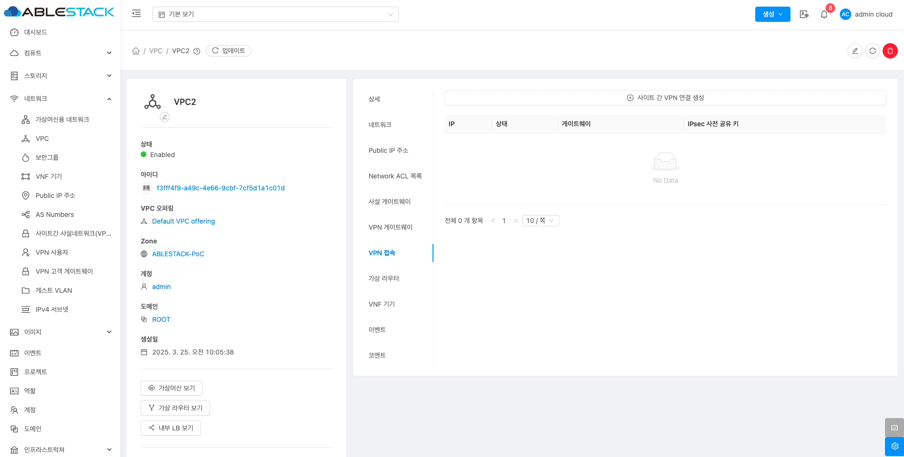

# VPC

## 개요
VPC(Virtual Private Cloud)는 ABLESTACK 내에서 독립적이고 격리된 네트워크 영역입니다. VPC는 전통적인 물리적 네트워크처럼 구성할 수 있는 가상 네트워크 구조를 제공합니다. 이를 통해 원하는 IP 주소 범위 내에서 프라이빗 주소를 가진 인스턴스를 실행할 수 있습니다. 또한, VPC 내에서 네트워크 계층(Network Tiers)을 설정하여, IP 주소 범위에 따라 비슷한 종류의 인스턴스를 그룹화할 수 있습니다.

## 목록 조회

1. VPC 목록을 확인하는 화면입니다.
    생성된 VPC 목록을 확인하거나 VPC 추가 버튼을 클릭하여 VPC를 생성할 수 있습니다.
    { align=center }

## VPC 추가

1. VPC 추가 버튼 클릭 하여 VPC 추가 팝업을 호출합니다.
    { align=center }

2. VPC 추가를 위한 항목을 입력합니다.
    { align=center }
    * **이름:** 이름을 입력합니다.
    * **설명:** 설명을 입력합니다.
    * **Zone:** Zone을 선택합니다.
    * **소유자 유형:** 소유자 유형을 선택합니다.
    * **도메인:** 도메인을 선택합니다.
    * **계정:** 계정을 선택합니다.
    * **CIDR:** CIDR를 입력합니다.
    * **VPC 오퍼링:** VPC 오퍼링을 선택합니다.
    * **확인** 버튼을 클릭하여 VPC를 생성합니다.

## 편집

1. 해당 VPC의 정보를 업데이트합니다.

    { align=center }

    * **편집** 버튼을 클릭하여 VPC 편집 화면을 호출합니다.

    { align=center }

    * 수정할 **항목** 을 입력합니다.
    * **확인** 버튼을 클릭하여 VPC를 편집 합니다.

## VPC 재시작

1. VPC를 재시작합니다.

    { align=center }

    * **VPC 재시작** 버튼을 클릭하여 VPC 재시작 화면을 호출합니다.

    { align=center }

    * **확인** 버튼을 클릭하여 VPC을 재시작합니다.

## VPC 삭제

1. VPC를 삭제합니다.

    { align=center }

    * **VPC 삭제** 버튼을 클릭하여 VPC 삭제 화면을 호출합니다.

    { align=center }

    * **확인** 버튼을 클릭하여 VPC을 삭제합니다.

## 상세 탭

1. VPC에 대한 상세정보를 조회하는 화면입니다. 해당 VPC의 이름, 아이디, 설명, CIDR, 네트워크 도메인, Redundant VPC, 재시작 필요, Zone, 계정, 도메인, Public 인터페이스 MTU 등의 정보를 확인할 수 있습니다.

    { align=center }

## 네트워크 탭

1. VPC에 대한 서브 네트워크를 조회 및 관리하는 화면입니다. 해당 네트워크의 서브넷 이름, 상태, CIDR, ACL 등의 정보를 확인할 수 있습니다.

    { align=center }

### 새 서브넷 추가

1. VPC의 새 서브넷 추가 버튼을 클릭하여 새 서브넷 추가 화면으로 이동합니다.

    { align=center }

2. VPC의 새 서브넷 추가 버튼을 클릭하여 새 서브넷 추가 화면으로 이동합니다.
    
    { align=center }

    * **이름:** 이름을 입력합니다.
    * **네트워크 오퍼링:** 네트워크 오퍼링을 선택합니다.
    * **게이트웨이:** 게이트웨이를 입력합니다.
    * **넷마스크:** 넷마스크를 입력합니다.
    * **ACL:** ACL을 입력합니다.
    * **확인** 버튼을 클릭하여 새 서브넷을 추가합니다.

### 새 서브넷 가상머신 추가

1. 가상머신 추가 버튼을 클릭하여 가상머신 생성 화면으로 이동

    { align=center }

2. 가상머신 생성에 필요한 값을 입력합니다.

    { align=center }

    * **이름:** 이름을 입력합니다.
    * **소유자 유형:** 소유자 유형을 선택합니다.
    * **도메인:** 도메인을 선택합니다.
    * **계정:** 계정을 선택합니다.
    * **Zone:** Zone을 선택합니다.
    * **Pod:** Pod를 선택합니다.
    * **클러스터:** 클러스터를 선택합니다.
    * **호스트:** 호스트를 선택합니다.
    
    { align=center }
    
    * **템플릿:** 템플릿을 선택합니다.

    { align=center }

    * **컴퓨트 오퍼링:** 컴퓨트 오퍼링을 선택합니다.

    { align=center }

    * **데이터 디스크:** 데이터 디스크를 선택합니다.
    * **네트워크:** 네트워크를 선택합니다.

    { align=center }

    * **SSH 키 쌍:** SSH 키 쌍을 선택합니다. (필요시)
    * **부팅 유형:** 부팅 유형을 선택합니다.
    * **부팅 모드:** 부팅 모드를 선택합니다.
    * **TPM 활성화:** TPM 활성화를 선택합니다.

    { align=center }

    * **이름:** 이름을 입력합니다
    * **VM 시작** 버튼을 클릭하여 새 서브넷에 가상머신을 추가합니다.

### 내부 LB 추가

1. VPC의 새 서브넷에 내부 LB 추가 버튼을 클릭하여 내부 LB 추가 화면을 호출합니다.

    { align=center }

2. 내부 LB 추가에 필요한 값을 입력합니다.
    
    { align=center }

    * **이름:** 이름을 입력합니다.
    * **설명:** 설명을 입력합니다.
    * **Source IP 주소:** Source IP 주소를 입력합니다.
    * **Source 포트:** Source 포트를 입력합니다.
    * **가상머신 포트:** 가상머신 포트를 입력합니다.
    * **알고리즘:** 알고리즘을 선택합니다.
    * **확인** 버튼을 클릭하여 내부 LB 추가합니다.

## Public IP 주소 탭

1. VPC에 대한 서브 네트워크를 조회 및 관리하는 화면입니다. 해당 Public IP 주소의 서브넷 이름, 상태, CIDR, ACL 등의 정보를 확인할 수 있습니다.

    { align=center }

### 새 IP 주소 가져오기

1. 새 IP 주소 가져오기 버튼을 클릭하여 새 IP 주소 가져오기 화면으로 이동

    { align=center }

2. 새 IP 주소 가져오기에 필요한 값을 입력합니다.

    { align=center }

    * **IP 주소:** IP 주소를 선택합니다.
    * **확인** 버튼을 클릭하여 새 IP 주소 가져오기로 Public IP를 추가합니다.

## 사설 게이트웨이 탭

1. VPC에 네트워크 사설 게이트웨이를 조회 및 관리하는 화면입니다. 해당 Network 사설 게이트웨이 목록의 IP, 상태, 게이트웨이, 넷마스크, VLAN/VNI 등의 정보를 확인할 수 있습니다.

    { align=center }

### 사설 게이트웨이 추가

1. 사설 게이트웨이 추가 버튼을 클릭하여 사설 게이트웨이 추가하기 화면으로 이동

    { align=center }

2. 사설 게이트웨이 추가에 필요한 값을 입력합니다.

    { align=center }

    * **물리 네트워크:** 물리 네트워크를 선택합니다.
    * **VLAN/VNI:** VLAN/VNI를 입력합니다.
    * **연결된 네트워크:** 연결된 네트워크를 선택합니다.
    * **Public IP 주소:** Public IP 주소를 입력합니다.
    * **게이트웨이:** 게이트웨이를 입력합니다.
    * **넷마스크:** 넷마스크를 입력합니다.
    * **ACL:** ACL을 선택합니다.
    * **확인** 버튼을 클릭하여 새 게이트웨이를 추가합니다.

## 사설 게이트웨이 탭

1. VPC에 네트워크 사설 게이트웨이를 조회 및 관리하는 화면입니다. 해당 사설 게이트웨이 목록의 IP, 상태, 게이트웨이, 넷마스크, VLAN/VNI 등의 정보를 확인할 수 있습니다.

    { align=center }

### 사설 게이트웨이 추가

1. 사설 게이트웨이 추가 버튼을 클릭하여 사설 게이트웨이 추가하기 화면으로 이동

    { align=center }

2. 사설 게이트웨이 추가에 필요한 값을 입력합니다.

    { align=center }

    * **물리 네트워크:** 물리 네트워크를 선택합니다.
    * **VLAN/VNI:** VLAN/VNI를 입력합니다.
    * **연결된 네트워크:** 연결된 네트워크를 선택합니다.
    * **Public IP 주소:** Public IP 주소를 입력합니다.
    * **게이트웨이:** 게이트웨이를 입력합니다.
    * **넷마스크:** 넷마스크를 입력합니다.
    * **ACL:** ACL을 선택합니다.
    * **확인** 버튼을 클릭하여 새 게이트웨이를 추가합니다.

## VPN 게이트웨이 탭

1. VPC에 VPN 게이트웨이를 조회 및 관리하는 화면입니다. 해당 VPN 게이트웨이 정보를 확인할 수 있습니다.

    { align=center }

### VPN 게이트웨이 추가

1. VPN 게이트웨이 추가 버튼을 클릭합니다.

    { align=center }
    
    * **사이트 간 VPN 게이트웨이 생성** 버튼을 클릭하여 VPN 게이트웨이를 추가합니다.

2. VPN 게이트웨이가 자동으로 생성됩니다.

    { align=center }

## VPN 접속 탭

1. VPC에 VPN 접속을 조회 및 관리하는 화면입니다. 해당 VPN 접속의 IP, 상태, 게이트웨이, IPsec 사전 공유 키 등의 정보를 확인할 수 있습니다.

    { align=center }

### 사이트 간 VPN 연결 생성

1. 사이트 간 VPN 연결 생성 버튼을 클릭합니다.

    { align=center }
    
    * **사이트 간 VPN 게이트웨이 생성** 버튼을 클릭하여 VPN 게이트웨이를 추가합니다.

2. 사이트 간 VPN 연결에 필요한 값을 입력합니다.

    { align=center }

    * **VPN 고객 게이트웨이:** VPN 고객 게이트웨이를 선택합니다.
    * **확인** 버튼을 클릭하여 VPN 게이트웨이를 추가합니다.

## 가상 라우터 탭

1. VPC에 대한 가상 라우터를 조회하는 화면입니다. 해당 VPC의 가상 라우터 이름, 상태, IP, 버전, 실행중인 호스트 등의 정보를 확인할 수 있습니다.

    { align=center }

## VNF 기기 탭

1. VPC에 대한 VNF 기기를 조회하는 화면입니다. 해당 VPC의 연결된 VNF 기기의 이름, 상태, IP 주소, 템플릿, OS Display 명, 실행중인 호스트 등의 정보를 확인할 수 있습니다.

    { align=center }

## 이벤트 탭

1. VPC에  관련된 이벤트 정보를 확인할 수 있는 화면입니다. VPC에서 발생한 다양한 액션과 변경 사항을 쉽게 파악할 수 있습니다.

    { align=center }

## 코멘트 탭

1. VPC 관련된 코멘트 정보를 확인하는 화면입니다. 각 사용자별로 해당 VPC에 대한 코멘트 정보를 조회 및 관리할 수 있는 화면입니다.

    { align=center }

## 용어사전

* VNI
    * VNI는 **VXLAN (Virtual Extensible LAN)** 에서 사용하는 개념으로, 물리적인 네트워크를 넘어서 여러 데이터센터나 네트워크 구간을 가상화하는 기술에서 사용됩니다. VXLAN은 대규모 데이터 센터나 클라우드 환경에서 여러 가상 네트워크를 확장하고 관리하는 데 사용됩니다.

* Public IP
    * 외부 접근 허용 목적으로 vm이나 로드 밸런서, 방화벽 등 외부에서 접근해야 하는 리소스에 대해 Public ip를 할당합니다.  클라우드 내의 VM이 외부 인터넷과 통신할 수 있게 하기 위해 사용됩니다.

* ACL
	* 네트워크 ACL(Access Control List)은 네트워크에서 트래픽의 접근을 제어하는 보안 기능입니다.
