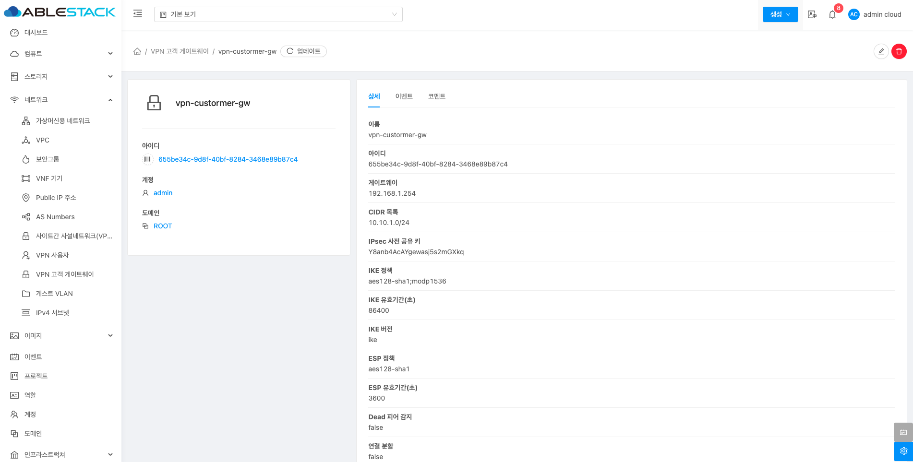

# VPN 고객 게이트웨이

## 개요
 VPN 고객 게이트웨이는 외부 네트워크와 ABLESTACk 클라우드 인프라 간의 안전한 연결을 위한 기능입니다. 이 기능을 사용하면 ABLESTACK 클라우드 가상머신이 사용자의 온프레미스 네트워크와 보안된 VPN 터널을 통해 연결할 수 있습니다. 기본적으로 VPN 고객 게이트웨이는 ABLESTACk 클라우드와 외부 네트워크 간의 IPsec VPN 연결을 설정하고 관리하는 데 사용됩니다. 이 연결은 데이터를 암호화하고 보호하여 인터넷을 통해 안전하게 데이터를 전송할 수 있도록 합니다.

## 목록 조회

1. VPN 고객 게이트웨이 목록을 확인하는 화면입니다.
    생성된 VPN 고객 게이트웨이 목록을 확인하거나 VPN 고객 게이트웨이 추가 버튼을 클릭하여 VPN 고객 게이트웨이 추가할 수 있습니다.
    { .imgCenter .imgBorder }

## VPN 고객 게이트웨이 추가

1. VPN 고객 게이트웨이 추가 버튼 클릭 하여 VPN 고객 게이트웨이 추가 화면을 호출합니다.

    { .imgCenter .imgBorder }

    * **VPN 고객 게이트웨이 추가** 버튼을 클릭하여 VPN 고객 게이트웨이 추가 화면을 호출합니다.

2. VPN 고객 게이트웨이 추가를 위한 항목을 입력합니다.
    { .imgCenter .imgBorder }

    * **이름:**이름을 입력합니다.
    * **게이트웨이:** 게이트웨이를 입력합니다.
    * **CIDR 목록:** CIDR 목록을 입력합니다.
    * **IPsec 사전 공유키:** IPsec 사전 공유키를 입력합니다.
    * **IKE 암호화:** IKE 암호화를 선택합니다.
    * **IKE 해시:** IKE 해시를 선택합니다.
    * **IKE 버전:** IKE 버전을 선택합니다.
    * **IKE DH:** IKE DH를 선택합니다.
    * **ESP 암호화:** ESP 암호화를 선택합니다.
    * **ESP 해시:** ESP 해시를 선택합니다.
    * **완벽한 순방향 비밀성:** 완벽한 순방향 비밀성을 선택합니다.
    * **IKE 유효기간(초):** IKE 유효기간(초)을 입력합니다.

    { .imgCenter .imgBorder }

    * **ESP 유효기간(초):** ESP 유효기간(초)을 입력합니다.
    * **확인** 버튼을 클릭하여 VPN 고객 게이트웨이를 생성합니다.

## 편집

1. 해당 VPC 고객 게이트웨이의 정보를 업데이트합니다.

    { .imgCenter .imgBorder }

    * **편집** 버튼을 클릭하여 VPC 고객 게이트웨이 편집 화면을 호출합니다.

    { .imgCenter .imgBorder }

    * 수정할 **항목** 을 입력합니다.
    * **확인** 버튼을 클릭하여 VPC 고객 게이트웨이를 편집 합니다.

## VPN 고객 게이트웨이 삭제

1. VPN 고객 게이트웨이을 삭제할 수 있습니다.

    { .imgCenter .imgBorder }

    * **VPN 고객 게이트웨이 삭제** 버튼을 클릭하여 VPN 고객 게이트웨이 삭제 화면을 호출합니다.

    { .imgCenter .imgBorder }

    * **확인** 버튼을 클릭하여 VPN 고객 게이트웨이를 삭제합니다.

## 상세 탭

1. VPN 고객 게이트웨이에 대한 상세정보를 조회하는 화면입니다. 해당 VPN 고객 게이트웨이의 이름, 아이디, 게이트웨이, CIDR 목록, IPsec 사전 공유 키, IKE 정책, IKE 유효시간(초), IKE 버전, ESP 정책, ESP 유효기간(초), Dead 피어 감지, 연결 분할, ESP 패킷의 UDP 캡슐화 강제, 계정, 도메인 등의 정보를 확인할 수 있습니다.

    { .imgCenter .imgBorder }

## 용어사전

* IPsec
	* IPsec은 인터넷 통신의 보안을 위한 프로토콜로 데이터 암호화와 인증을 통해 기밀성, 무결성, 인증을 보장합니다.

* IKE (Internet Key Exchange)
	* IKE는 IPsec에서 보안 연결을 설정하고 안전한 키 교환과 인증을 담당하는 프로토콜입니다.

* IKE 암호화
	* IKE 암호화는 키 교환 과정에서 데이터를 보호하는 암호화 기술로 주로 DES, 3DES, AES 등의 알고리즘을 사용합니다.

* IKE DH (Diffie-Hellman)
	* Diffie-Hellman(DH)은 두 노드 간에 안전하게 공유 비밀 키를 생성하는 공개 키 암호화 방식으로 해킹 공격을 방지합니다.

* IKE 해시
	* IKE 해시는 키 교환과 인증 과정에서 데이터 무결성을 검증하기 위해 사용되는 해시 함수로, HMAC과 SHA 알고리즘을 사용합니다.

* ESP 암호화
	* ESP는 IPsec의 암호화 프로토콜로 데이터 페이로드를 암호화하고 AES, 3DES와 같은 대칭 키 암호화 방식을 사용하여 기밀성을 제공합니다.

* ESP 해시
	* ESP 해시는 암호화된 데이터의 무결성을 확인하는 기능으로, HMAC과 SHA 알고리즘을 통해 데이터가 변조되지 않았음을 검증합니다.
