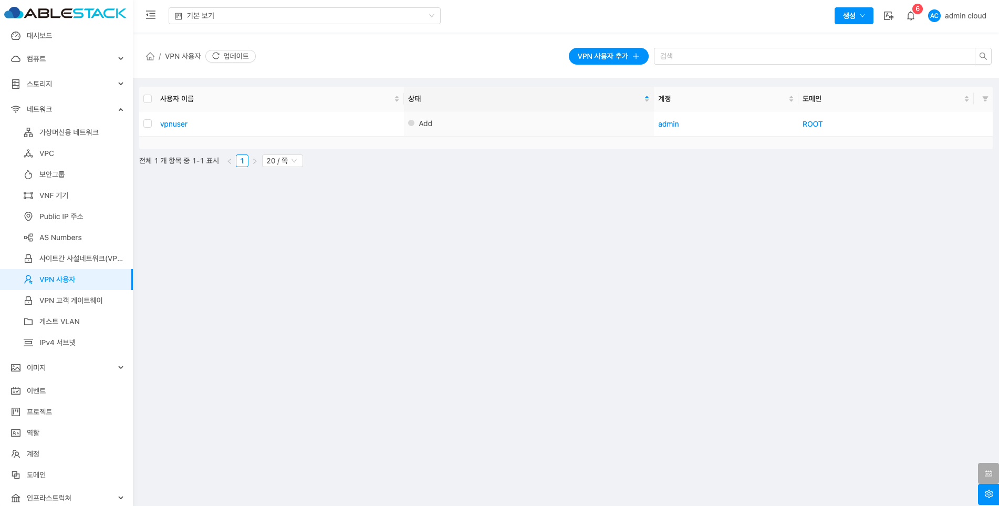
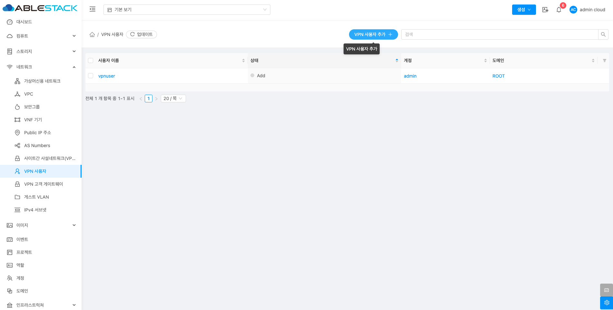
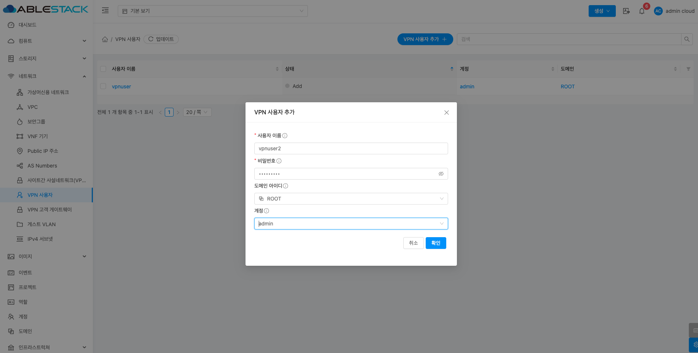
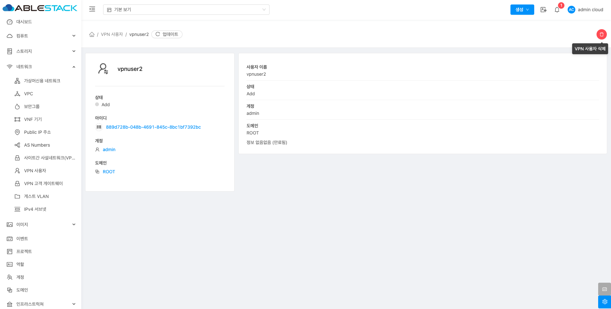
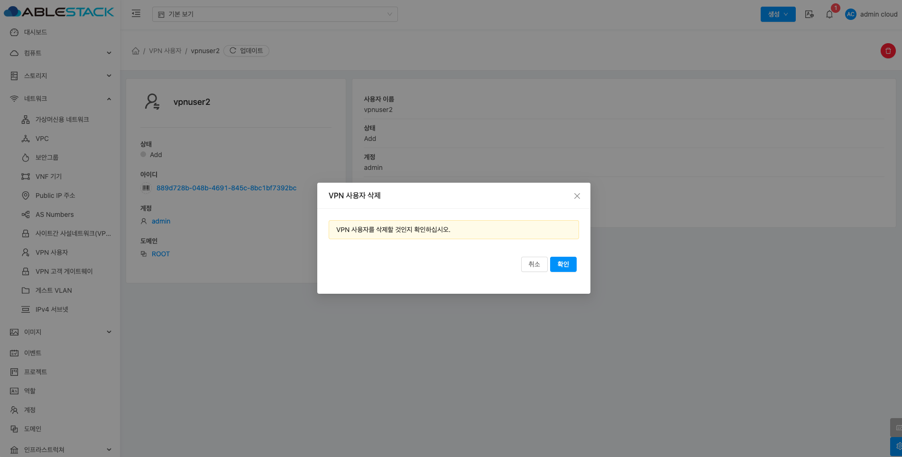
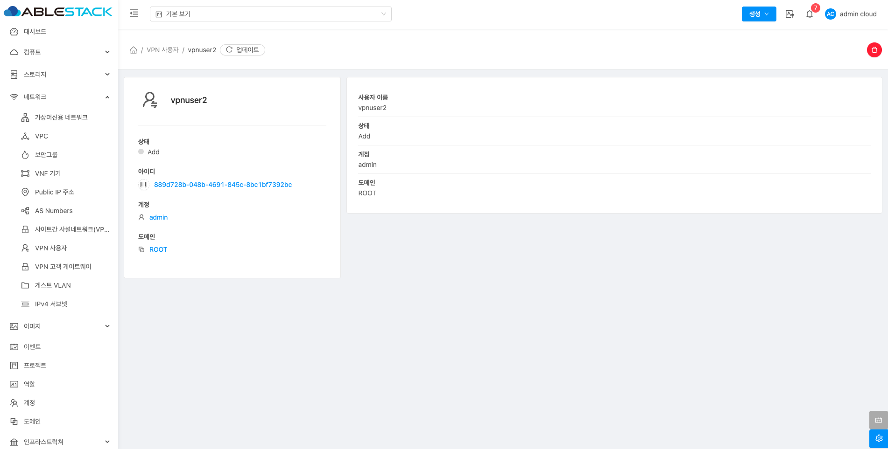

# VPN 사용자

## 개요
 VPN을 사용하여 ABLESTACK 클라우드 환경에 접근하는 사용자들을 관리하는 기능입니다. 관리자는 VPN 접속을 허용할 사용자 계정을 생성하고 계정 및 도메인을 설정할 수 있습니다.

## 목록 조회

1. VPN 사용자 목록을 확인하는 화면입니다.
    생성된 VPN 사용자 목록을 확인하거나 VPN 사용자 추가 버튼을 클릭하여 VPN 사용자 추가할 수 있습니다.
    { .imgCenter .imgBorder }

## VPN 사용자 추가

1. VPN 사용자 추가 버튼 클릭 하여 VPN 사용자 추가 화면을 호출합니다.

    { .imgCenter .imgBorder }

    * **VPN 사용자 추가** 버튼을 클릭하여 VPN 사용자 추가 화면을 호출합니다.

2. VPN 사용자 추가를 위한 항목을 입력합니다.
    { .imgCenter .imgBorder }

    * **사용자 이름:** 사용자 이름을 입력합니다.
    * **비밀번호:** 비밀번호를 입력합니다.
    * **도메인 아이디:** 도메인 아이디를 선택합니다.
    * **계정:** 계정을 선택합니다.
    * **확인** 버튼을 클릭하여 VPN 사용자를 생성합니다.

## VPN 사용자 삭제

1. VPN 사용자를 삭제할 수 있습니다.

    { .imgCenter .imgBorder }

    * **VPN 사용자 삭제** 버튼을 클릭하여 VPN 사용자 삭제 화면을 호출합니다.

    { .imgCenter .imgBorder }

    * **확인** 버튼을 클릭하여 VPN 사용자를 삭제합니다.

## 상세 탭

1. VPN 사용자에 대한 상세정보를 조회하는 화면입니다. 해당 VPN 사용자의 이름, 상태, 계정, 도메인 등의 정보를 확인할 수 있습니다.

    { .imgCenter .imgBorder }
