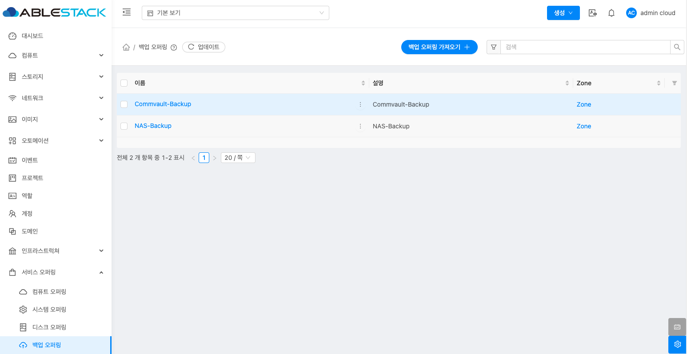
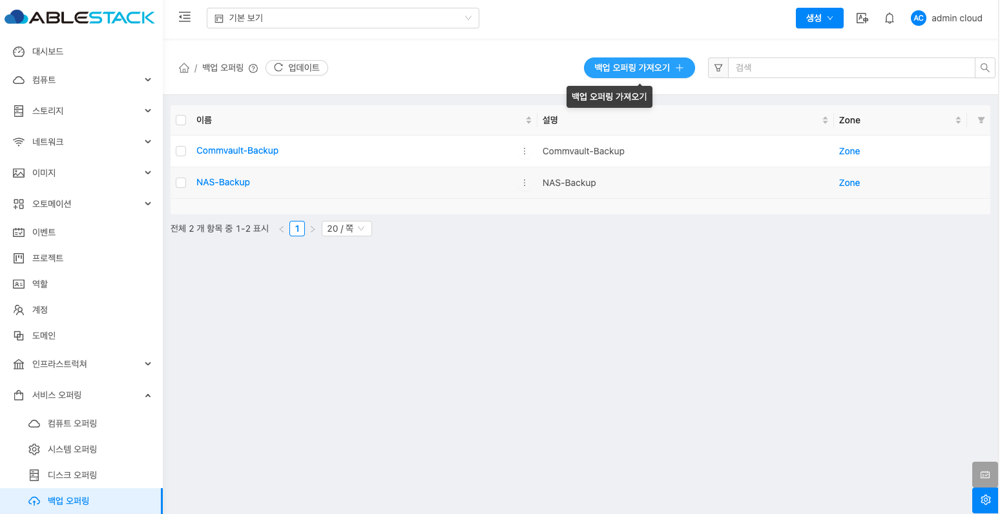
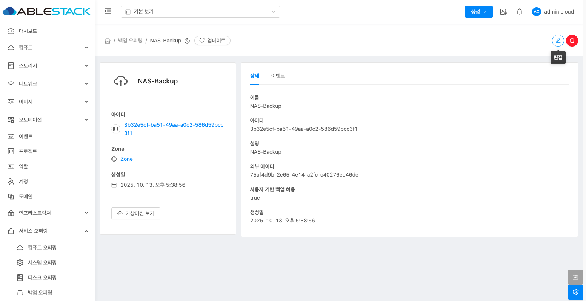
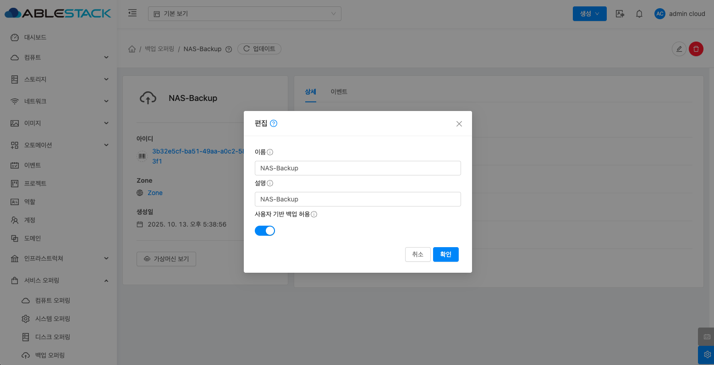
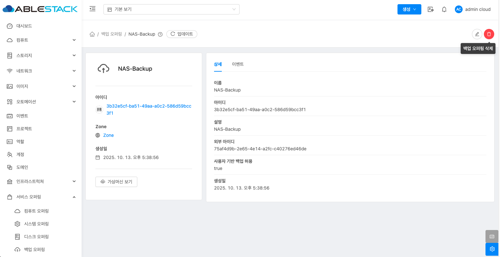
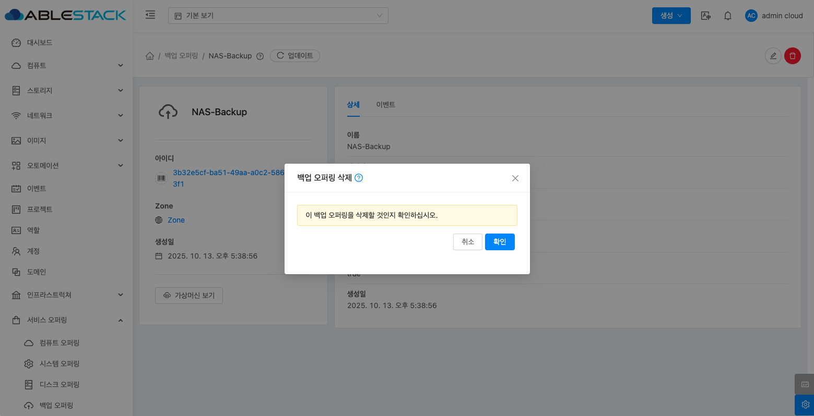
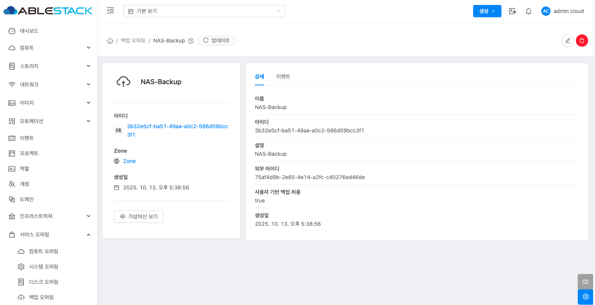

# 백업 오퍼링

## 개요
관리자는 3rd party 백업 솔루션의 백업 서비스를 가져올 수 있으며 백업 서비스의 수명 주기를 관리할 수 있습니다. 또한, 관리자는 백업 서비스에서 사용자 정의 백업 일정 및 임시 백업을 허용하는지 여부를 지정할 수 있습니다.

!!! note
    * 백업 활성화 필수: 백업 프레임워크를 활성화해야 백업 오퍼링 메뉴가 활성화됩니다. (글로벌 설정에서 backup.framework.enabled 옵션 활성화)

## 백업 오퍼링 목록 조회
1. 모든 백업 오퍼링의 목록을 확인하는 화면입니다. 생성된 백업 오퍼링 목록을 확인하거나 백업 오퍼링 가져오기 버튼을 클릭하여 백업 오퍼링을 가져올 수 있습니다.
    { .imgCenter .imgBorder }

## 백업 오퍼링 가져오기
1. 서비스 오퍼링의 백업 오퍼링에서 상단의 백업 오퍼링 가져오기 버튼을 클릭합니다.
    { .imgCenter .imgBorder }
2. 백업 오퍼링 가져오기 버튼을 클릭한 화면입니다.
    { .imgCenter .imgBorder }
    - **이름:** 이름을 입력합니다.
    - **설명:** 설명을 입력합니다.
    - **Zone:** Zone을 선택합니다.
    - **제공자:** 백업 플러그인을 선택합니다.
    - **외부 아이디:** 백업 솔루션의 정책을 선택합니다.
    - **보존 기간:** Commvault 백업 플러그인을 선택한 경우 활성화되며, 해당 정책의 보존 기간을 입력합니다.
    - **사용자 기반 백업 허용:** 사용자 정의 백업 일정 및 임시 백업을 허용하는지 여부를 선택합니다.

## 편집
1. 백업 오퍼링 상세 오른쪽 상단의 편집 버튼을 클릭합니다.
    { .imgCenter .imgBorder }
2. 편집 버튼을 클릭한 화면입니다.
    { .imgCenter .imgBorder }
    - **이름:** 이름을 입력합니다.
    - **설명:** 설명을 입력합니다.
    - **보존 기간:** Commvault 백업 오퍼링을 선택한 경우 활성화되며, 해당 백업 오퍼링의 보존 기간을 입력합니다.
    - **사용자 기반 백업 허용:** 사용자 정의 백업 일정 및 임시 백업을 허용하는지 여부를 선택합니다.

## 백업 오퍼링 삭제
1. 백업 오퍼링 상세 오른쪽 상단의 백업 오퍼링 삭제 버튼을 클릭합니다.
    { .imgCenter .imgBorder }
2. 백업 오퍼링 삭제 버튼을 클릭한 화면입니다.
    { .imgCenter .imgBorder }

## 백업 오퍼링 상세 탭
1. 백업 오퍼링 목록 조회에서 확인하고 싶은 백업 오퍼링 목록을 조회합니다. 백업 오퍼링 대한 상세 정보를 확인하는 화면입니다. 해당 백업 오퍼링에 대한 이름, 아이디 등 상세 정보를 확인할 수 있습니다.
    { .imgCenter .imgBorder }

## 백업 오퍼링 이벤트 탭
1. 백업 오퍼링 목록 조회에서 확인하고 싶은 백업 오퍼링 목록을 조회합니다. 백업 오퍼링과 관련된 이벤트 정보를 확인할 수 있는 화면입니다. 백업 오퍼링에서 발생한 다양한 액션과 변경 사항을 쉽게 파악할 수 있습니다.
    { .imgCenter .imgBorder }
