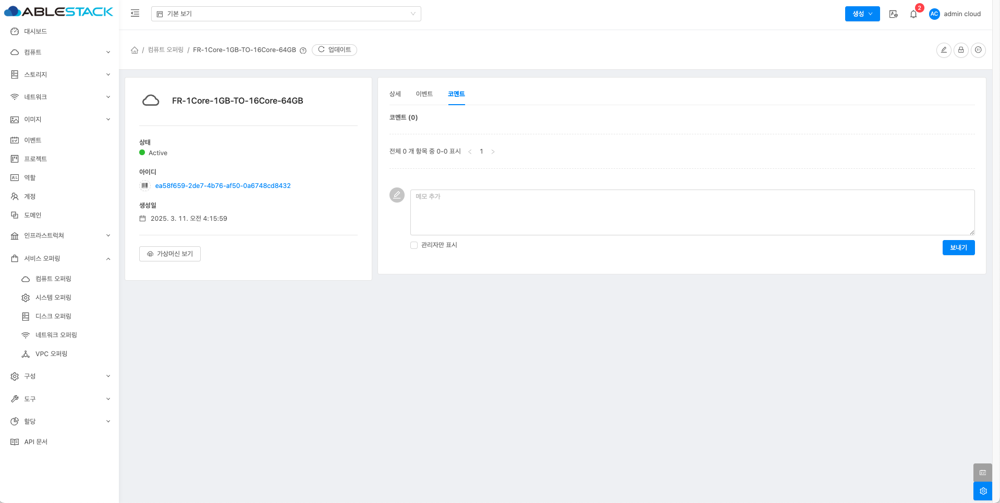

# 컴퓨트 오퍼링
!!! check
    기본 스토리지가 여러 개일 경우, 가상 머신(VM) 디스크가 특정 스토리지에 배치되도록 스토리지 태그를 설정해야 합니다.

    스토리지 태그가 없는 경우, Mold는 임의의 기본 스토리지에 디스크를 생성할 수 있습니다.

    따라서 서비스 오퍼링 및 디스크 오퍼링을 생성할 때 적절한 스토리지 태그를 지정하는 것이 중요합니다.

## 개요
컴퓨트 오퍼링은 가상 머신의 CPU, 메모리 및 기타 리소스 할당을 정의하는 템플릿입니다. 이를 통해 사용자는 특정 성능 요구 사항에 맞는 VM을 생성할 수 있습니다.

컴퓨트 오퍼링에서는 VM의 가상 CPU 개수와 RAM 크기를 지정할 수 있으며, 필요 시 리소스를 동적으로 확장할 수 있도록 설정할 수 있습니다.
또한, 로컬 또는 공유 스토리지를 선택하여 성능과 가용성을 조정할 수 있으며, 디스크 IOPS 및 네트워크 QoS를 정의하여 특정 워크로드에 맞춰 성능을 최적화할 수 있습니다.

특정 하이퍼바이저(KVM, VMware 등)에 맞춰 최적화된 옵션을 제공하며, 태그 설정을 통해 특정 호스트 또는 스토리지에 VM을 배치할 수도 있습니다.
기존 오퍼링을 편집하거나 삭제할 수 있으며, 특정 사용자 또는 프로젝트에만 할당할 수 있는 프라이빗 오퍼링도 지원합니다.

컴퓨트 오퍼링은 VM 템플릿과 함께 사용하여 표준화된 VM을 손쉽게 배포할 수 있으며, 효율적인 리소스 할당을 통해 비용을 최적화하는 데에도 도움이 됩니다.

## 컴퓨트 오퍼링 목록 조회
1. 모든 컴퓨트 오퍼링의 목록을 확인하는 화면입니다. 생성된 컴퓨트 오퍼링 목록을 확인하거나 컴퓨트 오퍼링 추가 버튼을 클릭하여 컴퓨트 오퍼링을 추가하실 수 있습니다.
    { .imgCenter .imgBorder }

    !!! info
        필터링 기준으로 컴퓨트 오퍼링 상태에 따라 목록 조회가 가능합니다.
        { .imgCenter .imgBorder }

## 컴퓨트 오퍼링 추가
1. 서비스 오퍼링의 컴퓨트 오퍼링에서 상단의 컴퓨트 오퍼링 추가 버튼을 클릭합니다.
    { .imgCenter .imgBorder }
2. 컴퓨트 오퍼링 추가 버튼을 클릭한 화면입니다.
    { .imgCenter .imgBorder }
    - **이름:** 이름을 입력합니다.
    - **설명:** 설명을 입력합니다.
    - **컴퓨트 오퍼링 유형:** 컴퓨트 오퍼링 유형을 선택합니다.
    - **CPU 코어:** CPU 코어를 입력합니다.
    - **CPU(MHz):** CPU(MHz)를 입력합니다.
    - **메모리(MB):** 메모리(MB)를 입력합니다.
    - **네트워크 속도(Mb/s):** 네트워크 속도(Mb/s)를 입력합니다.
    - **HA제공:** HA제공을 활성화합니다.
    - **공개:** 공개를 활성화합니다.
    - **컴퓨팅 전용 디스크 제공:** 컴퓨팅 전용 디스크 제공을 활성화합니다.
    { .imgCenter .imgBorder }
    - **스토리지 유형:** 스토리지 유형을 선택합니다.
    - **프로비저닝 유형:** 프로비저닝 유형을 선택합니다.
    - **압축/중복제거** 압축/중복제거가 필요할 경우, 활성화합니다.
    - **Write-cache 유형:** Write-cache 유형을 선택합니다.
    - **QoS 유형:** QoS 유형을 선택합니다.
    - **스토리지 태그:** 스토리지 태그를 입력합니다.

## 편집
1. 컴퓨트 오퍼링 상세 오른쪽 상단의 편집 버튼을 클릭합니다.
    { .imgCenter .imgBorder }
2. 편집 버튼을 클릭한 화면입니다.
    { .imgCenter .imgBorder }
    - **이름:** 이름을 입력합니다.
    - **설명:** 설명을 입력합니다.
    - **스토리지 태그:** 스토리지 태그를 입력합니다.

## 오퍼링 액세스 업데이트
1. 컴퓨트 오퍼링 상세 오른쪽 상단의 오퍼링 액세스 업데이트 버튼을 클릭합니다.
    { .imgCenter .imgBorder }
2. 오퍼링 액세스 업데이트 버튼을 클릭한 화면입니다.
    { .imgCenter .imgBorder }
    - **Zone:** Zone을 선택합니다.

## 서비스 오퍼링 비활성화
1. 컴퓨트 오퍼링 상세 오른쪽 상단의 서비스 오퍼링 비활성화 버튼을 클릭합니다.
    { .imgCenter .imgBorder }
2. 서비스 오퍼링 비활성화 버튼을 클릭한 화면입니다.
    { .imgCenter .imgBorder }

## 컴퓨트 오퍼링 상세 탭
1. 컴퓨트 오퍼링에 대한 상세 정보를 확인하는 화면입니다. 해당 컴퓨트 오퍼링에 대한 이름, 아이디, HA 제공 등 상세 정보를 확인할 수 있습니다.
    { .imgCenter .imgBorder }

## 컴퓨트 오퍼링 이벤트 탭
1. 컴퓨트 오퍼링과 관련된 이벤트 정보를 확인할 수 있는 화면입니다. 컴퓨트 오퍼링에서 발생한 다양한 액션과 변경 사항을 쉽게 파악할 수 있습니다.
    { .imgCenter .imgBorder }

## 컴퓨트 오퍼링 코멘트 탭
1. 컴퓨트 오퍼링과 관련된 코멘트 정보를 확인하는 화면입니다. 각 사용자별로 해당 컴퓨트 오퍼링에 대한 코멘트 정보를 조회 및 관리할 수 있니다.
    { .imgCenter .imgBorder }

## 용어사전
<!-- |  용어명      | 옵션 | 설명                        |
| :---------: | :-: | :----------------------------------: |
| 컴퓨트 오퍼링 유형 | 고정 오퍼링 | 사용자가 정의할 수 없음 |
|  | 사용자 정의 제한 | 설정된 매개변수 내에서 컴퓨팅 리소스를 사용자 정의할 수 있음 |
|  | 사용자 정의 제한 없음 | 사용자가 원하는 값을 설정할 수 있음 | -->
<table>
    <tr>
        <th>용어명</th>
        <th>옵션</th>
        <th>설명</th>
    </tr>
    <tr>
        <td rowspan="3">컴퓨트 오퍼링 유형</td>
        <td>고정 오퍼링</td>
        <td>사용자가 정의할 수 없음</td>
    </tr>
    <tr>
        <td>사용자 정의 제한</td>
        <td>설정된 매개변수 내에서 컴퓨팅 자원을 사용자 정의할 수 있음</td>
    </tr>
    <tr>
        <td>사용자 정의 제한 없음</td>
        <td>사용자가 원하는 값을 설정할 수 있음</td>
    </tr>
    <tr>
        <td>CPU 코어</td>
        <td></td>
        <td>이 오퍼링으로 VM에 할당해야 하는 코어 수입니다. '사용자 정의 제한'이 체크되어 있으면 관리자는 사용자가 요청할 수 있는 최소 및 최대 CPU 수를 입력하라는 메시지를 받게 됩니다. '사용자 정의 제한 없음'이 체크되어 있으면 이 필드는 나타나지 않습니다.</td>
    </tr>
    <tr>
        <td>CPU(MHz)</td>
        <td></td>
        <td>게스트 인스턴에 할당된 코어의 CPU 속도입니다. 이 설정은 CPU 캡이 선택된 경우에만 사용됩니다.이 값은 하이퍼바이저 호스트가 과도하게 프로비저닝될 때 인스턴스에 상대적 우선순위를 부여하기 위해 공유 값으로 하이퍼바이저에 전달됩니다. '사용자 지정 제한 없음'이 선택된 경우 이 필드는 나타나지 않습니다.</td>
    </tr>
    <tr>
        <td>메모리(MB)</td>
        <td></td>
        <td>VM에 할당해야 하는 메모리 양(MB). '사용자 정의 제한'을 선택하면 관리자에게 사용자가 요청할 수 있는 최소 및 최대 RAM 양을 입력하라는 메시지가 표시됩니다. '사용자 정의 제한 없음'을 선택하면 이 필드는 나타나지 않습니다.</td>
    </tr>
    <tr>
        <td>호스트 태그</td>
        <td></td>
        <td>호스트를 구성하는 데 사용하는 태그</td>
    </tr>
    <tr>
        <td>네트워크 속도(Mb/s)</td>
        <td></td>
        <td>초당 허용되는 데이터 전송 속도(MB)입니다.</td>
    </tr>
    <tr>
        <td>HA제공</td>
        <td></td>
        <td>관리자는 VM을 모니터링하고 가능한 한 높은 가용성을 유지할 수 있습니다.</td>
    </tr>
    <tr>
        <td>Dynamic Scaling 활성화</td>
        <td></td>
        <td>인스턴스는 CPU 또는 메모리를 동적으로 확장할 수 있습니다.</td>
    </tr>
    <tr>
        <td>CPU 제한</td>
        <td></td>
        <td>여유 용량이 있더라도 CPU 사용 수준을 제한할지 여부입니다.</td>
    </tr>
    <tr>
        <td>휘발성 여부</td>
        <td></td>
        <td>체크하면 이 서비스 제공에서 생성된 인스턴스는 재부팅 시 루트 디스크가 재설정됩니다. 이는 부팅할 때마다 새로 시작해야 하는 보안 환경과 상태를 유지하지 않아야 하는 데스크톱에 유용합니다.</td>
    </tr>
    <tr>
        <td rowspan="5">배포 플래너</td>
        <td>FirstFitPlaaner</td>
        <td>인스턴스의 요구 사항을 지원할 충분한 용량을 갖춘 첫번째 호스트에 새로운 인스턴스를 배치합니다.</td>
    </tr>
    <tr>
        <td>UserDispersingPlanner</td>
        <td>동일한 계정에 속한 인스턴스를 서로 다른 클러스터나 Pod에 균등하게 분산시키기 위해 최선을 다합니다.</td>
    </tr>
    <tr>
        <td>UserConcentratedPodPlanner</td>
        <td>동일한 계정에 속한 인스턴스를 단일 Pod 내에 배포하는 것을 선호합니다.</td>
    </tr>
    <tr>
        <td>ImplicitDedicationPlanner</td>
        <td>특정 도메인이나 계정에 전담된 프라이빗 인프라에 인스턴스를 배포합니다. 이 플래너를 선택할 경우, 플래너 모드에 대한 값도 선택해야 합니다.</td>
    </tr>
    <tr>
        <td>BareMetalPlanner</td>
        <td>베어 메탈 호스트와 함께 사용됩니다.</td>
    </tr>
    <tr>
        <td rowspan="2">Planner Mode</td>
        <td>Strict</td>
        <td>배포 플래너에서 ImplicitDedicationPlanner 선택할 경우 사용됩니다. 단일 도메인 또는 계정에 전용된 개인 인프라에 인스턴스가 배포되는 방식을 결정합니다. strict는 호스트 여러 계정에서 공유되지 않습니다.</td>
    </tr>
    <tr>
        <td>우선</td>
        <td>인스턴스는 가능하면 전용 인프라에 배포됩니다. 그렇지 않으면 인스턴스는 공유 인프라에 배포될 수 있습니다.</td>
    </tr>
    <tr>
        <td>GPU</td>
        <td></td>
        <td>게스트 인스턴스에 물리 GPU(GPU-패스스루) 또는 가상 GPU 카드(vGPU)의 일부를 할당합니다. 이를 통해 인스턴스에서 그래픽 애플리케이션을 실행할 수 있습니다.</td>
    </tr>
    <tr>
        <td>vGPU 유형</td>
        <td></td>
        <td>게스트 인스턴스에 할당할 가상 GPU 유형을 나타냅니다. 이 경우 가상 GPU 카드(vGPU)의 일부만 게스트 인스턴스에 할당됩니다. 또한 패스스루 vGPU 유형은 실제 GPU 장치를 나타내도록 정의됩니다. 패스스루 vGPU는 단일 게스트 인스턴스에 직접 할당할 수 있습니다. 이 경우 실제 GPU 장치는 단일 게스트 인스턴스에만 독점적으로 할당됩니다.</td>
    </tr>
    <tr>
        <td>공개</td>
        <td></td>
        <td>컴퓨팅 오퍼링을 모든 도메인에서 사용할 수 있는지 아니면 일부 도메인에서만 사용할 수 있는지를 나타냅니다. 모든 도메인에서 사용할 수 있도록 하려면 예를 선택합니다. 범위를 하나 이상의 특정 도메인으로 제한하려면 아니요를 선택합니다.</td>
    </tr>
    <tr>
        <td>도메인</td>
        <td></td>
        <td>'공개'가 선택 취소된 경우에만 표시됩니다. 표시되면 이 컴퓨팅 제공을 사용할 수 있는 도메인을 제어합니다 . 다중 선택 목록 상자가 표시됩니다. 이 목록 상자에서 하나 이상의 도메인을 선택하려면 Ctrl 키를 누른 채 원하는 도메인을 클릭합니다.</td>
    </tr>
    <tr>
        <td>Zone</td>
        <td></td>
        <td>컴퓨트 오퍼링이 사용 가능한 영역을 제어합니다. '모든 영역' 또는 특정 영역만 선택할 수 있습니다. 이 목록 상자에서 컨트롤 키를 누른 채로 원하는 영역을 클릭하면 하나 이상의 영역을 선택할 수 있습니다.</td>
    </tr>
    <tr>
        <td>Purge Resources</td>
        <td></td>
        <td>삭제 시 인스턴스와 연관된 리소스를 데이터베이스에서 정리할지 여부입니다. true로 설정하면 볼륨, NIC 등과 같은 제공 및 연관된 리소스가 있는 인스턴스의 데이터베이스 레코드가 인스턴스가 삭제되는 즉시 제거됩니다. </td>
    </tr>
    <tr>
        <td>컴퓨팅 전용 디스크 제공</td>
        <td></td>
        <td>이 플래그가 활성화되면 디스크 관련 정보가 제공된 후 컴퓨트 오퍼링에 연결된 컴퓨팅 전용 디스크 제공이 생성됩니다. 디스크 관련 정보를 기록하기 위해 새로 생성된 컴퓨트 오퍼링에 국한됩니다. 이 플래그가 비활성화되면 기존 디스크 오퍼링을 선택하여 컴퓨트 오퍼링과 연결하거나 동시에 새 디스크 오퍼링을 생성하여 컴퓨트 오퍼링에 연결됩니다.</td>
    </tr>
    <tr>
        <td rowspan="2">스토리지 유형</td>
        <td>shared</td>
        <td>할당해야 하는 디스크 유형입니다. shared는 공유 스토리지를 통해 액세스 할 수 있는 저장소에서 할당합니다.</td>
    </tr>
    <tr>
        <td>로컬</td>
        <td>로컬은 VM이 실행중인 호스트에 직접 연결된 저장소에서 할당합니다.</td>
    </tr>
    <tr>
        <td rowspan="3">프로비저닝 유형</td>
        <td>Thin 프로비저닝</td>
        <td>필요한 만큼만 저장 공간을 할당하여 디스크 공간을 효율적으로 사용하며, 초기에는 적은 공간을 사용하고 데이터가 증가하면 할당된 공간도 확장됩니다.</td>
    </tr>
    <tr>
        <td>Sparse 프로비저닝</td>
        <td>데이터가 실제로 쓰이지 않는 공간을 할당하지 않아 저장 공간을 절약하고, 빈 공간이 실제로 사용될 때만 할당되어 저장 공간 활용도가 높습니다.</td>
    </tr>
    <tr>
        <td>Fat 프로비저닝</td>
        <td>초기 설정 시 전체 용량을 미리 할당하여 디스크 공간을 고정적으로 사용하며, 할당된 용량이 실제로 사용되지 않아 공간이 낭비될 수 있습니다.</td>
    </tr>
    <tr>
        <td>압축/중복제거</td>
        <td></td>
        <td>KVM에서 LVM의 VDO기능을 사용하여 중복 및 압축된 논리 볼륨으로 관리합니다. VDO를 배포하여 블록 액세스, 파일 액세스, 로컬 스토리지 및 원격 스토리지에 중복된 스토리지를 제공할 수 있습니다. 100%가 사용되는 VDO 볼륨의 물리적 공간을 피하기 위해 씬 프로비저닝된 VDO 볼륨을 구성할 수도 있습니다.</td>
    </tr>
    <tr>
        <td>공유 볼륨</td>
        <td></td>
        <td>여러 가상 머신에서 동시에 액세스할 수 있는 디스크 볼륨입니다. </td>
    </tr>
    <tr>
        <td rowspan="3">Write-cache 유형</td>
        <td>디스크 캐시 없음</td>
        <td>데이터는 캐시 없이 직접 디스크에 기록됩니다. 성능은 낮을 수 있지만 데이터 안정성은 높습니다.</td>
    </tr>
    <tr>
        <td>Write-back 디스크 캐싱</td>
        <td>데이터가 캐시에 먼저 기록되고, 백그라운드에서 디스크로 기록됩니다. 성능은 향상되지만 장애 시 데이터 손실이 발생할 수 있습니다.</td>
    </tr>
    <tr>
        <td>Write-through</td>
        <td>데이터는 캐시와 디스크에 동시에 기록됩니다. 데이터의 일관성은 보장되지만 성능은 Write-back보다는 낮습니다.</td>
    </tr>
    <tr>
        <td rowspan="3">QoS 유형</td>
        <td>없음</td>
        <td>서비스 품질이 없는 기능입니다.</td>
    </tr>
    <tr>
        <td>하이퍼바이저</td>
        <td>하이퍼바이저 측에서 속도 제한을 적용한 기능입니다. 해당 하이퍼바이저에서 기능을 지원하는지 확인이 필요합니다.</td>
    </tr>
    <tr>
        <td>스토리지</td>
        <td>스토리지 측에서 보장된 최소 및 최대 IOPS를 적용한 기능입니다. 해당 스토리지에서 기능을 지원하는지 확인이 필요합니다.</td>
    </tr>
    <tr>
        <td>최소 IOPS</td>
        <td rowspan="3">Qos 유형에서 스토리지 선택한 경우</td>
        <td>스토리지 측에서 적용할 보장된 최소 IOPS 수를 설정합니다.</td>
    </tr>
    <tr>
        <td>최대 IOPS</td>
        <td>스토리지 측에서 적용할 최대 IOPS 수를 설정합니다(시스템은 특정 상황에서 짧은 간격으로 이 한도를 초과할 수 있음).</td>
    </tr>
    <tr>
        <td>하이퍼바이저 스냅샷 예약</td>
        <td>이는 데이터 디스크 크기의 백분율 값입니다. 예를 들어, 데이터 디스크가 20GB이고 예약값이 200%인 경우 해당 스토리지 리포지토리(XenServer) 또는 데이터스토어(VMware)를 백업하는 스토리지 볼륨의 크기는 60GB(20GB + (20GB * 2))입니다. 이를 통해 데이터 디스크를 나타내는 가상 디스크 외에도 하이퍼바이저 스냅샷을 위한 공간을 확보할 수 있습니다. 이는 KVM에는 적용되지 않습니다.</td>
    </tr>
    <tr>
        <td>스토리지 태그</td>
        <td></td>
        <td>VM에서 사용하는 기본 저장소와 연결되어야 하는 태그입니다.</td>
    </tr>
    <tr>
        <td>암호화</td>
        <td></td>
        <td>데이터의 보안성을 높이기 위한 기능입니다. 디스크 암호화는 저장된 데이터를 읽을 수 없도록 암호화하여, 외부의 무단 접근이나 도난으로부터 데이터를 보호합니다.</td>
    </tr>
    <tr>
        <td>디스크 오퍼링 엄격성</td>
        <td></td>
        <td>이 플래그는 컴퓨트 오퍼링과 관련된 디스크 오퍼링의 엄격성을 의미합니다 . true로 설정하면 배포 인스턴스에서 디스크 제공을 재정의할 수 없으며 ROOT 디스크에 대해 디스크 제공 변경이 허용되지 않습니다.</td>
    </tr>
</table>
