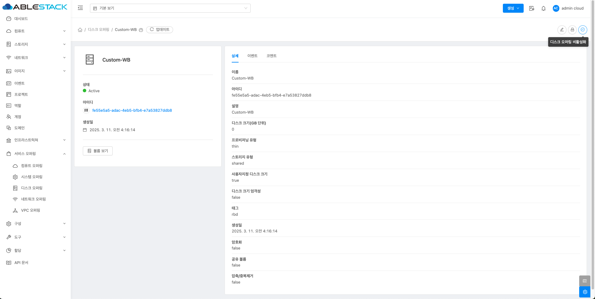

# 디스크 오퍼링
!!! check
    기본 스토리지가 여러 개일 경우, 가상 머신(VM) 디스크가 특정 스토리지에 배치되도록 스토리지 태그를 설정해야 합니다.

    스토리지 태그가 없는 경우, Mold는 임의의 기본 스토리지에 디스크를 생성할 수 있습니다.

    따라서 서비스 오퍼링 및 디스크 오퍼링을 생성할 때 적절한 스토리지 태그를 지정하는 것이 중요합니다.

## 개요
디스크 오퍼링은 가상 머신에서 사용할 디스크의 성능과 속성을 정의하는 설정입니다.
관리자는 디스크 크기, IOPS 제한, 스토리지 태그, 데이터 캐싱 방식 등을 지정할 수 있습니다.
이를 통해 다양한 워크로드에 맞는 디스크를 제공하고 성능을 최적화할 수 있습니다.

로컬 스토리지와 공유 스토리지를 지원하며, SSD나 HDD 같은 스토리지 유형도 선택할 수 있습니다.
디스크 오퍼링은 루트 디스크뿐만 아니라 추가 데이터 디스크에도 적용할 수 있습니다.

높은 성능이 필요한 경우 IOPS 값을 조정하여 입출력 속도를 최적화할 수 있습니다.
하이퍼바이저와 스토리지 백엔드에 따라 지원되는 기능이 달라질 수 있으므로 환경에 맞게 설정해야 합니다.

적절한 디스크 오퍼링을 사용하면 안정적이고 효율적인 스토리지 운영이 가능합니다.

## 디스크 오퍼링 목록 조회
1. 모든 디스크 오퍼링의 목록을 확인하는 화면입니다. 생성된 디스크 오퍼링 목록을 확인하거나 디스크 오퍼링 추가 버튼을 클릭하여 디스크 오퍼링을 추가하실 수 있습니다.
    { .imgCenter .imgBorder }

    !!! info
        필터링 기준으로 디스크 오퍼링 상태에 따라 목록 조회가 가능합니다.
        { .imgCenter .imgBorder }

## 디스크 오퍼링 추가
1. 서비스 오퍼링의 디스크 오퍼링에서 상단의 디스크 오퍼링 추가 버튼을 클릭합니다.
    { .imgCenter .imgBorder }
2. 디스크 오퍼링 추가 버튼을 클릭한 화면입니다.
    { .imgCenter .imgBorder }
    - **이름** 을 입력합니다.
    - **설명** 을 입력합니다.
    - **스토리지 유형** 을 선택합니다.
    - **프로비저닝 유형** 를 선택합니다.
    - **사용자지정 디스크 크기** 를 활성화 및 비활성화합니다.
    - **Qos 유형** 을 선택합니다.
    - **압축/중복제거** 를 활성화 및 비활성화합니다.
    - **공유볼륨** 을 활성화 및 비활성화합니다.
    - **Write-cache 유형** 을 선택합니다.
    - **스토리지 태그** 를 입력합니다.
    - **공개** 를 활성화합니다.

## 편집
1. 디스크 오퍼링 상세 오른쪽 상단의 편집 버튼을 클릭합니다.
    { .imgCenter .imgBorder }
2. 편집 버튼을 클릭한 화면입니다.
    { .imgCenter .imgBorder }
    - **이름** 을 입력합니다.
    - **설명** 을 입력합니다.
    - **태그** 를 입력합니다.

## 오퍼링 액세스 업데이트
1. 디스크 오퍼링 상세 오른쪽 상단의 오퍼링 액세스 업데이트 버튼을 클릭합니다.
    { .imgCenter .imgBorder }
2. 오퍼링 액세스 업데이트 버튼을 클릭한 화면입니다.
    { .imgCenter .imgBorder }
    - **Zone** 을 선택합니다.

## 디스크 오퍼링 비활성화
1. 디스크 오퍼링 상세 오른쪽 상단의 디스크 오퍼링 비활성화 버튼을 클릭합니다.
    { .imgCenter .imgBorder }
2. 디스크 오퍼링 비활성화 버튼을 클릭한 화면입니다.
    { .imgCenter .imgBorder }

## 디스크 오퍼링 상세 탭
1. 디스크 오퍼링 목록 조회에서 확인하고 싶은 디스크 오퍼링 목록을 조회합니다. 디스크 오퍼링 대한 상세 정보를 확인하는 화면입니다. 해당 디스크 오퍼링에 대한 이름, 아이디 등 상세 정보를 확인할 수 있습니다.
    { .imgCenter .imgBorder }

## 디스크 오퍼링 이벤트 탭
1. 디스크 오퍼링 목록 조회에서 확인하고 싶은 디스크 오퍼링 목록을 조회합니다. 디스크 오퍼링과 관련된 이벤트 정보를 확인할 수 있는 화면입니다. 디스크 오퍼링에서 발생한 다양한 액션과 변경 사항을 쉽게 파악할 수 있습니다.
    { .imgCenter .imgBorder }

## 디스크 오퍼링 코멘트 탭
1. 디스크 오퍼링 목록 조회에서 확인하고 싶은 디스크 오퍼링 목록을 조회합니다. 디스크 오퍼링과 관련된 코멘트 정보를 확인하는 화면입니다. 각 사용자별로 해당 디스크 오퍼링에 대한 코멘트 정보를 조회 및 관리할 수 있니다.
    { .imgCenter .imgBorder }

## 용어사전
<table>
    <tr>
        <th>용어명</th>
        <th>옵션</th>
        <th>설명</th>
    </tr>
    <tr>
        <td rowspan="3">프로비저닝 유형</td>
        <td>Thin 프로비저닝</td>
        <td>필요한 만큼만 저장 공간을 할당하여 디스크 공간을 효율적으로 사용하며, 초기에는 적은 공간을 사용하고 데이터가 증가하면 할당된 공간도 확장됩니다.</td>
    </tr>
    <tr>
        <td>Sparse 프로비저닝</td>
        <td>데이터가 실제로 쓰이지 않는 공간을 할당하지 않아 저장 공간을 절약하고, 빈 공간이 실제로 사용될 때만 할당되어 저장 공간 활용도가 됩니다.</td>
    </tr>
    <tr>
        <td>Fat 프로비저닝</td>
        <td>초기 설정 시 전체 용량을 미리 할당하여 디스크 공간을 고정적으로 사용하며, 할당된 용량이 실제로 사용되지 않아도 공간은 낭비될 수 있습니다.</td>
    </tr>
    <tr>
        <td>암호화</td>
        <td></td>
        <td>데이터의 보안성을 높이기 위한 기능입니다. 디스크 암호화는 저장된 데이터를 읽을 수 없도록 암호화하여, 외부의 무단 접근이나 도난으로부터 데이터를 보호합니다.</td>
    </tr>
    <tr>
        <td>디스크 크기 엄격성</td>
        <td></td>
        <td>이 디스크 제공에서 생성된 볼륨의 크기 엄격성을 정의합니다. true이면 볼륨의 크기를 변경할 수 없습니다.</td>
    </tr>
    <tr>
        <td>사용자지정 디스크 크기</td>
        <td></td>
        <td>true이면, 사용자가 디스크 크기를 설정할 수 있습니다. false이면, 루트 관리자가 값을 정의할 수 있습니다. </td>
    </tr>
    <tr>
        <td rowspan="3">QoS 유형</td>
        <td>없음</td>
        <td>서비스 품질이 없는 기능입니다.</td>
    </tr>
    <tr>
        <td>하이퍼바이저</td>
        <td>하이퍼바이저 측에서 속도 제한을 적용한 기능입니다. 해당 하이퍼바이저에서 기능을 지원하는지 확인이 필요합니다.</td>
    </tr>
    <tr>
        <td>스토리지</td>
        <td>스토리지 측에서 보장된 최소 및 최대 IOPS를 적용한 기능입니다. 해당 스토리지에서 기능을 지원하는지 확인이 필요합니다.</td>
    </tr>
    <tr>
        <td>최소 IOPS</td>
        <td rowspan="3">Qos 유형에서 스토리지 선택한 경우</td>
        <td>스토리지 측에서 적용할 보장된 최소 IOPS 수를 설정합니다.</td>
    </tr>
    <tr>
        <td>최대 IOPS</td>
        <td>스토리지 측에서 적용할 최대 IOPS 수를 설정합니다(시스템은 특정 상황에서 짧은 간격으로 이 한도를 초과할 수 있음).</td>
    </tr>
    <tr>
        <td>하이퍼바이저 스냅샷 예약</td>
        <td>이는 데이터 디스크 크기의 백분율인 값입니다. 예를 들어, 데이터 디스크가 20GB이고 Hypervisor Snapshot Reserve가 200%인 경우 해당 스토리지 리포지토리(XenServer) 또는 데이터스토어(VMware)를 백업하는 스토리지 볼륨의 크기는 60GB(20GB + (20GB * 2))입니다. 이를 통해 데이터 디스크를 나타내는 가상 디스크 외에도 하이퍼바이저 스냅샷을 위한 공간을 확보할 수 있습니다. 이는 KVM에는 적용되지 않습니다.</td>
    </tr>
    <tr>
        <td>압축/중복제거</td>
        <td></td>
        <td>KVM에서 LVM의 VDO기능을 사용하여 중복 및 압축된 논리 볼륨으로 관리합니다. VDO를 배포하여 블록 액세스, 파일 액세스, 로컬 스토리지 및 원격 스토리지에 중복된 스토리지를 제공할 수 있습니다. 100%가 사용되는 VDO 볼륨의 물리적 공간을 피하기 위해 씬 프로비저닝된 VDO 볼륨을 구성할 수도 있습니다.</td>
    </tr>
    <tr>
        <td>공유 볼륨</td>
        <td></td>
        <td>여러 가상 머신에서 동시에 액세스할 수 있는 디스크 볼륨입니다. </td>
    </tr>
    <tr>
        <td rowspan="3">Write-cache 유형</td>
        <td>디스크 캐시 없음</td>
        <td>데이터는 캐시 없이 직접 디스크에 기록됩니다. 성능은 낮을 수 있지만 데이터 안정성은 높습니다.</td>
    </tr>
    <tr>
        <td>Write-back 디스크 캐싱</td>
        <td>데이터가 캐시에 먼저 기록되고, 백그라운드에서 디스크로 기록됩니다. 성능은 향상되지만 장애 시 데이터 손실이 발생할 수 있습니다.</td>
    </tr>
    <tr>
        <td>Write-through</td>
        <td>데이터는 캐시와 디스크에 동시에 기록됩니다. 데이터의 일관성은 보장되지만 성능은 Write-back보다는 낮습니다.</td>
    </tr>
    <tr>
        <td>스토리지 태그</td>
        <td></td>
        <td>이 디스크의 기본 스토리지와 연관되어야 하는 태그입니다. 태그는 스토리지의 속성을 쉼표로 구분한 목록입니다. 예를 들어 "ssd,blue". 태그는 기본 스토리지에도 추가됩니다. 디스크 오퍼링의 태그를 스토리지의 태그와 일치시킵니다. 디스크 오퍼링에 태그가 있는 경우 볼륨을 프로비저닝하려면 해당 태그(또는 태그들)도 기본 스토리지에 있어야 합니다. 해당 기본 스토리지가 없는 경우 디스크 오퍼링에서 할당이 실패합니다.</td>
    </tr>
    <tr>
        <td>공개</td>
        <td></td>
        <td>디스크 제공을 모든 도메인에서 사용할 수 있는지 아니면 일부 도메인에서만 사용할 수 있는지를 나타냅니다. 모든 도메인에서 사용할 수 있도록 하려면 예를 선택합니다. 범위를 하나 이상의 특정 도메인으로 제한하려면 아니요를 선택합니다.</td>
    </tr>
    <tr>
        <td>Zone</td>
        <td></td>
        <td>디스크 오퍼링이 사용 가능한 영역을 제어합니다. '모든 영역' 또는 특정 영역만 선택할 수 있습니다. 이 목록 상자에서 컨트롤 키를 누른 채로 원하는 영역을 선택하면 하나 이상의 영역을 선택할 수 있습니다.</td>
    </tr>
</table>
