# 네트워크 오퍼링

## 개요
네트워크 오퍼링은 가상 머신에서 사용할 네트워크의 기능과 속성을 정의하는 설정입니다.
관리자는 트래픽 유형, IP 할당 방식, 로드 밸런싱, 방화벽 규칙, VPN 지원 여부 등을 지정할 수 있습니다.
이를 통해 다양한 네트워크 요구 사항에 맞는 환경을 구성할 수 있습니다.

공개 네트워크와 사설 네트워크를 지원하며, VLAN 또는 SDN 기술을 활용하여 네트워크를 분리하고 보안을 강화할 수 있습니다.
필요에 따라 DHCP, DNS, 소스 NAT, 포트 포워딩 등 추가 네트워크 서비스를 활성화할 수 있습니다.

고가용성이 필요한 경우 복수의 라우터 또는 로드 밸런서를 설정하여 네트워크 장애에 대비할 수 있습니다.
또한, 특정 환경에 맞게 트래픽 제한을 설정하여 대역폭을 효율적으로 관리할 수도 있습니다.

네트워크 오퍼링을 적절히 설정하면 가상 머신 간 원활한 통신을 보장하고, 안정적이며 확장 가능한 네트워크 운영이 가능합니다.

## 네트워크 오퍼링 목록 조회
!!! danger
    해당 목록은 기본적으로 제공되는 네트워크 오퍼링 목록입니다.

    삭제하면 시스템 운영에 문제가 발생할 수 있으므로 절대 삭제하지 마세요.

1. 모든 네트워크 오퍼링의 목록을 확인하는 화면입니다. 생성된 네트워크 오퍼링 목록을 확인하거나 네트워크 오퍼링 추가 버튼을 클릭하여 네트워크 오퍼링을 추가하실 수 있습니다.
    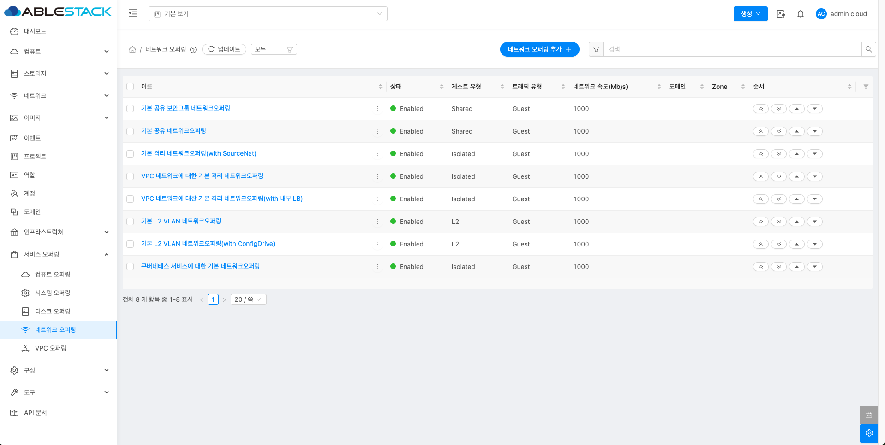{ .imgCenter .imgBorder }

    !!! info
        필터링 기준으로 네트워크 오퍼링 상태에 따라 목록 조회가 가능합니다.
        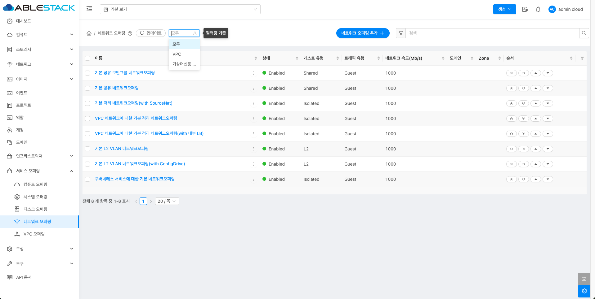{ .imgCenter .imgBorder }

## 네트워크 오퍼링 추가
1. 서비스 오퍼링의 네트워크 오퍼링에서 상단의 네트워크 오퍼링 추가 버튼을 클릭합니다.
    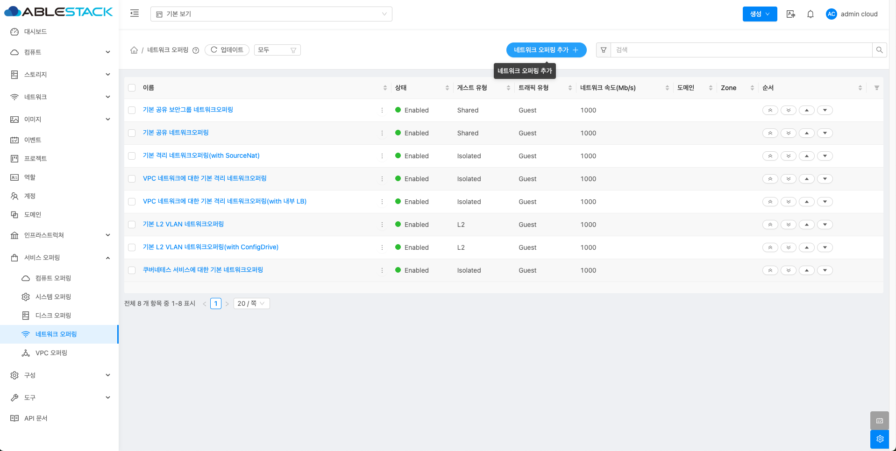{ .imgCenter .imgBorder }
2. 네트워크 오퍼링 추가 버튼을 클릭한 화면입니다.
    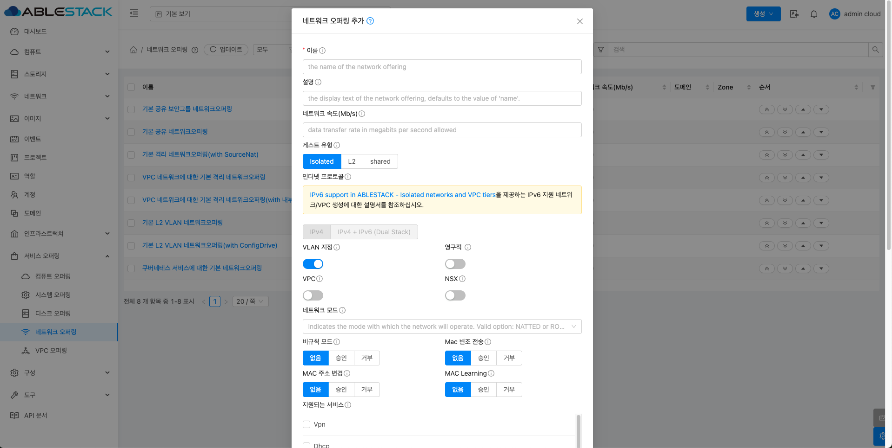{ .imgCenter .imgBorder }
    - **이름** 을 입력합니다.
    - **설명** 을 입력합니다.
    - **네트워크 속도(Mb/s)** 를 입력합니다.
    - **게스트 유형** 를 선택합니다.
    - **VLAN 지정** 을 활성화 및 비활성화합니다.
    - **영구적** 을 활성화 및 비활성화합니다.
    - **VPC** 을 활성화 및 비활성화합니다.
    - **NSX** 를 활성화 및 비활성화합니다.
    - **네트워크 모드** 를 선택합니다.
    - **비규칙 모드** 를 선택합니다.
    - **Mac 변조 전송** 을 선택합니다.
    - **MAC 주소 변경** 을 선택합니다.
    - **MAC Learning** 을 선택합니다.
    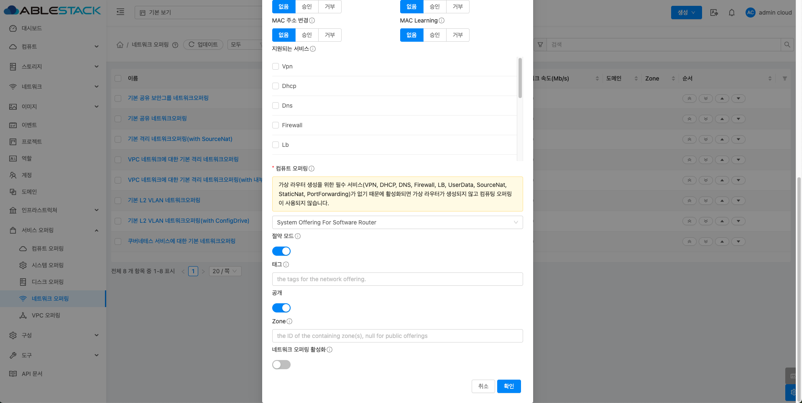{ .imgCenter .imgBorder }
    - **지원되는 서비스** 를 선택합니다.
    - **컴퓨트 오퍼링** 을 선택합니다.
    - **절약 모드** 를 활성화 및 비활성화합니다.
    - **태그** 를 입력합니다.
    - **공개** 를 활성화 및 비활성화합니다.
    - **Zone** 을 선택합니다.
    - **네트워크 오퍼링 활성화** 를 활성화 및 비활성화합니다.

## 편집
1. 네트워크 오퍼링 상세 오른쪽 상단의 편집 버튼을 클릭합니다.
    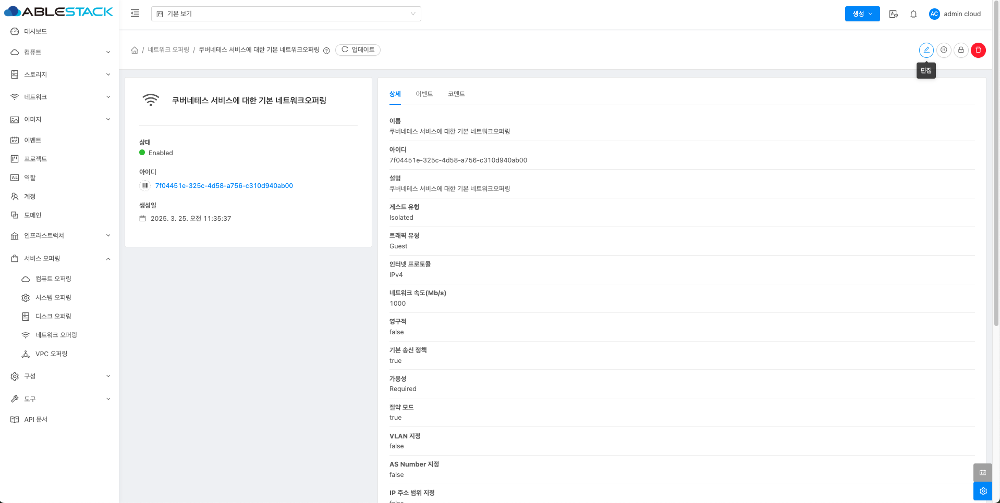{ .imgCenter .imgBorder }
2. 편집 버튼을 클릭한 화면입니다.
    { .imgCenter .imgBorder }
    - **이름** 을 입력합니다.
    - **설명** 을 입력합니다.
    - **가용성** 을 선택합니다.
    - **태그** 를 입력합니다.

## 오퍼링 액세스 업데이트
1. 네트워크 오퍼링 상세 오른쪽 상단의 오퍼링 액세스 업데이트 버튼을 클릭합니다.
    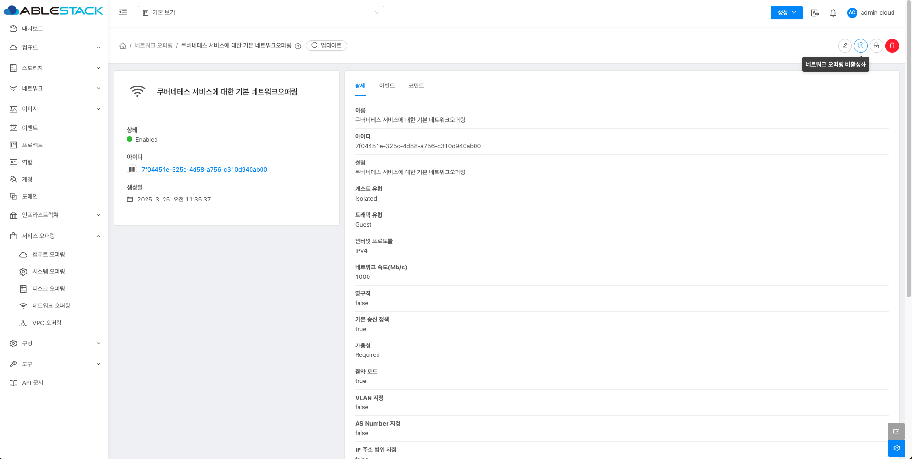{ .imgCenter .imgBorder }
2. 오퍼링 액세스 업데이트 버튼을 클릭한 화면입니다.
    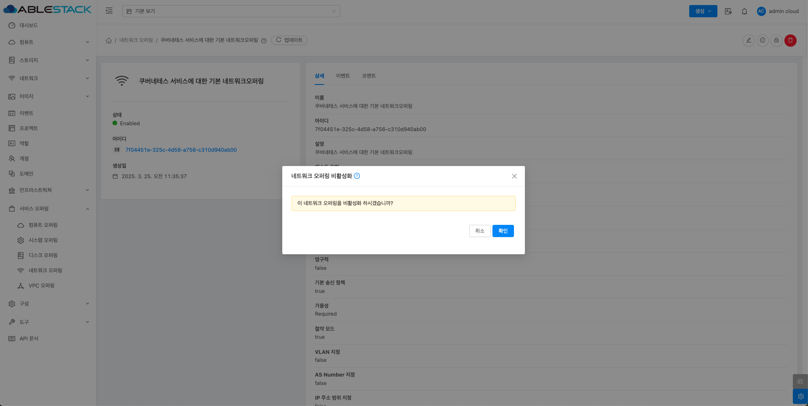{ .imgCenter .imgBorder }
    - **Zone** 을 선택합니다.

## 네트워크 오퍼링 비활성화
1. 네트워크 오퍼링 상세 오른쪽 상단의 네트워크 오퍼링 비활성화 버튼을 클릭합니다.
    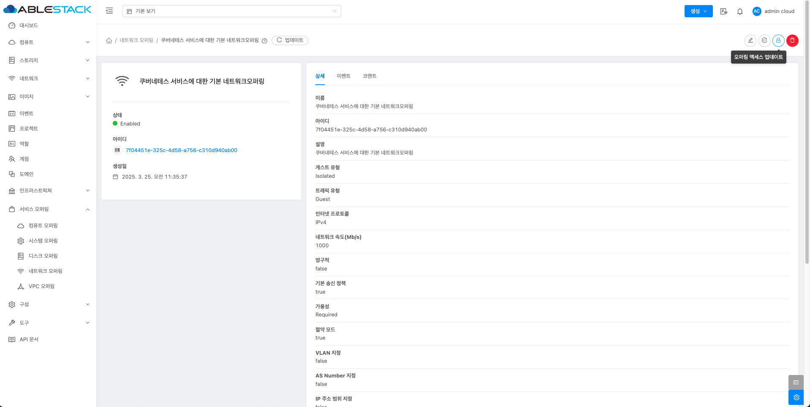{ .imgCenter .imgBorder }
2. 네트워크 오퍼링 비활성화 버튼을 클릭한 화면입니다.
    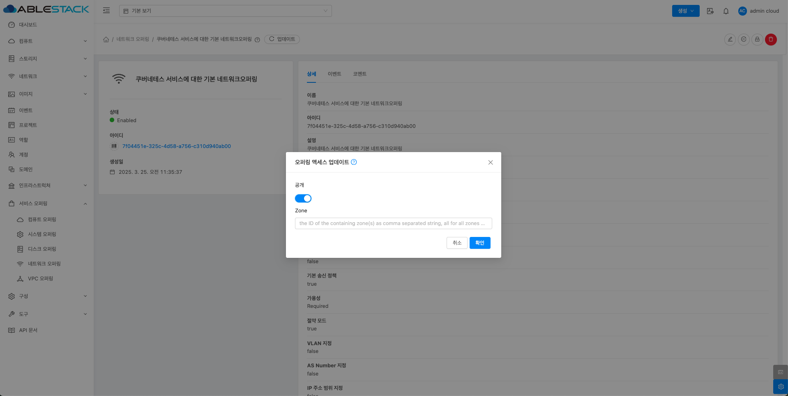{ .imgCenter .imgBorder }

## 네트워크 오퍼링 삭제
1. 네트워크 오퍼링 상세 오른쪽 상단의 네트워크 오퍼링 삭제 버튼을 클릭합니다.
    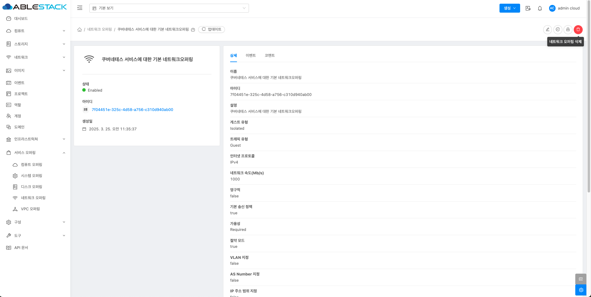{ .imgCenter .imgBorder }
2. 네트워크 오퍼링 삭제 버튼을 클릭한 화면입니다.
    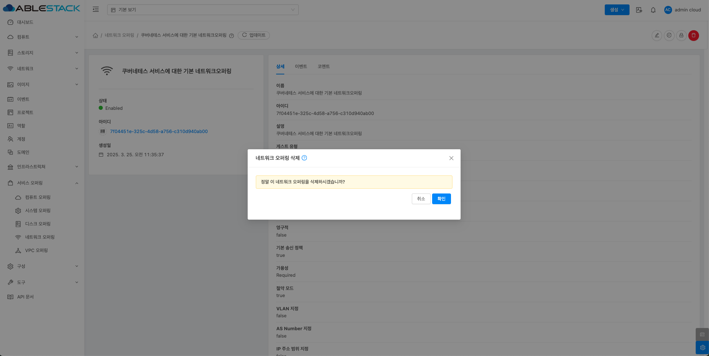{ .imgCenter .imgBorder }

## 네트워크 오퍼링 상세 탭
1. 네트워크 오퍼링 목록 조회에서 확인하고 싶은 네트워크 오퍼링 목록을 조회합니다. 네트워크 오퍼링 대한 상세 정보를 확인하는 화면입니다. 해당 네트워크 오퍼링에 대한 이름, 아이디 등 상세 정보를 확인할 수 있습니다.
    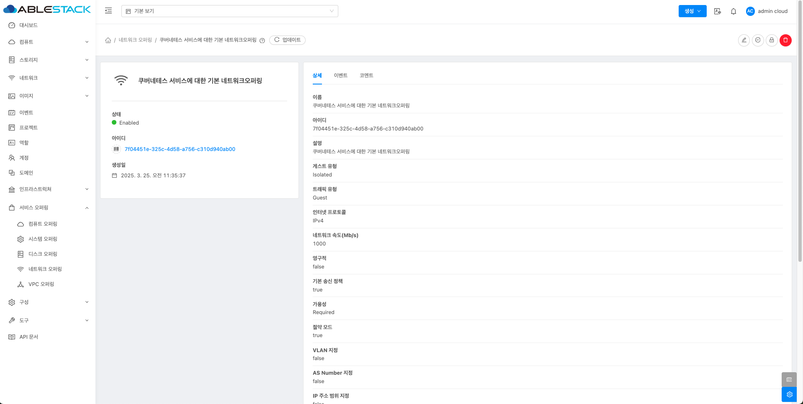{ .imgCenter .imgBorder }

## 네트워크 오퍼링 이벤트 탭
1. 네트워크 오퍼링 목록 조회에서 확인하고 싶은 네트워크 오퍼링 목록을 조회합니다. 네트워크 오퍼링과 관련된 이벤트 정보를 확인할 수 있는 화면입니다. 네트워크 오퍼링에서 발생한 다양한 액션과 변경 사항을 쉽게 파악할 수 있습니다.
    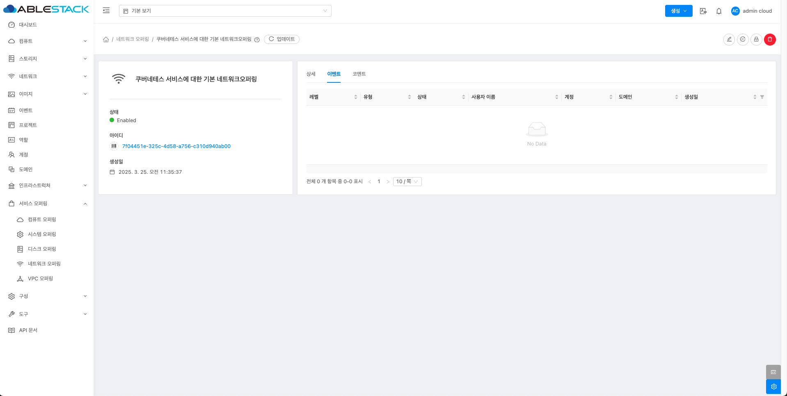{ .imgCenter .imgBorder }

## 네트워크 오퍼링 코멘트 탭
1. 네트워크 오퍼링 목록 조회에서 확인하고 싶은 네트워크 오퍼링 목록을 조회합니다. 네트워크 오퍼링과 관련된 코멘트 정보를 확인하는 화면입니다. 각 사용자별로 해당 네트워크 오퍼링에 대한 코멘트 정보를 조회 및 관리할 수 있니다.
    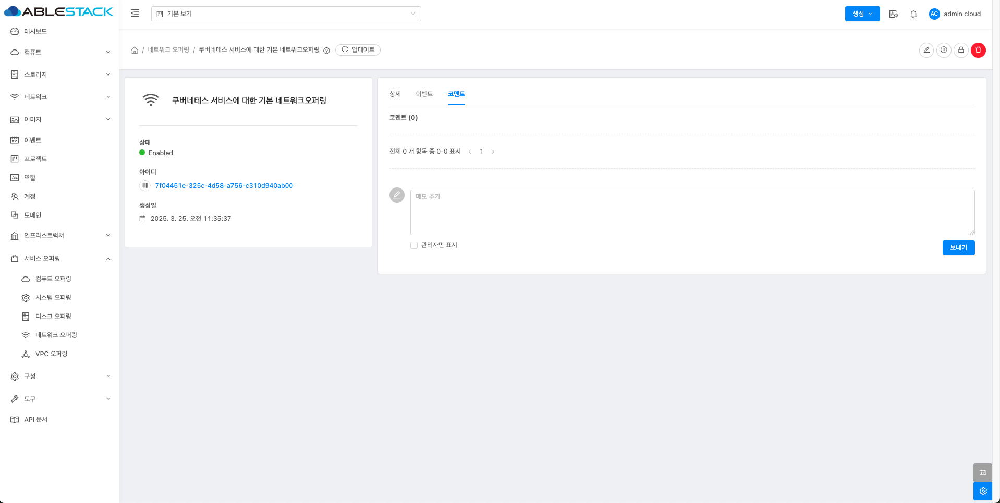{ .imgCenter .imgBorder }

## 용어사전
<table>
  <tr>
    <th>용어명</th>
    <th>옵션</th>
    <th>설명</th>
  </tr>
  <tr>
    <td rowspan="3">게스트 유형</td>
    <td>Isolated</td>
    <td>단일 계정의 인스턴스에서만 액세스할 수 있습니다.</td>
  </tr>
  <tr>
    <td>L2</td>
    <td>다른 서비스 없이 네트워크 격리를 제공합니다. 즉, 가상 라우터가 없습니다.</td>
  </tr>
  <tr>
    <td>shared</td>
    <td>여러 다른 계정에 속한 인스턴스에서 액세스할 수 있습니다.</td>
  </tr>
  <tr>
    <td>인터넷 프로토콜</td>
    <td></td>
    <td>IPv4 그리고 IPv6를 지원합니다.</td>
  </tr>
  <tr>
    <td>VLAN 지정</td>
    <td></td>
    <td>이 오퍼링을 사용할 때, VLAN을 지정할 수 있는지 여부를 나타냅니다. 네트워크에 대한 VLAN ID를 지정할 수 있습니다.</td>
  </tr>
  <tr>
    <td>영구적</td>
    <td></td>
    <td>게스트 네트워크가 영구적인지 여부를 나타냅니다. 인스턴스를 배포할지 않고도 프로비저닝할 수 있는 네트워크입니다.</td>
  </tr>
  <tr>
    <td>VPC</td>
    <td></td>
    <td>게스트 네트워크가 Virtual Private Cloud를 지원하는지 여부를 나타냅니다. 기존의 물리적 네트워크와 유사한 자체 가상 네트워크 토폴로지를 가질 수 있습니다.</td>
  </tr>
  <tr>
    <td>NSX</td>
    <td></td>
    <td>VMware NSX4를 도입하여 VPC를 생성하고 관리합니다.(VMware 전용 입니다.)</td>
  </tr>
  <tr>
    <td rowspan="2">네트워크 모드</td>
    <td>NATTED</td>
    <td>네트워크가 작동하는 모드를 나타냅니다. 이는 격리된 네트워크의 기본 네트워크 모드입니다. 격리된 네트워크와 VPC의 VR은 소스 NAT 서비스와 네트워크 제공이 지원하는 경우 정적 NAT, 로드밸런서, 포트 포워딩, VPN을 제공합니다.</td>
  </tr>
  <tr>
    <td>ROUTED</td>
    <td>VR은 더이상 소스 NAT, 정적 NAT, 로드 밸런서, 포트 포워딩 및 VPN을 지원하지 않습니다. 지원 되는 서비스는 DNS,DHCP, Userdata, 방화벽(격리된 네트워크용) 및 네트워크 ACL(vpc 및 vpc 네트워크용) 입니다.</td>
  </tr>
  <tr>
    <td>라우팅 모드</td>
    <td></td>
    <td>네트워크 제공에 대한 라우팅 모드를 나타냅니다. 지원되는 유형은 static 또는 dynamic입니다.</td>
  </tr>
  <tr>
    <td>비규칙모드</td>
    <td rowspan="4"></td>
    <td rowspan="4">VMware 하이퍼바이저의 게스트 네트워크에만 적용 가능합니다.</td>
  </tr>
  <tr>
    <td>Mac 변조 전송</td>
  </tr>
  <tr>
    <td>MAC 주소 변경</td>
  </tr>
  <tr>
    <td>Mac Learning</td>
  </tr>
  <tr>
    <td rowspan="13">지원되는 서비스</td>
    <td>VPN</td>
    <td>인스턴스에 액세스하기 위해 가상 사설망을 만듭니다. 게스트 네트워크가 원격 액세스 VPN 서비스를 제공하는 네트워크 오퍼링에서 인스턴스화된 경우 가상 라우터(시스템 VM 기반)가 서비스를 제공하는 데 사용됩니다. </td>
  </tr>
  <tr>
    <td>DHCP</td>
    <td>Virtual Router & ConfigDrive는 게스트에게 DNS 및 DHCP 서비스를 제공합니다.</td>
  </tr>
  <tr>
    <td>DNS</td>
    <td>가용성 영역에 구성된 DNS 서버로 DNS 요청을 프록시합니다.</td>
  </tr>
  <tr>
    <td>Firewall</td>
    <td>가상 머신과 외부 네트워크 간의 트래픽을 제어하는 역할을 합니다.</td>
  </tr>
  <tr>
    <td>Lb</td>
    <td>가상 라우터나 클라우드에 구성된 다른 로드 밸런서를 선택할 수 있습니다.</td>
  </tr>
  <tr>
    <td>UserData</td>
    <td>공유 또는 격리된 네트워크의 사용자 데이터 서비스는 가상 라우터를 통해 제공되거나 Config 드라이브라고 하는 연결된 ISO를 통해 제공될 수 있습니다.</td>
  </tr>
  <tr>
    <td>SourceNat</td>
    <td>클라우드에 구성된 가상 라우터나 다른 소스 NAT 공급자를 선택할 수 있습니다.</td>
  </tr>
  <tr>
    <td>StaticNat</td>
    <td>가상 라우터나 클라우드에 구성된 다른 Static NAT 공급자를 선택할 수 있습니다.</td>
  </tr>
  <tr>
    <td>PortForwarding</td>
    <td>가상 라우터나 클라우드에 구성된 다른 포트포워딩 공급자를 선택할 수 있습니다.</td>
  </tr>
  <tr>
    <td>SecurityGroup</td>
    <td>KVM이 하이퍼바이저인 고급 구역에서 단일 공유, 구역 전체 네트워크의 게스트 간 격리를 제공하기 위해 보안 그룹을 사용할 수 있는 기능을 제공합니다.</td>
  </tr>
  <tr>
    <td>NetworkACL</td>
    <td>네트워크 ACL 규칙의 그룹입니다. ACL 규칙은 가장 낮은 번호의 규칙부터 시작하여 순서대로 처리됩니다. 각 규칙은 최소한 영향을 받는 프로토콜, 트래픽 유형, 작업 및 영향을 받는 대상/소스 네트워크를 정의합니다.</td>

  </tr>
  <tr>
    <td>Connectivity</td>
    <td>가상 머신이 외부 또는 내부 네트워크와 어떻게 연결될지 결정합니다. DHCP, 정적 라우팅, VPN 과 같은 다른 네트워크 서비스와 함께 동작할 수 있습니다.</td>
  </tr>
  <tr>
    <td>BaremetalPxeService</td>
    <td>PXE(Preboot Execution Environment) 부팅을 지원하여 베어메탈 서버의 네트워크 기반 운영 체제 설치를 가능하게 하는 서비스입니다.</td>
  </tr>
  <tr>
    <td>절약 모드</td>
    <td></td>
    <td>네트워크 오퍼링에서 최소한의 기능만 제공하여 네트워크 리소스를 절감하는 설정입니다.</td>
  </tr>
  <tr>
    <td rowspan="2">기본 송신 정책</td>
    <td>허용</td>
    <td>가상머신에서 인터넷이나 외부 네트워크로 데이터를 어떻게 처리하는지를 결정하는 설정입니다. 허용은 별도의 방화벽 규칙을 설정하지 않아도 가상머신이 외부 네트워크로 자유롭게 통신할 수 있습니다.</td>
  </tr>
  <tr>
    <td>거부</td>
    <td>거부는 가상 머신에서 인터넷이나 외부 네트워크로의 연결이 불가능합니다. 허용하려면 Egress 방화벽 규칙을 수동으로 추가해야 합니다.</td>
  </tr>
  <tr>
    <td>Streched L2 서브넷 지원</td>
    <td></td>
    <td>동일한 L2 네트워크 서브넷을 여러 물리적인 데이터센터 또는 가용 영역(Zone)으로 확장할 수 있는 기능입니다. 서로 다른 물리적 위치에 있는 VM들이 같은 네트워크에 있는 것처럼 통신할 수 있습니다.</td>
  </tr>
</table>
