# 시스템 오퍼링

## 개요
시스템 오퍼링은 시스템 VM이 사용할 CPU, 메모리, 디스크 크기를 정의하는 설정입니다.
시스템 VM에는 가상 라우터, 콘솔 프록시, 세컨더리 스토리지 VM이 포함되며, 각각의 역할에 맞는 리소스를 할당받습니다.

가상 라우터는 네트워크 서비스를 제공하며, 충분한 리소스를 할당해야 원활한 트래픽 처리가 가능합니다.
콘솔 프록시는 VM의 콘솔 접속을 중계하며, 리소스 부족 시 접속 속도가 느려질 수 있습니다.
세컨더리 스토리지 VM은 템플릿과 ISO 이미지를 관리하며, 안정적인 스토리지 운영을 위해 적절한 설정이 필요합니다.

환경에 따라 기본 제공되는 오퍼링을 그대로 사용할 수도 있고, 필요에 맞게 새로운 오퍼링을 생성할 수도 있습니다.
적절한 시스템 오퍼링을 설정하면 VM의 성능과 안정성이 향상되며, 관리 부담을 줄일 수 있습니다.

설정을 변경할 경우 기존 시스템 VM에 영향을 줄 수 있으므로, 변경 전에 충분한 검토가 필요합니다.
잘못된 설정은 네트워크 장애, 콘솔 접속 문제, 스토리지 성능 저하를 초래할 수 있으므로 신중하게 관리해야 합니다.

시스템 오퍼링을 적절하게 활용하면 안정적인 클라우드 인프라를 구축하고 효율적인 운영이 가능합니다.

## 시스템 오퍼링 목록 조회
!!! danger
    해당 목록은 기본적으로 제공되는 시스템 오퍼링 목록입니다.

    삭제하면 시스템 운영에 문제가 발생할 수 있으므로 절대 삭제하지 마세요.

1. 모든 시스템 오퍼링의 목록을 확인하는 화면입니다. 생성된 시스템 오퍼링 목록을 확인하거나 시스템 오퍼링 추가 버튼을 클릭하여 시스템 오퍼링을 추가하실 수 있습니다.
    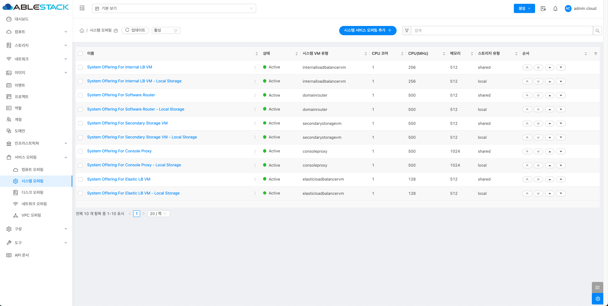{ .imgCenter .imgBorder }

    !!! info
        필터링 기준으로 시스템 오퍼링 상태에 따라 목록 조회가 가능합니다.
        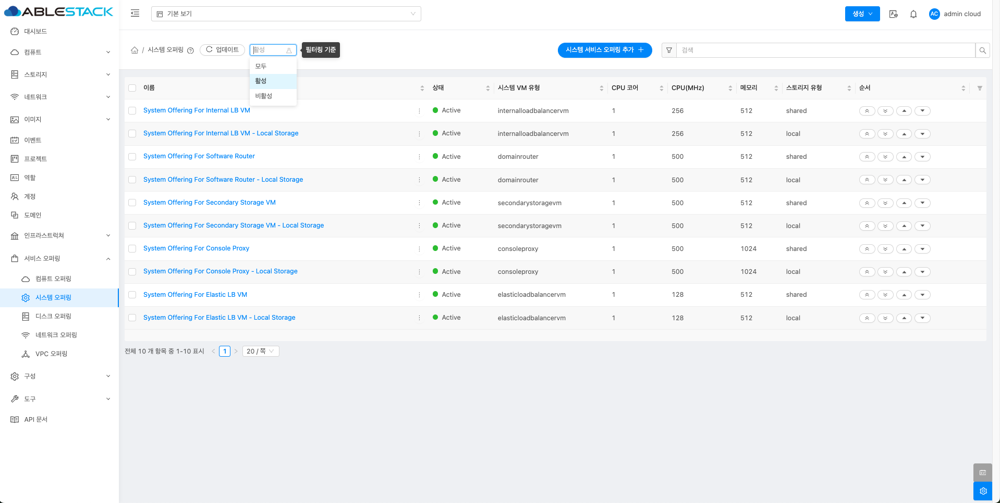{ .imgCenter .imgBorder }

## 시스템 오퍼링 추가
1. 서비스 오퍼링의 시스템 오퍼링에서 상단의 시스템 오퍼링 추가 버튼을 클릭합니다.
    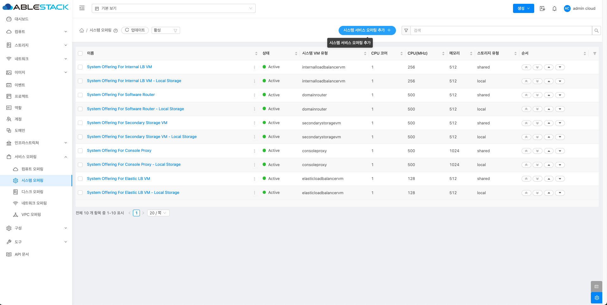{ .imgCenter .imgBorder }
2. 시스템 오퍼링 추가 버튼을 클릭한 화면입니다.
    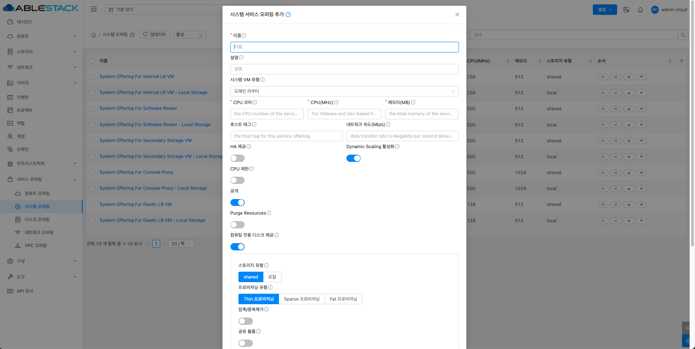{ .imgCenter .imgBorder }
    - **이름** 을 입력합니다.
    - **설명** 을 입력합니다.
    - **시스템 VM 유형** 를 선택합니다.
    - **CPU 코어** 를 입력합니다.
    - **CPU(MHz)** 를 입력합니다.
    - **메모리(MB)** 를 입력합니다.
    - **네트워크 속도(Mb/s)** 를 입력합니다.
    - **HA 제공** 를 활성화 및 비활성화합니다.
    - **Dynamic Scaling 활성화** 를 활성화 및 비활성화합니다.
    - **CPU 제한** 을 활성화 및 비활성화합니다.
    - **공개** 을 활성화 및 비활성화합니다.
    - **Purge Resources** 를 활성화 및 비활성화합니다.
    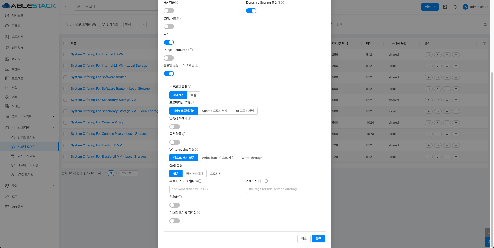{ .imgCenter .imgBorder }
    - **컴퓨트 전용 디스크 제공** 을 활성화 및 비활성화합니다.
    - **스토리지 유형** 을 선택합니다.
    - **프로비저닝 유형** 을 입선택합니다.
    - **압축/중복제거** 를 활성화 및 비활성화합니다.
    - **공유 볼륨** 을 활성화 및 비활성화합니다.
    - **Write-cache 유형** 을 선택합니다.
    - **Qos 유형** 을 선택합니다.
    - **스토리지 태그** 를 선택합니다.

## 편집
1. 시스템 오퍼링 상세 오른쪽 상단의 편집 버튼을 클릭합니다.
    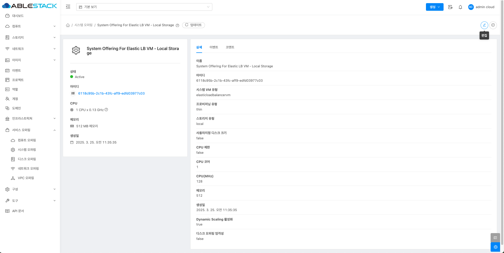{ .imgCenter .imgBorder }
2. 편집 버튼을 클릭한 화면입니다.
    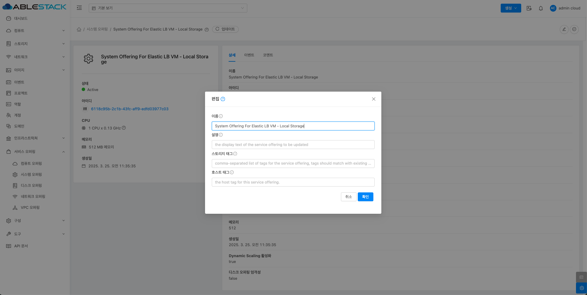{ .imgCenter .imgBorder }
    - **이름** 을 입력합니다.
    - **설명** 을 입력합니다.
    - **스토리지 태그** 을 입력합니다.
    - **호스트 태그** 를 입력합니다.

## 시스템 서비스 오퍼링 비활성화
1. 시스템 오퍼링 상세 오른쪽 상단의 시스템 서비스 오퍼링 비활성화 버튼을 클릭합니다.
    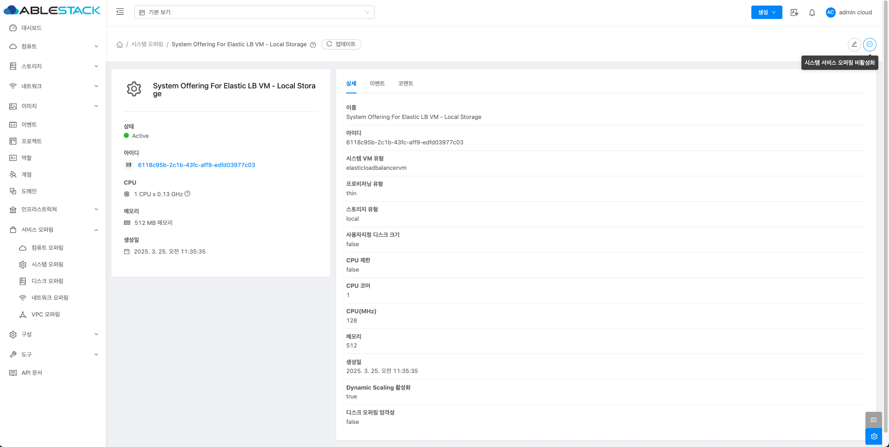{ .imgCenter .imgBorder }
2. 시스템 서비스 오퍼링 비활성화 버튼을 클릭한 화면입니다.
    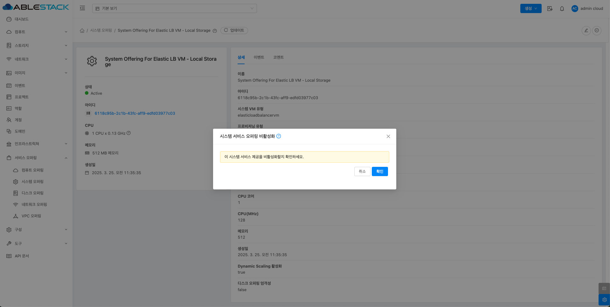{ .imgCenter .imgBorder }

## 시스템 오퍼링 상세 탭
1. 시스템 오퍼링 목록 조회에서 확인하고 싶은 시스템 오퍼링 목록을 조회합니다. 시스템 오퍼링 대한 상세 정보를 확인하는 화면입니다. 해당 시스템 오퍼링에 대한 이름, 아이디 등 상세 정보를 확인할 수 있습니다.
    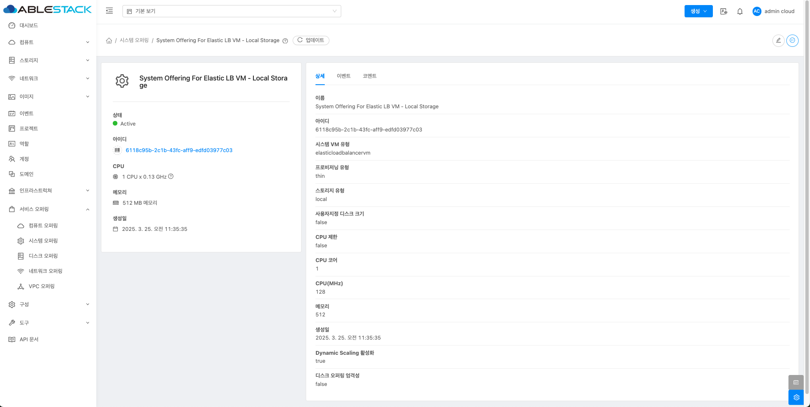{ .imgCenter .imgBorder }

## 시스템 오퍼링 이벤트 탭
1. 시스템 오퍼링 목록 조회에서 확인하고 싶은 시스템 오퍼링 목록을 조회합니다. 시스템 오퍼링과 관련된 이벤트 정보를 확인할 수 있는 화면입니다. 시스템 오퍼링에서 발생한 다양한 액션과 변경 사항을 쉽게 파악할 수 있습니다.
    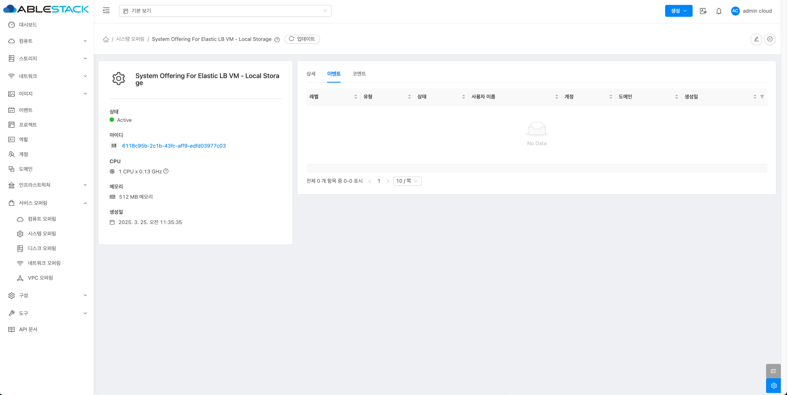{ .imgCenter .imgBorder }

## 시스템 오퍼링 코멘트 탭
1. 시스템 오퍼링 목록 조회에서 확인하고 싶은 시스템 오퍼링 목록을 조회합니다. 시스템 오퍼링과 관련된 코멘트 정보를 확인하는 화면입니다. 각 사용자별로 해당 시스템 오퍼링에 대한 코멘트 정보를 조회 및 관리할 수 있니다.
    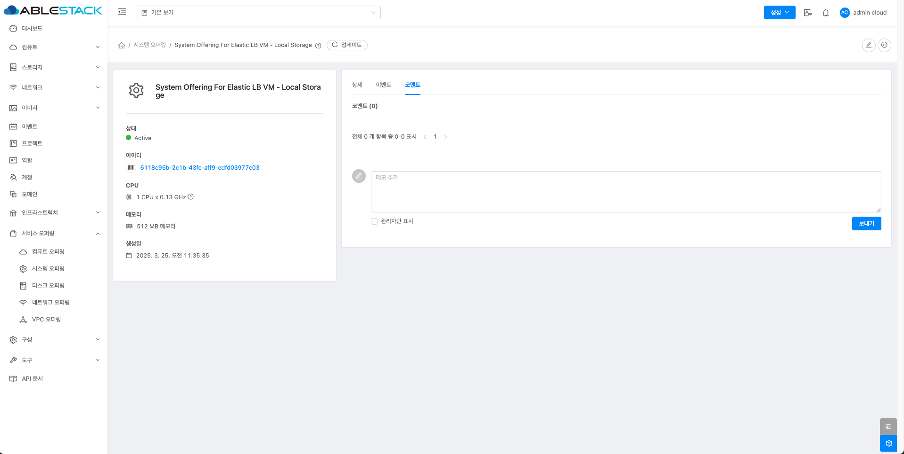{ .imgCenter .imgBorder }

## 용어사전
<!-- |  용어명      | 옵션 | 설명                        |
| :---------: | :-: | :----------------------------------: |
| 시스템 오퍼링 유형 | 고정 오퍼링 | 사용자가 사용자 정의할 수 없음 |
|  | 사용자 정의 제한 | 사용자가 제공에서 설정한 매개변수 내에서 컴퓨팅을 사용자 정의할 수 있는 자유도 있음 |
|  | 사용자 정의 제한 없음 | 사용자가 원하는 값을 설정할 수 있음 | -->
<table>
  <tr>
    <th>용어명</th>
    <th>옵션</th>
    <th>설명</th>
  </tr>
  <tr>
    <td rowspan="3">시스템 오퍼링 유형</td>
    <td>고정 오퍼링</td>
    <td>사용자가 사용자 정의할 수 없음</td>
  </tr>
  <tr>
    <td>사용자 정의 제한</td>
    <td>사용자가 제공에서 설정한 매개변수 내에서 컴퓨팅을 사용자 정의할 수 있는 자유도 있음</td>
  </tr>
  <tr>
    <td>사용자 정의 제한 없음</td>
    <td>사용자가 원하는 값을 설정할 수 있음</td>
  </tr>
</table>
