# VPC 오퍼링

## 개요
VPC 오퍼링은 가상 사설 클라우드(Virtual Private Cloud, VPC)의 네트워크 기능과 정책을 정의하는 설정입니다.
VPC는 여러 개의 네트워크를 하나의 논리적 그룹으로 묶어 격리된 환경을 제공하며, 다양한 구성 요소를 포함할 수 있습니다.

VPC 오퍼링을 통해 지원하는 네트워크 서비스(라우팅, 방화벽, 로드밸런서, DHCP 등)를 지정할 수 있습니다.
각 VPC는 하나 이상의 티어(Tier)를 가질 수 있으며, 티어 간 트래픽 흐름을 제어할 수 있습니다.

보안 그룹과 ACL(Access Control List)을 사용하여 트래픽을 필터링하고, 네트워크 접근을 세밀하게 설정할 수 있습니다.
VPC 오퍼링은 퍼블릭 게이트웨이와 NAT(Network Address Translation) 기능을 지원하여 외부 네트워크와 연결할 수 있습니다.
환경에 따라 기본 제공되는 VPC 오퍼링을 사용할 수도 있고, 필요에 맞게 새로운 오퍼링을 생성할 수도 있습니다.

잘못된 설정은 네트워크 장애를 초래할 수 있으므로, VPC의 구조와 정책을 충분히 고려한 후 설정해야 합니다.
VPC 오퍼링을 적절히 활용하면 클라우드 환경에서 안전하고 유연한 네트워크 구성이 가능합니다.
기업 또는 프로젝트별로 독립적인 네트워크를 운영하고, 보안과 성능을 최적화하는 데 도움을 줍니다.

## VPC 오퍼링 목록 조회
!!! danger
    해당 목록은 기본적으로 제공되는 VPC 오퍼링 목록입니다.

    삭제하면 시스템 운영에 문제가 발생할 수 있으므로 절대 삭제하지 마세요.

1. 모든 VPC 오퍼링의 목록을 확인하는 화면입니다. 생성된 VPC 오퍼링 목록을 확인하거나 VPC 오퍼링 추가 버튼을 클릭하여 VPC 오퍼링을 추가하실 수 있습니다.
    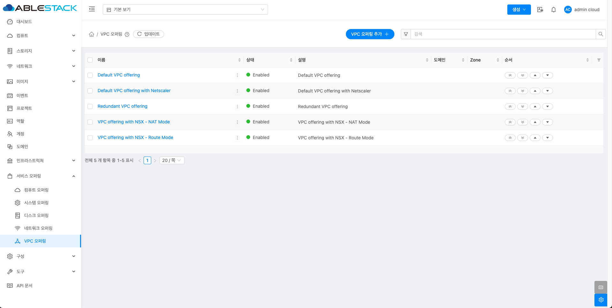{ .imgCenter .imgBorder }

## VPC 오퍼링 추가
1. 서비스 오퍼링의 VPC 오퍼링에서 상단의 VPC 오퍼링 추가 버튼을 클릭합니다.
    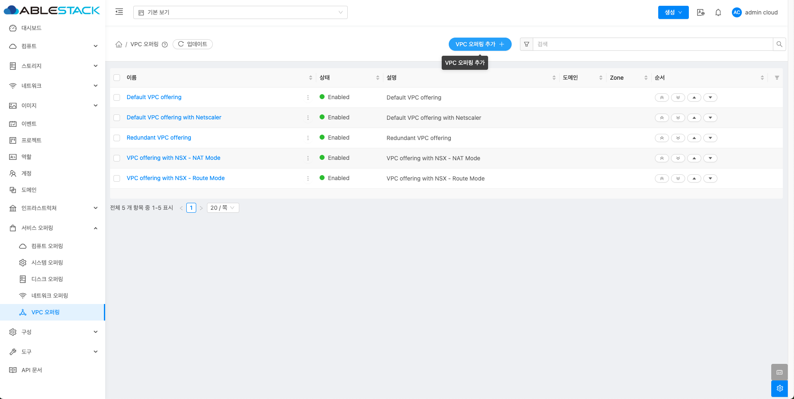{ .imgCenter .imgBorder }
2. VPC 오퍼링 추가 버튼을 클릭한 화면입니다.
    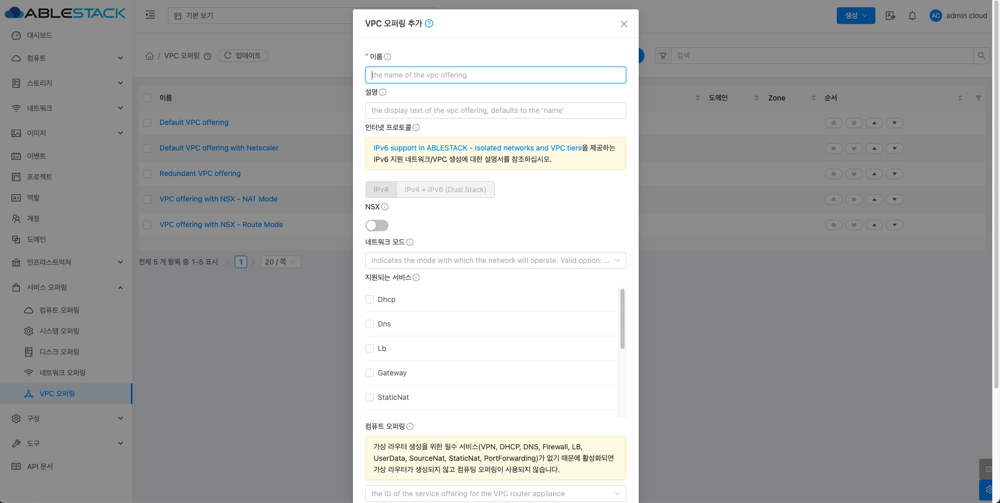{ .imgCenter .imgBorder }
    - **이름:** 이름을 입력합니다.
    - **설명:** 설명을 입력합니다.
    - **NSX:** NSX를 활성화 및 비활성화합니다.
    - **네트워크 모드:** 네트워크 모드를 선택합니다.
    - **지원되는 서비스:** 지원되는 서비스를 선택합니다.
    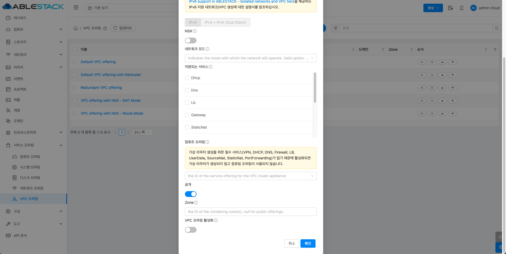{ .imgCenter .imgBorder }
    - **컴퓨트 오퍼링:** 컴퓨트 오퍼링을 선택합니다.
    - **공개:** 공개를 활성화 및 비활성화합니다.
    - **Zone:** Zone을 활성화 및 비활성화합니다.
    - **VPC 오퍼링 활성화:** VPC 오퍼링 활성화를 활성화 및 비활성화합니다.

## 편집
1. VPC 오퍼링 상세 오른쪽 상단의 편집 버튼을 클릭합니다.
    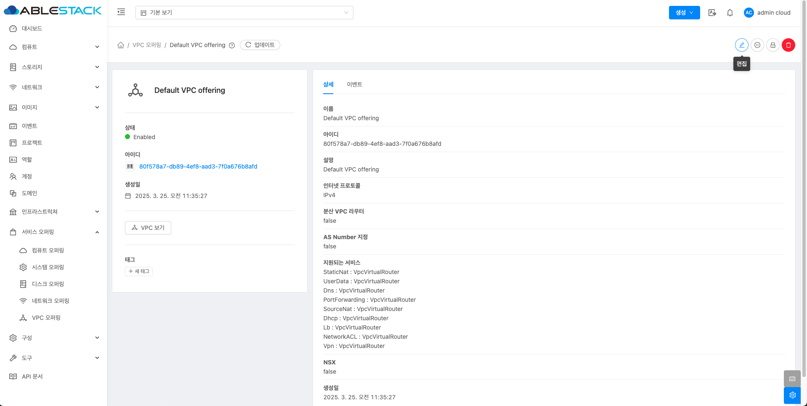{ .imgCenter .imgBorder }
2. 편집 버튼을 클릭한 화면입니다.
    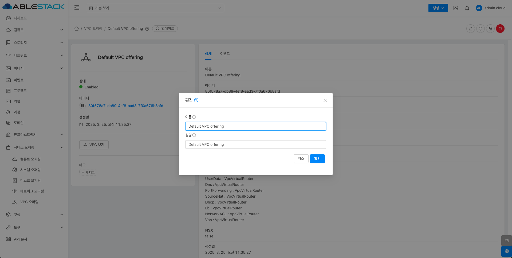{ .imgCenter .imgBorder }
    - **이름:** 이름을 입력합니다.
    - **설명:** 설명을 입력합니다.

## VPC 서비스 오퍼링 비활성화
1. VPC 오퍼링 상세 오른쪽 상단의 VPC 서비스 오퍼링 비활성화 버튼을 클릭합니다.
    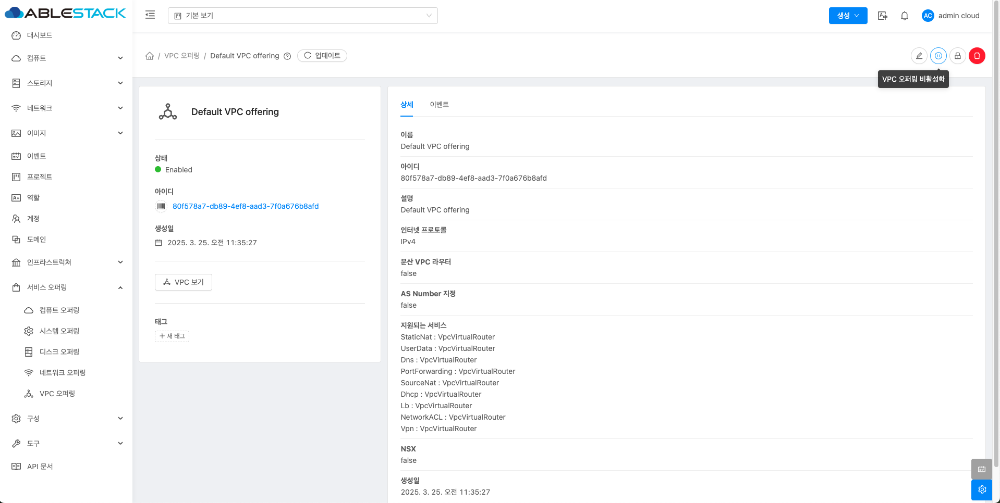{ .imgCenter .imgBorder }
2. VPC 서비스 오퍼링 비활성화 버튼을 클릭한 화면입니다.
    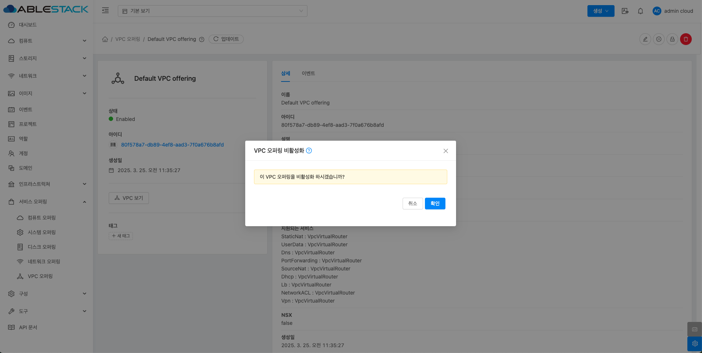{ .imgCenter .imgBorder }

## 오퍼링 액세스 업데이트
1. VPC 오퍼링 상세 오른쪽 상단의 오퍼링 액세스 업데이트 버튼을 클릭합니다.
    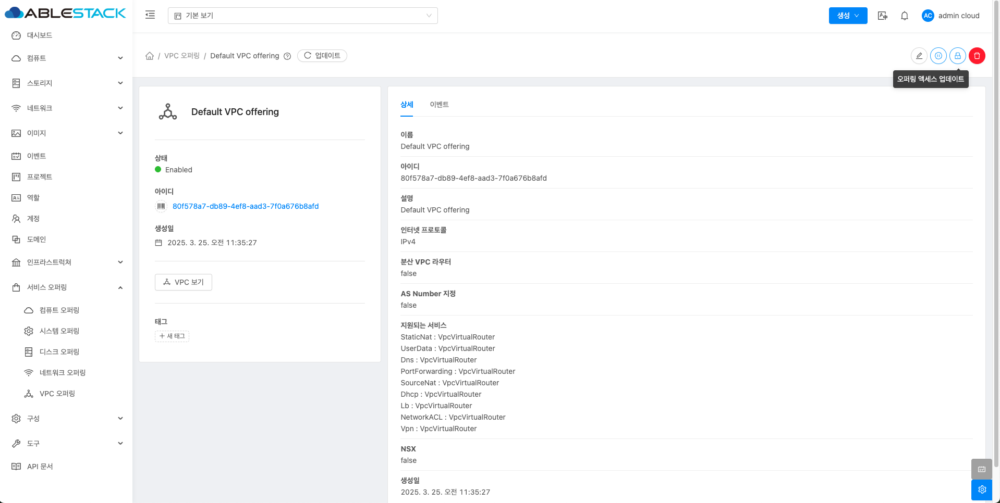{ .imgCenter .imgBorder }
2. 오퍼링 액세스 업데이트 버튼을 클릭한 화면입니다.
    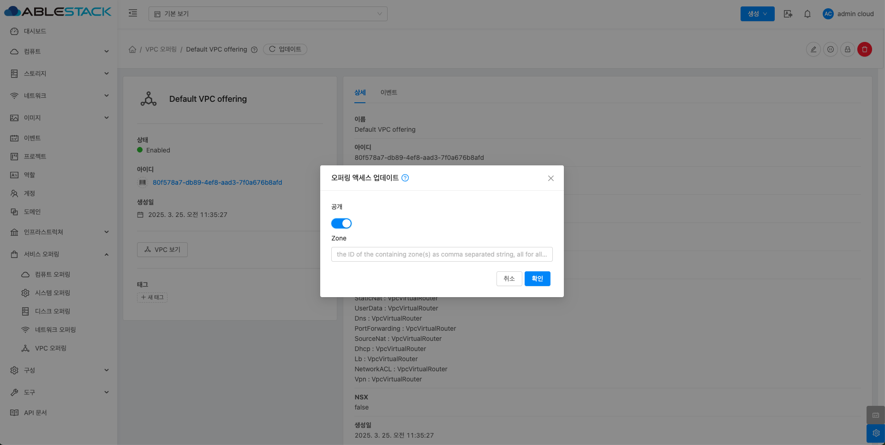{ .imgCenter .imgBorder }
    - **Zone:** Zone을 선택합니다.

## VPC 오퍼링 삭제
1. VPC 오퍼링 상세 오른쪽 상단의 VPC 오퍼링 삭제 버튼을 클릭합니다.
    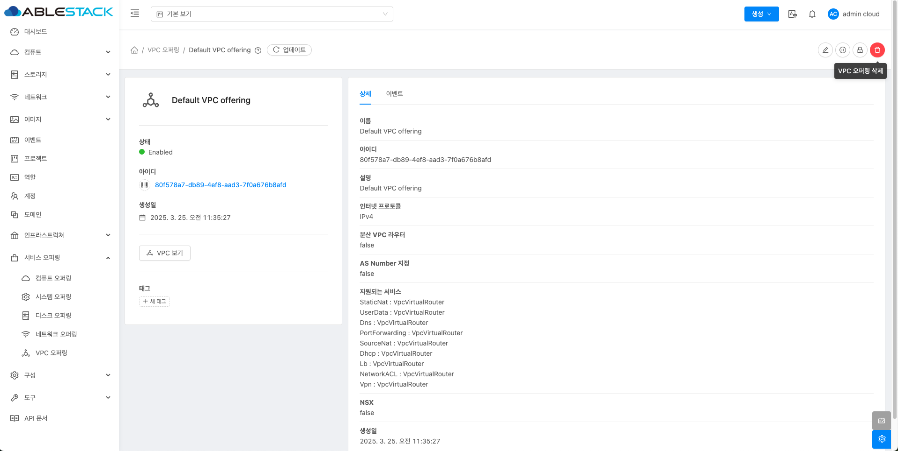{ .imgCenter .imgBorder }
2. VPC 오퍼링 삭제 버튼을 클릭한 화면입니다.
    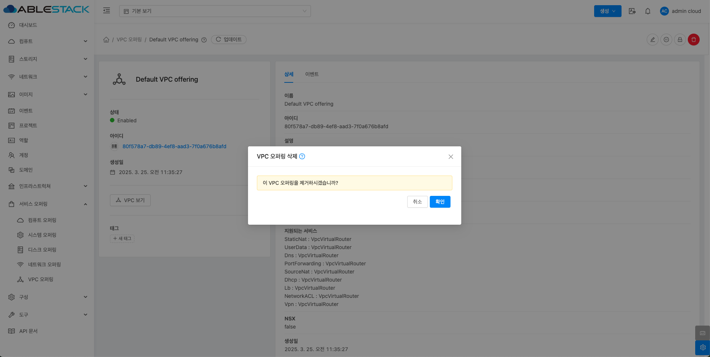{ .imgCenter .imgBorder }

## VPC 오퍼링 상세 탭
1. VPC 오퍼링에 대한 상세 정보를 확인하는 화면입니다. 해당 VPC 오퍼링에 대한 이름, 아이디 등 상세 정보를 확인할 수 있습니다.
    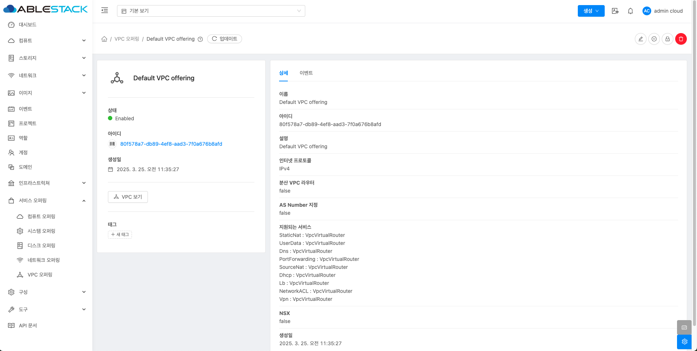{ .imgCenter .imgBorder }

## VPC 오퍼링 이벤트 탭
1. VPC 오퍼링과 관련된 이벤트 정보를 확인할 수 있는 화면입니다. VPC 오퍼링에서 발생한 다양한 액션과 변경 사항을 쉽게 파악할 수 있습니다.
    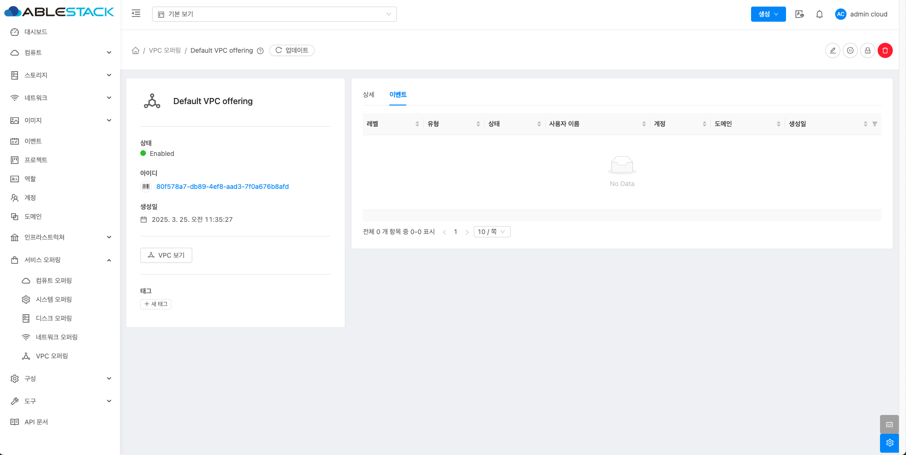{ .imgCenter .imgBorder }

## 용어사전
<!-- |  용어명      | 옵션 | 설명                        |
| :---------: | :-: | :----------------------------------: |
| VPC 오퍼링 유형 | 고정 오퍼링 | 사용자가 사용자 정의할 수 없음 |
|  | 사용자 정의 제한 | 사용자가 제공에서 설정한 매개변수 내에서 컴퓨팅을 사용자 정의할 수 있는 자유도 있음 |
|  | 사용자 정의 제한 없음 | 사용자가 원하는 값을 설정할 수 있음 | -->
<table>
  <tr>
    <th>용어명</th>
    <th>옵션</th>
    <th>설명</th>
  </tr>
  <tr>
    <td>인터넷 프로토콜</td>
    <td></td>
    <td>IPv4 그리고 IPv6를 지원합니다.</td>
  </tr>
  <tr>
    <td>NSX</td>
    <td></td>
    <td>VMware NSX4를 도입하여 VPC를 생성하고 관리합니다.(VMware 전용 입니다.)</td>
  </tr>
  <tr>
    <td rowspan="2">네트워크 모드</td>
    <td>NATTED</td>
    <td>네트워크가 작동하는 모드를 나타냅니다. 이는 격리된 네트워크의 기본 네트워크 모드입니다. 격리된 네트워크와 VPC의 VR은 소스 NAT 서비스와 네트워크 제공이 지원하는 경우 정적 NAT, 로드밸런서, 포트 포워딩, VPN을 제공합니다.</td>
  </tr>
  <tr>
    <td>ROUTED</td>
    <td>VR은 더이상 소스 NAT, 정적 NAT, 로드 밸런서, 포트 포워딩 및 VPN을 지원하지 않습니다. 지원 되는 서비스는 DNS,DHCP, Userdata, 방화벽(격리된 네트워크용) 및 네트워크 ACL(vpc 및 vpc 네트워크용) 입니다.</td>
  </tr>
  <tr>
    <td rowspan="13">지원되는 서비스</td>
    <td>VPN</td>
    <td>인스턴스에 액세스하기 위해 가상 사설망을 만듭니다. 게스트 네트워크가 원격 액세스 VPN 서비스를 제공하는 네트워크 오퍼링에서 인스턴스화된 경우 가상 라우터(시스템 VM 기반)가 서비스를 제공하는 데 사용됩니다. </td>
  </tr>
  <tr>
    <td>DHCP</td>
    <td>Virtual Router & ConfigDrive는 게스트에게 DNS 및 DHCP 서비스를 제공합니다.</td>
  </tr>
  <tr>
    <td>DNS</td>
    <td>가용성 영역에 구성된 DNS 서버로 DNS 요청을 프록시합니다.</td>
  </tr>
  <tr>
    <td>Lb</td>
    <td>가상 라우터나 클라우드에 구성된 다른 로드 밸런서를 선택할 수 있습니다.</td>
  </tr>
  <tr>
    <td>UserData</td>
    <td>공유 또는 격리된 네트워크의 사용자 데이터 서비스는 가상 라우터를 통해 제공되거나 Config 드라이브라고 하는 연결된 ISO를 통해 제공될 수 있습니다.</td>
  </tr>
  <tr>
    <td>SourceNat</td>
    <td>클라우드에 구성된 가상 라우터나 다른 소스 NAT 공급자를 선택할 수 있습니다.</td>
  </tr>
  <tr>
    <td>StaticNat</td>
    <td>가상 라우터나 클라우드에 구성된 다른 Static NAT 공급자를 선택할 수 있습니다.</td>
  </tr>
  <tr>
    <td>PortForwarding</td>
    <td>가상 라우터나 클라우드에 구성된 다른 포트포워딩 공급자를 선택할 수 있습니다.</td>
  </tr>
  <tr>
    <td>NetworkACL</td>
    <td>네트워크 ACL 규칙의 그룹입니다. ACL 규칙은 가장 낮은 번호의 규칙부터 시작하여 순서대로 처리됩니다. 각 규칙은 최소한 영향을 받는 프로토콜, 트래픽 유형, 작업 및 영향을 받는 대상/소스 네트워크를 정의합니다.</td>

  </tr>
  <tr>
    <td>Connectivity</td>
    <td>가상 머신이 외부 또는 내부 네트워크와 어떻게 연결될지 결정합니다. DHCP, 정적 라우팅, VPN 과 같은 다른 네트워크 서비스와 함께 동작할 수 있습니다.</td>
  </tr>
  <tr>
    <td>Gateway</td>
    <td>VPC내에서 인터넷 또는 외부 네트워크로 통신할 수 있도록 출입구 역할 기능.</td>
  </tr>
</table>
