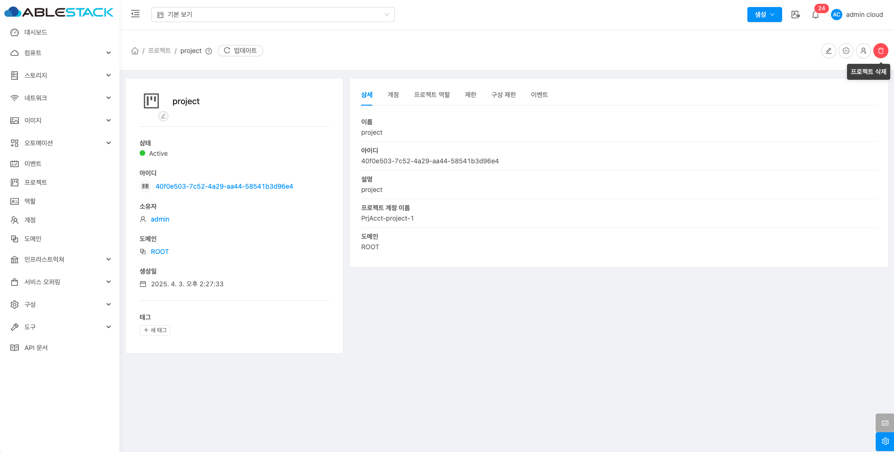
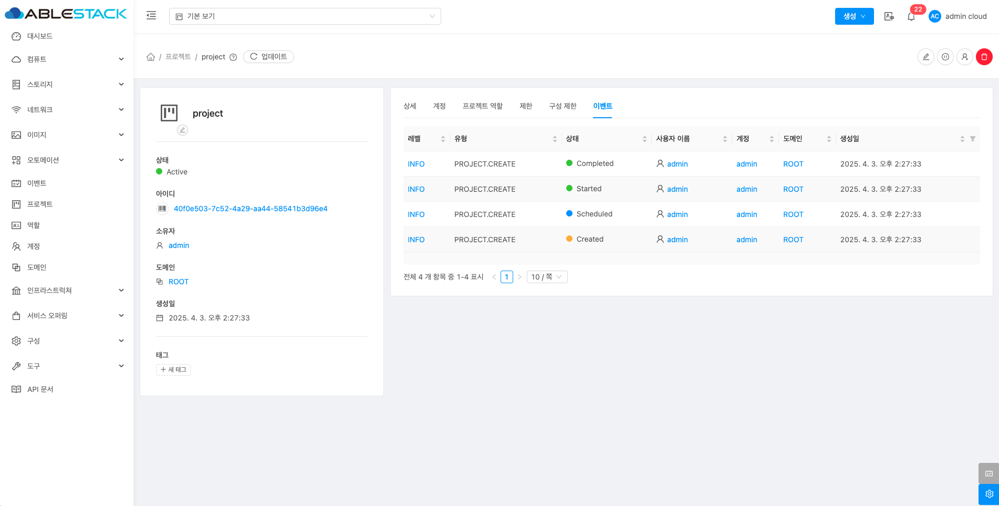

# 프로젝트

## 개요
프로젝트는 여러 사용자가 리소스를 공유하고 협력할 수 있도록 하는 단위입니다. 프로젝트 내의 사용자들은 가상 머신, 스토리지 등의 리소스를 함께 사용할 수 있으며 프로젝트 간에는 리소스가 격리됩니다. 관리자는 사용자 권한을 설정하고 프로젝트별로 정책을 적용할 수 있습니다.프로젝트는 팀 단위 협업과 보안 관리, 리소스 공유에 유용하게 활용됩니다.

## 목록 조회

1. 프로젝트 목록을 확인하는 화면입니다.
    생성된 프로젝트 목록을 확인하거나 새 프로젝트 버튼을 클릭하여 새 프로젝트를 생성할 수 있습니다.
    { .imgCenter .imgBorder }

## 새 프로젝트

1. 새 포로젝트 버튼 클릭 하여 프로젝트 추가 팝업을 호출합니다.

    { .imgCenter .imgBorder }

2. 새 프로젝트 추가를 위한 항목을 입력합니다.

    { .imgCenter .imgBorder }

    * **이름:** 이름을 입력합니다.
    * **설명:** 설명을 입력합니다.
    * **확인** 버튼을 클릭하여 새 프로젝트를 생성합니다.

## 편집

1. 해당 프로젝트의 정보를 편집합니다.

    { .imgCenter .imgBorder }

    * **프로젝트 상세 편집** 버튼을 클릭하여 프로젝트 상세 편집 화면을 호출합니다.

    { .imgCenter .imgBorder }

    * 수정할 **항목** 을 입력합니다.
    * **확인** 버튼을 클릭하여 프로젝트 정보를 업데이트합니다.

## 프로젝트 일시정지

1. 해당 프로젝트를 일시정지합니다.

    { .imgCenter .imgBorder }

    * **프로젝트 일시정지** 버튼을 클릭하여 프로젝트 일시정지 화면을 호출합니다.

    { .imgCenter .imgBorder }

    * **확인** 버튼을 클릭하여 프로젝트를 일시정지합니다.

## 프로젝트 활성화

1. 해당 프로젝트를 활성화합니다.

    { .imgCenter .imgBorder }

    * **프로젝트 활성화** 버튼을 클릭하여 프로젝트 활성화 화면을 호출합니다.

    { .imgCenter .imgBorder }

    * **확인** 버튼을 클릭하여 프로젝트를 활성화합니다.

## 프로젝트에 계정 추가

1. 해당 프로젝트에 계정 또는 사용자를 추가화합니다.

    { .imgCenter .imgBorder }

    * **프로젝트에 계정 추가** 버튼을 클릭하여 프로젝트에 계정 추가 화면을 호출합니다.

    { .imgCenter .imgBorder }

    * **계정:** 계정을 선택합니다.
    * **이메일:** 이메일을 입력합니다.
    * **프로젝트 역할:** 프로젝트 역할을 선택합니다.
    * **확인** 버튼을 클릭하여 프로젝트에 계정 또는 사용자를 추가합니다.

## 프로젝트 삭제

1. 해당 프로젝트를 삭제합니다.

    { .imgCenter .imgBorder }

    * **프로젝트 삭제** 버튼을 클릭하여 프로젝트 삭제 화면을 호출합니다.

    { .imgCenter .imgBorder }

    * **확인** 버튼을 클릭하여 프로젝트를 삭제합니다.

## 상세 탭

1. 프로젝트에 대한 상세정보를 조회하는 화면입니다. 해당 프로젝트의 이름, 아이디, 설명, 프로젝트 계정 이름, 도메인 등의 정보를 확인할 수 있습니다.

    { .imgCenter .imgBorder }

## 계정 탭

1. 해당 프로젝트에 포함된 계정 정보를 확인할 수 있습니다.

    { .imgCenter .imgBorder }

## 프로젝트 역할 탭

1. 프로젝트에서 사용하는 역할을 조회 및 관리하는 화면입니다. 해당 프로젝트의 역할을 생성, 수정, 삭제 할 수 있습니다.

    { .imgCenter .imgBorder }

### 프로젝트 역할 생성

1. 프로젝트 역할을 생성할 수 있습니다.

    { .imgCenter .imgBorder }

    * **프로젝트 역할 생성** 버튼을 클릭하여 프로젝트 역할 생성 화면을 호출합니다.

    { .imgCenter .imgBorder }

    * **이름:** 이름을 입력합니다.
    * **설명:** 설명을 입력합니다.
    * **확인** 버튼을 클릭하여 프로젝트 역할을 생성합니다.

### 프로젝트 역할 수정, 삭제

1. 프로젝트 역할을 수정 및 삭제할 수 있습니다.

    { .imgCenter .imgBorder }

    * **프로젝트 역할 업데이트** 버튼을 클릭하여 역할을 업데이트할 수 있습니다.
    * **프로젝트 역할 삭제** 버튼을 클릭하여 역할을 삭제할 수 있습니다.

### 새 규칙 저장

1. 프로젝트 역할에 새로운 규칙을 등록합니다.

    { .imgCenter .imgBorder }

    * **Rule:** Rule을 선택합니다.
    * **Description:** Description을 입력합니다.
    * **새 규칙 저장** 버튼을 클릭하여 규칙을 추가합니다.

### 규칙 삭제

1. 프로젝트 역할의 규칙을 삭제합니다.

    { .imgCenter .imgBorder }

    * **규칙 삭제** 버튼을 클릭하여 규칙을 삭제합니다.

## 제한 탭

1. 해당 프로젝트에 할당된 자원에 대하여 ( 사용됨/제한 ) 으로 계산하여 시각적으로 보여주는 화면입니다.

    { .imgCenter .imgBorder }

## 구성 제한 탭

1. 해당 프로젝트에 리소스를 할당하는 기능입니다. 해당 기능을 통해 프로젝트에서 사용 가능한 자원의 최대값을 설정할 수 있습니다.

    { .imgCenter .imgBorder }

    * 자원 할당 수를 확인 하거나 변경합니다.

    { .imgCenter .imgBorder }

    * **보내기** 버튼을 클릭하여 구성 제한을 편경합니다.

## 이벤트 탭

1. 프로젝트에 관련된 이벤트 정보를 확인할 수 있는 화면입니다. 프로젝트에서 발생한 다양한 액션과 변경 사항을 쉽게 파악할 수 있습니다.

    { .imgCenter .imgBorder }
