# 역할

## 개요
역할은 사용자의 권한을 관리하는 기능으로, 관리자가 역할별로 접근 권한을 설정할 수 있습니다. 이를 통해 각 사용자가 수행할 수 있는 작업을 세부적으로 제어할 수 있습니다. 예를 들어 관리자는 모든 리소스를 관리할 수 있는 권한을, 일반 사용자는 제한된 작업만 할 수 있도록 설정할 수 있습니다. 이를 통해 ABLESTACK 클라우드 리소스를 안전하고 효율적으로 관리할 수 있으며 각 역할에 맞는 적절한 권한을 부여하여 보안을 강화할 수 있습니다.

## 목록 조회

1. 역할 목록을 확인하는 화면입니다.
    생성된 역할 목록을 확인하거나 역할 추가 버튼을 클릭하여 역할를 추가할 수 있습니다.

    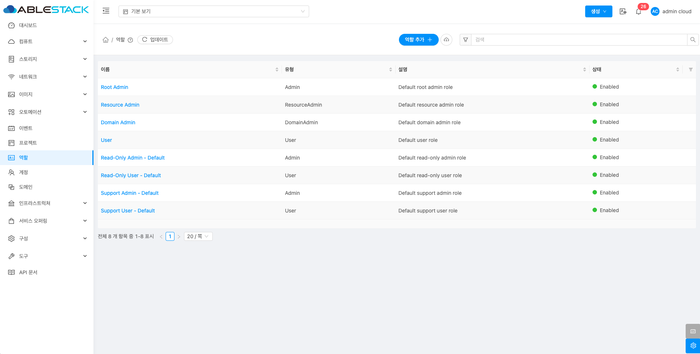{ .imgCenter .imgBorder }

## 역할 추가

1. 역할 추가 버튼 클릭 하여 역할 추가 팝업을 호출합니다.

    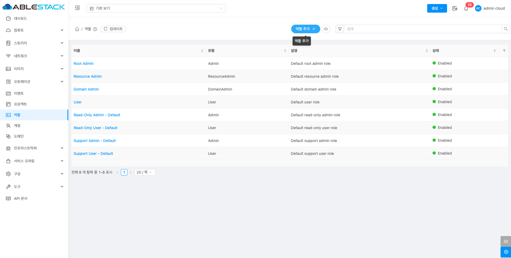{ .imgCenter .imgBorder }

2. 역할 추가를 위한 항목을 입력합니다.

    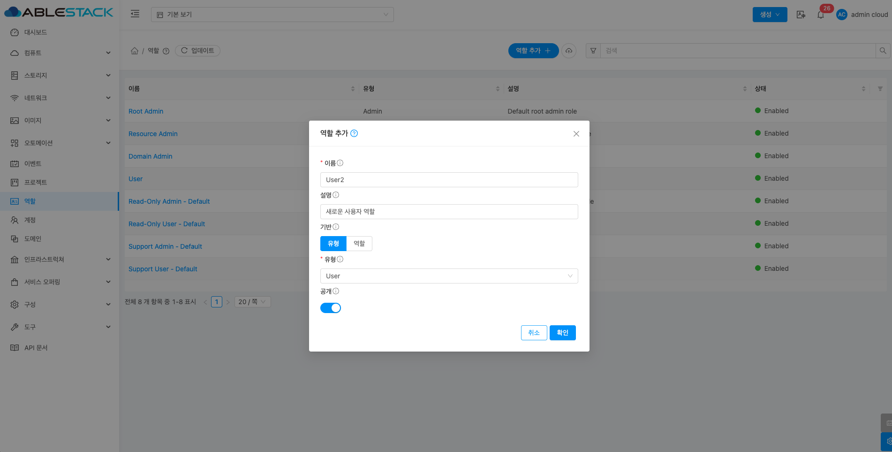{ .imgCenter .imgBorder }

    * **이름:** 이름을 입력합니다.
    * **설명:** 설명을 입력합니다.
    * **기반:** 기반을 선택합니다.
    * **유형:** 유형을 선택합니다.
    * **확인** 버튼을 클릭하여 역할를 추가합니다.

## 역할 가져오기

1. 역할 가져오기 버튼 클릭 하여 역할 가져오기 팝업을 호출합니다.

    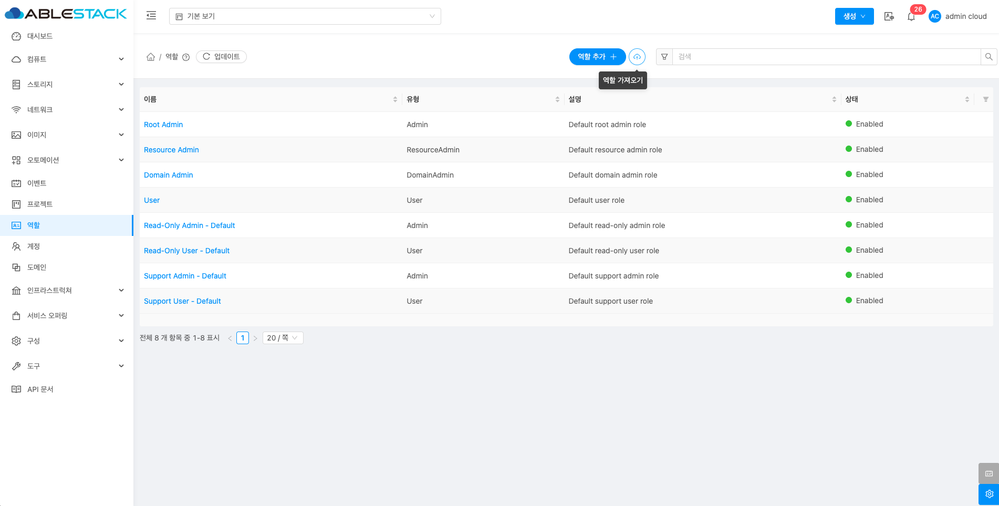{ .imgCenter .imgBorder }

2. 역할 가져오기를 위한 항목을 입력합니다.

    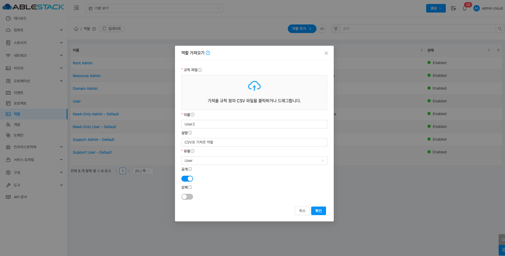{ .imgCenter .imgBorder }

    * **규칙 파일:** 규칙 파일을 업로드합니다.
    * **이름:** 이름을 입력합니다.
    * **설명:** 설명을 입력합니다.
    * **유형:** 유형을 선택합니다.
    * **확인** 버튼을 클릭하여 역할를 CSV르 import 하여 추가합니다.

## 역할 비활성화

1. 해당 역할을 비활성화합니다.

    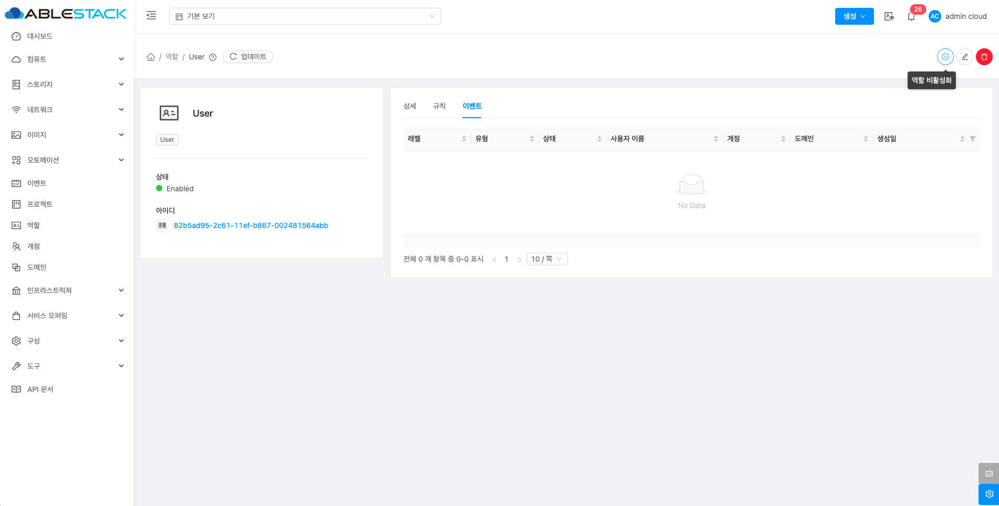{ .imgCenter .imgBorder }

    * **역할 비활성화** 버튼을 클릭하여 역할 비활성화 화면을 호출합니다.

    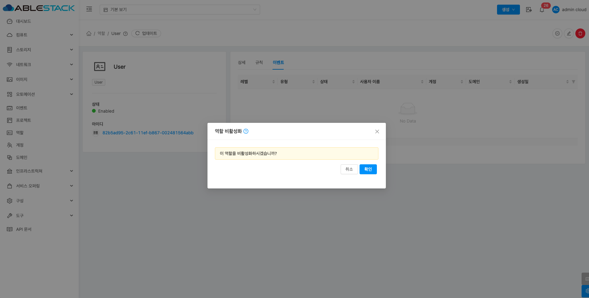{ .imgCenter .imgBorder }

    * **확인** 버튼을 클릭하여 역할 비활성화합니다.

## 역할 활성화

1. 해당 역할를 활성화합니다.

    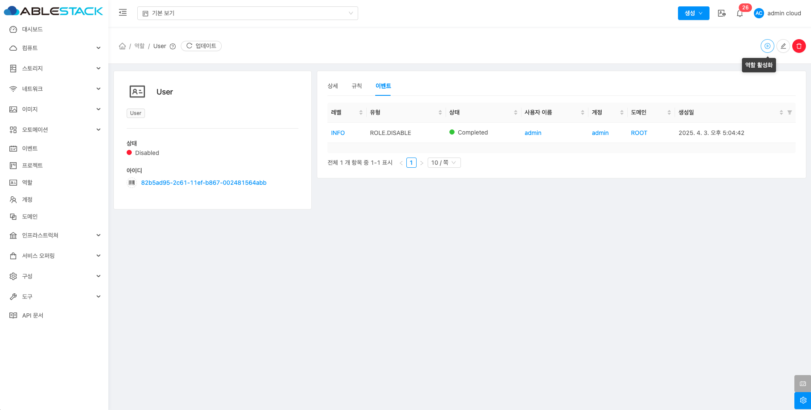{ .imgCenter .imgBorder }

    * **역할 활성화** 버튼을 클릭하여 역할 활성화 화면을 호출합니다.

    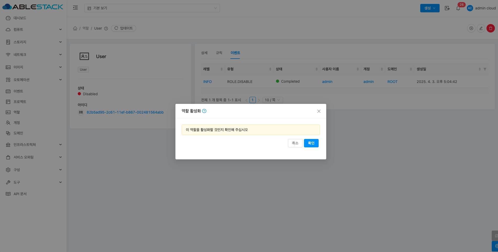{ .imgCenter .imgBorder }

    * **확인** 버튼을 클릭하여 역할 활성화합니다.

## 역할 편집

1. 해당 역할 정보를 편집합니다.

    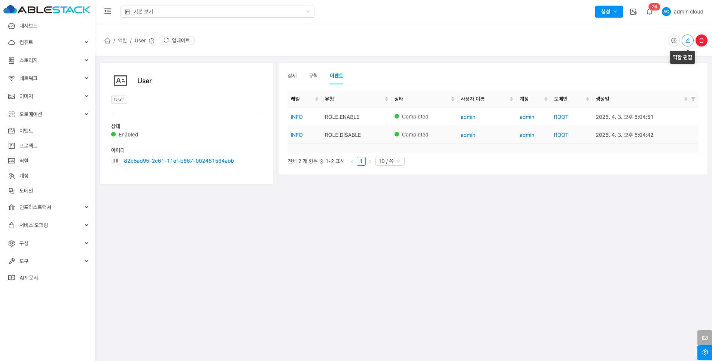{ .imgCenter .imgBorder }

    * **역할 편집** 버튼을 클릭하여 편집 화면을 호출합니다.

    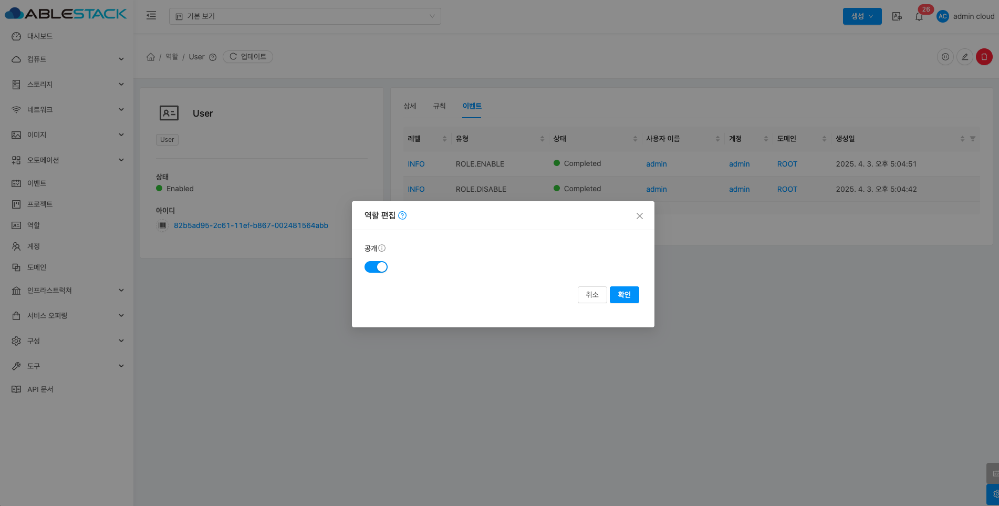{ .imgCenter .imgBorder }

    * 수정할 **항목** 을 입력합니다.
    * **확인** 버튼을 클릭하여 역할를 업데이트합니다.

## 역할 삭제

1. 해당 역할를 삭제합니다.

    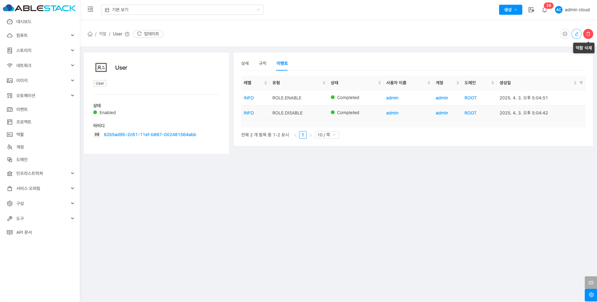{ .imgCenter .imgBorder }

    * **역할 삭제** 버튼을 클릭하여 역할 삭제 화면을 호출합니다.

    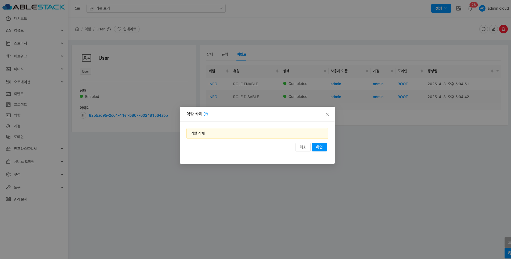{ .imgCenter .imgBorder }

    * **확인** 버튼을 클릭하여 역할을 삭제합니다.

## 상세 탭

1. 역할에 대한 상세정보를 조회하는 화면입니다. 해당 역할의 이름, 아이디, 유형, 설명, 공개 등의 정보를 확인할 수 있습니다.

    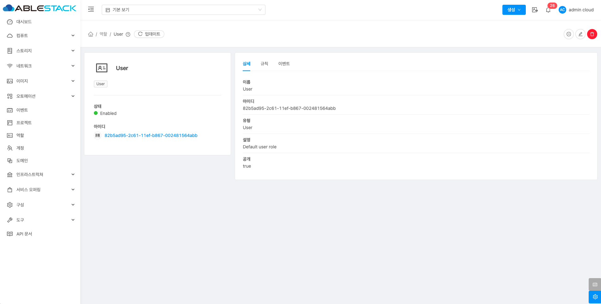{ .imgCenter .imgBorder }

## 규칙 탭

1. 해당 역할 규칙을 조회하거나 편집할 수 있습니다.

    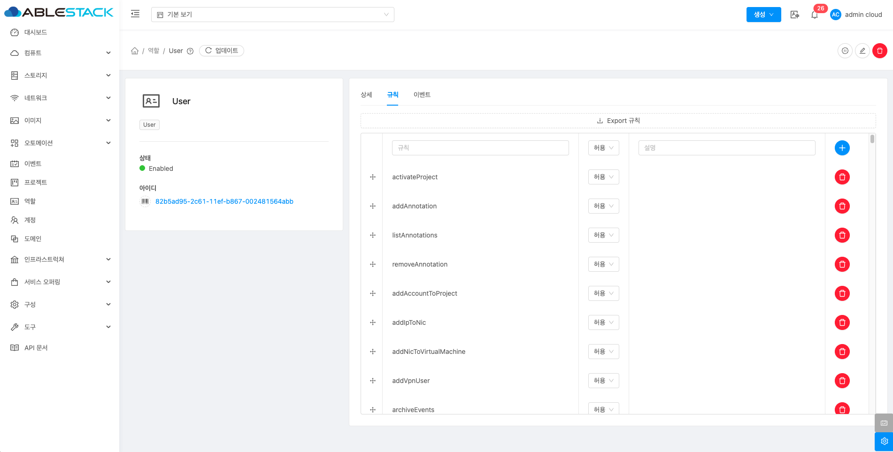{ .imgCenter .imgBorder }

### Export 규칙

1. 해당 역할 규칙 csv 파일로 내보내기 합니다.

    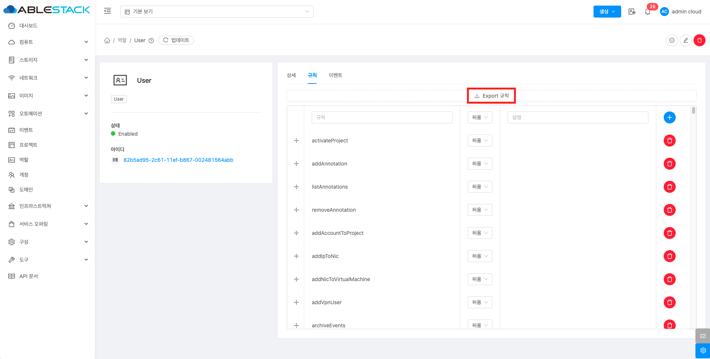{ .imgCenter .imgBorder }

    * **Export 규칙** 버튼을 클릭하여 규칙을 csv 형식으로 내보내기 합니다.

### 새 규칙 저장

1. 해당 역할에 규칙을 추가할 수 있습니다.

    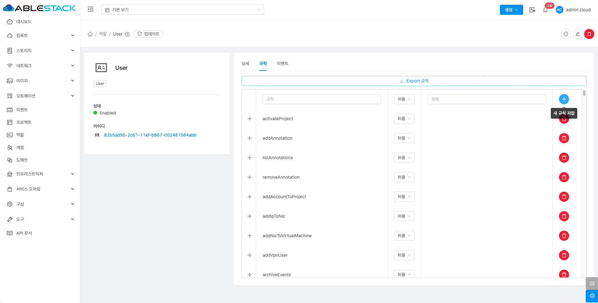{ .imgCenter .imgBorder }

    * **규칙:** 규칙을 선택합니다.
    * **설명:**설명을 입력합니다.
    * **새 규칙 저장** 버튼을 클릭하여 규칙 저장합니다.

### 규칙 삭제

1. 해당 역할에 규칙을 삭제할 수 있습니다.

    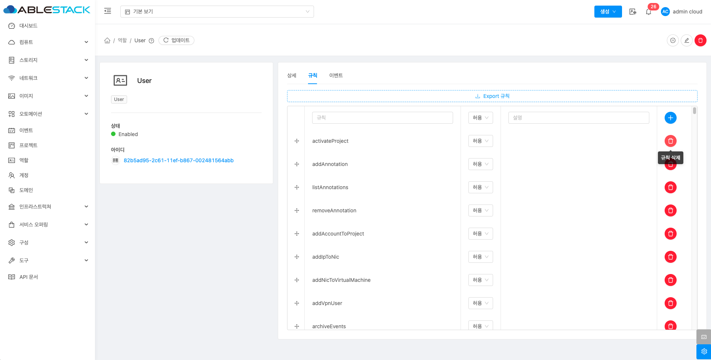{ .imgCenter .imgBorder }

    * **규칙 삭제** 버튼을 클릭하여 규칙 삭제합니다.

## 이벤트 탭

1. 역할에 관련된 이벤트 정보를 확인할 수 있는 화면입니다. 역할에서 발생한 다양한 액션과 변경 사항을 쉽게 파악할 수 있습니다.

    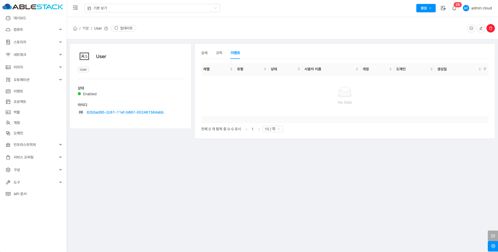{ .imgCenter .imgBorder }
