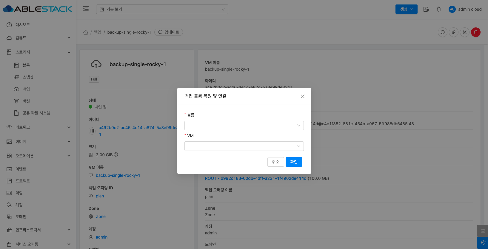

# 백업

## 개요
사용자가 3rd party 백업 솔루션을 통해 Guest Instance(가상머신)를 백업하고 복구할 수 있는 기능을 제공합니다.

VMware with Veeam Backup, KVM with DELL EMC Networker, KVM with NAS, KVM with Commvault 백업 솔루션을 지원합니다.

## 백업 목록 조회
1. 모든 백업의 목록을 확인하는 화면입니다. 생성된 백업 목록을 확인하거나 정보를 확인할 수 있습니다..
    { .imgCenter .imgBorder }

## 백업 생성
1. 백업 생성은 해당 가상머신의 상세 페이지에서 **백업 시작** 버튼을 클릭합니다.
    { .imgCenter .imgBorder }
2. 백업 시작 버튼을 클릭한 화면입니다.
    { .imgCenter .imgBorder }
3. 생성된 백업은 스토리지의 백업 목록에서 확인하실 수 있습니다.

## 백업 삭제
1. 백업 상세 오른쪽 상단의 백업 삭제 버튼을 클릭합니다.
    { .imgCenter .imgBorder }
2. 백업 삭제 버튼을 클릭한 화면입니다.
    { .imgCenter .imgBorder }

!!! warning
    - 강제: 체크 시 백업 체인을 삭제하지만, 가상머신의 백업 오퍼링은 유지합니다.

## 가상머신 백업 복원
1. 백업 상세 오른쪽 상단의 가상머신 백업 복원 버튼을 클릭합니다.
    { .imgCenter .imgBorder }
2. 가상머신 백업 복원 버튼을 클릭한 화면입니다.
    { .imgCenter .imgBorder }

    !!! info
        가상머신 백업 복원할 경우, 가상머신의 상태가 **정지 중** 이어야 실행됩니다.

## 백업 볼륨 복원 및 연결
1. 백업 상세 오른쪽 상단의 백업 볼륨 복원 및 연결버튼을 클릭합니다.
    { .imgCenter .imgBorder }
2. 백업 볼륨 복원 및 연결 버튼을 클릭한 화면입니다.
    { .imgCenter .imgBorder }
    - **볼륨:** 복원할 볼륨을 선택합니다.
    - **VM:** 복원된 볼륨을 연결할 가상머신을 선택합니다.

    !!! info
        글로벌 설정의 backup.enable.attach.detach.of.volumes 항목이 활성화 되어있어야 해당 기능 사용이 가능하며, 복원된 볼륨은 해당 가상머신의 데이터 디스크로 연결됩니다.

## 가상머신에 백업 오퍼링 제거
1. 백업 상세 오른쪽 상단의 가상머신에 백업 오퍼링 제거 버튼을 클릭합니다.
    { .imgCenter .imgBorder }
2. 가상머신에 백업 오퍼링 제거 버튼을 클릭한 화면입니다.
    { .imgCenter .imgBorder }

    !!! danger
        가상머신에 백업 오퍼링을 제거할 경우 해당 가상머신에서 생성된 백업은 모두 삭제됩니다.
