# 버킷
!!! check
    버킷을 생성하기 전에 반드시 확인하세요!

    1. 지원되는 개체 저장소 시스템이 설정되어 있어야 합니다.

    2. 설정된 개체 저장소 시스템을 개체 저장소 풀에 추가해야 합니다.

    3. 적절한 액세스 정책 및 권한을 사전에 구성하는 것이 좋습니다.

    👉 &nbsp;&nbsp;🔗[Object 스토리지 가이드](./mold-admin-guide-storage-volume.md/#_3)

## 개요

버킷은 개체(Object)를 저장하기 위한 논리적 컨테이너로, 개체 저장소에서 데이터를 효율적으로 관리하는 기본 단위입니다.
일반적인 파일 시스템과 달리, 개체 저장소에서는 데이터가 파일이 아닌 개체 단위로 저장됩니다. 즉, 각 개체는 메타데이터와 고유한 식별자를 가지며, 독립적으로 관리됩니다.

버킷은 이미지, 동영상, 문서, 로그 파일 등 모든 유형의 데이터를 저장할 수 있으며, 대량의 데이터를 안정적으로 보관하는 데 적합합니다.

또한, 버킷은 퍼블릭 또는 프라이빗으로 설정할 수 있어 보안 요구 사항에 따라 접근 권한을 조정할 수 있습니다.
기업 환경에서는 버킷을 활용하여 백업, 아카이빙, 빅데이터 분석 등 다양한 용도로 데이터를 저장하고 관리합니다.
이처럼, 버킷은 개체 저장소에서 데이터를 저장하고 조직화하는 핵심 요소로 작용합니다.

## 버킷 목록 조회
1. 모든 버킷 목록을 확인하는 화면입니다. 생성된 버킷 목록을 확인하거나 정보를 확인할 수 있습니다.
    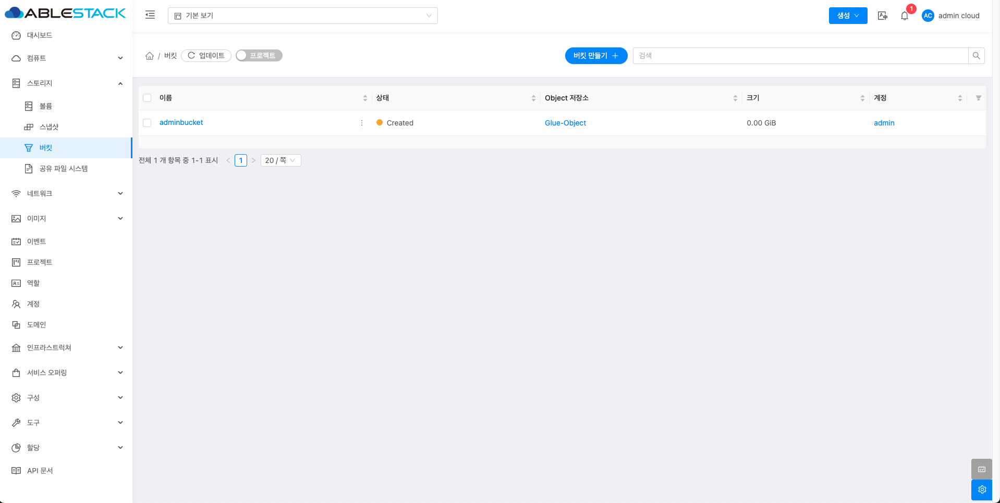{ .imgCenter .imgBorder }

    !!! info
        프로젝트 버튼을 활성화할 때 해당 프로젝트에 대한 정보를 버킷 목록에서 확인할 수 있습니다.

## 버킷 만들기
1. 스토리지의 버킷에서 상단의 버킷 만들기 버튼을 클릭합니다.
    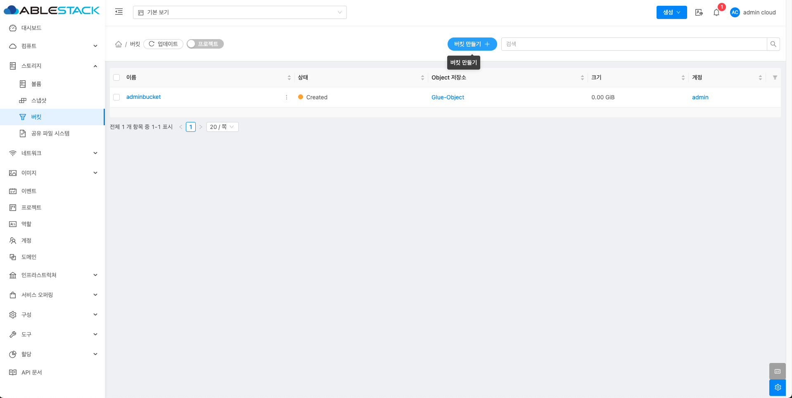{ .imgCenter .imgBorder }
2. 버킷 만들기 버튼을 클릭한 화면입니다.
    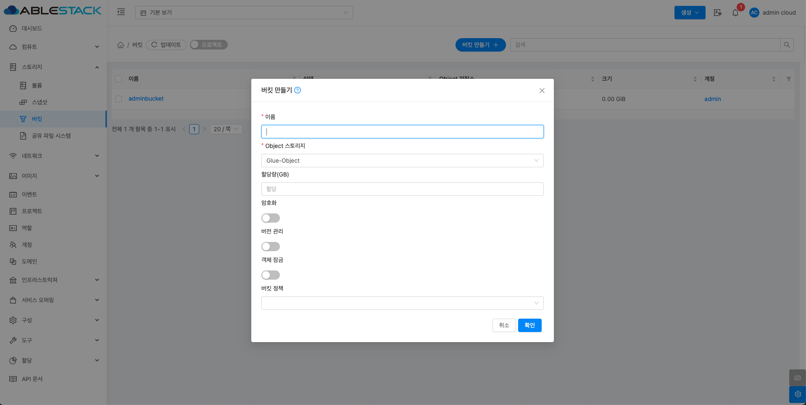{ .imgCenter .imgBorder }
    - **이름:** 이름을 입력합니다.
    - **Object 스토리지:** Object 스토리지를 선택합니다.
    - **할당량(GB):** 할당량(GB)을 입력합니다.
    - **버킷 정책:** 버킷 정책을 선택합니다.

## 버킷 삭제
1. 버킷 상세 오른쪽 상단의 버킷 삭제 버튼을 클릭합니다.
    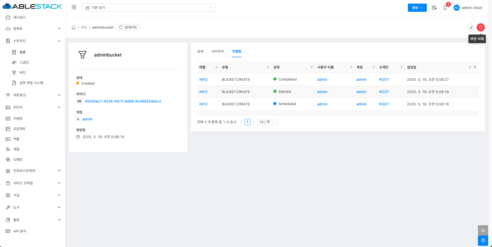{ .imgCenter .imgBorder }
2. 버킷 삭제 버튼을 클릭한 화면입니다.
    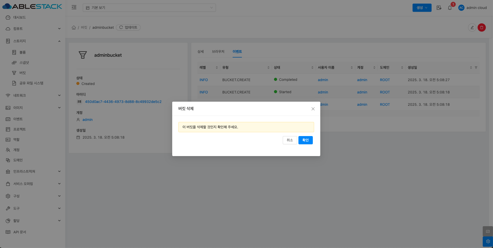{ .imgCenter .imgBorder }

## 버킷 업데이트
1. 버킷 상세 오른쪽 상단의 버킷 업데이트 버튼을 클릭합니다.
    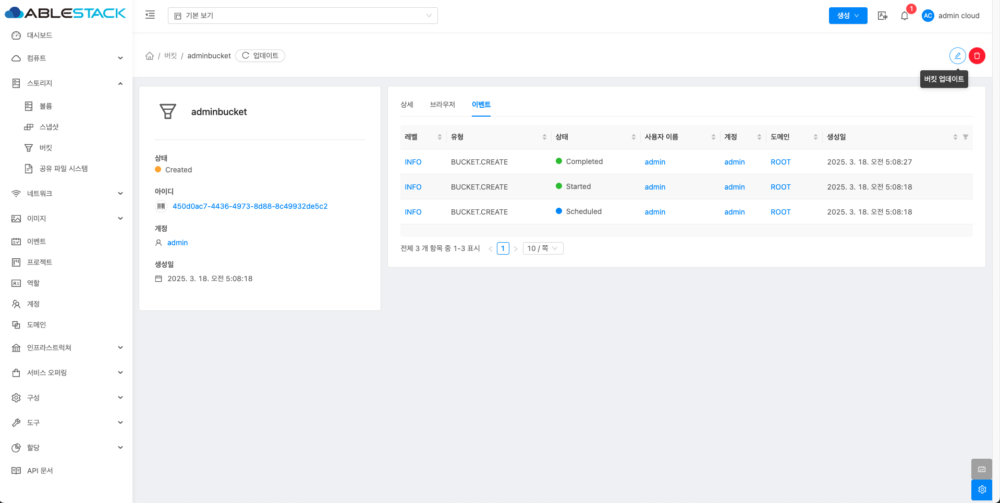{ .imgCenter .imgBorder }
2. 버킷 업데이트 버튼을 클릭한 화면입니다.
    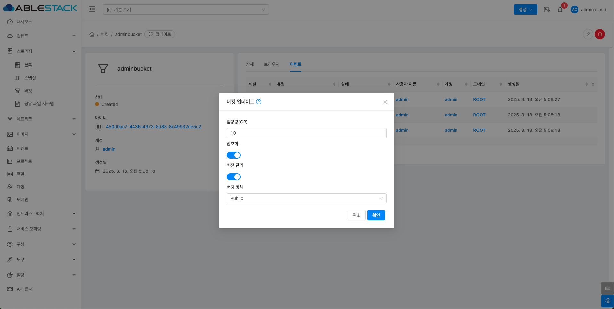{ .imgCenter .imgBorder }
    - **할당량(GB):** 할당량(GB)을 입력합니다.
    - **버킷 정책:** 버킷 정책을 선택합니다.

### 삭제
6. 업로드된 파일을 삭제할 수 있습니다. 삭제할 파일을 선택한 후 삭제 버튼을 클릭하면 해당 파일이 제거됩니다.
    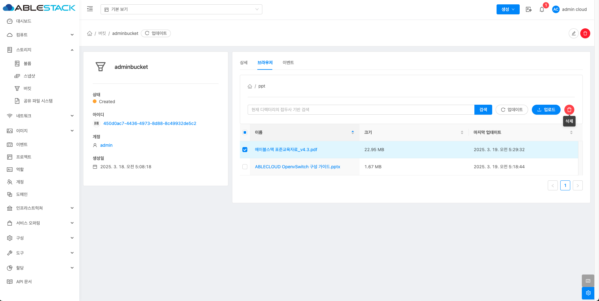{ .imgCenter .imgBorder }

## 버킷 상세 탭
1. 버킷 목록 조회에서 확인하고 싶은 버킷 목록을 조회합니다. 버킷에 대한 상세 정보를 확인하는 화면입니다. 해당 버킷에 대한 크기, UUID, 이름 등 상세 정보를 확인할 수 있습니다.
    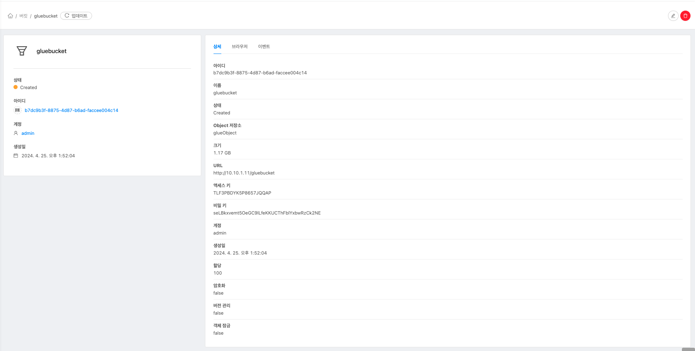{ .imgCenter .imgBorder }

## 버킷 브라우저 탭
1. 버킷에 대한 브라우저를 확인 및 관리하는 화면입니다. 해당 버킷에서 조회 및 관리할 수 있습니다.
    { .imgCenter .imgBorder }

### 업로드
2. 해당 버킷에 객체 형태의 파일을 업로드할 수 있는 기능을 제공합니다. 업로드 버튼을 클릭합니다.
    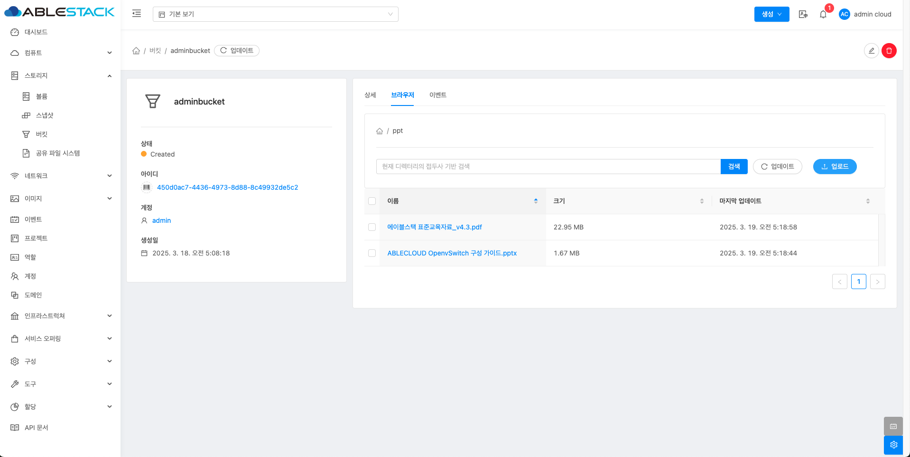{ .imgCenter .imgBorder }
3. 업로드 버튼을 클릭한 화면입니다.
    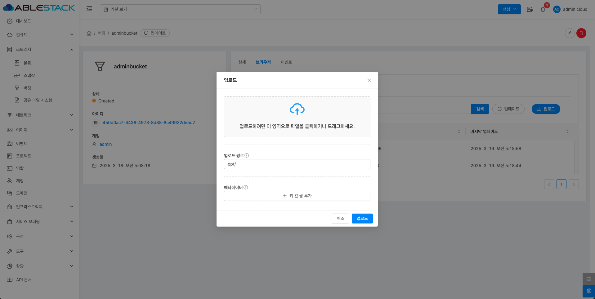{ .imgCenter .imgBorder }

### 다운로드
4. 업로드된 파일을 다운로드 할 수 있는 기능을 제공합니다. 해당 파일 이름을 클릭합니다.
    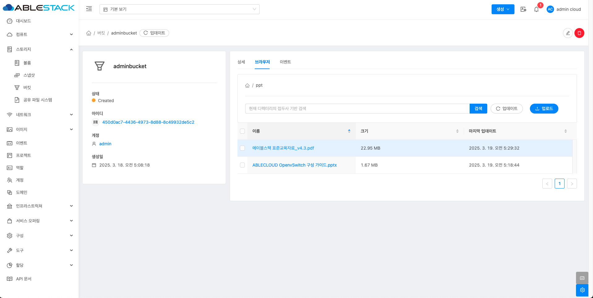{ .imgCenter .imgBorder }
5. 파일 이름을 클릭한 화면입니다. Link를 클릭하여 다운로드 받으세요.
    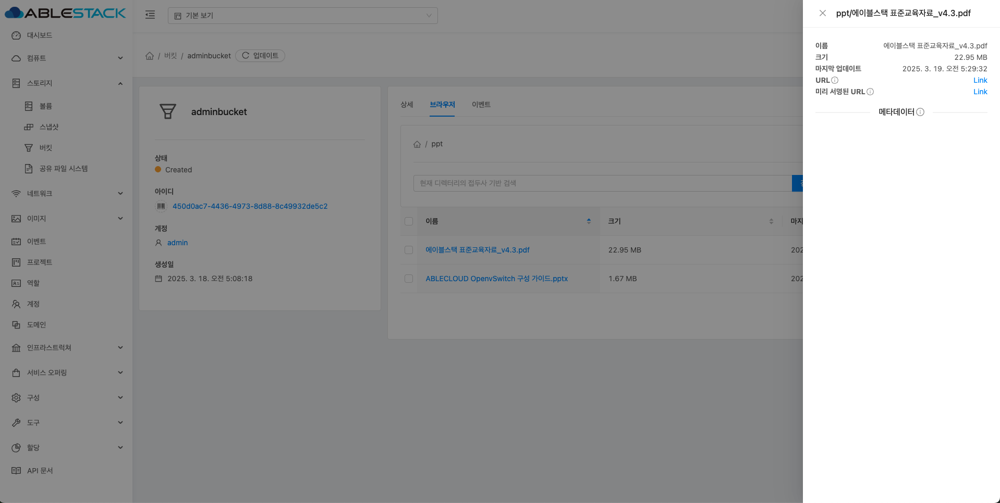{ .imgCenter .imgBorder }

## 버킷 이벤트 탭
1. 버킷 목록 조회에서 확인하고 싶은 버킷 목록을 조회합니다. 버킷에 대한 이벤트 정보를 확인하는 화면입니다. 해당 버킷의 유형 및 생성일 등 확인할 수 있습니다.
    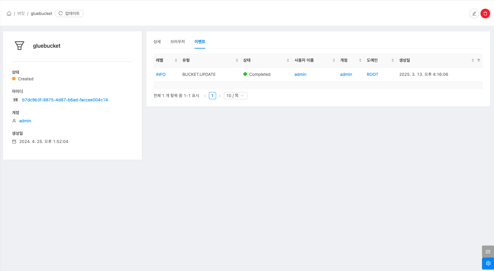{ .imgCenter .imgBorder }

## 용어사전
* 암호화
    * 저장되는 데이터를 자동으로 암호화하여 보안성을 높이는 기능

* 버전 관리
    * 동일한 객체 이름으로 파일을 덮어쓸 때, 이전 버전을 삭제하지 않고 모든 변경 이력을 저장하는 기능

* 객체 잠금
    * 특정 객체를 일정 기간 동안 삭제하거나 변경할 수 없도록 보호하는 기능

* 버킷 정책
    * 버킷에 저장된 객체에 접근할 수 있는 기본 접근 권한 수준을 설정하는 기능
