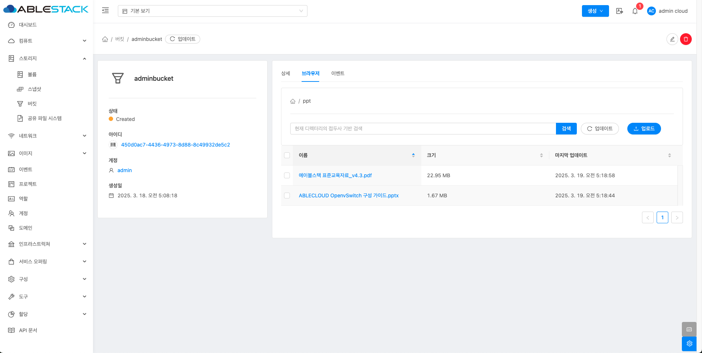

# 버킷
!!! check
    버킷을 생성하기 전에 반드시 확인하세요! 
    1. 지원되는 개체 저장소 시스템이 설정되어 있어야 합니다. 
    2. 설정된 개체 저장소 시스템을 개체 저장소 풀에 추가해야 합니다. 
    3. 적절한 액세스 정책 및 권한을 사전에 구성하는 것이 좋습니다.  
    👉 &nbsp;&nbsp;🔗[Object 스토리지 가이드](./mold-admin-guide-storage-volume.md/#_3)

버킷은 개체(Object)를 저장하기 위한 논리적 컨테이너로, 개체 저장소에서 데이터를 효율적으로 관리하는 기본 단위입니다. 
일반적인 파일 시스템과 달리, 개체 저장소에서는 데이터가 파일이 아닌 개체 단위로 저장됩니다. 즉, 각 개체는 메타데이터와 고유한 식별자를 가지며, 독립적으로 관리됩니다.  
버킷은 이미지, 동영상, 문서, 로그 파일 등 모든 유형의 데이터를 저장할 수 있으며, 대량의 데이터를 안정적으로 보관하는 데 적합합니다. 
또한, 버킷은 퍼블릭 또는 프라이빗으로 설정할 수 있어 보안 요구 사항에 따라 접근 권한을 조정할 수 있습니다. 
기업 환경에서는 버킷을 활용하여 백업, 아카이빙, 빅데이터 분석 등 다양한 용도로 데이터를 저장하고 관리합니다. 
이처럼, 버킷은 개체 저장소에서 데이터를 저장하고 조직화하는 핵심 요소로 작용합니다.

## 버킷 목록 조회
1. 모든 버킷 목록을 확인하는 화면입니다. 생성된 버킷 목록을 확인하거나 정보를 확인할 수 있습니다.
    { align=center }

    !!! info
        프로젝트 버튼을 활성화할 때 해당 프로젝트에 대한 정보를 볼륨 목록에서 확인할 수 있습니다.

## 버킷 만들기
1. 스토리지의 버킷에서 상단의 버킷 만들기 버튼을 클릭합니다.
    { align=center }
    - **이름** 을 입력합니다.
    - **Object 스토리지** 를 선택합니다.
    - **할당량(GB)** 을 입력합니다.
    - **버킷 정책** 을 선택합니다.

## 버킷 상세 정보
1. 버킷에 대한 상세 정보를 확인하는 화면입니다. 해당 버킷에 대한 크기, UUID, 이름 등 상세 정보를 확인할 수 있습니다.
    { align=center }

## 버킷 브라우저
1. 버킷에 대한 브라우저를 확인 및 관리하는 화면입니다. 해당 버킷에 대한 저장, 삭제, 다운로드 기능을 사용할 수 있습니다.
    { align=center }

## 버킷 이벤트
1. 버킷에 대한 이벤트 정보를 확인하는 화면입니다. 해당 버킷의 유형 및 생성일 등 확인할 수 있습니다.
    { align=center }

## 버킷 업데이트
1. 버킷 상세 오른쪽 상단의 버킷 업데이트 버튼을 클릭한 화면입니다.
    { align=center }
    - **할당량(GB)** 을 입력합니다.
    - **버킷 정책** 을 선택합니다.

## 버킷 삭제
1. 버킷 상세 오른쪽 상단의 버킷 삭제 버튼을 클릭한 화면입니다.
    { align=center }
