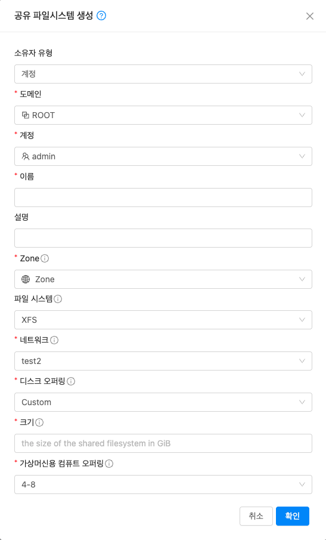
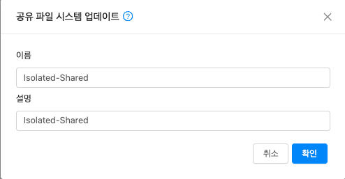
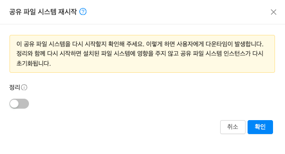
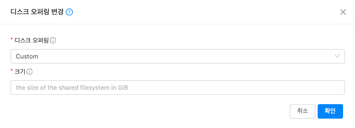
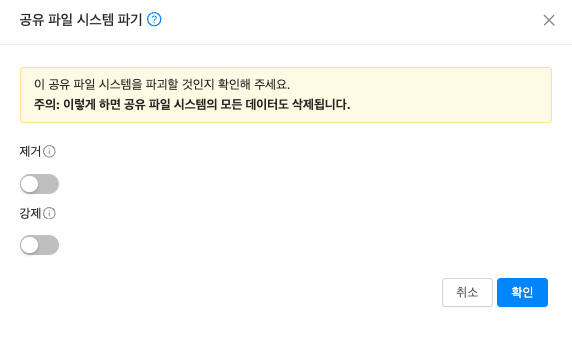

# 공유 파일 시스템
NFS를 통해 마운트할 수 있는 관리 공유 파일 시스템을 설정할 수 있습니다. 
사용자는 서비스 제공, 디스크 제공, 파일 시스템 형식 및 네트워크를 선택할 수 있습니다.  
공유 파일 시스템은 지정된 서비스 제공이 있는 인스턴스에 배포됩니다. 
제공된 디스크 제공을 사용하여 데이터 볼륨이 생성되고 인스턴스에 연결됩니다. 
사용자는 사용할 파일 시스템(XFS, EXT4)을 지정할 수 있습니다. 
파일 시스템은 데이터 볼륨에 생성되고 NFS를 통해 내보내집니다.  
게스트 네트워크의 모든 인스턴스는 공유 파일 시스템을 마운트하고 읽고 쓸 수 있습니다. 

## 공유 파일 시스템 목록 조회
1. 모든 공유 파일 시스템 목록을 확인하는 화면입니다. 생성된 공유 파일 시스템 목록을 확인하거나 공유 파일 시스템 생성 버튼을 클릭하여 공유 파일 시스템을 생성 및 추가하실 수 있습니다.
    { align=center }

    !!! info
        매트릭 버튼을 활성화할 때 해당 디스크에 대한 상세 정보를 볼륨 목록에서 확인할 수 있습니다.  
        프로젝트 버튼을 활성화할 때 해당 프로젝트에 대한 정보를 볼륨 목록에서 확인할 수 있습니다.

## 공유 파일 시스템 생성
1. 스토리지의 공유 파일 시스템에 상단의 공유 파일 시스템 생성 버튼을 클릭합니다.
    { align=center }
    - **소유자 유형** 을 선택합니다.
    - **도메인** 을 선택합니다.
    - **계정** 을 선택합니다.
    - **이름** 을 입력합니다.
    - **설명** 을 입력합니다.
    - **Zone** 을 선택합니다.
    - **파일 시스템** 을 선택합니다.
    - **네트워크** 를 선택합니다.
    - **디스크 오퍼링** 을 선택합니다.
    - **크기** 를 입력합니다.
    - **가상머신용 컴퓨트 오퍼링** 을 선택합니다.

    !!! info
        네트워크, 디스크 오퍼링, 가상머신용 컴퓨트 오퍼링 경우, 미리 사전에 생성되어 있어야 합니다. 
        👉 &nbsp;&nbsp;🔗[네트워크 생성 가이드](./mold-admin-guide-storage-volume.md/#_3) 
        👉 &nbsp;&nbsp;🔗[디스크 오퍼링 생성 가이드](./mold-admin-guide-storage-volume.md/#_3) 
        👉 &nbsp;&nbsp;🔗[가상머신용 컴퓨트 오퍼링 생성 가이드](./mold-admin-guide-storage-volume.md/#_3)

## 공유 파일 시스템 상세 정보
1. 공유 파일 시스템에 대한 상세 정보를 확인하는 화면입니다. 해당 공유 파일 시스템에 대한 크기, UUID, 이름 등 상세 정보를 확인할 수 있습니다.
    { align=center }

## 공유 파일 시스템 액세스 정보
1. 공유 파일 시스템에 대한 액세스 정보를 확인하는 화면입니다. 해당 공유 파일 시스템에 대한 마운트 정보를 확인할 수 있습니다.
    { align=center }

## 공유 파일 시스템 네트워크 정보
1. 공유 파일 시스템에 대한 네트워크 정보를 확인하는 화면입니다. 해당 공유 파일 시스템에 대한 네트워크 정보를 확인할 수 있습니다.
    { align=center }

    !!! info
        해당 탭에서 VM에 네트워크 추가는 네트워크 생성과 동일한 화면입니다. 
        👉 &nbsp;&nbsp;🔗[네트워크 생성 가이드](./mold-admin-guide-storage-volume.md/#_3) 

## 공유 파일 시스템 매트릭 정보
1. 공유 파일 시스템에 대한 매트릭 정보를 확인하는 화면입니다. 해당 공유 파일 시스템에 대한 CPU, Memory, Network 등 할당량 및 사용량을 확인할 수 있습니다.
    { align=center }
    { align=center }

    !!! info
        사용자가 원하는 시간과 단위 등을 커스터마이징 할 수 있습니다.

## 공유 파일 시스템 이벤트 정보
1. 공유 파일 시스템에 대한 이벤트 정보를 확인하는 화면입니다. 해당 공유 파일 시스템에 대한 유형 및 생성일 등 확인할 수 있습니다.
    { align=center }

## 공유 파일 시스템 업데이트
1. 공유 파일 시스템 상세 오른쪽 상단의 공유 파일 시스템 업데이트 버튼을 클릭합니다.
    { align=center }
    - **이름** 을 입력합니다.
    - **설명** 을 입력합니다.

## 공유 파일 시스템 중지
!!! check
    공유 파일 시스템이 **실행중** 일 경우, 활성화됩니다.

1. 공유 파일 시스템 상세 오른쪽 상단의 공유 파일 시스템 중지 버튼을 클릭합니다.
    { align=center }

## 공유 파일 시스템 재시작
1. 공유 파일 시스템 상세 오른쪽 상단의 공유 파일 시스템 재시작 버튼을 클릭합니다.
    { align=center }

## 디스크 오퍼링 변경
1. 공유 파일 시스템 상세 오른쪽 상단의 디스크 오퍼링 변경 버튼을 클릭합니다.
    { align=center }
    - **디스크 오퍼링** 을 선택합니다.
    - **크기** 를 입력합니다.

    !!! info
        고정 디스크 오퍼링을 선택할 시, 해당 크기는 오퍼링에서 고정으로 할당된 값으로 만들어 집니다.

## 공유 파일 시스템 파기
1. 공유 파일 시스템 상세 오른쪽 상단의 공유 파일 시스템 파기 버튼을 클릭합니다.
    { align=center }

    !!! danger
        공유 파일 시스템에서 작업한 모든 데이터가 삭제됩니다. 삭제 전에 반드시 다시 확인해 주세요!

## 공유 파일 시스템 시작
!!! check
    공유 파일 시스템이 **정지된 상태** 일 경우, 활성화됩니다.

1. 공유 파일 시스템 상세 오른쪽 상단의 공유 파일 시스템 시작 버튼을 클릭합니다.
    { align=center }

## 서비스 오퍼링 변경
!!! check
    공유 파일 시스템이 **정지된 상태** 일 경우, 활성화됩니다.

1. 공유 파일 시스템 상세 오른쪽 상단의 서비스 오퍼링 변경 버튼을 클릭합니다.
    { align=center }
    - **컴퓨트 오퍼링** 을 선택합니다.
