# 공유 파일 시스템

## 개요

공유 파일 시스템은 전용 Storage Service System VM과 데이터 볼륨을 사용하여 파일 및 블록 스토리지 서비스를 제공하는 기능입니다.
하나의 공유 파일 시스템에서 NFS, SMB, iSCSI 및 NVMe-oF 가운데 하나 이상의 서비스를 선택하여 함께 운영할 수 있습니다.

공유 파일 시스템을 생성하면 선택한 가상머신용 컴퓨트 오퍼링으로 System VM이 배포되고 새 데이터 볼륨 또는 기존 데이터 볼륨이 백킹 볼륨으로 연결됩니다.
NFS와 SMB 파일 서비스의 백킹 볼륨에는 XFS 또는 EXT4 파일 시스템을 사용할 수 있습니다.
iSCSI와 NVMe-oF 블록 서비스는 백킹 볼륨을 LUN 또는 네임스페이스로 제공합니다.

NFS 내보내기 이름, SMB 공유 이름, iSCSI 대상 IQN 및 NVMe-oF 서브시스템 NQN은 클라이언트에서 사용하는 식별자입니다.
내부 백킹 경로와 클라이언트에서 사용하는 이름을 구분하여 설정해야 합니다.

!!! info
    최신 UI의 메뉴와 생성 화면에서는 **공유 파일 시스템**이라는 명칭을 사용합니다.
    이 문서에서 Storage Service는 공유 파일 시스템이 제공하는 다중 프로토콜 서비스 기능을 의미합니다.

## 사전 준비 사항

1. 공유 파일 시스템을 생성하기 전에 사용할 네트워크, 디스크 오퍼링 및 가상머신용 컴퓨트 오퍼링을 준비합니다.

    👉 &nbsp;&nbsp;🔗[네트워크 생성 가이드](../mold-admin-guide-network-guest-networks/#_5)

    👉 &nbsp;&nbsp;🔗[디스크 오퍼링 생성 가이드](../mold-admin-guide-offerings-disk-offerings/#_4)

    👉 &nbsp;&nbsp;🔗[가상머신용 컴퓨트 오퍼링 생성 가이드](../mold-admin-guide-offerings-compute-offerings/#_5)

2. 기존 데이터 볼륨을 사용할 경우 볼륨이 `Ready` 상태이고 다른 가상머신에 연결되어 있지 않은지 확인합니다.
3. 사용할 프로토콜에 맞는 클라이언트 도구와 네트워크 연결을 준비합니다.
    - NFS 클라이언트
    - SMB 클라이언트 또는 `smbclient`
    - iSCSI 초기자(Initiator)
    - NVMe CLI
4. SMB Active Directory, iSCSI CHAP와 같은 인증 기능을 사용할 경우 필요한 인증정보를 준비합니다.

!!! danger
    비밀번호와 CHAP Secret은 생성 또는 변경 요청에만 사용하는 민감정보입니다.
    인증정보를 문서, 명령 기록 또는 화면 이미지에 저장하지 마십시오.

## 공유 파일 시스템 목록 조회

1. **스토리지 > 공유 파일 시스템**을 선택합니다.
2. 생성된 공유 파일 시스템의 이름, 상태, 크기, 스토리지, 계정 및 Zone을 확인합니다.
3. 공유 파일 시스템을 생성하려면 오른쪽 상단의 **공유 파일시스템 생성** 버튼을 클릭합니다.

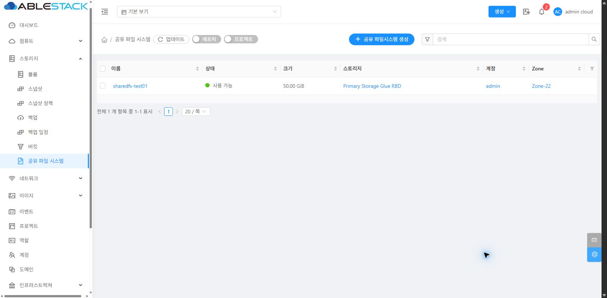{ .imgCenter .imgBorder }

!!! info
    메트릭 표시를 활성화하면 목록에서 읽기, 쓰기, 사용률 및 물리 크기와 같은 정보를 추가로 확인할 수 있습니다.

    프로젝트 표시를 활성화하면 공유 파일 시스템이 속한 프로젝트 정보를 확인할 수 있습니다.

## 공유 파일 시스템 생성

1. **스토리지 > 공유 파일 시스템**에서 **공유 파일시스템 생성** 버튼을 클릭합니다.
2. 기본 정보, 볼륨 및 백킹 용량, 서비스 선택과 프로토콜별 설정을 입력합니다.
3. 왼쪽의 입력 내용 검토 영역에서 선택한 항목을 확인하고 **확인** 버튼을 클릭합니다.
4. 생성 작업이 완료되면 목록에서 공유 파일 시스템의 상태를 확인합니다.

!!! check
    공유 파일 시스템 생성 후 선택한 프로토콜의 초기 개체가 준비될 때까지 시간이 걸릴 수 있습니다.
    성공 메시지만 확인하지 말고 상세 화면의 프로토콜 탭에서 내보내기, 공유, 대상 또는 네임스페이스의 상태를 확인합니다.

### 기본 정보

1. **기본 정보**를 확장하고 다음 항목을 입력합니다.

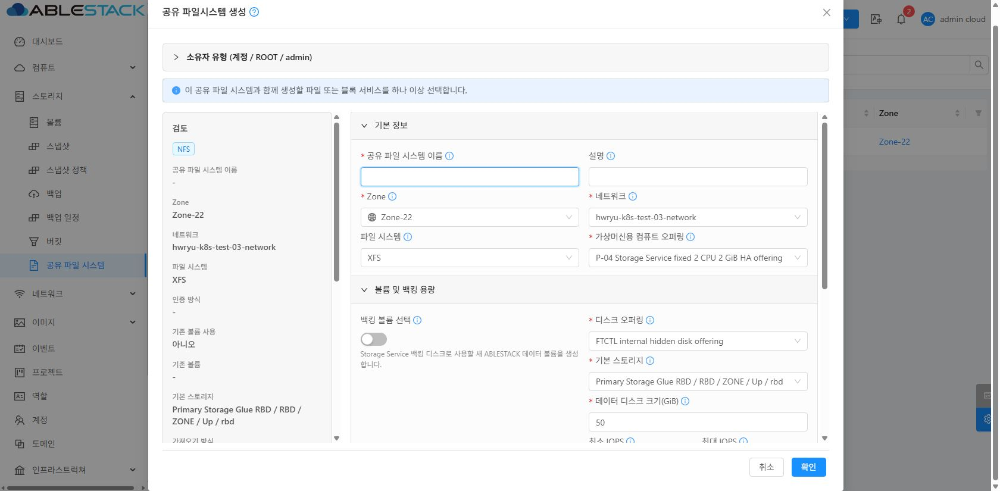{ .imgCenter .imgBorder }

- **소유자 유형:** 공유 파일 시스템을 소유할 계정 또는 프로젝트 유형을 선택합니다.
- **도메인:** 공유 파일 시스템을 소유할 도메인을 선택합니다.
- **계정:** 공유 파일 시스템을 소유할 계정을 선택합니다.
- **공유 파일 시스템 이름:** 목록에 표시할 이름을 입력합니다.
- **설명:** 공유 파일 시스템에 대한 설명을 입력합니다.
- **Zone:** 공유 파일 시스템을 배포할 Zone을 선택합니다.
- **네트워크:** Storage Service System VM이 사용할 네트워크를 선택합니다.
- **파일 시스템:** 백킹 볼륨에 사용할 XFS 또는 EXT4를 선택합니다.
- **가상머신용 컴퓨트 오퍼링:** Storage Service System VM에 사용할 컴퓨트 오퍼링을 선택합니다.

!!! check
    가상머신용 컴퓨트 오퍼링은 HA가 활성화되어 있고 Storage Service System VM의 최소 CPU 및 메모리 요구사항을 충족해야 합니다.

### 볼륨 및 백킹 용량

새 데이터 볼륨을 생성하거나 기존 데이터 볼륨을 백킹 볼륨으로 사용할 수 있습니다.

1. 새 데이터 볼륨을 생성하려면 **백킹 볼륨 선택**을 비활성화하고 다음 항목을 입력합니다.

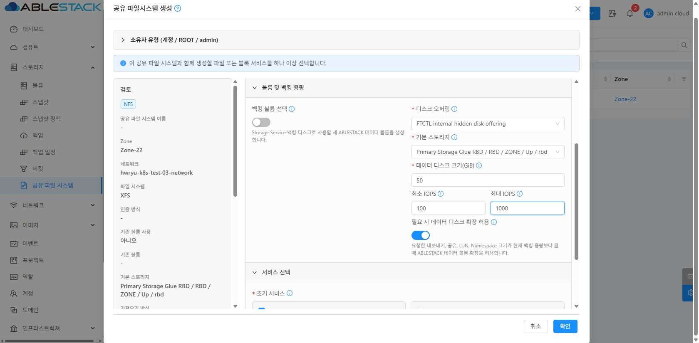{ .imgCenter .imgBorder }

- **디스크 오퍼링:** 새 데이터 볼륨에 사용할 디스크 오퍼링을 선택합니다.
- **기본 스토리지:** 볼륨을 배치할 기본 스토리지를 선택합니다.
- **데이터 디스크 크기:** 사용자 지정 크기 디스크 오퍼링을 선택한 경우 GiB 단위로 입력합니다.
- **최소 IOPS:** 사용자 지정 IOPS를 사용하는 경우 최소 IOPS를 입력합니다.
- **최대 IOPS:** 사용자 지정 IOPS를 사용하는 경우 최대 IOPS를 입력합니다.
- **필요 시 데이터 디스크 확장 허용:** 생성 후 백킹 볼륨의 크기 확장을 허용할지 선택합니다.

2. 기존 데이터 볼륨을 사용하려면 **백킹 볼륨 선택**을 활성화하고 다음 항목을 입력합니다.

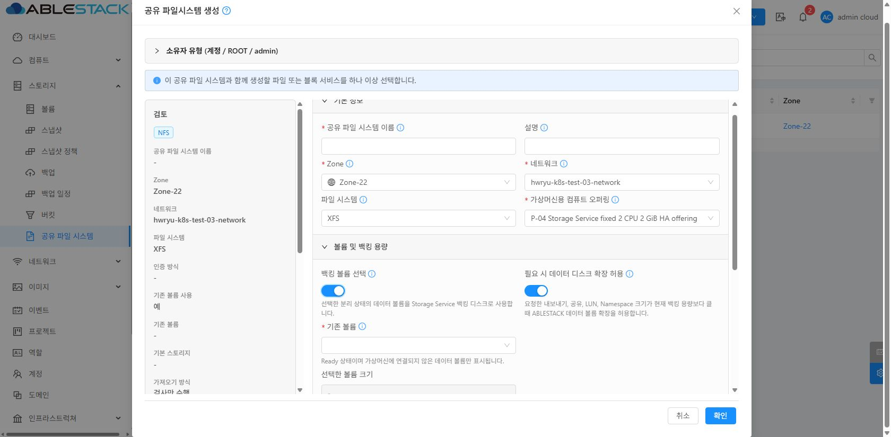{ .imgCenter .imgBorder }

- **기존 볼륨:** `Ready` 상태이고 다른 가상머신에 연결되지 않은 데이터 볼륨을 선택합니다.
- **선택한 볼륨 크기:** 선택한 기존 볼륨의 실제 크기를 확인합니다.
- **가져오기 방식:** 기존 볼륨을 검사하거나 마운트 또는 포맷할 방식을 선택합니다.
    - **검사만 수행:** 기존 파일 시스템과 볼륨 상태를 검사합니다.
    - **기존 파일 시스템 마운트:** 기존 파일 시스템을 유지한 채 마운트합니다.
    - **새로 포맷:** 선택한 파일 시스템으로 볼륨을 새로 포맷합니다.
- **필요 시 데이터 디스크 확장 허용:** 생성 후 백킹 볼륨의 크기 확장을 허용할지 선택합니다.

!!! danger
    **새로 포맷**을 선택하면 기존 볼륨의 데이터가 삭제될 수 있습니다.
    기존 데이터를 유지해야 하는 경우 **기존 파일 시스템 마운트**를 선택하고 생성 전에 백업 상태를 확인합니다.

### 서비스 선택

1. **서비스 선택**을 확장합니다.
2. NFS, SMB, iSCSI 및 NVMe-oF 가운데 사용할 서비스를 하나 이상 선택합니다.

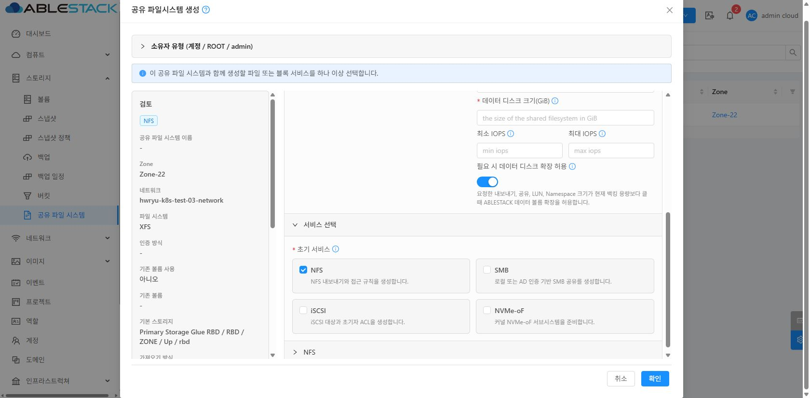{ .imgCenter .imgBorder }

!!! info
    NFS는 기본으로 선택됩니다.
    여러 서비스를 선택하면 동일한 Storage Service System VM에서 선택한 프로토콜을 함께 운영할 수 있습니다.

### NFS 설정

1. 서비스 선택에서 NFS를 선택하고 **NFS** 영역을 확장합니다.
2. 초기 NFS 내보내기와 접근 허용 목록을 설정합니다.

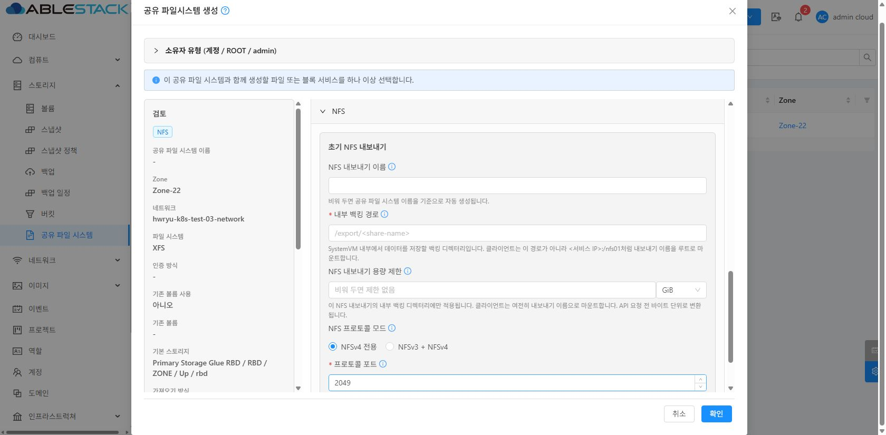{ .imgCenter .imgBorder }

- **NFS 내보내기 이름:** 클라이언트에서 사용할 내보내기 이름을 입력합니다. 비워 두면 자동으로 생성됩니다.
- **내부 백킹 경로:** Storage Service System VM에서 사용할 내부 경로를 입력합니다.
- **NFS 내보내기 용량 제한:** 내보내기에서 사용할 수 있는 최대 용량과 단위를 입력합니다.
- **NFS 프로토콜 모드:** **NFSv4 전용** 또는 **NFSv3 + NFSv4**를 선택합니다.
- **프로토콜 포트:** NFS 리스너 포트를 확인합니다. **NFSv3 + NFSv4** 모드에서는 2049 포트를 사용합니다.
- **허용 CIDR:** 접근을 허용할 클라이언트 네트워크를 입력합니다. 비워 두면 전체 접근 허용 정책이 적용될 수 있으므로 보안 정책을 확인합니다.
- **권한:** 읽기/쓰기 또는 읽기 전용을 선택합니다.
- **Root Squash:** 클라이언트의 root 사용자를 제한할지 선택합니다.
- **동기화:** 쓰기 작업을 동기 방식으로 처리할지 선택합니다.
- **특권 포트 요구:** 특권 포트에서 연결한 클라이언트만 허용할지 선택합니다.

!!! info
    NFS 내보내기 이름은 클라이언트에서 마운트하는 경로이고 내부 백킹 경로는 System VM 내부 경로입니다.
    두 값을 같은 개념으로 사용하지 마십시오.

### SMB 설정

1. 서비스 선택에서 SMB를 선택하고 **SMB** 영역을 확장합니다.
2. 초기 SMB 공유와 인증 방식을 설정합니다.

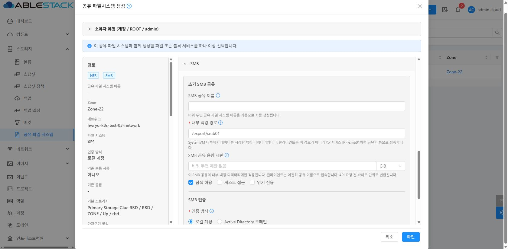{ .imgCenter .imgBorder }

- **SMB 공유 이름:** 클라이언트에서 사용할 공유 이름을 입력합니다. 비워 두면 자동으로 생성됩니다.
- **내부 백킹 경로:** SMB 공유가 사용할 내부 경로를 입력합니다.
- **SMB 공유 용량 제한:** 공유에서 사용할 수 있는 최대 용량과 단위를 입력합니다.
- **탐색 허용:** 네트워크 탐색에서 공유를 표시할지 선택합니다.
- **게스트 접근:** 인증하지 않은 게스트 접근을 허용할지 선택합니다.
- **읽기 전용:** 공유를 읽기 전용으로 제공할지 선택합니다.
- **인증 방식:** 로컬 계정 또는 Active Directory 도메인을 선택합니다.

3. 로컬 계정을 사용하는 경우 다음 항목을 입력합니다.
    - **로컬 사용자:** SMB에 접속할 로컬 사용자 이름을 입력합니다.
    - **권한:** 읽기 전용, 읽기/쓰기 또는 관리자 권한을 선택합니다.
    - **로컬 사용자 비밀번호:** 로컬 사용자의 비밀번호를 입력합니다.
    - **로컬 사용자 비밀번호 확인:** 동일한 비밀번호를 다시 입력합니다.
4. Active Directory를 사용하는 경우 다음 항목을 입력합니다.

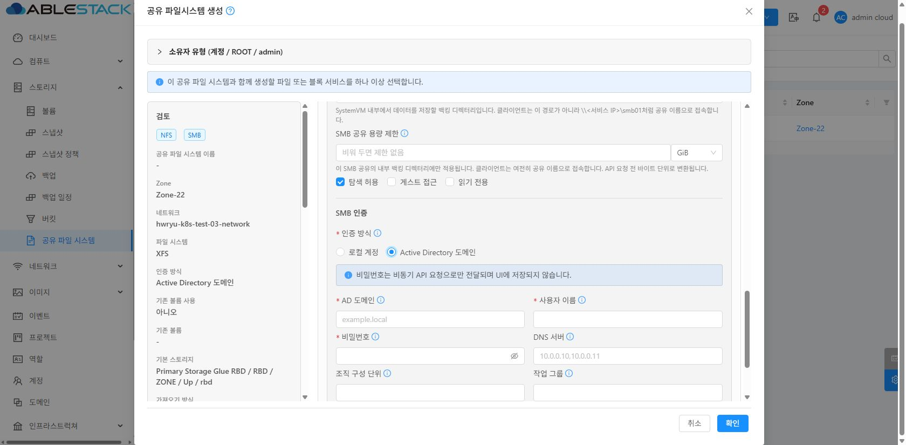{ .imgCenter .imgBorder }

- **AD 도메인:** 가입할 Active Directory 도메인을 입력합니다.
- **사용자 이름:** 도메인 가입 권한이 있는 사용자 이름을 입력합니다.
- **비밀번호:** 도메인 가입에 사용할 비밀번호를 입력합니다.
- **DNS 서버:** Active Directory 도메인을 조회할 DNS 서버를 입력합니다.
- **조직 구성 단위:** 컴퓨터 계정을 생성할 OU를 입력합니다.
- **작업 그룹:** 사용할 NetBIOS 작업 그룹을 입력합니다.
- **초기 SMB 접근 주체 유형:** AD 사용자 또는 AD 그룹을 선택합니다.
- **초기 SMB 접근 주체:** 접근을 허용할 사용자 또는 그룹을 입력합니다.
- **권한:** 읽기 전용, 읽기/쓰기 또는 관리자 권한을 선택합니다.

!!! danger
    SMB 로컬 비밀번호와 Active Directory 비밀번호는 요청할 때만 입력합니다.
    입력한 비밀번호는 상태 화면이나 검토 화면에 다시 표시되지 않습니다.

### iSCSI 설정

1. 서비스 선택에서 iSCSI를 선택하고 **iSCSI** 영역을 확장합니다.
2. 초기 iSCSI 대상, LUN 및 접근 방식을 설정합니다.

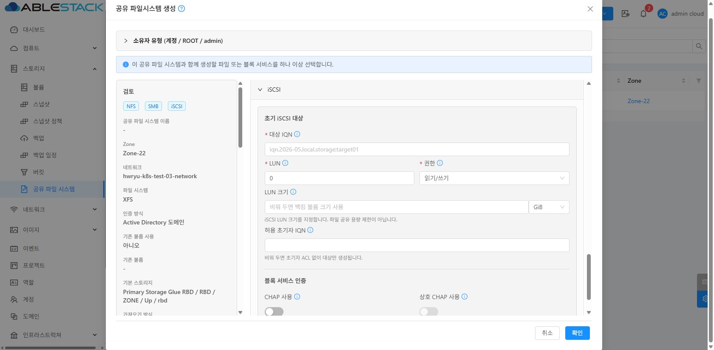{ .imgCenter .imgBorder }

- **대상 IQN:** iSCSI 대상의 고유한 IQN을 입력합니다.
- **LUN:** 대상에 매핑할 LUN 번호를 입력합니다.
- **권한:** 읽기/쓰기 또는 읽기 전용을 선택합니다.
- **LUN 크기:** LUN에서 사용할 용량과 단위를 입력합니다. 비워 두면 백킹 볼륨 크기를 사용합니다.
- **허용 초기자 IQN:** 접근을 허용할 초기자 IQN을 입력합니다.
- **CHAP 사용:** 단방향 CHAP 인증을 사용할지 선택합니다.
- **상호 CHAP 사용:** 초기자와 대상이 서로 인증할지 선택합니다.
- **CHAP 사용자 이름:** 단방향 CHAP 사용자 이름을 입력합니다.
- **CHAP 비밀값:** 단방향 CHAP Secret을 입력합니다.
- **상호 CHAP 사용자 이름:** 상호 CHAP 사용자 이름을 입력합니다.
- **상호 CHAP 비밀값:** 상호 CHAP Secret을 입력합니다.

!!! danger
    CHAP Secret은 일회성 런타임 입력값입니다.
    상태 정보, 테이블 또는 문서에 Secret 값을 기록하지 마십시오.

### NVMe-oF 설정

1. 서비스 선택에서 NVMe-oF를 선택하고 **NVMe-oF** 영역을 확장합니다.
2. 초기 서브시스템, 네임스페이스와 호스트 접근 정책을 설정합니다.

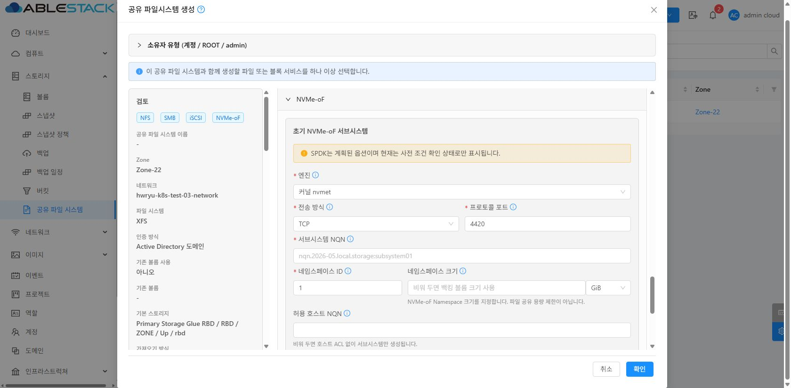{ .imgCenter .imgBorder }

- **엔진:** **커널 nvmet**을 선택합니다.
- **전송 방식:** TCP를 선택합니다.
- **프로토콜 포트:** NVMe-oF 리스너 포트를 입력합니다. 기본 포트는 4420입니다.
- **서브시스템 NQN:** NVMe-oF 서브시스템의 고유한 NQN을 입력합니다.
- **네임스페이스 ID:** 서브시스템에 연결할 네임스페이스 ID를 입력합니다.
- **네임스페이스 크기:** 네임스페이스에서 사용할 용량과 단위를 입력합니다. 비워 두면 백킹 볼륨 크기를 사용합니다.
- **허용 호스트 NQN:** 접근을 허용할 클라이언트의 호스트 NQN을 입력합니다. 비워 두면 생성 후 별도의 호스트 ACL을 추가해야 합니다.

!!! check
    현재 지원하는 NVMe-oF 엔진은 **커널 nvmet**(`KERNEL_NVMET`)입니다.
    SPDK는 선택할 수 없는 준비 단계 기능입니다.

!!! info
    현재 System VM에서는 DH-HMAC-CHAP 인증을 사용할 수 없습니다.
    클라이언트 접근을 제한하려면 호스트 NQN 접근 허용 목록을 사용합니다.

### 입력 내용 검토

1. 생성 화면 왼쪽의 입력 내용 검토에서 소유자, Zone, 네트워크, 볼륨과 선택한 서비스를 확인합니다.
2. 프로토콜별 이름, 내부 경로, 대상 IQN 또는 서브시스템 NQN이 올바른지 확인합니다.
3. 기존 볼륨을 선택한 경우 가져오기 방식을 다시 확인합니다.
4. 인증정보가 검토 화면에 노출되지 않는지 확인하고 **확인** 버튼을 클릭합니다.

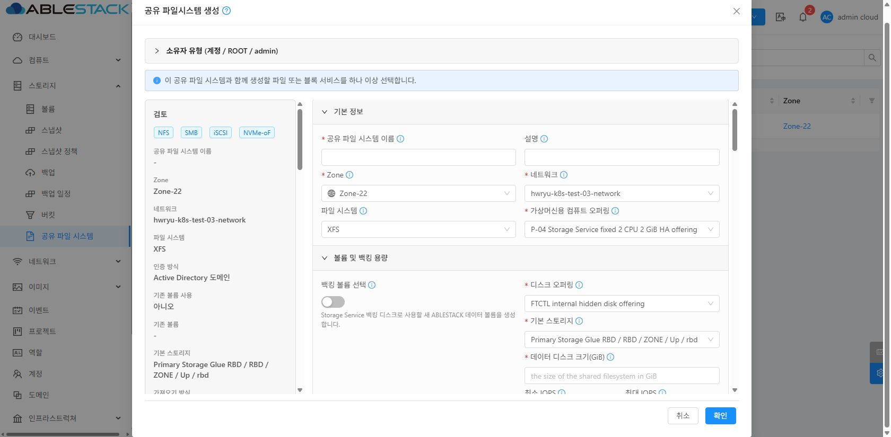{ .imgCenter .imgBorder }

## 공유 파일 시스템 업데이트

1. 공유 파일 시스템 상세 화면 오른쪽 상단의 작업 메뉴에서 **공유 파일 시스템 업데이트**를 클릭합니다.
2. 이름 또는 설명을 수정하고 **확인** 버튼을 클릭합니다.

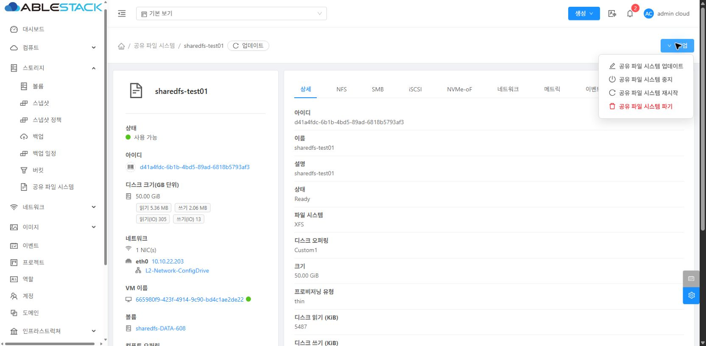{ .imgCenter .imgBorder }

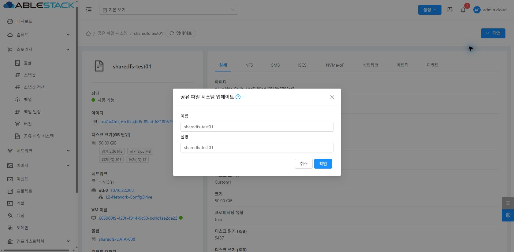{ .imgCenter .imgBorder }

- **이름:** 목록에 표시할 공유 파일 시스템 이름을 입력합니다.
- **설명:** 공유 파일 시스템에 대한 설명을 입력합니다.

## 공유 파일 시스템 시작

!!! check
    공유 파일 시스템이 `Stopped` 상태일 때 **공유 파일 시스템 시작** 작업이 활성화됩니다.

1. 공유 파일 시스템 상세 화면 오른쪽 상단의 작업 메뉴에서 **공유 파일 시스템 시작**을 클릭합니다.
2. 시작 작업을 확인하고 **확인** 버튼을 클릭합니다.
3. 상태가 `Ready`로 변경되는지 확인합니다.

## 공유 파일 시스템 중지

!!! check
    공유 파일 시스템이 `Ready` 상태일 때 **공유 파일 시스템 중지** 작업이 활성화됩니다.

1. 공유 파일 시스템 상세 화면 오른쪽 상단의 작업 메뉴에서 **공유 파일 시스템 중지**를 클릭합니다.
2. 필요한 경우 **강제**를 선택하고 **확인** 버튼을 클릭합니다.
3. 상태가 `Stopped`로 변경되는지 확인합니다.

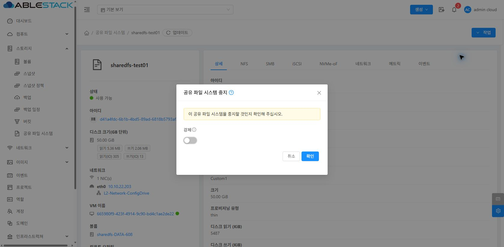{ .imgCenter .imgBorder }

!!! danger
    강제 중지는 연결된 클라이언트 작업을 중단시킬 수 있습니다.
    정상 중지가 불가능한 경우에만 사용합니다.

## 공유 파일 시스템 재시작

!!! check
    공유 파일 시스템이 `Ready`, `Stopped` 또는 `Detached` 상태일 때 **공유 파일 시스템 재시작** 작업이 활성화됩니다.

1. 공유 파일 시스템 상세 화면 오른쪽 상단의 작업 메뉴에서 **공유 파일 시스템 재시작**을 클릭합니다.
2. 필요한 경우 **정리**를 선택하고 **확인** 버튼을 클릭합니다.
3. 재시작 후 공유 파일 시스템과 프로토콜의 상태를 확인합니다.

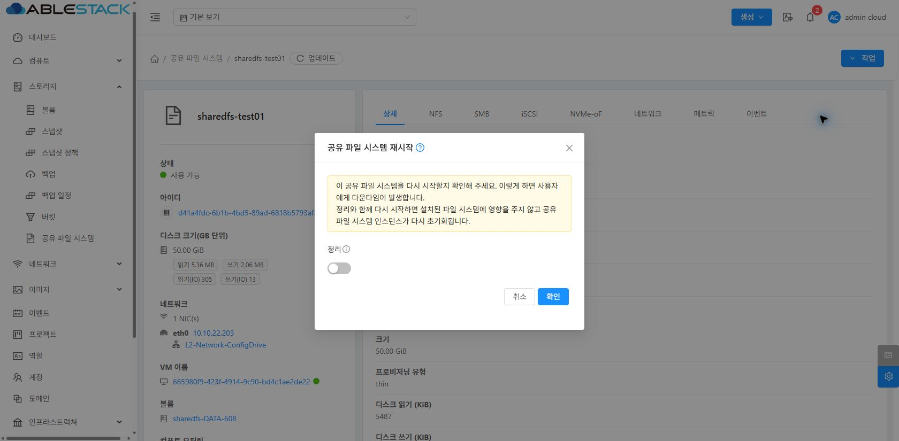{ .imgCenter .imgBorder }

!!! check
    재시작 후 NFS 내보내기, SMB 공유, iSCSI 대상 및 NVMe-oF 네임스페이스의 리스너와 매핑 상태를 확인합니다.

## 서비스 오퍼링 변경

!!! check
    공유 파일 시스템이 `Stopped` 상태일 때 **서비스 오퍼링 변경** 작업이 활성화됩니다.

1. 공유 파일 시스템 상세 화면 오른쪽 상단의 작업 메뉴에서 **서비스 오퍼링 변경**을 클릭합니다.
2. 변경할 컴퓨트 오퍼링을 선택하고 **확인** 버튼을 클릭합니다.
3. 공유 파일 시스템을 시작하고 변경된 컴퓨트 오퍼링을 확인합니다.

- **컴퓨트 오퍼링:** Storage Service System VM에 적용할 가상머신용 컴퓨트 오퍼링을 선택합니다.

!!! info
    서비스 오퍼링을 변경하려면 사용할 가상머신용 컴퓨트 오퍼링이 미리 생성되어 있어야 합니다.
    변경 목록에는 사용자 지정 오퍼링이 아니고 HA가 활성화되어 있으며 시스템의 최소 CPU 및 메모리 요구사항을 충족하는 오퍼링만 표시됩니다.

    👉 &nbsp;&nbsp;🔗[가상머신용 컴퓨트 오퍼링 생성 가이드](../mold-admin-guide-offerings-compute-offerings/#_5)

## 공유 파일 시스템 파기

!!! check
    `Ready` 상태에서 파기하려면 먼저 공유 파일 시스템을 중지하거나 파기 화면에서 **강제**를 선택해야 합니다.

1. 공유 파일 시스템 상세 화면 오른쪽 상단의 작업 메뉴에서 **공유 파일 시스템 파기**를 클릭합니다.
2. **제거**와 **강제** 선택 여부를 확인합니다.
3. 파기 작업을 계속하려면 **확인** 버튼을 클릭합니다.

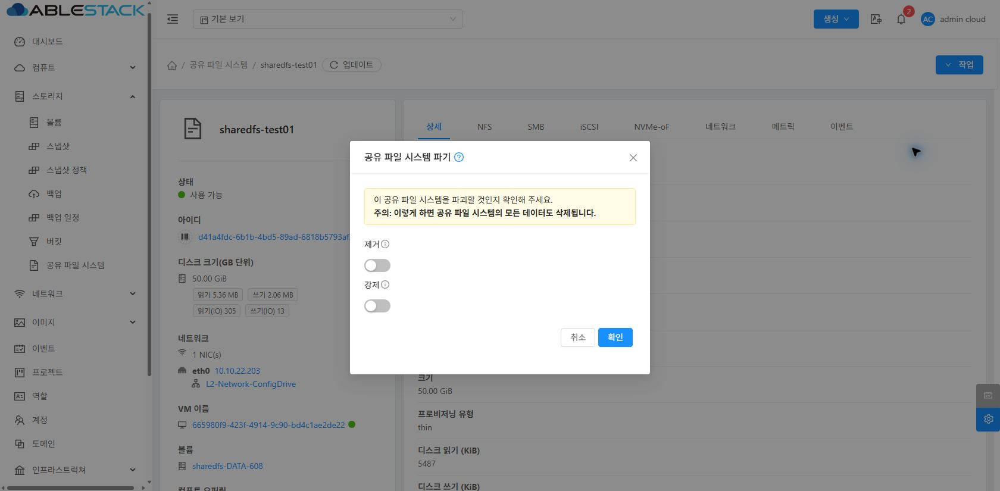{ .imgCenter .imgBorder }

!!! danger
    공유 파일 시스템을 파기하면 클라이언트 연결과 프로토콜 서비스가 중단됩니다.
    **제거**를 선택하지 않으면 `Destroyed` 상태에서 복구할 수 있습니다.
    **제거**를 선택하면 공유 파일 시스템을 바로 삭제하여 복구할 수 없으므로 작업 전에 데이터 백업과 선택 항목을 확인합니다.

## 공유 파일 시스템 복구

!!! check
    공유 파일 시스템이 `Destroyed` 상태일 때 **공유 파일 시스템 복구** 작업이 활성화됩니다.

1. 공유 파일 시스템 상세 화면 오른쪽 상단의 작업 메뉴에서 **공유 파일 시스템 복구**를 클릭합니다.
2. 복구 작업을 확인하고 **확인** 버튼을 클릭합니다.
3. 복구 후 공유 파일 시스템의 상태와 백킹 볼륨을 확인합니다.

## 공유 파일 시스템 삭제

!!! check
    공유 파일 시스템이 `Destroyed`, `Expunging` 또는 `Error` 상태일 때 삭제 작업이 표시될 수 있습니다.

1. 공유 파일 시스템 상세 화면 오른쪽 상단의 작업 메뉴에서 **공유 파일 시스템 삭제**를 클릭합니다.
2. 삭제할 자원과 데이터 볼륨을 확인하고 **확인** 버튼을 클릭합니다.

!!! danger
    삭제한 공유 파일 시스템과 데이터는 복구할 수 없습니다.
    공유 파일 시스템 복구가 필요한 경우 삭제 작업을 실행하지 마십시오.

## 공유 파일 시스템 상세 탭

1. 목록에서 확인할 공유 파일 시스템의 이름을 클릭합니다.
2. **상세** 탭에서 상태, ID, 크기, 읽기·쓰기 통계, 네트워크, VM, 볼륨, 컴퓨트 오퍼링, 스토리지 풀, Zone 및 소유자 정보를 확인합니다.
3. Storage Service 개요에서 활성화된 서비스 유형을 확인합니다.

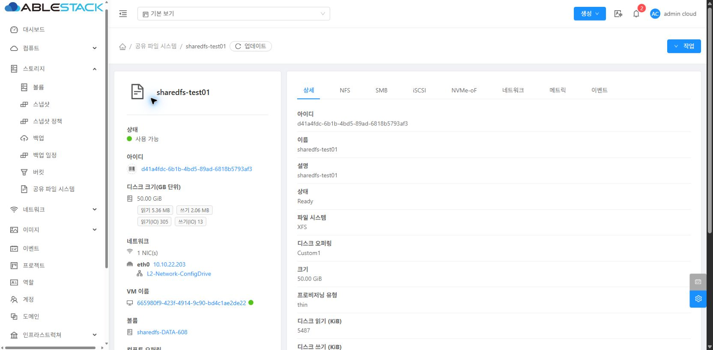{ .imgCenter .imgBorder }

## NFS 탭

1. 공유 파일 시스템 상세 화면에서 **NFS** 탭을 선택합니다.
2. **접속 정보**에서 클라이언트 마운트 명령을 확인합니다.
3. 상태 요약에서 엔드포인트, 모니터링 캐시와 마지막 새로고침 시간을 확인합니다.

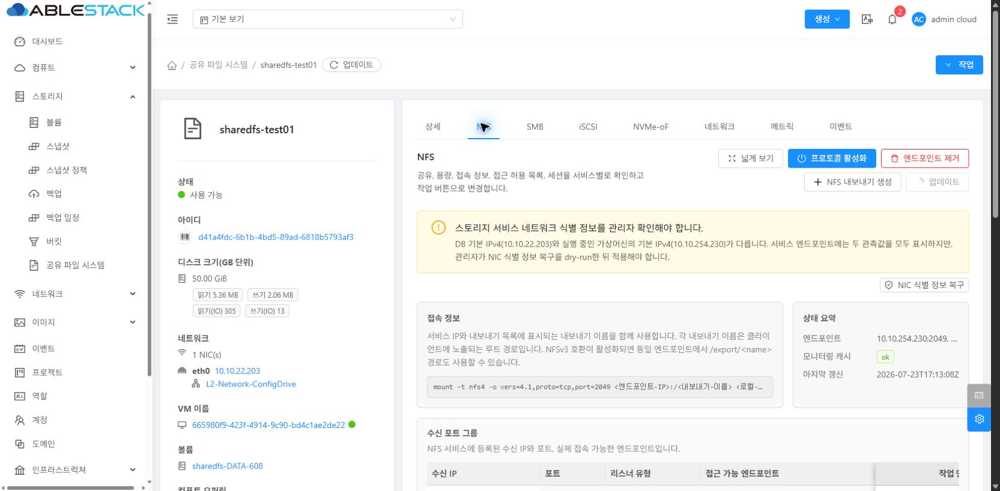{ .imgCenter .imgBorder }

### NFS 내보내기 관리

1. NFS 내보내기를 생성하려면 **NFS 내보내기 생성**을 클릭합니다.
2. 내보내기 이름, 내부 백킹 경로, 백킹 볼륨, 용량 제한, NFS 프로토콜 모드, 리스너, 권한과 내보내기 옵션을 입력합니다.
3. 기존 내보내기의 작업 영역에서 편집, 파일 공유 용량 확장 또는 삭제를 실행합니다.

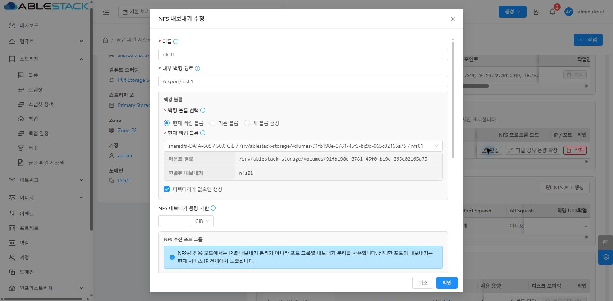{ .imgCenter .imgBorder }

!!! check
    NFS 내보내기의 수신 포트 그룹이 TCP 2049인지 확인합니다.
    현재 배포 UI에서 SMB용 TCP 445 포트 그룹이 자동 선택되면 작업을 제출하지 말고 NFS용 TCP 2049 포트 그룹을 다시 선택합니다.

!!! danger
    NFS 내보내기를 삭제하기 전에 클라이언트에서 마운트를 해제하고 사용 중인 세션이 없는지 확인합니다.

### NFS 접근 허용 목록 관리

1. 접근 허용 목록을 추가하려면 **NFS ACL 생성**을 클릭합니다.
2. 허용할 CIDR, 권한, Root Squash, 동기화와 특권 포트 요구 여부를 입력합니다.
3. 기존 접근 허용 목록의 작업 영역에서 편집 또는 삭제를 실행합니다.

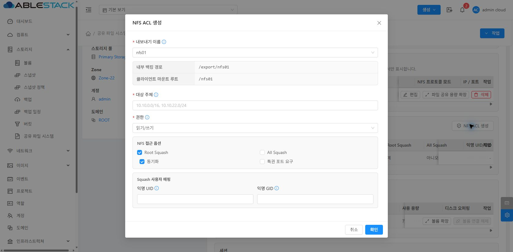{ .imgCenter .imgBorder }

!!! info
    기본 전체 허용 정책이 표시되는 경우 운영 환경에 필요한 CIDR만 허용하도록 접근 정책을 검토합니다.

### NFS 리스너, 백킹 볼륨 및 세션

1. **수신 포트 그룹**에서 리스너 포트와 실제 엔드포인트를 확인합니다.
2. **백킹 볼륨**에서 파일 시스템, 내부 경로, 용량과 연결 상태를 확인합니다.
3. **세션**에서 연결된 클라이언트와 마지막 관찰 시간을 확인합니다.
4. 프로토콜을 준비하려면 **프로토콜 활성화**를 클릭합니다.
5. 사용하지 않는 엔드포인트를 제거하려면 **엔드포인트 제거**를 클릭합니다.

!!! check
    리스너 또는 엔드포인트를 제거하기 전에 해당 포트를 사용하는 내보내기와 클라이언트 연결이 없는지 확인합니다.
    NFS 세션 종료는 최선 노력 방식으로 처리되므로 클라이언트에서 마운트가 해제되었는지도 확인합니다.

## SMB 탭

1. 공유 파일 시스템 상세 화면에서 **SMB** 탭을 선택합니다.
2. **접속 정보**에서 UNC 경로, `net use` 또는 `smbclient` 연결 예시를 확인합니다.
3. 상태 요약에서 엔드포인트, 인증 방식, 도메인 상태, SMB 서비스와 모니터링 캐시를 확인합니다.

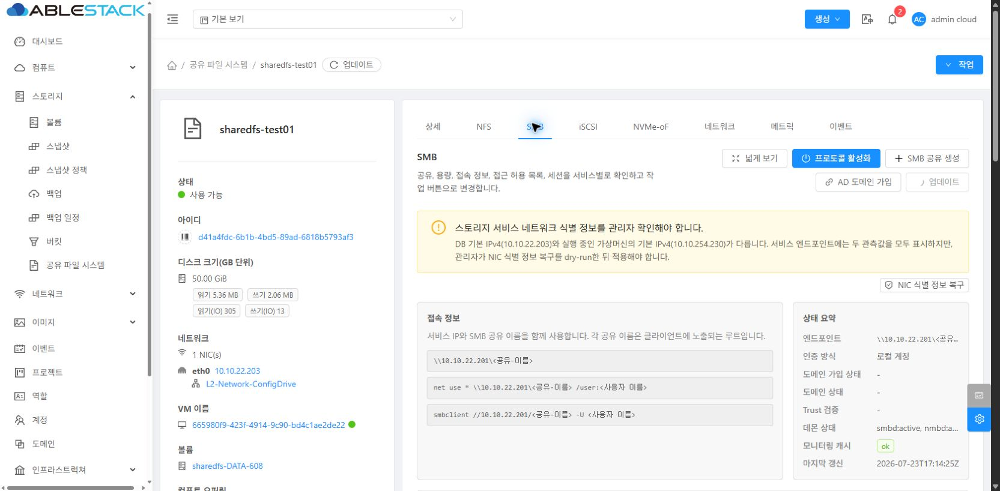{ .imgCenter .imgBorder }

### SMB 공유 관리

1. SMB 공유를 생성하려면 **SMB 공유 생성**을 클릭합니다.
2. 공유 이름, 내부 백킹 경로, 백킹 볼륨, 용량 제한과 공유 옵션을 입력합니다.
3. 기존 공유의 작업 영역에서 편집, 파일 공유 용량 확장 또는 삭제를 실행합니다.

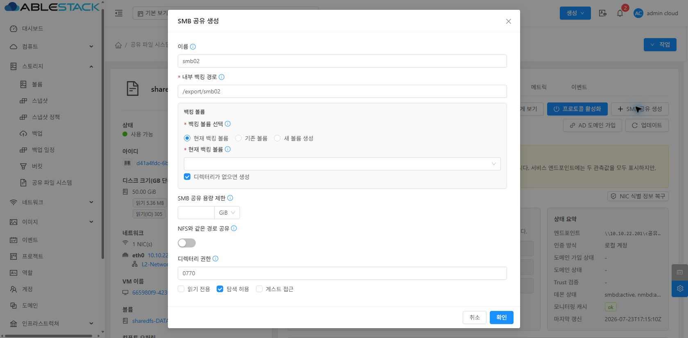{ .imgCenter .imgBorder }

### SMB 접근 및 계정 관리

1. 접근 권한을 추가하려면 **SMB ACL 생성**을 클릭합니다.
2. 로컬 사용자, AD 사용자 또는 AD 그룹과 권한을 입력합니다.
3. 로컬 계정을 생성할 경우 비밀번호를 요청 화면에서 입력합니다.
4. 기존 접근 허용 목록의 작업 영역에서 편집 또는 삭제를 실행합니다.

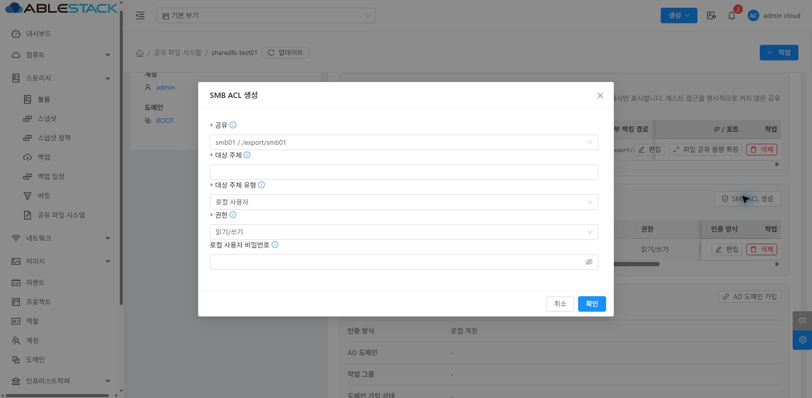{ .imgCenter .imgBorder }

!!! danger
    SMB 계정 비밀번호는 작업 요청에만 입력하며 테이블이나 상태 정보에서 다시 조회할 수 없습니다.

### Active Directory 관리

1. Active Directory를 사용하려면 **AD 도메인 가입**을 클릭합니다.
2. 도메인, 사용자 이름, 비밀번호, DNS 서버, 조직 구성 단위와 작업 그룹을 입력합니다.
3. 도메인 상태에서 가입 상태, 상태 점검과 Trust 정보를 확인합니다.
4. 도메인 사용을 중단하려면 도메인 탈퇴 작업을 실행합니다.

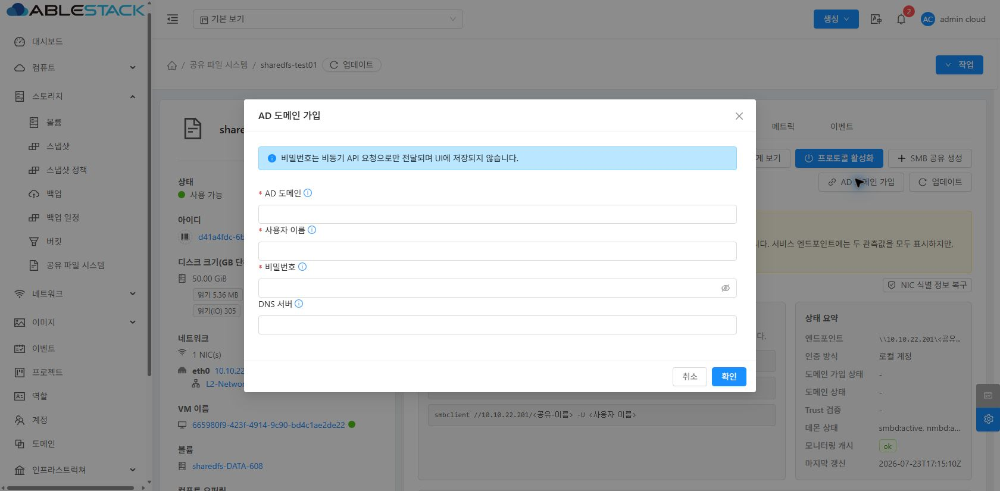{ .imgCenter .imgBorder }

!!! check
    Active Directory 도메인 가입 전에 Storage Service System VM이 도메인 DNS 서버와 시간 동기화 서버에 연결할 수 있는지 확인합니다.

### SMB 리스너, 백킹 볼륨 및 세션

1. **수신 포트 그룹**에서 SMB 리스너와 실제 엔드포인트를 확인합니다.
2. **백킹 볼륨**에서 내부 경로, 용량과 연결 상태를 확인합니다.
3. **세션**에서 사용자, 클라이언트, 공유 이름과 연결 상태를 확인합니다.
4. 지원되는 세션에서 **세션 종료** 작업을 실행합니다.

## iSCSI 탭

1. 공유 파일 시스템 상세 화면에서 **iSCSI** 탭을 선택합니다.
2. **접속 정보**에서 `iscsiadm`을 사용하는 검색과 로그인 예시를 확인합니다.
3. 상태 요약에서 엔드포인트, 서비스 상태와 모니터링 캐시를 확인합니다.

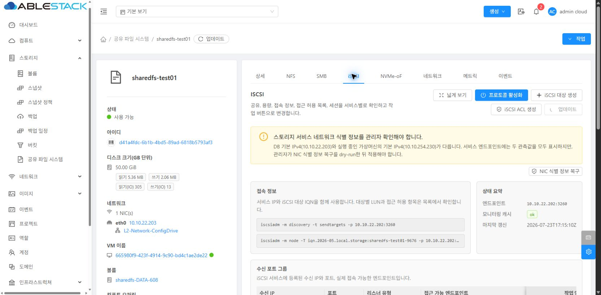{ .imgCenter .imgBorder }

### iSCSI 대상 및 LUN 관리

1. iSCSI 대상을 생성하려면 **iSCSI 대상 생성**을 클릭합니다.
2. 대상 IQN, LUN, 백킹 볼륨, LUN 크기, 리스너와 권한을 입력합니다.
3. 기존 대상의 작업 영역에서 편집 또는 삭제를 실행합니다.
4. 대상 목록에서 런타임 백킹 경로와 매핑 상태를 확인합니다.

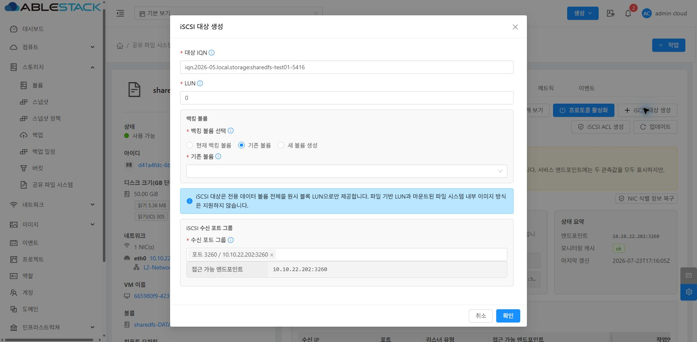{ .imgCenter .imgBorder }

### iSCSI 접근 허용 목록과 CHAP

1. 접근 허용 목록을 추가하려면 **iSCSI ACL 생성**을 클릭합니다.
2. 허용할 초기자 IQN과 권한을 입력합니다.
3. CHAP를 사용할 경우 사용자 이름과 Secret을 입력합니다.
4. 상호 CHAP를 사용할 경우 상호 CHAP 사용자 이름과 Secret을 추가로 입력합니다.
5. 기존 접근 허용 목록의 작업 영역에서 편집 또는 삭제를 실행합니다.

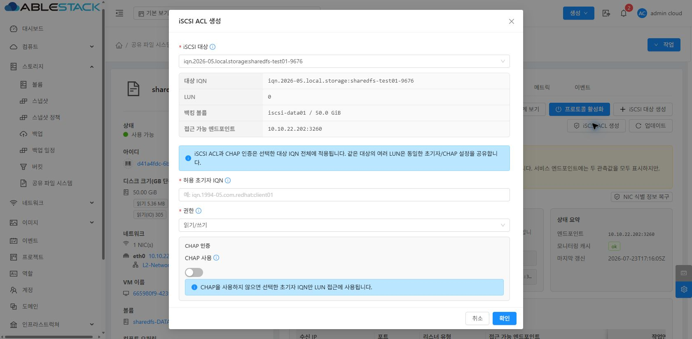{ .imgCenter .imgBorder }

!!! danger
    CHAP Secret은 일회성 입력값이며 저장된 값을 화면에서 다시 확인할 수 없습니다.
    변경 전에 초기자 측 인증정보와 함께 갱신할 준비를 합니다.

### iSCSI 리스너, 백킹 볼륨 및 세션

1. **수신 포트 그룹**에서 iSCSI 리스너와 실제 엔드포인트를 확인합니다.
2. **백킹 볼륨**에서 LUN에 연결된 볼륨, 크기와 연결 상태를 확인합니다.
3. **세션**에서 초기자 IQN, 대상 IQN, LUN, 인증 상태와 엔드포인트를 확인합니다.
4. 지원되는 세션에서 **세션 종료** 작업을 실행합니다.

## NVMe-oF 탭

1. 공유 파일 시스템 상세 화면에서 **NVMe-oF** 탭을 선택합니다.
2. **접속 정보**에서 `nvme discover`와 `nvme connect` 예시를 확인합니다.
3. 상태 요약에서 엔드포인트, 엔진, 모니터링 캐시와 DH-HMAC-CHAP 지원 상태를 확인합니다.

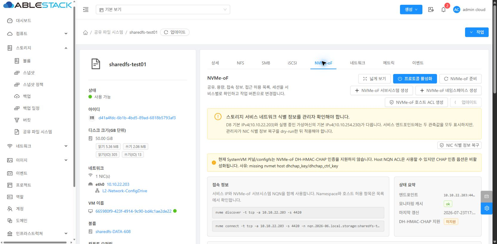{ .imgCenter .imgBorder }

### NVMe-oF 준비

1. **NVMe-oF 준비**를 클릭합니다.
2. 엔진으로 **커널 nvmet**을 선택합니다.
3. 준비 상태와 필수 커널 기능을 확인하고 작업을 실행합니다.

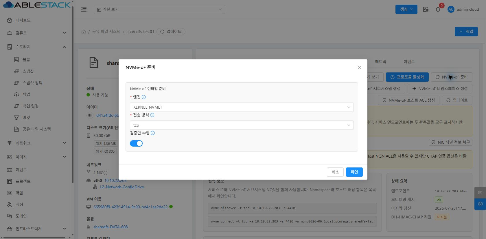{ .imgCenter .imgBorder }

!!! check
    SPDK는 준비 또는 예정 상태로만 표시되며 현재 활성화할 수 없습니다.

### 서브시스템 및 네임스페이스 관리

1. 서브시스템을 생성하려면 **NVMe-oF 서브시스템 생성**을 클릭합니다.
2. 서브시스템 NQN, 엔진, 전송 방식, 리스너 포트와 호스트 접근 정책을 입력합니다.
3. 네임스페이스를 생성하려면 **NVMe-oF 네임스페이스 생성**을 클릭합니다.
4. 서브시스템, 네임스페이스 ID, 백킹 볼륨, 크기와 리스너를 입력합니다.
5. 기존 서브시스템과 네임스페이스의 작업 영역에서 편집 또는 삭제를 실행합니다.

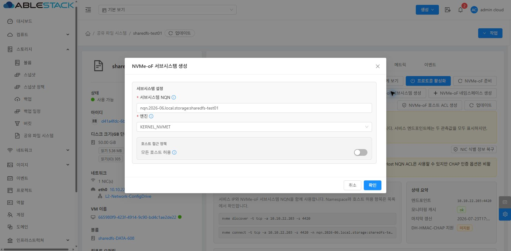{ .imgCenter .imgBorder }

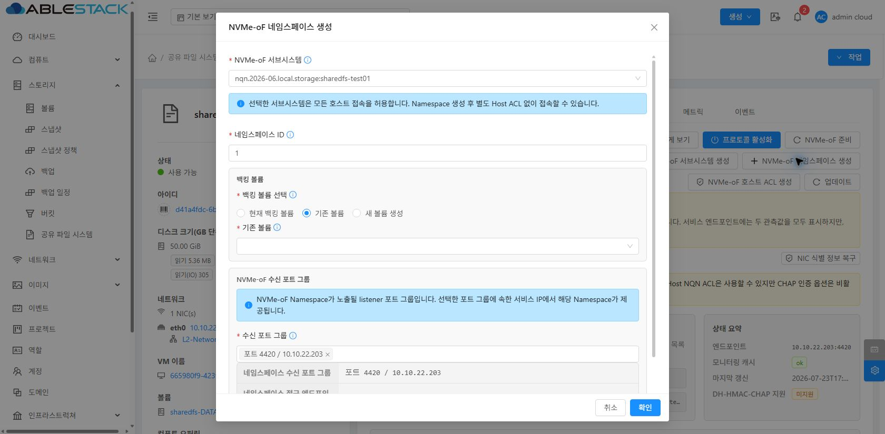{ .imgCenter .imgBorder }

!!! danger
    네임스페이스 또는 서브시스템을 삭제하기 전에 클라이언트 연결을 해제하고 사용 중인 세션이 없는지 확인합니다.

### 호스트 NQN 접근 허용 목록

1. 호스트 NQN 접근 허용 목록을 추가하려면 **NVMe-oF 호스트 ACL 생성**을 클릭합니다.
2. 서브시스템과 접근을 허용할 호스트 NQN을 입력합니다.
3. 기존 호스트 NQN 접근 허용 목록의 작업 영역에서 편집 또는 삭제를 실행합니다.

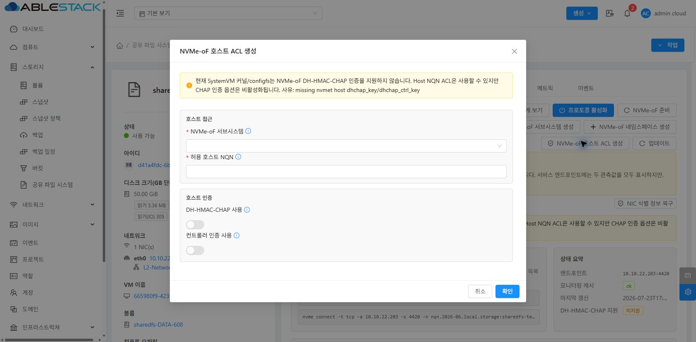{ .imgCenter .imgBorder }

!!! info
    모든 호스트 허용 정책을 사용하는 서브시스템에는 개별 호스트 NQN 접근 허용 목록을 추가할 수 없습니다.
    개별 호스트만 허용하려면 먼저 서브시스템의 모든 호스트 허용 정책을 비활성화합니다.

### NVMe-oF 리스너, 백킹 볼륨 및 세션

1. **NVMe-oF 수신 포트 그룹**에서 TCP 리스너와 실제 엔드포인트를 확인합니다.
2. **백킹 볼륨**에서 네임스페이스에 연결된 볼륨, 런타임 경로와 매핑 상태를 확인합니다.
3. **세션**에서 호스트 NQN, 서브시스템, 네임스페이스, 접근 정책, 큐 수와 엔드포인트를 확인합니다.
4. **세션 종료**가 활성화된 세션에서만 종료 작업을 실행합니다.

## 백킹 볼륨 관리

### 백킹 볼륨 연결

1. 프로토콜 탭의 **백킹 볼륨** 영역에서 **기존 볼륨 연결**을 클릭합니다.
2. 연결할 데이터 볼륨과 가져오기 방식을 선택합니다.
3. 선택한 볼륨이 다른 가상머신에 연결되어 있지 않은지 확인하고 작업을 실행합니다.

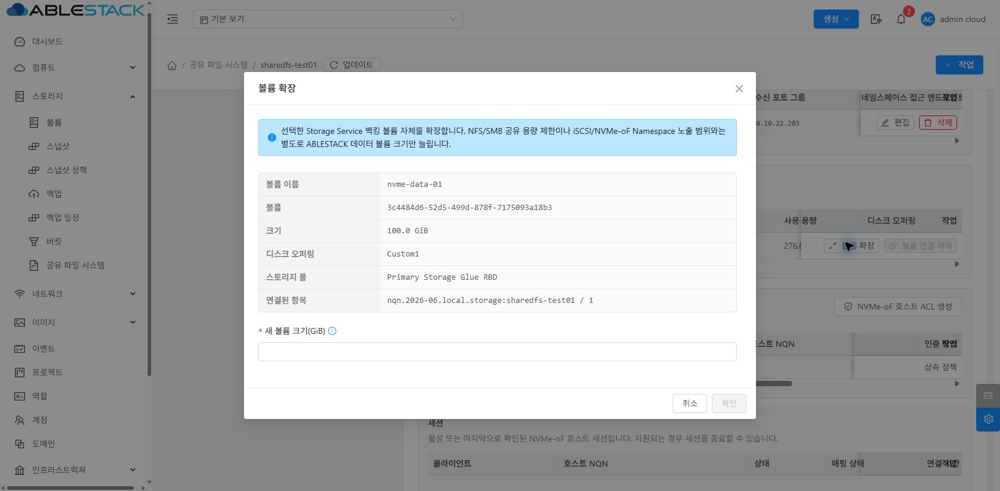{ .imgCenter .imgBorder }

### 백킹 볼륨 분리

1. **백킹 볼륨** 목록에서 분리할 볼륨의 **볼륨 연결 해제**를 클릭합니다.
2. 해당 볼륨을 사용하는 NFS 내보내기, SMB 공유, iSCSI LUN 또는 NVMe-oF 네임스페이스가 없는지 확인합니다.
3. 분리 작업을 실행하고 볼륨 상태를 확인합니다.

!!! check
    프로토콜 개체에서 사용 중인 백킹 볼륨은 분리할 수 없습니다.
    먼저 해당 내보내기, 공유, LUN 또는 네임스페이스 연결을 정리합니다.

!!! info
    **볼륨 연결 해제**는 Storage Service System VM에서 연결만 해제하며 볼륨과 데이터는 삭제하지 않습니다.
    볼륨을 삭제하려면 **스토리지 > 볼륨**에서 별도로 삭제해야 합니다.

### 백킹 볼륨 확장

1. **백킹 볼륨** 목록에서 **볼륨 확장**을 클릭합니다.
2. **새 볼륨 크기(GiB)**에 현재 크기보다 큰 정수 값을 입력합니다.
3. 작업 완료 후 볼륨 크기와 프로토콜 개체의 용량을 확인합니다.

!!! danger
    백킹 볼륨 확장은 축소할 수 없습니다.
    볼륨과 파일 시스템의 백업 상태를 확인한 후 실행합니다.

## 공유 파일 시스템 네트워크 탭

1. 공유 파일 시스템 상세 화면에서 **네트워크** 탭을 선택합니다.
2. 연결된 네트워크와 기본 IP를 확인합니다. L2가 아닌 네트워크에서는 보조 IP도 확인할 수 있습니다.

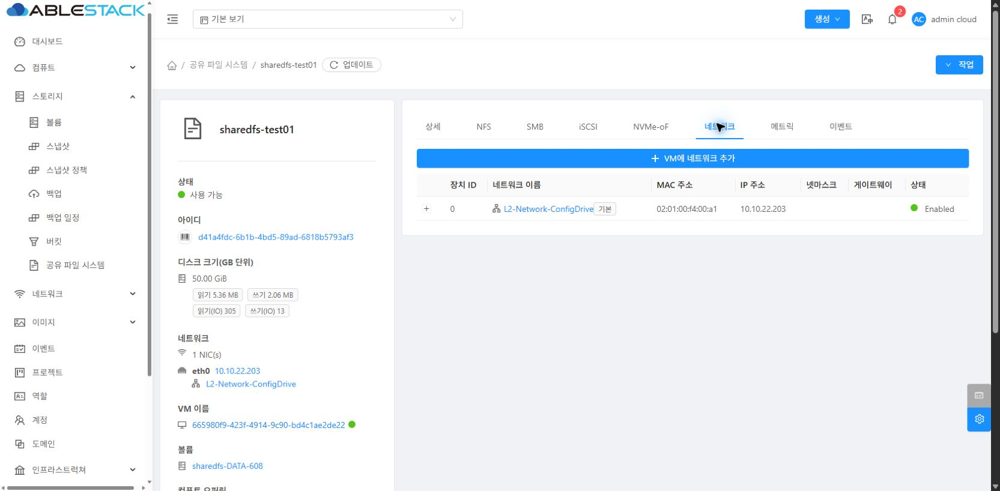{ .imgCenter .imgBorder }

### VM에 네트워크 추가

1. **VM에 네트워크 추가**를 클릭합니다.
2. 연결할 네트워크와 IP 주소를 선택하고 **확인** 버튼을 클릭합니다.

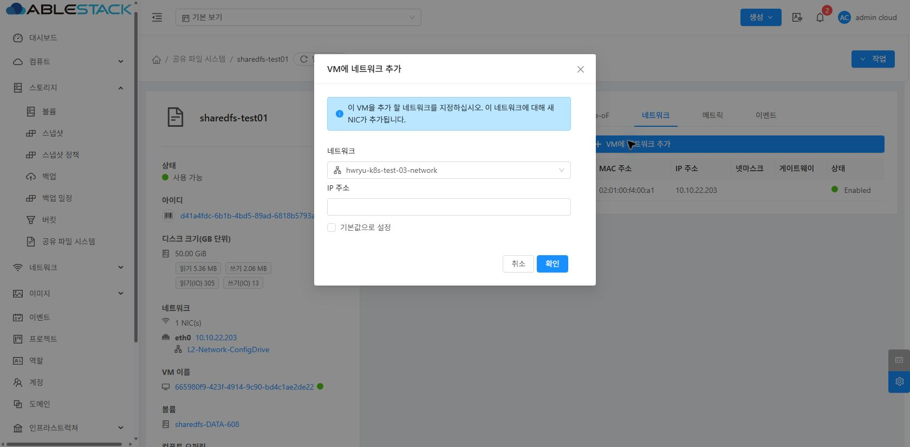{ .imgCenter .imgBorder }

- **네트워크:** Storage Service System VM에 연결할 네트워크를 선택합니다.
- **IP 주소:** 네트워크에서 사용할 IP 주소를 입력합니다.

!!! info
    네트워크를 기본값으로 설정하면 Storage Service System VM의 기본 네트워크로 사용됩니다.

### IP 주소 또는 MAC 주소 변경

1. 변경할 네트워크의 작업 메뉴에서 **IP 주소 또는 MAC 주소 변경**을 클릭합니다.
2. 새 IP 주소 또는 MAC 주소를 입력하고 **확인** 버튼을 클릭합니다.
3. 프로토콜 탭에서 실제 엔드포인트가 갱신되었는지 확인합니다.

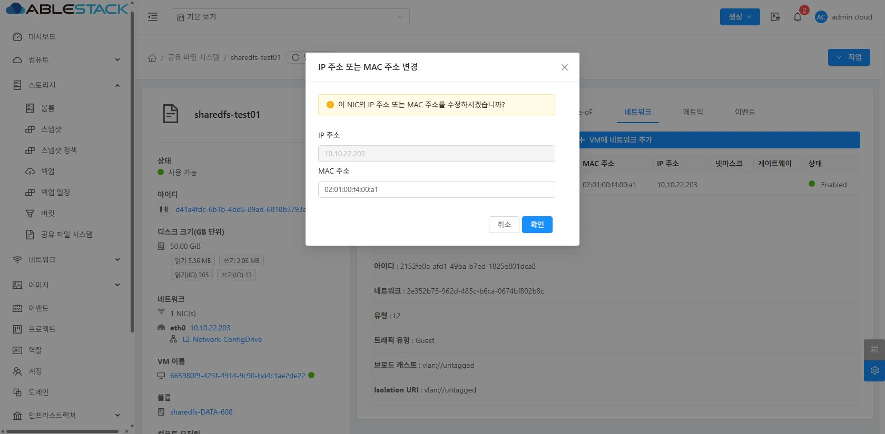{ .imgCenter .imgBorder }

### 보조 IP 편집

!!! check
    **보조 IP 편집**은 L2가 아닌 네트워크에서만 표시됩니다.
    NIC 유형이 L2이면 이 작업을 사용할 수 없습니다.

1. 변경할 네트워크의 작업 메뉴에서 **보조 IP 편집**을 클릭합니다.
2. 보조 IP를 추가하거나 제거하고 **확인** 버튼을 클릭합니다.
3. 리스너 포트 그룹과 실제 엔드포인트를 확인합니다.

### NIC 식별 정보 복구

Storage Service의 데이터베이스 네트워크 정보와 실행 중인 System VM의 NIC 정보가 다르면 프로토콜 탭에 NIC 식별 정보 경고가 표시됩니다.

1. 경고 내용을 확인하고 변경된 네트워크가 의도한 구성인지 확인합니다.
2. **NIC 식별 정보 복구**를 클릭합니다.
3. 데이터베이스에 반영할 NIC와 IP 정보를 확인하고 복구 작업을 실행합니다.
4. 작업 후 각 프로토콜 탭의 리스너와 엔드포인트를 다시 확인합니다.

!!! danger
    NIC 식별 정보 복구는 실행 중인 System VM의 기본 IPv4를 기준으로 데이터베이스의 기본 IPv4만 교정합니다.
    가상머신 네트워크와 보조 IP는 변경하지 않습니다.
    의도하지 않은 네트워크 변경이 없는지 확인한 후 실행합니다.

## 공유 파일 시스템 메트릭 탭

1. 공유 파일 시스템 상세 화면에서 **메트릭** 탭을 선택합니다.
2. CPU, 메모리, 네트워크와 디스크의 사용량을 확인합니다.
3. 필요한 기간과 단위를 선택하여 추이를 확인합니다.

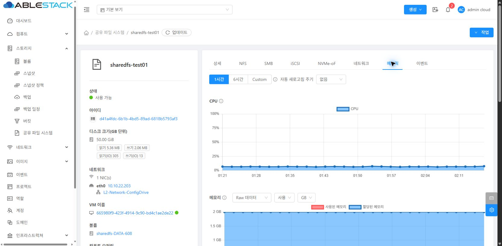{ .imgCenter .imgBorder }

## 공유 파일 시스템 이벤트 탭

1. 공유 파일 시스템 상세 화면에서 **이벤트** 탭을 선택합니다.
2. 공유 파일 시스템과 관련된 이벤트 유형, 상태, 설명 및 생성 시간을 확인합니다.
3. 생성, 시작, 중지, 재시작, 네트워크 또는 프로토콜 작업의 결과를 확인합니다.

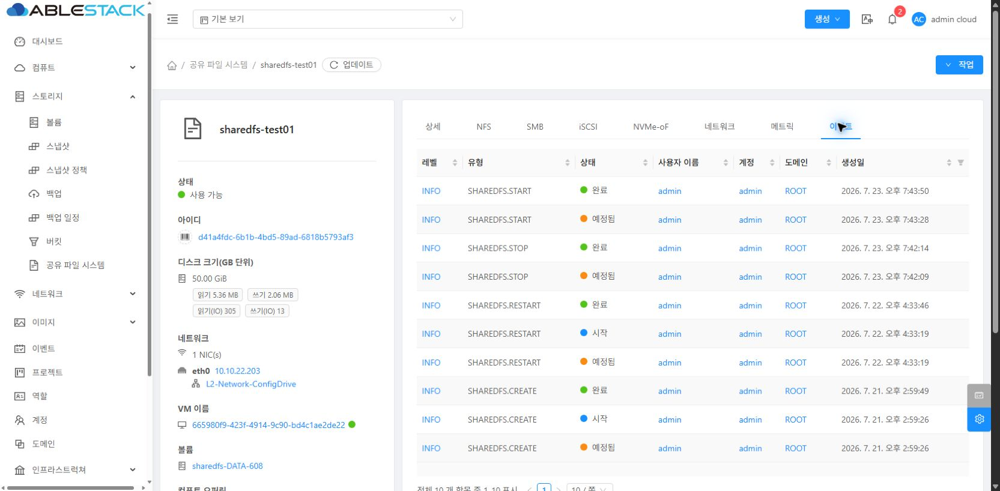{ .imgCenter .imgBorder }

## 제한사항

- NVMe-oF는 **커널 nvmet**(`KERNEL_NVMET`) 엔진만 사용할 수 있습니다.
- SPDK 엔진은 준비 또는 예정 상태이며 현재 선택할 수 없습니다.
- 현재 System VM 커널에서는 NVMe-oF DH-HMAC-CHAP 호스트 인증과 컨트롤러 인증을 사용할 수 없습니다.
- 호스트 NQN 접근 허용 목록은 DH-HMAC-CHAP 지원 여부와 관계없이 사용할 수 있습니다.
- NFSv4 전용 내보내기는 개별 IP가 아니라 리스너 포트 그룹을 기준으로 노출됩니다.
- **NFSv3 + NFSv4** 모드는 서비스 전체의 TCP 2049 리스너를 사용합니다.
- 공유 파일 시스템의 디스크 오퍼링 변경 API는 호환성을 위해 남아 있지만 최신 UI에서는 해당 작업을 제공하지 않습니다.
- SMB 비밀번호, Active Directory 비밀번호, CHAP Secret과 DH-HMAC-CHAP 키는 요청에만 사용되며 화면이나 API 응답에서 다시 조회할 수 없습니다.
- HugePage, NUMA, CPU 고정, memlock, SR-IOV 및 PCI Passthrough 설정은 현재 Storage Service 관리 범위에 포함되지 않습니다.

## 용어사전

- **Storage Service System VM:** NFS, SMB, iSCSI 및 NVMe-oF 서비스를 실행하는 전용 시스템 가상머신입니다.
- **백킹 볼륨:** 파일 공유, LUN 또는 네임스페이스의 실제 데이터를 저장하는 데이터 볼륨입니다.
- **내부 백킹 경로:** Storage Service System VM 안에서 파일 공유가 사용하는 경로입니다.
- **ACL:** 클라이언트 네트워크, 사용자, 초기자 또는 호스트의 접근을 허용하거나 제한하는 규칙입니다.
- **리스너 포트 그룹:** 프로토콜 서비스가 요청을 수신하는 IP와 포트의 논리적인 그룹입니다.
- **IQN:** iSCSI 초기자와 대상을 구분하는 고유 이름입니다.
- **LUN:** iSCSI 대상이 클라이언트에 제공하는 논리 블록 장치 번호입니다.
- **NQN:** NVMe-oF 호스트와 서브시스템을 구분하는 고유 이름입니다.
- **네임스페이스:** NVMe-oF 서브시스템이 클라이언트에 제공하는 논리 블록 장치입니다.
- **CHAP:** iSCSI 연결에서 사용자 이름과 Secret을 사용하여 인증하는 방식입니다.
- **Root Squash:** NFS 클라이언트의 root 사용자를 제한된 사용자로 매핑하는 기능입니다.
