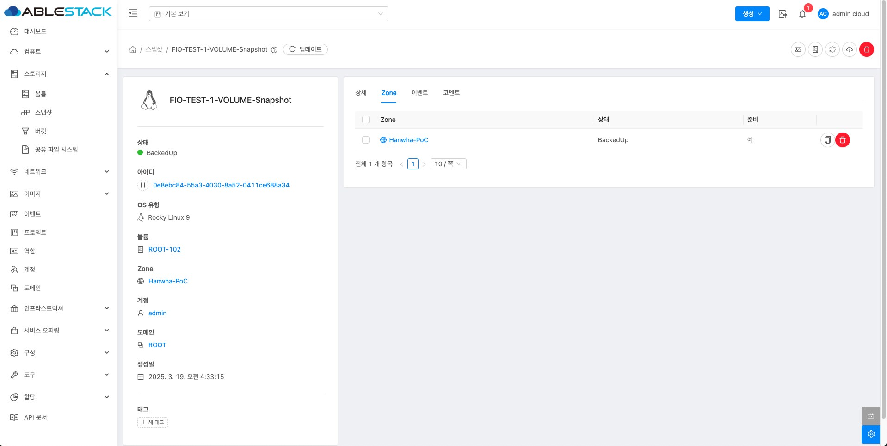

# 스냅샷

## 개요
스냅샷은 인스턴스 디스크의 특정 시점 캡처입니다. 메모리 및 CPU 상태는 캡처되지 않습니다.
Oracle VM 하이퍼바이저를 사용하는 경우 OVM이 지원하지 않으므로 스냅샷을 찍을 수 없습니다.
루트 및 데이터 디스크를 포함한 볼륨에 대해 촬영할 수 있습니다. 관리자는 사용자당 저장된 스냅샷수에 제한을 둡니다.

사용자는 특정 파일을 복구하기 위해 스냅샷에서 새 볼륨을 만들 수 있으며, 복원된 디스크에서 부팅하기 위해 스냅샷에서 템플릿을 만들 수 있습니다.
사용자는 수동으로 또는 자동 반복 스냅샷 정책을 설정하여 스냅샷을 만들 수 있습니다.
스냅샷에서 디스크 볼륨을 만들 수도 있으며, 이는 다른 디스크 볼륨과 마찬가지로 인스턴스에 연결될 수 있습니다. 루트 디스크 및 데이터 디스크의 스냅샷이 모두 지원됩니다.
그러나 현재 복구된 루트 디스크에서 인스턴스를 부팅하는 것을 지원하지 않습니다.

완료된 스냅샷은 기본 저장소에서 보조 저장소로 복사되고, 새 스냅샷에 의해 삭제되거나 제거될 때까지 해당 저장소에 저장됩니다.
또한 수동 스냅샷을 찍을 때나 스냅샷 정책을 만들 때 원하는 영역을 선택하여 추가 영역을 선택하고, 스냅샷 백업이 허용되면 스냅샷은 먼저 네이티브 영역의 보조 스토리지에 복사된 다음 거기에서 추가 영역으로 복사됩니다.

## 스냅샷 목록 조회
1. 모든 스냅샷의 목록을 확인하는 화면입니다. 생성된 스냅샷 목록을 확인하거나 정보를 확인할 수 있습니다..
    { .imgCenter .imgBorder }

    !!! info
        프로젝트 버튼을 활성화할 때 해당 프로젝트에 대한 정보를 볼륨 목록에서 확인할 수 있습니다.

## 스냅샷 생성
1. 스냅샷 생성은 해당 가상머신의 상세 페이지에서 **VM 볼륨 스냅샷 생성** 버튼을 클릭합니다.
    { .imgCenter .imgBorder }
2. VM 볼륨 스냅샷 생성 버튼을 클릭한 화면입니다.
    { .imgCenter .imgBorder }
3. 생성된 볼륨 스냅샷은 스토리지의 스냅샷 목록에서 확인하실 수 있습니다.

## 스냅샷 삭제
1. 스냅샷 상세 오른쪽 상단의 스냅샷 삭제 버튼을 클릭합니다.
    { .imgCenter .imgBorder }
2. 스냅샷 삭제 버튼을 클릭한 화면입니다.
    { .imgCenter .imgBorder }

## 스냅샹 상세 탭
1. 스냅샷 목록 조회에서 확인하고 싶은 스냅샷 목록을 조회합니다. 스냅샷에 대한 상세 정보를 확인하는 화면입니다. 해당 스냅샷에 대한 크기, UUID, 이름 등 상세 정보를 확인할 수 있습니다.
    { .imgCenter .imgBorder }

## 스냅샷 Zone 탭
1. 스냅샷 목록 조회에서 확인하고 싶은 스냅샷 목록을 조회합니다. 스냅샷에 대한 Zone 정보를 확인하는 화면입니다. 해당 Zone에 대한 상태와 준비를 확인할 수 있습니다.
    { .imgCenter .imgBorder }

### 스냅샷 복사
2. 여러 개의 Zone이 존재 할 경우, 스냅샷을 다른 Zone에 복사할 수 있는 기능을 제공합니다.
    { .imgCenter .imgBorder }
3. 스냅샷 복사 버튼을 클릭한 화면입니다.
    { .imgCenter .imgBorder }

### 스냅샷 삭제
4. 스냅샷이 포함된 Zone에서 해당 스냅샷 삭제 기능 을 제공합니다.
    { .imgCenter .imgBorder }
5. 스냅샷 삭제 버튼을 클릭한 화면입니다.
    { .imgCenter .imgBorder }

### 스냅샷 일괄 삭제
6. 여러 개의 Zone이 존재 할 경우, Zone을 다중 선택하여 다른 Zone에서도 삭제 할 수 있는 기능을 제공합니다.
    { .imgCenter .imgBorder }
7. 스냅샷 일괄 삭제 버튼을 클릭한 화면입니다.
    { .imgCenter .imgBorder }

## 스냅샷 이벤트 탭
1. 스냅샷 목록 조회에서 확인하고 싶은 스냅샷 목록을 조회합니다. 스냅샷에 대한 이벤트 정보를 확인하는 화면입니다. 해당 이벤트의 유형 및 생성일 등 확인할 수 있습니다.
    { .imgCenter .imgBorder }

## 스냅샷 코멘트 정보
1. 스냅샷 목록 조회에서 확인하고 싶은 스냅샷 목록을 조회합니다. 스냅샷에 대한 코멘트 정보를 확인하는 장면입니다. 각 사용자별로 해당 볼륨에 대한 코멘트 정보를 조회 및 관리할 수 있는 화면입니다.
    { .imgCenter .imgBorder }

## 템플릿 생성
1. 스냅샷 상세 오른쪽 상단의 템플릿 생성 버튼을 클릭합니다.
    { .imgCenter .imgBorder }
2. 템플릿 생성 버튼을 클릭한 화면입니다.
    { .imgCenter .imgBorder }
    - **이름** 을 입력합니다.
    - **설명** 을 입력합니다.
    - **Zone** 을 선택합니다.
    - **도메인 아이디** 를 선택합니다.
    - **OS 유형** 을 선택합니다.
    - **동적으로 확장 가능** 을 체크합니다.
    - **HVM** 을 체크합니다.
    - **추천** 을 체크합니다.
    - **공개** 를 체크합니다.

## 볼륨 생성
1. 스냅샷 상세 오른쪽 상단의 볼륨 생성 버튼을 클릭합니다.
    { .imgCenter .imgBorder }
2. 볼륨 생성 버튼을 클릭한 화면입니다.
    { .imgCenter .imgBorder }
    - **소유자 유형** 을 선택합니다.
    - **도메인** 을 선택합니다.
    - **계정** 을 선택합니다.
    - **이름** 을 입력합니다.
    - **Zone** 을 선택합니다.
    - **디스크 오퍼링** 을 선택합니다.
    - **크기** 를 선택합니다.

## 스냅샷 복원
1. 스냅샷 상세 오른쪽 상단의 스냅샷 복원 버튼을 클릭합니다.
    { .imgCenter .imgBorder }
2. 스냅샷 복원 버튼을 클릭한 화면입니다.
    { .imgCenter .imgBorder }

    !!! info
        스냅샷 복원 할 경우, 가상머신의 상태가 **정지 중** 이어야 실행됩니다.

## 스냅샷 다운로드
1. 스냅샷 상세 오른쪽 상단의 스냅샷 다운로드 버튼을 클릭합니다.
    { .imgCenter .imgBorder }
2. 스냅샷 다운로드 버튼을 클릭한 화면입니다.
    { .imgCenter .imgBorder }

## 용어사전
