# 볼륨

## 개요
볼륨은 게스트 인스턴스에서 스토리지를 제공하는 중요한 요소로, 운영 체제가 설치되는 루트 디스크뿐만 아니라 추가적인 데이터 디스크로도 활용될 수 있습니다.

ABLESTACK은 이러한 추가 볼륨을 지원하여, 사용자가 필요에 따라 유연하게 스토리지를 확장할 수 있도록 합니다.

이 문서에서는 볼륨의 생성, 관리, 확장 및 삭제 방법을 포함한 다양한 볼륨 관리 기능에 대해 자세히 설명합니다.

## 볼륨 목록 조회
1. 모든 볼륨의 목록을 확인하는 화면입니다. 생성된 볼륨 목록을 확인하거나 볼륨 추가 버튼을 클릭하여 볼륨을 추가하실 수 있습니다.
    { .imgCenter .imgBorder }

    !!! info
        필터 버튼을 선택할 시, 모든 디스크에 대한 필터를 제한하여 볼륨 목록에서 확인할 수 있습니다.

        매트릭 버튼을 활성화할 때 해당 디스크에 대한 상세 정보를 볼륨 목록에서 확인할 수 있습니다.

        프로젝트 버튼을 활성화할 때 해당 프로젝트에 대한 정보를 볼륨 목록에서 확인할 수 있습니다.

## 볼륨 생성
1. 스토리지의 볼륨에서 상단의 볼륨 생성 버튼을 클릭합니다.
    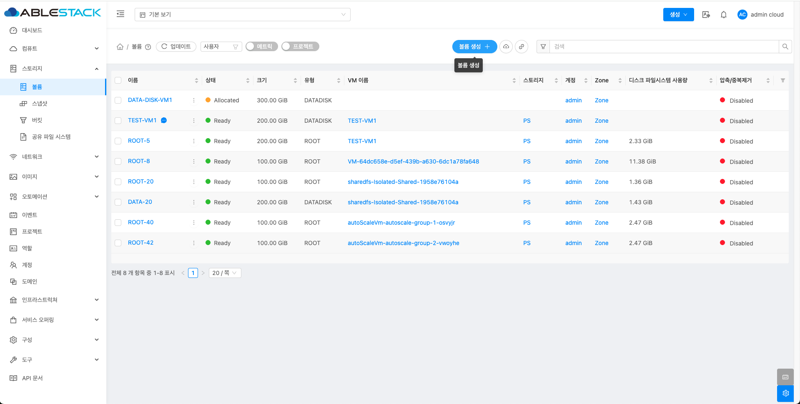{ .imgCenter .imgBorder }
2. 볼륨 생성 화면입니다.
    { .imgCenter .imgBorder }
    - **소유자 유형** 을 선택합니다.
    - **도메인** 을 선택합니다.
    - **계정** 을 선택합니다.
    - **이름** 을 입력합니다.
    - **Zone** 을 선택합니다.
    - **디스크 오퍼링** 을 선택합니다.
    - **크기** 를 선택합니다.

    !!! info
        고정 디스크 오퍼링을 선택할 시, 해당 크기는 오퍼링에서 고정으로 할당된 값으로 만들어 집니다.

## 볼륨 삭제
!!! check
    해당 볼륨 삭제 버튼 활성화는 볼륨 목록의 상태에서 **Allocate** 일 경우에 활성화됩니다.

    또는, 가상머신을 삭제할 경우, 자동으로 삭제됩니다.

1. 볼륨 상세 오른쪽 상단의 볼륨 삭제 버튼을 클릭합니다.
    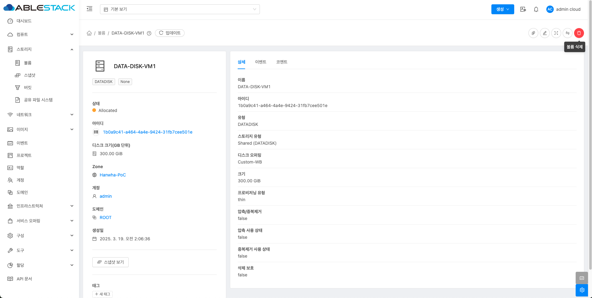{ .imgCenter .imgBorder }
2. 볼륨 삭제 버튼을 클릭한 화면입니다.
    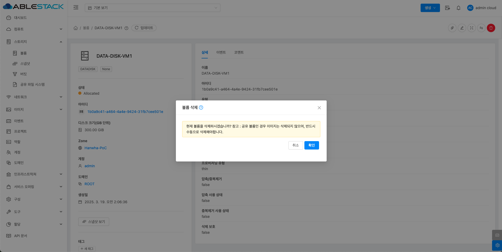{ .imgCenter .imgBorder }

## 편집
1. 볼륨 상세 오른쪽 상단의 편집 버튼을 클릭합니다.
    { .imgCenter .imgBorder }
2. 편집 버튼을 클릭한 화면입니다.
    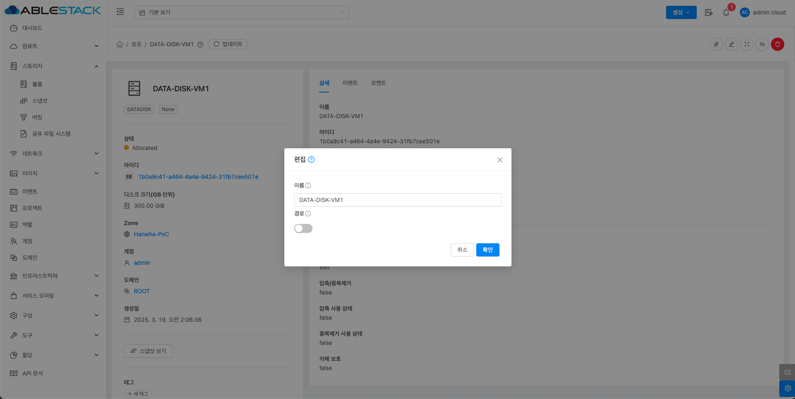{ .imgCenter .imgBorder }
    - **이름** 을 입력합니다.

## 볼륨 상세 탭
1. 볼륨 목록 조회에서 확인하고 싶은 볼륨 목록을 조회합니다. 볼륨에 대한 상세 정보를 확인하는 화면입니다. 해당 볼륨에 대한 크기, UUID, 이름 등 상세 정보를 확인할 수 있습니다.
    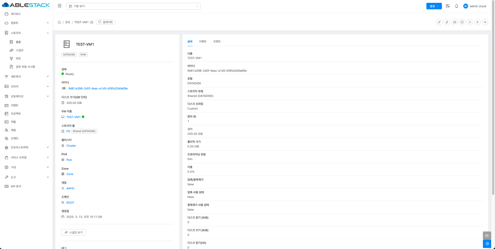{ .imgCenter .imgBorder }

## 볼륨 이벤트 탭
1. 볼륨 목록 조회에서 확인하고 싶은 볼륨 목록을 조회합니다. 볼륨과 관련된 이벤트 정보를 확인할 수 있는 화면입니다. 볼륨에서 발생한 다양한 액션과 변경 사항을 쉽게 파악할 수 있습니다.
    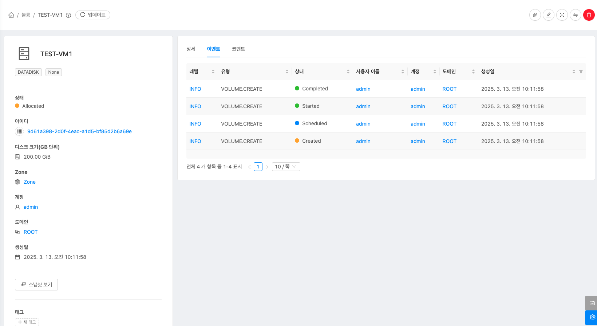{ .imgCenter .imgBorder }

## 볼륨 코멘트 탭
1. 볼륨 목록 조회에서 확인하고 싶은 볼륨 목록을 조회합니다. 볼륨과 관련된 코멘트 정보를 확인하는 화면입니다. 각 사용자별로 해당 볼륨에 대한 코멘트 정보를 조회 및 관리할 수 있는 화면입니다.
    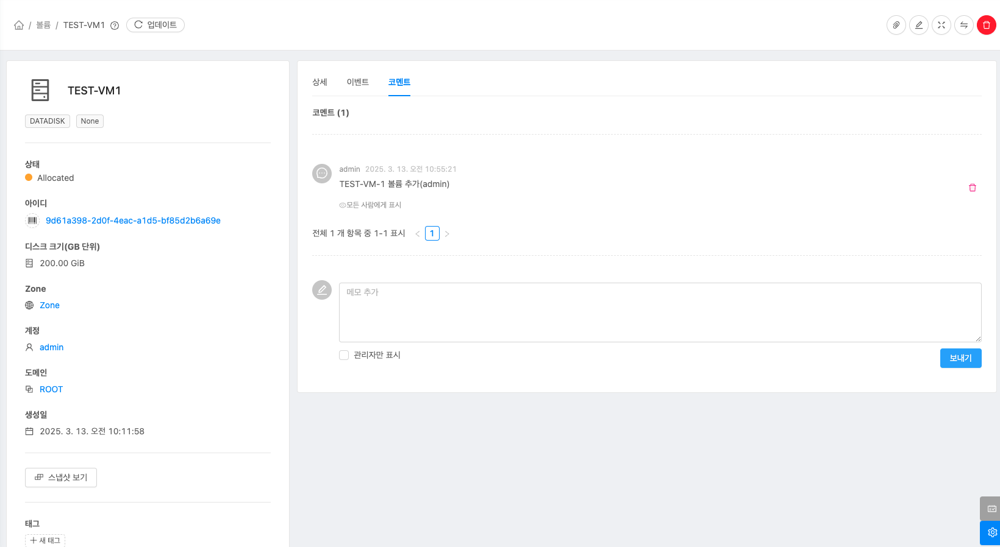{ .imgCenter .imgBorder }

## 로컬에서 볼륨 업로드
1. 볼륨 생성 버튼 오른쪽 버튼 중 로컬에서 볼륨 업로드 버튼을 클릭합니다.
    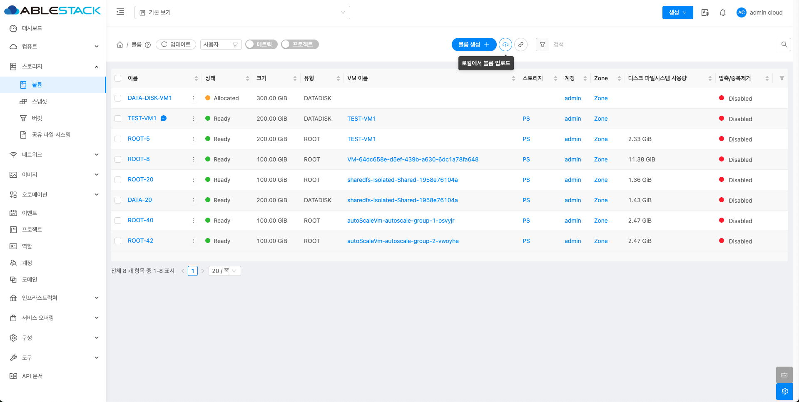{ .imgCenter .imgBorder }
2. 로컬에서 볼륨 업로드 화면입니다.
    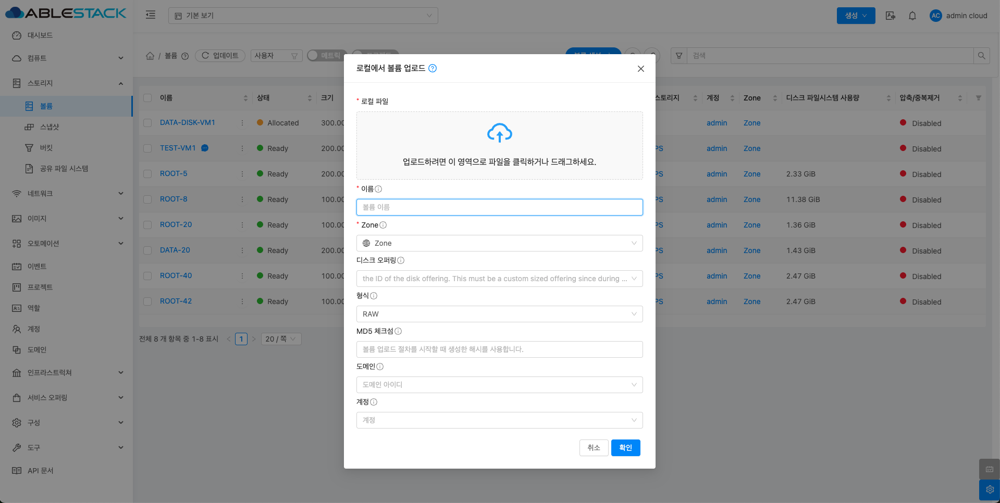{ .imgCenter .imgBorder }
    - **로컬 파일** 을 선택하여 로컬에서 볼륨 파일을 선택합니다.
    - **Zone** 을 선택합니다.
    - **디스크 오퍼링** 을 미선택 및 선택합니다.
    - **형식** 을 선택합니다.
    - **도메인** 을 선택합니다.
    - **계정** 을 선택합니다.

    !!! info
        형식은 해당 디스크의 형식에 맞게 선택합니다.

        도메인 및 계정은 사용자 없이 최상단 계정 및 도메인을 사용하시면 공란을 선택합니다.

## URL에서 볼륨 업로드
1. 볼륨 생성 버튼의 오른쪽 버튼 중 URL에서 볼륨 업로드 버튼을 클릭합니다.
    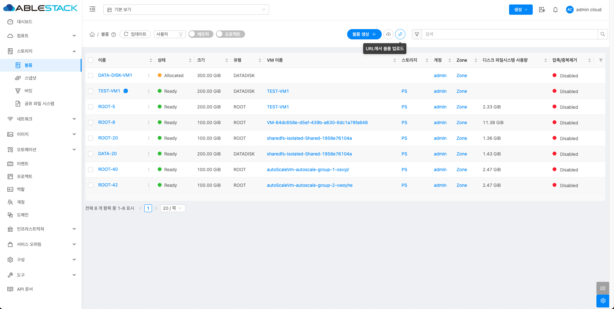{ .imgCenter .imgBorder }
2. URL에서 볼륨 업로드 화면입니다.
    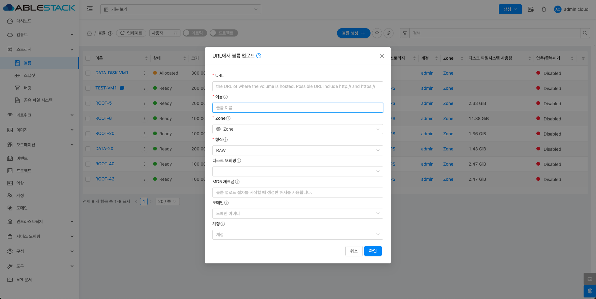{ .imgCenter .imgBorder }
    - **URL** 을 입력합니다.
    - **이름** 을 입력합니다.
    - **Zone** 을 선택합니다.
    - **형식** 을 선택합니다.
    - **디스크 오퍼링** 을 미선택 및 선택합니다.
    - **도메인** 을 선택합니다.
    - **계정** 을 선택합니다.

    !!! info
        형식은 해당 디스크의 형식에 맞게 선택합니다.

        도메인 및 계정은 사용자 없이 최상단 계정 및 도메인을 사용하시면 공란을 선택합니다.

## 디스크 연결
!!! check
    해당 디스크 연결 버튼 활성화는 볼륨 목록의 상태에서 **Allocate** 일 경우에 활성화됩니다.

1. 볼륨 상세 오른쪽 상단의 디스크 연결 버튼을 클릭합니다.
    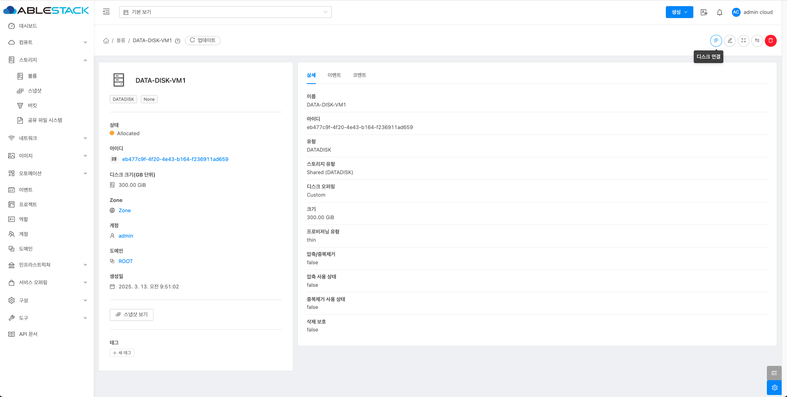{ .imgCenter .imgBorder }
2. 디스크 연결 버튼을 클릭한 화면입니다.
    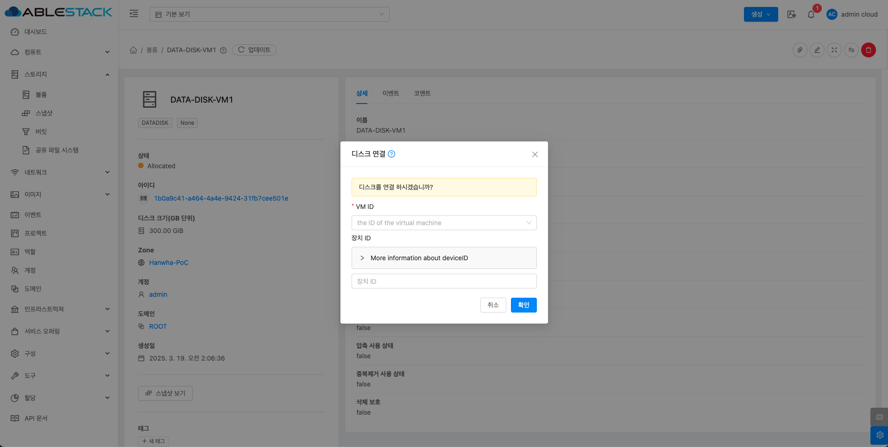{ .imgCenter .imgBorder }
    - **VM ID** 를 선택합니다.

## 디스크 분리
!!! check
    해당 디스크 분리 버튼 활성화는 볼륨 목록의 상태에서 **Ready** 일 경우에 활성화됩니다.

1. 볼륨 상세 오른쪽 상단의 디스크 분리 버튼을 클릭합니다.
    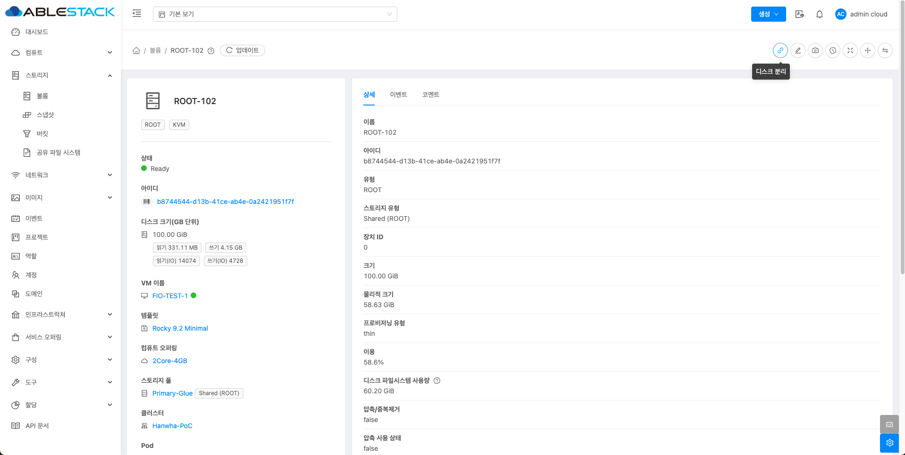{ .imgCenter .imgBorder }
2. 디스크 분리 버튼을 클릭한 화면입니다.
    { .imgCenter .imgBorder }

    !!! warning
        사용 중인 데이터가 있을 경우, 분리 시 데이터 손실이나 시스템 오류가 발생할 위험이 큽니다. 반드시 확인 후 신중하게 디스크를 분리하세요.

## 볼륨 크기 변경
1. 볼륨 상세 오른쪽 상단의 볼륨 크기 변경 버튼을 클릭합니다.
    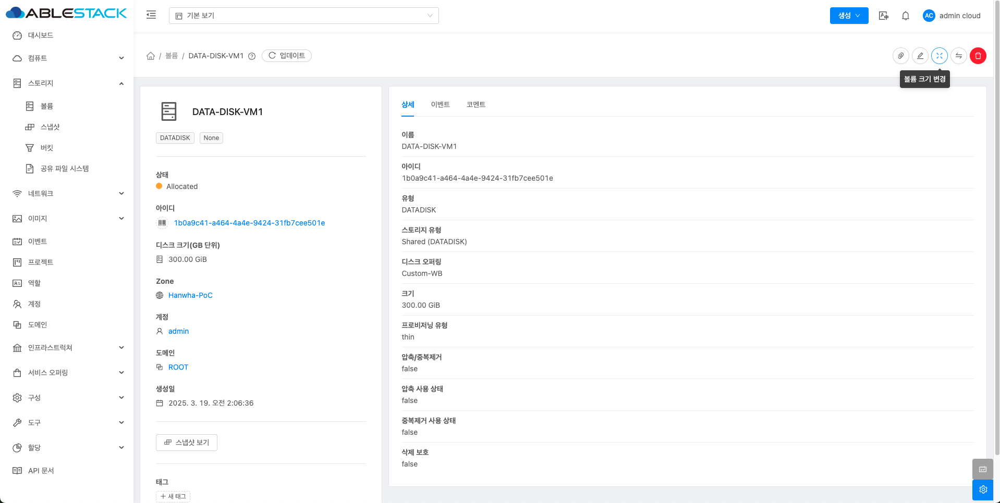{ .imgCenter .imgBorder }
2. 볼륨 크기 변경 버튼을 클릭한 화면입니다.
    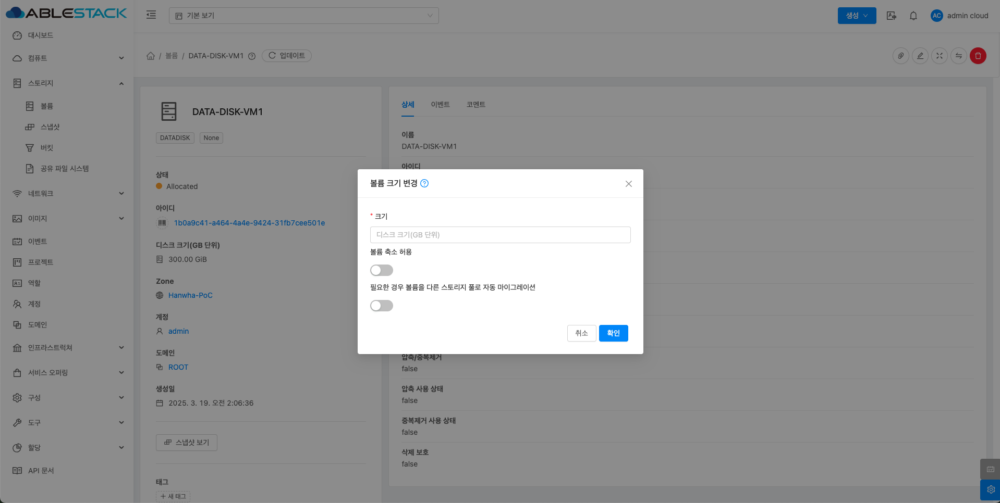{ .imgCenter .imgBorder }
    - **크기** 을 입력합니다.

    !!! info
        볼륨을 축소할 경우, 볼륨 축소 허용을 활성화합니다.

        볼륨을 다른 스토리지 풀로 자동 마이그레이션 할 경우 활성화합니다.

## 볼륨에 대한 디스크 오퍼링 변경
1. 볼륨 상세 오른쪽 상단의 디스크 오퍼링 변경 버튼을 클릭합니다.
    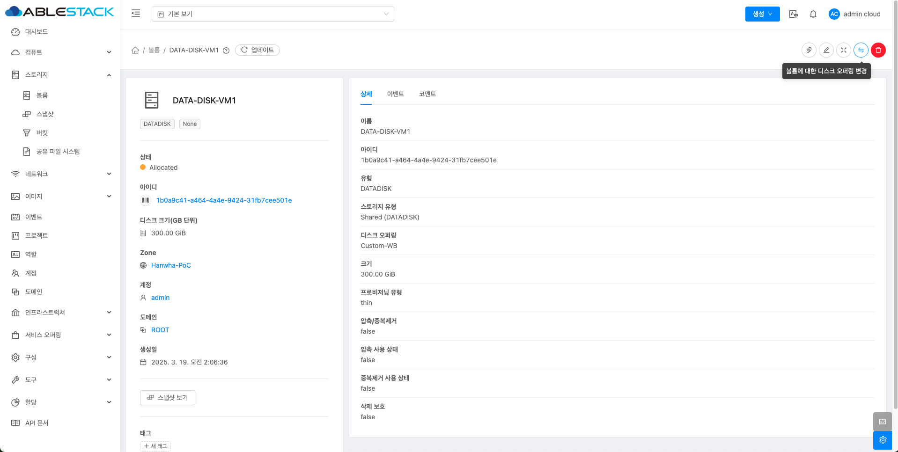{ .imgCenter .imgBorder }
2. 볼륨에 대한 디스크 오퍼링 변경 버튼을 클릭한 화면입니다.
    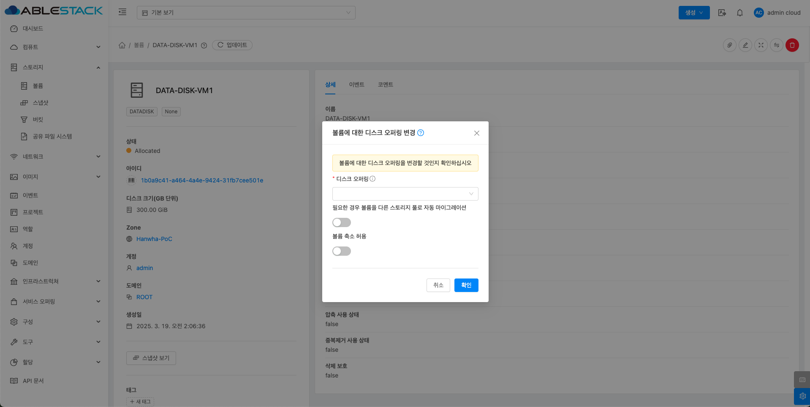{ .imgCenter .imgBorder }
    - **디스크 오퍼링** 을 선택합니다.

    !!! info
        볼륨을 축소할 경우, 볼륨 축소 허용을 활성화 합니다.

        볼륨을 다른 스토리지 풀로 자동 마이그레이션 할 경우 활성화합니다.

## 스냅샷 생성
!!! check
    해당 스냅샷 생성 버튼 활성화는 볼륨 목록의 상태에서 **Ready** 일 경우에 활성화됩니다.

1. 볼륨 상세 오른쪽 상단의 스냅샷 생성 버튼을 클릭합니다.
    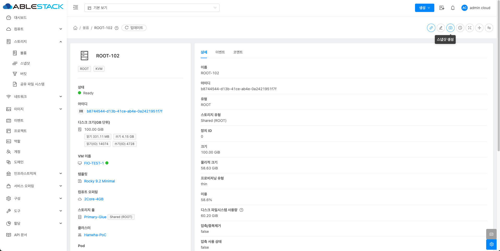{ .imgCenter .imgBorder }
2. 스냅샷 생성 버튼을 클릭한 화면입니다.
    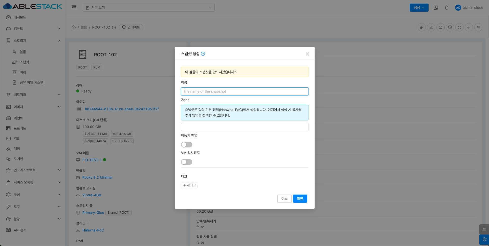{ .imgCenter .imgBorder }
    - **이름** 을 입력합니다.
    - **Zone** 을 선택합니다.

    !!! info
        비동기 작업을 원하시면, 비동기 작업을 활성화합니다.

        VM 일시정지를 원하시면, VM 일시정지를 활성화합니다.

## 정기 스냅샷
!!! check
    해당 정기 스냅샷 버튼 활성화는 볼륨 목록의 상태에서 **Ready** 일 경우에 활성화됩니다.

1. 볼륨 상세 오른쪽 상단의 정기 스냅샷 버튼을 클릭합니다.
    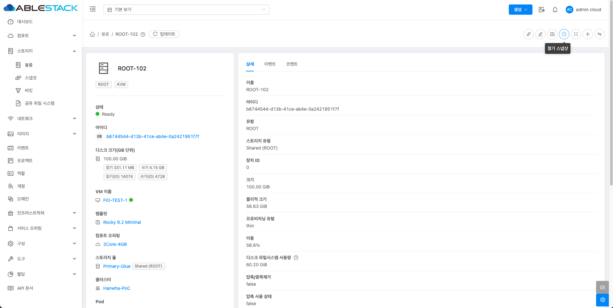{ .imgCenter .imgBorder }
2. 정기 스냅샷 버튼을 클릭한 화면입니다.
    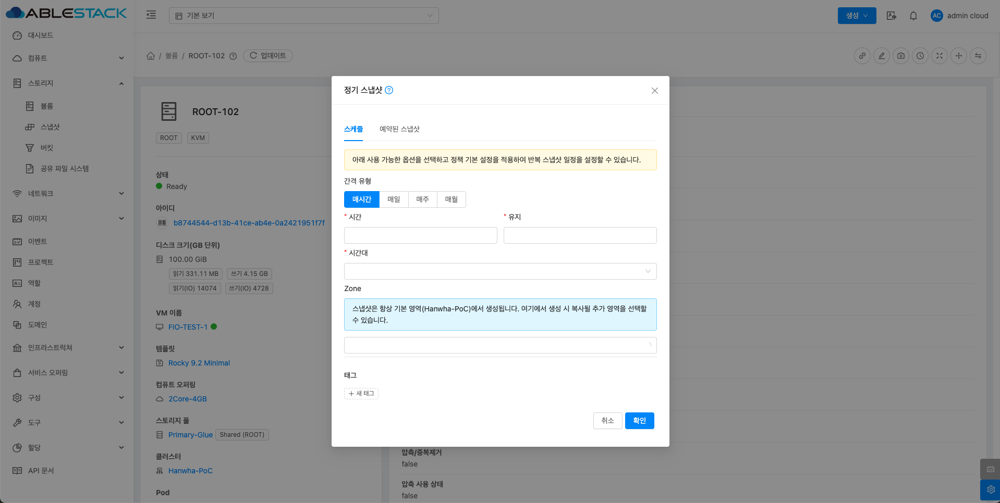{ .imgCenter .imgBorder }
    - **간격 유형** 을 선택합니다.
    - **시간** 을 입력합니다.
    - **유지** 를 입력합니다.
    - **시간대** 를 입력합니다.
    - **Zone** 을 선택합니다.
3. 정기 스냅샷의 예약된 스냅샷을 클릭한 화면입니다.
    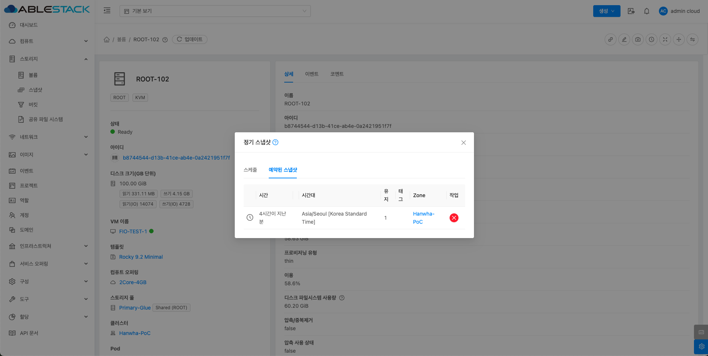{ .imgCenter .imgBorder }

## 볼륨 마이그레이션
!!! check
    해당 볼륨 마이그레이션 버튼 활성화는 볼륨 목록의 상태에서 **Ready** 일 경우에 활성화됩니다.

1. 볼륨 상세 오른쪽 상단의 볼륨 마이그레이션 버튼을 클릭합니다.
    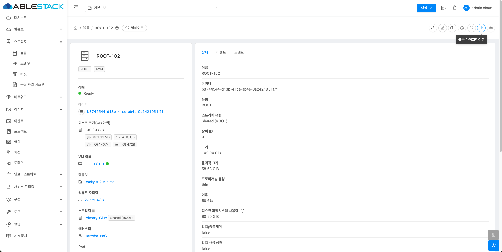{ .imgCenter .imgBorder }
2. 볼륨 마이그레이션 버튼을 클릭한 화면입니다.
    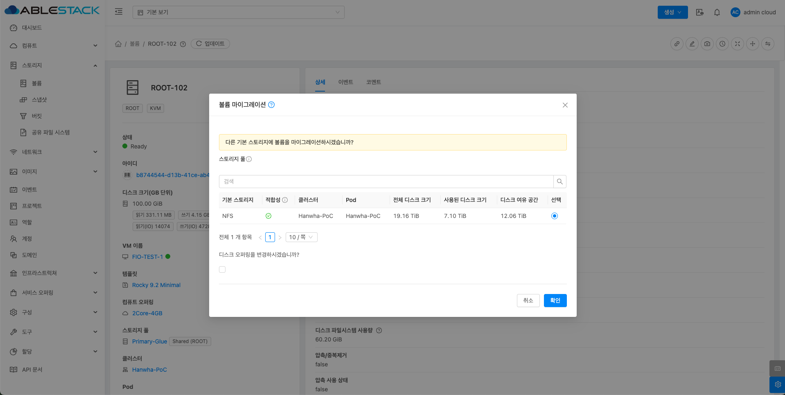{ .imgCenter .imgBorder }
    - 마이그레이션 할 **기본 스토리지** 를 선택합니다.

    !!! info
        디스크 오퍼링을 변경할 시, 체크합니다.

## 볼륨 다운로드
!!! check
    해당 볼륨 다운로드 버튼 활성화는 해당 볼륨을 가진 가상머신 상태에서 **정지 중** 일 경우에 활성화됩니다.

1. 볼륨 상세 오른쪽 상단의 볼륨 다운로드 버튼을 클릭합니다.
    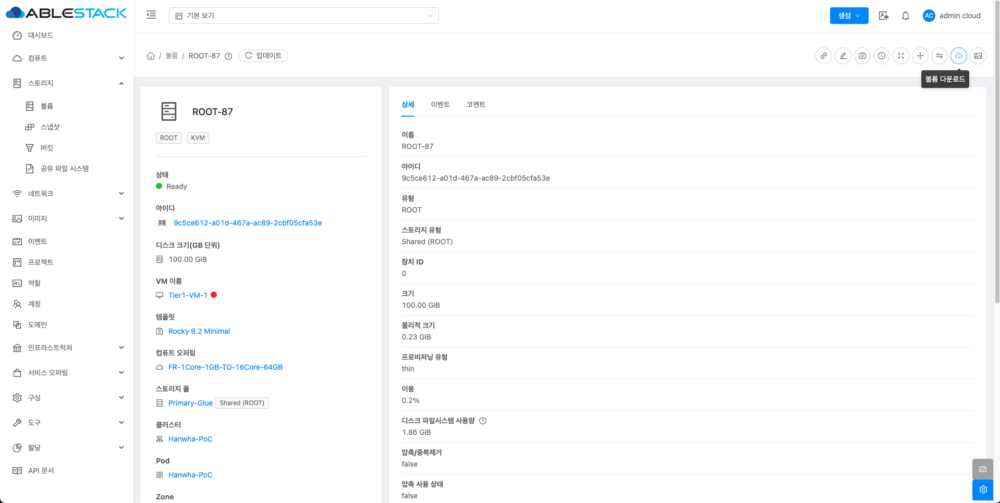{ .imgCenter .imgBorder }
2. 볼륨 다운로드 버튼을 클릭한 화면입니다.
    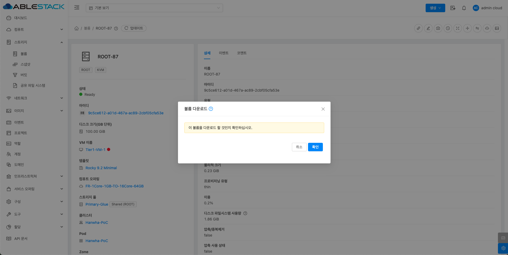{ .imgCenter .imgBorder }

## 볼륨으로 템플릿 생성
!!! check
    해당 볼륨 다운로드 버튼 활성화는 해당 볼륨을 가진 가상머신 상태에서 **정지 중** 일 경우에 활성화됩니다.

1. 볼륨 상세 오른쪽 상단의 볼륨으로 템플릿 생성 버튼을 클릭합니다.
    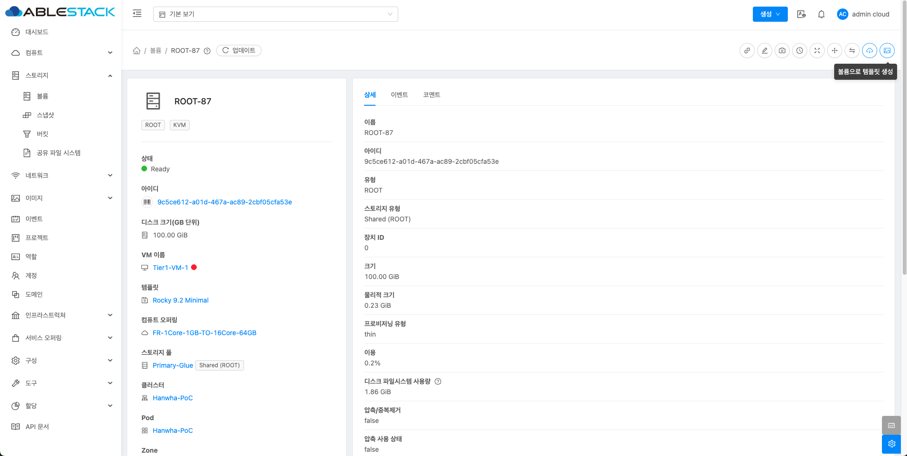{ .imgCenter .imgBorder }
2. 볼륨으로 템플릿 생성 버튼을 클릭한 화면입니다.
    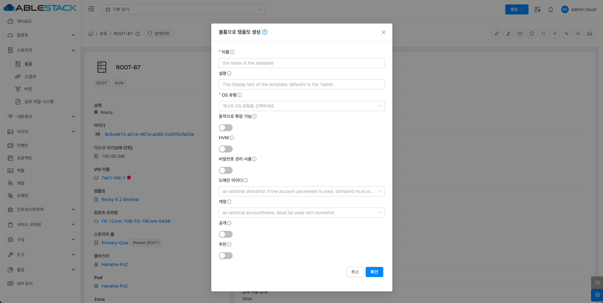{ .imgCenter .imgBorder }
    - **이름** 을 입력합니다.
    - **설명** 을 입력합니다.
    - **OS 유형** 을 선택합니다.
    - **동적으로 확장 가능** 을 활성화합니다.
    - **HVM** 을 활성화합니다.
    - **공개** 를 활성화합니다.
    - **추천** 을 활성화합니다.

## 용어 사전
