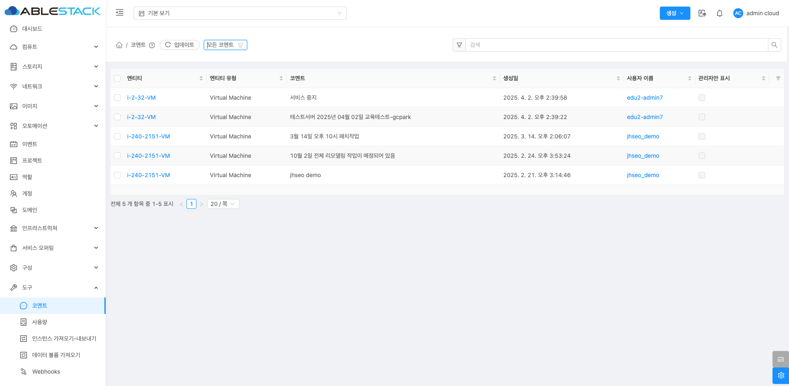
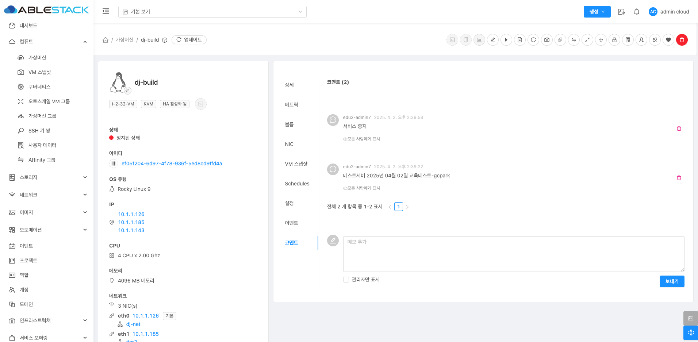

# 코멘트

## 개요
코멘트 기능은 가상 머신과 관련된 코멘트를 관리할 수 있는 도구입니다. 관리자와 사용자 간의 커뮤니케이션 기록이나 특정 가상 머신에 대한 메모를 관리하는 데 유용합니다.

{ .imgCenter .imgBorder }

## 코멘트 메뉴 화면 구성
생성된 VM에 대해 등록된 코멘트의 전체 목록을 확인할 수 있는 화면입니다.
엔티티, 엔티티 유형, 코멘트 내용, 생성일, 사용자 이름 등의 정보를 확인할 수 있습니다.

!!! info "INFO"
    코멘트 목록 상단에 위치한 필터링 기준에서 '내가 만든 것' 또는 '모든 코멘트'를 선택할 수 있습니다.

## 코멘트 상세 탭
코멘트를 선택하면 해당 코멘트가 작성된 가상머신의 코멘트 탭으로 이동되어 코멘트를 확인할 수 있습니다.

{ .imgCenter .imgBorder }

